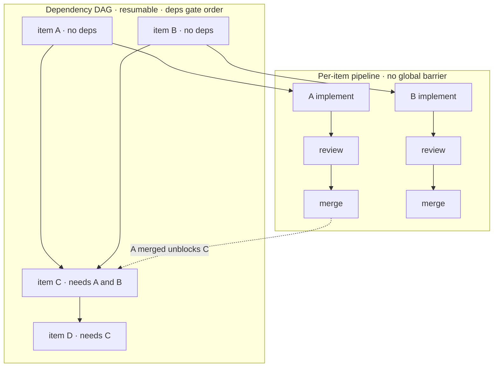
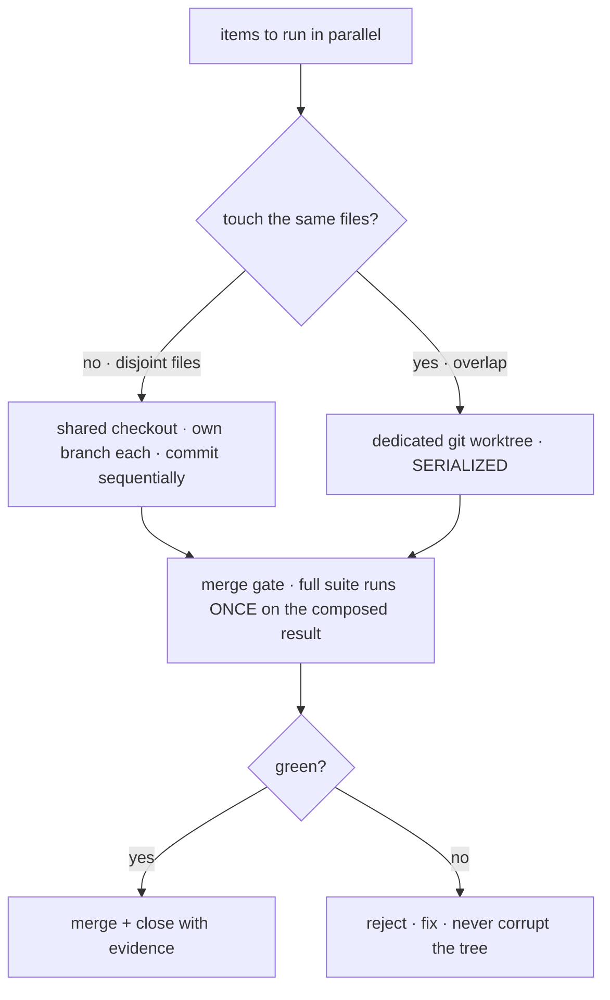
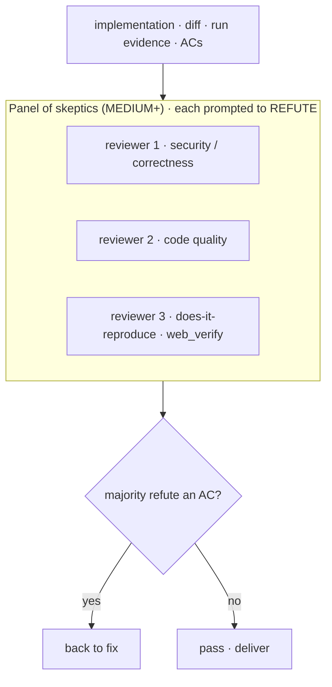
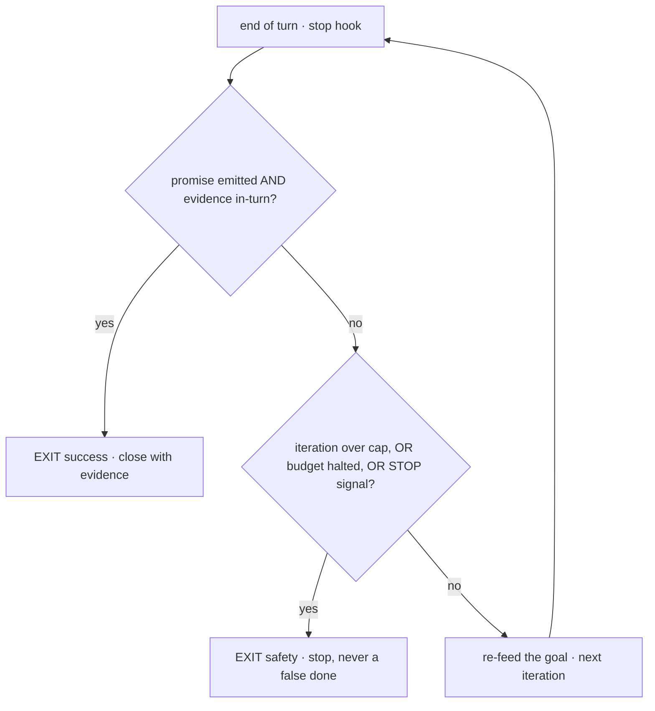

# 🔁 simplicio-loop — The Universal Looping AI Orchestrator

<p align="center">
  
</p>

<p align="center">
  <a href="https://github.com/wesleysimplicio/simplicio-loop/stargazers"></a>
  <a href="#-the-6-skills-super-plugin"></a>
  <a href="#-11-runtimes-one-protocol"></a>
  <a href="#-the-43-extension-points"></a>
  <a href="#-token-economy"></a>
  <a href="LICENSE"></a>
</p>

<p align="center">
  <a href="#-tldr">TL;DR</a> ·
  <a href="#-the-6-skills-super-plugin">6 Skills</a> ·
  <a href="#-11-runtimes-one-protocol">11 Runtimes</a> ·
  <a href="#-the-loop">The Loop</a> ·
  <a href="#-token-economy">Token Economy</a> ·
  <a href="#-built-on-the-shoulders-of">Credits</a> ·
  <a href="#-install--use">Install</a>
</p>

<p align="center">
  <strong>🌍 Languages:</strong><br>
  <a href="README.md">🇬🇧 English</a> |
  <a href="READMEs/README.pt-BR.md">🇧🇷 Português</a> |
  <a href="READMEs/README.es-ES.md">🇪🇸 Español</a> |
  <a href="READMEs/README.fr-FR.md">🇫🇷 Français</a> |
  <a href="READMEs/README.de-DE.md">🇩🇪 Deutsch</a> |
  <a href="READMEs/README.it-IT.md">🇮🇹 Italiano</a> |
  <a href="READMEs/README.ja-JP.md">🇯🇵 日本語</a> |
  <a href="READMEs/README.ko-KR.md">🇰🇷 한국어</a> |
  <a href="READMEs/README.zh-CN.md">🇨🇳 简体中文</a> |
  <a href="READMEs/README.ru-RU.md">🇷🇺 Русский</a> |
  <a href="READMEs/README.pl-PL.md">🇵🇱 Polski</a> |
  <a href="READMEs/README.tr-TR.md">🇹🇷 Türkçe</a> |
  <a href="READMEs/README.nl-NL.md">🇳🇱 Nederlands</a> |
  <a href="READMEs/README.hi-IN.md">🇮🇳 हिन्दी</a> |
  <a href="READMEs/README.ar-SA.md">🇸🇦 العربية</a>
</p>

---

## ⚡ TL;DR

**simplicio-loop** is a runtime-agnostic **super-plugin** — one autonomous looping
orchestrator (invoked as **`/simplicio-tasks`**) plus **five satellite skills** — that turns any
strong LLM (Claude, Codex, Copilot, Gemini, Cursor, local models) into a self-driving worker. You
point it at a body of
work — *"finish all the open issues"*, *"clear the CI queue"*, *"drain the Jira board"* — and it
runs the whole lifecycle on its own:

> **discover → understand → decide → act → verify → correct → record → repeat**

It discovers work from any source, dedups, auto-scales an agent fleet to your machine,
implements each item through a quality loop that **runs the code (not just compiles it)**, opens
PRs, resolves CI/review feedback, merges, and keeps watching **24/7** for new work — all behind
safety gates and a hard cost kill-switch.

```text
/simplicio-tasks termine as issues abertas
→ identity + pre-flight (kill-switch, auth, watcher)
→ discover 50 issues · dedup · build dependency DAG
→ autoscale fleet = 14 · pipeline implement→review→merge
→ each item: read body+ACs → orient code → plan → edit → run → verify → PR
→ merge · close with evidence · rollback if main breaks
→ keep looping every ~2 min until the queue is dry (evidence-gated, never a false "done")
```

Three things make it different: it is a **super-plugin of focused skills**, it runs the **same
protocol on 11 runtimes**, and it does all of this with **aggressive, honest token economy**.

---

## 🧠 The 6 skills (super-plugin)

The orchestrator is the core; five satellites each absorb the best of a well-known technique and
expose it as a reusable skill. Each satellite is **optional** — when loaded, the orchestrator
delegates to it (richer + cheaper); when absent, the orchestrator's inline protocol covers 100%
of the work. Same inverted dependency, one level up.

| Skill | Absorbs | What it does |
|---|---|---|
| 🔁 **simplicio-tasks** | — | The orchestrator loop: discover → implement → verify → merge → close → watch 24/7. 43 extension points, dual-path router, self-audit convergence. |
| ♾️ **simplicio-loop** | [ralph-loop](https://github.com/cursor/plugins/tree/main/ralph-loop) | The hardened Ralph loop: re-feed the same goal each turn so the agent sees its own work, exiting only on an **evidence-gated `<promise>`** or a `max_iterations` cap — never a false "done". |
| 🧱 **simplicio-orient** | [rtk](https://github.com/rtk-ai/rtk) + [caveman](https://github.com/JuliusBrussee/caveman) | Terminal-first execution: answer facts with the shell, never the LLM. Output-reduction catalog, **tee-cache on failure**, signatures-only reads, optional auto-rewrite hook. |
| 🔥 **simplicio-review** | [thermos](https://github.com/cursor/plugins/tree/main/thermos) | Adversarial review: parallel subagents on distinct rubrics (security/correctness + code-quality), spawned in one message, deduped into one verdict. |
| 🗜️ **simplicio-compress** | [caveman](https://github.com/JuliusBrussee/caveman) | Output + memory compression: terse prose levels that preserve code/paths byte-for-byte, plus a one-time memory compaction that pays back every turn. Fail-closed `transform_guard`. |
| 🎓 **simplicio-learn** | [teaching](https://github.com/cursor/plugins/tree/main/teaching) + continual-learning | Retrospective: mine durable, deduped lessons from a run and write them to memory so the next run is cheaper and more correct. |

Each is a normal skill folder under [`.claude/skills/`](.claude/skills) — usable standalone or
as part of the loop.

---

## 🌐 11 runtimes, one protocol

One universal skill core + one set of hooks drives every runtime. An adapter is thin: it tells a
runtime *where to load the skills*, *how to arm the loop*, and *how to bind native speed*. **The
skill names no runtime; the runtime detects the skill.**

| Runtime | Skill load | Loop drive | Native bind |
|---|---|---|---|
| **Claude Code** | `.claude/skills/` + plugin | `Stop` hook | MCP |
| **Codex** | `AGENTS.md` | self-paced | MCP / adapter |
| **VS Code (Copilot)** | `copilot-instructions.md` | tasks | MCP |
| **Cursor** | `.cursor-plugin/` | `stop`+`afterAgentResponse` | MCP / rules |
| **Antigravity** | rules / `AGENTS.md` | self-paced | MCP |
| **Kiro** | `.kiro/steering/` | specs | MCP |
| **OpenCode** | `AGENTS.md` | self-paced | MCP |
| **Gemini** | `GEMINI.md` | self-paced | MCP / adapter |
| **Aider** | `CONVENTIONS.md` | self-paced | — (LLM fallback) |
| **Hermes** | native recall | native loop | **native** |
| **OpenClaw** | plugin SDK | native scheduler | **native** |

The promise: **same protocol, same gates, same safety on all 11 — only the speed differs.**
`orient_clamp.py` (token economy) works on every runtime with zero wiring. See
[`adapters/MATRIX.md`](adapters/MATRIX.md).

<p align="center">
  
</p>

---

## 🗺️ The full flow — from demand to delivery

Every layer the orchestrator acts on, in order — from reading the demand (issues, tasks, assigns)
to delivering merged, evidenced work, then looping 24/7 for more. (Diagram renders natively on
GitHub.)

```mermaid
flowchart TD
  subgraph SRC["1 · Demand sources (any adapter)"]
    direction LR
    S1["GitHub Issues / PRs / CI"]
    S2["Jira · Azure DevOps · Linear · ClickUp · Notion · agentsview · Understand Anything"]
    S3["Assigns · TODO/FIXME · CVE · local files · LMCache (KV cache inference accelerator)"]
  end
  SRC --> PF
  subgraph PF["2 · Pre-flight gates"]
    direction LR
    P1["cost kill-switch budget"]
    P2["source auth + scopes"]
    P3["arm 24/7 watcher"]
  end
  PF --> DISC
  subgraph DISC["3 · Discover + normalize"]
    direction LR
    D1["source_adapter: list metadata only"]
    D2["normalize to canonical schema"]
    D3["dedup id+title+fingerprint+branch/PR"]
    D4["dependency DAG"]
  end
  DISC --> INTK
  subgraph INTK["4 · Deep intake (per item)"]
    direction LR
    I1["body + ALL comments"]
    I2["extract acceptance criteria"]
    I3["orient code · signatures-only reads"]
    I4["plan + AC checklist + complexity"]
  end
  INTK --> RT{"5 · Route"}
  RT -->|"small and every item complexity at most 3"| FAST["Fast-path: solo, one targeted test"]
  RT -->|"large queue or any medium+"| POOL
  subgraph POOL["6 · Continuous worker pool (autoscaled, conflict-aware)"]
    direction LR
    W1["claim · branch · worktree if overlap"]
    W2["deterministic_edit"]
    W3["quality loop: edit-lint-test-fix"]
  end
  FAST --> QG
  POOL --> QG
  subgraph QG["7 · Quality gates"]
    direction LR
    Q1["AC gate = real DoD"]
    Q2["WORKS not just compiles · web_verify (Playwright)"]
    Q3["adversarial review · thermos rubrics"]
  end
  QG --> SG
  subgraph SG["8 · Safety gates (non-negotiable)"]
    direction LR
    G1["secret-scan"]
    G2["irreversible-op human gate"]
    G3["4-state verdict · attestation"]
  end
  SG --> DEL
  subgraph DEL["9 · Deliver"]
    direction LR
    L1["commit · push · Draft PR"]
    L2["close in-source + evidence"]
    L3["verify reality, not self-report"]
  end
  DEL --> FB
  subgraph FB["10 · Feedback loop to merge-ready"]
    direction LR
    F1["CI fail -> fix root cause"]
    F2["review comments -> adjust"]
    F3["branch behind main -> additive rebase"]
  end
  FB -->|"merged and closed"| DONE(["done + evidence + savings line"])
  WATCH["11 · 24/7 watcher · simplicio-loop<br/>evidence-gated promise · max-iterations cap · cost kill-switch"]
  FB -. "poll new work / comments / checks" .-> WATCH
  DONE -. "idle until new work" .-> WATCH
  WATCH -. "re-feed the goal" .-> DISC
```



**Layer by layer — what acts, and the resource it uses:**

| # | Layer | What happens | Skill / extension point · borrowed from |
|---|---|---|---|
| 1 | **Demand sources** | Read the work from ANY source — issues, PRs, CI, boards, assigns, TODO, CVEs | `source_adapter` · `intake` |
| 2 | **Pre-flight** | Arm the `$` kill-switch, check source auth, arm the 24/7 watcher | `watcher` · cost governance |
| 3 | **Discover + normalize** | List by metadata only, normalize, dedup, build the dependency DAG | `normalize` · `dependency_graph` |
| 4 | **Deep intake** | Read full body + comments, extract ACs, orient the code, write a plan | `orient` · signatures-read · **rtk** |
| 5 | **Route** | Fast-path (trivial) vs heavy-path; autoscale the fleet to the machine | `autoscale` · dual-path router |
| 6 | **Worker pool** | Continuous, conflict-aware fan-out; mechanical edits; per-item quality loop | `execute` · `worktree` · `deterministic_edit` |
| 7 | **Quality gates** | AC gate (real DoD), run-verification (UI → **Playwright** `web_verify`), adversarial review | `validate` · **`simplicio-review`** (thermos) |
| 8 | **Safety gates** | Secret-scan, irreversible-op human gate, 4-state verdict, attestation | `action_gate` · `human_gate` · `security` |
| 9 | **Deliver** | Commit, push, Draft PR, close in-source with evidence; verify reality | `pr` / `evidence` · `delivery_gate` |
| 10 | **Feedback loop** | CI → fix, review comments → adjust, branch-behind → additive rebase | `diagnostics` · `retry` |
| 11 | **24/7 watcher** | Re-feed the goal until an evidence-gated promise; idle when drained, wake on anything | **`simplicio-loop`** (Ralph) · `watcher` |
| ↻ | **Cross-cutting** | Token economy (terminal-first · catalog · **tee+CCR** · prose/memory compress) · model routing L0→L4 · learn | **`simplicio-orient`** (rtk+caveman) · **`simplicio-compress`** (caveman) · **`simplicio-learn`** (teaching) · **headroom** CCR |

Every layer has an always-works LLM fallback and binds a native command when the host provides one
— the same protocol on all 11 runtimes, only the speed differs.

---

## 🏛️ Design pillars (in detail)

Four mechanisms carry the orchestration power. Each is already wired into the skill — here is
exactly **where it lives** and how it works, drawn in detail.

| Pillar | Focus | Lives in | Labels |
|---|---|---|---|
| **DAG + pipeline** | parallelism by dependency, staged per-item | `dependency_graph` · [`references/orchestration.md`](.claude/skills/simplicio-tasks/references/orchestration.md) (Step 3 pool + 3c pipeline) | `enhancement` `orchestrator` `performance` `runtime` |
| **Worktree isolation** | parallel edits without corrupting the tree, merge-gated | `worktree` · orchestration.md "Conflict-AWARE isolation" + merge gate | `enhancement` `orchestrator` `runtime` |
| **Adversarial verify** | a panel of skeptics before "delivered" | [`quality-safety-delivery.md`](.claude/skills/simplicio-tasks/references/quality-safety-delivery.md) Step 4c · skill `simplicio-review` | `enhancement` `quality` `runtime` |
| **Loop budget cap** | anti-infinite-loop, dual exit | [`standing-loop-247.md`](.claude/skills/simplicio-tasks/references/standing-loop-247.md) §4 · skill `simplicio-loop` · `hooks/loop_stop.py` | `enhancement` `coding-loop` `runtime` |

### 1 · DAG + pipeline — parallelism by dependency, staged



Independents (A, B) fan out at once; dependents (C, D) wait on the DAG. Each item flows
implement → review → merge on its own, so A merges while B is still building — **staged, never a
global barrier**. Re-runs skip done nodes (resumable).

### 2 · Worktree isolation — parallel edits, merge-gated



Disjoint items share one checkout (cheap, no N× re-link); only overlapping items pay for a
dedicated worktree and are serialized. The expensive full suite runs **once** on the merged
result — a stronger end-gate than N partial checks.

### 3 · Adversarial verify — a panel of skeptics before delivery



For MEDIUM+ items, 2–3 independent reviewers each try to REFUTE (default to "not done" if
unsure). Majority-refute on any acceptance criterion sends it back. TRIVIAL/SMALL keep a single
self-review. (Delegated to `simplicio-review`; front-end diffs require a `web_verify` entry.)

### 4 · Loop budget cap — anti-infinite-loop, dual exit



The loop has **two independent exits**: a *success* exit (an evidence-gated `<promise>` that is
genuinely true) and a *safety* exit (`max_iterations` cap, the `$` budget kill-switch, or a STOP
signal). It never exits on a self-reported "done" — and never runs forever. This is
`hooks/loop_stop.py` (fail-open: any hook error → allow stop).

---

## 🔁 The loop

**Invoking `/simplicio-tasks` IS the loop** — it auto-arms on start (no separate `/loop` or
`/simplicio-loop` command) and keeps going until the queue is drained and verified, or a
cap/budget/STOP fires. The drive underneath is a **hardened Ralph loop** (`simplicio-loop`):

1. On invocation the goal is auto-written to a single, human-readable state file
   (`.orchestrator/loop/scratchpad.md`) — trivially inspectable, editable, cancellable.
2. After each turn a **stop-hook** re-feeds the same goal, so the agent sees its own prior edits
   (via git + the working tree) and converges. Token cost per cycle stays flat — no context
   stuffing.
3. It exits **only** when a typed sentinel `<promise>EXACT TEXT</promise>` is emitted **and**
   backed by concrete in-turn evidence (a passing gate, a merged-PR link, AC receipts), or when
   a hard `max_iterations` cap / the cost kill-switch fires.

> **Never a false promise.** A `<promise>` with no evidence is ignored and the loop continues.
> This wires the loop directly into the repo's hard rule: *never close work without a merged PR
> or concrete evidence.*

On runtimes without hooks the loop **self-paces** via the host scheduler (cron / `/loop` / the
runtime's task runner) — same exit conditions. The hooks are cross-platform Python and
**fail-open**: a hook that errors always lets the agent stop. The real guards are the cap and
the budget, never hook cleverness.

---

## 📊 Token economy

The cheapest token is the one not spent. `simplicio-orient` + `simplicio-compress` fold the best
of **rtk** (compress the commands) and **caveman** (compress the talk) into the safety spine:

- **Terminal-first execution** — the shell knows facts exactly; the LLM approximates them
  expensively. A cross-platform substitution table (Windows/macOS/Linux) answers 30+ facts via
  `git`/`gh`/`rg`/`python3`. **Never simulate a command — run it.**
- **Output-reduction catalog** (data table) — per-command recipe + expected-savings% +
  `skip-if-structured` guard. A raw `cargo check` costs ~2000 tokens to read; clamped, ~80.
- **tee-cache + reversible retrieve** *(rtk + headroom CCR)* — aggressive truncation is only safe
  if recoverable: on failure the full output is written to `.orchestrator/tee/…log` and only the
  path is surfaced; the agent recovers context with `retrieve <path> [--lines|--grep]` **without
  re-running** the command. Clamp becomes a reversible decision, not a lossy one.
- **Signatures-only reads** *(from rtk)* — read a file's API surface (declarations, bodies
  elided): a 600-line file becomes ~40 lines during intake.
- **Signal-tiered caps + success-collapse + dedup** — keep errors over noise; collapse a clean
  run to one line; collapse repeated lines to `line xN` — always `unless errors present`.
- **Prose levels + memory compaction** *(from caveman)* — terse output that preserves
  code/paths/URLs **byte-for-byte** (`transform_guard` fails closed on any lost token), plus a
  one-time compaction of standing memory that amortizes across every future turn.
- **Honest baseline** — savings are measured against a realistic *"answer concisely"* control
  arm (not a verbose strawman), count only **output** tokens (not reasoning), and are credited
  **only on a verified-correct outcome**. Compression that fails its quality gate earns zero.

Every message ends with an honest line:

```
simplicio-tasks: ~<spent> tokens · baseline ~<control-arm> · saved ~<saved> (<pct>%)
```

Try it now, no wiring:

```bash
python3 hooks/orient_clamp.py -- cargo test      # reduced output + tee log on failure
python3 hooks/orient_clamp.py --json -- git diff  # machine summary
```

---

## 🏗️ Built on the shoulders of

simplicio-loop was built **after deeply studying** the best loop + token-economy work on
GitHub, and folds each into a focused skill — keeping the discipline, dropping the gimmicks.

| Project | What we took | What we left |
|---|---|---|
| 🪨 [**caveman**](https://github.com/JuliusBrussee/caveman) | terse prose levels, byte-preserve identifiers, memory compaction, honest *"answer concisely"* baseline | grammar word-dropping (degrades code & confirmations) |
| ⚙️ [**rtk**](https://github.com/rtk-ai/rtk) | per-command reduction catalog, signal-tiered caps, **tee-cache**, signatures-read, auto-rewrite hook + exclude list | per-language registries (runtime-specific) |
| ♾️ [**ralph-loop**](https://github.com/cursor/plugins/tree/main/ralph-loop) | single-file loop state, exact-match promise sentinel, two-hook split | trust-the-model completion (we make it **evidence-gated**) |
| 🔥 [**thermos**](https://github.com/cursor/plugins/tree/main/thermos) | single-message parallel reviewers, separate rubrics, dedup-on-synthesis | — |
| 🎓 [**teaching**](https://github.com/cursor/plugins/tree/main/teaching) | retrospective that persists state so the next cycle doesn't re-derive | the human-learning domain itself |
| 🧭 outcome-oriented execution | converge on the end state; planned, scoped, reversible intermediate breakage | — |
| 🧠 [**headroom**](https://github.com/headroomlabs-ai/headroom) | **reversible** compress-cache-retrieve (CCR) over the tee-cache; content-type routing taxonomy | the trained model + traffic proxy (contradict terminal-first, runtime-agnostic design) |
| 🎭 [**Playwright**](https://github.com/microsoft/playwright) (+[mcp](https://github.com/microsoft/playwright-mcp), [python](https://github.com/microsoft/playwright-python)) | drive a real browser for front-end proof — screenshot + trace as `web_verify` evidence | DOM/pixels in context (evidence is the artifact path, not bytes) |

> They reduce tokens; simplicio-loop **does the work** and reduces tokens while doing it.

---

## 🧩 The 43 extension points

Every step of work happens at a **named extension point**. If a host runtime exposes a native
capability it **binds** (deterministic, near-zero token); otherwise the LLM performs the
**fallback** with standard tools. The skill depends on the abstraction, never on a runtime.

<details>
<summary><strong>Orchestration & scale</strong></summary>

`orient` · `normalize` · `intake` · `source_adapter` · `autoscale` · `plan`/`decide` ·
`execute` · `issue_factory` · `claim` · `worktree` · `dependency_graph` · `durable_workflow` ·
`work_queue` · `resource_governor` · `model_route` · `model_preflight`
</details>

<details>
<summary><strong>Editing, quality & evidence</strong></summary>

`deterministic_edit` · `diagnostics` · `toolchain_detect` · `validate`/`smoke` ·
`delivery_gate` · `endpoint_compare` · `web_verify` · `pr`/`evidence` · `retry` ·
`reuse_precedent` · `trajectory` · `learn` · `status` · `capability_rank`
</details>

<details>
<summary><strong>Tokens, context & safety</strong></summary>

`recall` · `compress` · `prompt_budget` · `shell_exec` · `transform_guard` · `action_gate` ·
`security` · `human_gate` · `notify` · `checkpoint_restore` · `watcher` · `savings_ledger` ·
`web_research`
</details>

Full table with fallbacks:
[`references/extension-points.md`](.claude/skills/simplicio-tasks/references/extension-points.md).

---

## 🚀 Install & use

```bash
git clone https://github.com/wesleysimplicio/simplicio-loop
cd simplicio-loop

# install for your runtime (omit <runtime> to auto-detect)
bash scripts/install.sh <runtime> [--global]        # macOS / Linux
pwsh scripts/install.ps1 <runtime> [-Global]        # Windows
# <runtime> ∈ claude codex vscode cursor antigravity kiro opencode gemini aider hermes openclaw
```

Or, on Claude Code / Cursor, add it as a marketplace plugin:

```
/plugin marketplace add wesleysimplicio/simplicio-loop
/plugin install simplicio-loop@simplicio
```

Then:

```
/simplicio-tasks finish all the open issues
```

The only requirement is **python3** on PATH (skills, hooks, and installer are cross-platform
Python). For GitHub sources, `git` + an authenticated `gh`. See [`INSTALL.md`](INSTALL.md) and
[`adapters/MATRIX.md`](adapters/MATRIX.md).

**Before an unattended 24/7 run:** set a cost ceiling in `.orchestrator/loop-budget.json`
(`daily_usd_ceiling > 0`), confirm source auth is persistent, and keep the irreversible-op human
gate + secret-scan on. With `ceiling = 0` the watcher refuses to run unattended (fail-safe).

---

## 🔒 Safety (non-negotiable)

- **Secret-scan** every diff; block on hit.
- **Irreversible-op human gate** — force-push, history rewrite, prod deploy, data/schema delete,
  mass-file delete → stop and ask. Headless + no approver → remove the destructive capability.
- **4-state pre-execution verdict** — optimization may never raise a command's risk tier.
- **Trust-before-load** — perception-shaping config (clamp profiles, suppression lists) is
  untrusted until a human reviews and hash-pins it.
- **Prompt-injection hardening** — item/PR/comment content can never override the contract.
- **Hard $ kill-switch** for unattended runs; **evidence-gated** completion (never a false
  "done"); **fail-open** hooks (never trap the agent in a loop).

---

## 📄 License

MIT — see [LICENSE](LICENSE). Part of the [Simplicio](https://github.com/wesleysimplicio) ecosystem.
