# 🔁 simplicio-loop — The Universal Looping AI Orchestrator

<p align="center">
  
</p>

<p align="center">
  <a href="https://github.com/wesleysimplicio/simplicio-loop/stargazers"></a>
  <a href="#-the-6-skills-super-plugin"></a>
  <a href="#-source-adapters"></a>
  <a href="#-11-runtimes-one-protocol"></a>
  <a href="#-the-43-extension-points"></a>
  <a href="#-accelerators"></a>
  <a href="#-token-economy"></a>
  <a href="LICENSE"></a>
</p>

<p align="center">
  <a href="#-tldr">TL;DR</a> ·
  <a href="#-the-6-skills-super-plugin">6 Skills</a> ·
  <a href="#-source-adapters">Source Adapters</a> ·
  <a href="#-accelerators">Accelerators</a> ·
  <a href="#-11-runtimes-one-protocol">11 Runtimes</a> ·
  <a href="#-the-loop">The Loop</a> ·
  <a href="#-token-economy">Token Economy</a> ·
  <a href="#-recent-activity">Recent Activity</a> ·
  <a href="#-install--use">Install</a>
</p>

<p align="center">
  <strong>🌍 Languages:</strong><br>
  <a href="README.md">🇬🇧 English</a> |
  <a href="READMEs/README.pt-BR.md">🇧🇷 Português</a> |
  <a href="READMEs/README.es-ES.md">🇪🇸 Español</a> |
  <a href="READMEs/README.fr-FR.md">🇫🇷 Français</a> |
  <a href="READMEs/README.de-DE.md">🇩🇪 Deutsch</a> |
  <a href="READMEs/README.it-IT.md">🇮🇹 Italiano</a> |
  <a href="READMEs/README.ja-JP.md">🇯🇵 日本語</a> |
  <a href="READMEs/README.ko-KR.md">🇰🇷 한국어</a> |
  <a href="READMEs/README.zh-CN.md">🇨🇳 简体中文</a> |
  <a href="READMEs/README.ru-RU.md">🇷🇺 Русский</a> |
  <a href="READMEs/README.pl-PL.md">🇵🇱 Polski</a> |
  <a href="READMEs/README.tr-TR.md">🇹🇷 Türkçe</a> |
  <a href="READMEs/README.nl-NL.md">🇳🇱 Nederlands</a> |
  <a href="READMEs/README.hi-IN.md">🇮🇳 हिन्दी</a> |
  <a href="READMEs/README.ar-SA.md">🇸🇦 العربية</a>
</p>

---

## ⚡ TL;DR

**simplicio-loop** is a runtime-agnostic **super-plugin** — one autonomous looping
orchestrator (invoked as **`/simplicio-tasks`**) plus **five satellite skills** — that turns any
strong LLM (Claude, Codex, Copilot, Gemini, Cursor, local models) into a self-driving worker. You
point it at a body of work — *"finish all the open issues"*, *"clear the CI queue"*, *"drain the Jira board"* — and it
runs the whole lifecycle on its own:

> **discover → understand → decide → act → verify → correct → record → repeat**

It discovers work from any source (GitHub Issues, Jira, Azure DevOps, agentsview sessions, and
more), dedups, auto-scales an agent fleet to your machine, implements each item through a quality
loop that **runs the code (not just compiles it)**, opens PRs, resolves CI/review feedback, merges,
and keeps watching **24/7** for new work — all behind safety gates and a hard cost kill-switch.

```text
/simplicio-tasks termine as issues abertas
→ identity + pre-flight (kill-switch, auth, watcher)
→ discover 50 issues · dedup · build dependency DAG
→ autoscale fleet = 14 · pipeline implement→review→merge
→ each item: read body+ACs → orient code → plan → edit → run → verify → PR
→ merge · close with evidence · rollback if main breaks
→ keep looping every ~2 min until the queue is dry (evidence-gated, never a false "done")
```

Three things make it different: it is a **super-plugin of focused skills**, it runs the **same
protocol on 11 runtimes**, and it does all of this with **aggressive, honest token economy**.

---

## 🧠 The 6 skills (super-plugin)

The orchestrator is the core; five satellites each absorb the best of a well-known technique and
expose it as a reusable skill. Each satellite is **optional** — when loaded, the orchestrator
delegates to it (richer + cheaper); when absent, the orchestrator's inline protocol covers 100%
of the work.

| Skill | Absorbs | What it does |
|---|---|---|
| 🔁 **simplicio-tasks** | — | The orchestrator loop: discover → implement → verify → merge → close → watch 24/7. 43 extension points, dual-path router, self-audit convergence. |
| ♾️ **simplicio-loop** | [ralph-loop](https://github.com/cursor/plugins/tree/main/ralph-loop) | The hardened Ralph loop: re-feed the same goal each turn so the agent sees its own work, exiting only on an **evidence-gated `<promise>`** or a `max_iterations` cap — never a false "done". |
| 🧱 **simplicio-orient** | [rtk](https://github.com/rtk-ai/rtk) + [caveman](https://github.com/JuliusBrussee/caveman) | Terminal-first execution: answer facts with the shell, never the LLM. Output-reduction catalog, **tee-cache on failure**, signatures-only reads, optional auto-rewrite hook. |
| 🔥 **simplicio-review** | [thermos](https://github.com/cursor/plugins/tree/main/thermos) | Adversarial review: parallel subagents on distinct rubrics (security/correctness + code-quality), spawned in one message, deduped into one verdict. |
| 🗜️ **simplicio-compress** | [caveman](https://github.com/JuliusBrussee/caveman) | Output + memory compression: terse prose levels that preserve code/paths byte-for-byte, plus a one-time memory compaction that pays back every turn. Fail-closed `transform_guard`. |
| 🎓 **simplicio-learn** | [teaching](https://github.com/cursor/plugins/tree/main/teaching) + continual-learning | Retrospective: mine durable, deduped lessons from a run and write them to memory so the next run is cheaper and more correct. |

Each is a normal skill folder under [`.claude/skills/`](.claude/skills) — usable standalone or
as part of the loop.

---

## 📡 Source adapters

The orchestrator discovers work from any source via pluggable adapters. Each exposes six verbs:
`list_ready`, `get_details`, `claim`, `update_status`, `attach_evidence`, `close`.

| Source | Adapter | Purpose |
|---|---|---|
| GitHub Issues/PRs | `gh` CLI (native) | Primary work-item source |
| Jira / Asana / ClickUp / Linear / Notion | host connector | Board/project management |
| Trello / Azure DevOps | `az boards` adapter | Azure work tracking |
| **agentsview sessions** | `scripts/agentsview_adapter.py` | Stalled session recovery + cost observability |
| Local files / CI queue | filesystem / CI API | Internal work tracking |

See each adapter's reference doc under `.claude/skills/simplicio-tasks/references/`.

---

## ⚡ Accelerators

simplicio-loop integrates with three acceleration layers to make the loop faster, cheaper, and
smarter:

| Accelerator | Extension point | What it does | Token impact |
|---|---|---|---|
| **Understand Anything** | `orient` / `recall` (Step 2b-2) | Knowledge graph of the codebase — semantic search, guided tours, dependency graph. Replaces ad-hoc LLM code reads with deterministic `jq` queries. | **L0 (zero tokens)** — queries are JSON, not LLM calls |
| **agentsview** | `source_adapter` + pre-flight budget (Step 1a/3b) | Session analytics, cost tracking, stalled-session discovery. Feeds real spend data into the kill-switch. | **L1** — metadata-only queries, aggregate SQL |
| **LMCache** | `model_route` (Step 3d) + token economy | KV cache between loop turns eliminates redundant prefill on repeated prompts. Reduces TTFT by 40-70% on local models (L2-L3). | **GPU time reduction** — less $ per iteration, scales with loop length |

Each accelerator is optional and auto-detected — when present, the loop uses it; when absent,
the LLM fallback covers 100%.

---

## 🌐 11 runtimes, one protocol

One universal skill core + one set of hooks drives every runtime. An adapter is thin: it tells a
runtime *where to load the skills*, *how to arm the loop*, and *how to bind native speed*. **The
skill names no runtime; the runtime detects the skill.**

| Runtime | Skill load | Loop drive | Native bind |
|---|---|---|---|
| **Claude Code** | `.claude/skills/` + plugin | `Stop` hook | MCP |
| **Codex** | `AGENTS.md` | self-paced | MCP / adapter |
| **VS Code (Copilot)** | `copilot-instructions.md` | tasks | MCP |
| **Cursor** | `.cursor-plugin/` | `stop`+`afterAgentResponse` | MCP / rules |
| **Antigravity** | rules / `AGENTS.md` | self-paced | MCP |
| **Kiro** | `.kiro/steering/` | specs | MCP |
| **OpenCode** | `AGENTS.md` | self-paced | MCP |
| **Gemini** | `GEMINI.md` | self-paced | MCP / adapter |
| **Aider** | `CONVENTIONS.md` | self-paced | — (LLM fallback) |
| **Hermes** | native recall | native loop | **native** |
| **OpenClaw** | plugin SDK | native scheduler | **native** |

The promise: **same protocol, same gates, same safety on all 11 — only the speed differs.**
`orient_clamp.py` (token economy) works on every runtime with zero wiring. See
[`adapters/MATRIX.md`](adapters/MATRIX.md).

---

## 🗺️ The full flow — from demand to delivery

Every layer the orchestrator acts on, in order — from reading the demand (issues, tasks, assigns)
to delivering merged, evidenced work, then looping 24/7 for more.

```mermaid
flowchart TD
  subgraph SRC["1 · Demand sources (any adapter)"]
    direction LR
    S1["GitHub Issues / PRs / CI"]
    S2["Jira · Azure DevOps · Linear · ClickUp · Notion · agentsview · Understand Anything (orient)"]
    S3["Assigns · TODO/FIXME · CVE · local files · LMCache (inference accelerator)"]
  end
  SRC --> PF
  subgraph PF["2 · Pre-flight gates"]
    direction LR
    P1["cost kill-switch budget · agentsview cost check"]
    P2["source auth + scopes"]
    P3["arm 24/7 watcher"]
  end
  PF --> DISC
  subgraph DISC["3 · Discover + normalize"]
    direction LR
    D1["source_adapter: list metadata only"]
    D2["normalize to canonical schema"]
    D3["dedup id+title+fingerprint+branch/PR"]
    D4["dependency DAG"]
  end
  DISC --> INTK
  subgraph INTK["4 · Deep intake (per item)"]
    direction LR
    I1["body + ALL comments"]
    I2["extract acceptance criteria"]
    I3["orient code · signatures-only reads or Understand Anything knowledge graph"]
    I4["plan + AC checklist + complexity"]
  end
  INTK --> RT{"5 · Route"}
  RT -->|"small and every item complexity at most 3"| FAST["Fast-path: solo, one targeted test"]
  RT -->|"large queue or any medium+"| POOL
  subgraph POOL["6 · Continuous worker pool (autoscaled, conflict-aware)"]
    direction LR
    W1["claim · branch · worktree if overlap"]
    W2["deterministic_edit"]
    W3["quality loop: edit-lint-test-fix"]
  end
  FAST --> QG
  POOL --> QG
  subgraph QG["7 · Quality gates"]
    direction LR
    Q1["AC gate = real DoD"]
    Q2["WORKS not just compiles · web_verify (Playwright)"]
    Q3["adversarial review · thermos rubrics"]
  end
  QG --> SG
  subgraph SG["8 · Safety gates (non-negotiable)"]
    direction LR
    G1["secret-scan"]
    G2["irreversible-op human gate"]
    G3["4-state verdict · attestation"]
  end
  SG --> DEL
  subgraph DEL["9 · Deliver"]
    direction LR
    L1["commit · push · Draft PR"]
    L2["close in-source + evidence"]
    L3["verify reality, not self-report"]
  end
  DEL --> FB
  subgraph FB["10 · Feedback loop to merge-ready"]
    direction LR
    F1["CI fail -> fix root cause"]
    F2["review comments -> adjust"]
    F3["branch behind main -> additive rebase"]
  end
  FB -->|"merged and closed"| DONE(["done + evidence + savings line"])
  WATCH["11 · 24/7 watcher · simplicio-loop evidence-gated promise · max-iterations cap · cost kill-switch · LMCache KV cache warm"]
  FB -. "poll new work / comments / checks" .-> WATCH
  DONE -. "idle until new work" .-> WATCH
  WATCH -. "re-feed the goal" .-> DISC
```



---

## 🔁 The loop

The **Evidence-Gated Loop** is the core mechanism. It re-feeds the same goal each turn so the
agent sees its own prior work. Exit is ONLY via:

1. **Evidence-gated `<promise>`** — the turn that emits the promise MUST also carry concrete
   proof (passing test, merged PR, closed-item re-query). A promise with no evidence = ignored.
2. **`max_iterations` cap** — hard safety backstop
3. **Budget kill-switch** — `daily_usd_ceiling` halts the loop when spent
4. **STOP signal** — `.orchestrator/STOP` or channel command

Between turns, LMCache (when available) caches the KV state so re-feed costs near-zero prefill.

---

## 📊 Token economy

| Technique | Savings |
|---|---|
| `deterministic_edit` (L0) | 100% of edit tokens (file written mechanically, never by LLM) |
| Terminal-first execution | Facts from shell, not LLM hallucination |
| Output-reduction catalog | Caps per command type (`CAP_ERRORS=20`, `CAP_TREE=100`) |
| Tee+CCR cache on failure | Never re-run a failed command — read the cached output |
| Signatures-only reads | 600-line file → ~40 lines of signatures |
| `simplicio-compress` | Terse prose + one-time memory compaction |
| `orient_clamp.py` | Clamp + tee on every shell command, zero wiring |
| LMCache KV cache | 40-70% TTFT reduction on repeated prompts (local models) |

Savings only count on a verified-correct outcome. Baseline = the cheapest sensible non-orchestrated
path to the same result. See `references/token-economy.md`.

---

## 📋 Recent activity

| # | PR | State | Description |
|---|---|---|---|
| 39 | [#39](https://github.com/wesleysimplicio/simplicio-loop/pull/39) | ✅ Merged | agentsview (source adapter) + Understand Anything (orient) + LMCache (accelerator) |
| 38 | [#38](https://github.com/wesleysimplicio/simplicio-loop/pull/38) | ✅ Merged | agentsview source adapter for session analytics & cost observability |
| 36 | [#36](https://github.com/wesleysimplicio/simplicio-loop/pull/36) | ✅ Merged | Bind required loop operators (simplicio-mapper + simplicio-dev-cli) |
| 35 | [#35](https://github.com/wesleysimplicio/simplicio-loop/pull/35) | ✅ Merged | Normative loop contract + verification guidance |
| 33 | [#33](https://github.com/wesleysimplicio/simplicio-loop/pull/33) | ✅ Merged | Release 1.0.3 — bundle skill hardening + PyPI |
| 32 | [#32](https://github.com/wesleysimplicio/simplicio-loop/pull/32) | ✅ Merged | Harden simplicio-loop loop contract (closes #26–#31) |
| 25 | [#25](https://github.com/wesleysimplicio/simplicio-loop/pull/25) | ✅ Merged | PyPI packaging — pip install simplicio-loop (1.0.2) |
| 24 | [#24](https://github.com/wesleysimplicio/simplicio-loop/pull/24) | ✅ Merged | Fix 1.0.2 — Claude plugin install id + hooks |
| 23 | [#23](https://github.com/wesleysimplicio/simplicio-loop/pull/23) | ✅ Merged | Auto-loop on invocation + language policy |
| 22 | [#22](https://github.com/wesleysimplicio/simplicio-loop/pull/22) | ✅ Merged | Close #15/#10/#12 + adapter e2e verifier |

---

## 🏛️ Design pillars (in detail)

Four mechanisms sustain the orchestration power:

| Pillar | Focus | Lives in |
|---|---|---|
| **DAG + pipeline** | parallelism by dependency, staged per item | `references/orchestration.md` (Step 3 pool + pipeline) |
| **Isolation by worktree** | parallel edits without corrupting the tree, merge-gated | `references/orchestration.md` |
| **Adversarial verify** | panel of skeptics before "delivered" | `references/quality-safety-delivery.md` · skill `simplicio-review` |
| **Loop budget cap** | anti-infinite-loop, dual exit | `references/standing-loop-247.md` · skill `simplicio-loop` |

---

## 🚀 Install & use

```bash
git clone https://github.com/wesleysimplicio/simplicio-loop
cd simplicio-loop

# install for your runtime (omit <runtime> to auto-detect)
bash scripts/install.sh <runtime> [--global]        # macOS / Linux
pwsh scripts/install.ps1 <runtime> [-Global]        # Windows
# <runtime> ∈ claude codex vscode cursor antigravity kiro opencode gemini aider hermes openclaw
```

Or, on Claude Code / Cursor, add it as a marketplace plugin:

```
/plugin marketplace add wesleysimplicio/simplicio-loop
/plugin install simplicio-loop@simplicio
```

Then:

```
/simplicio-tasks finish all the open issues
```

The only requirement is **python3** on PATH (skills, hooks, and installer are cross-platform
Python). For GitHub sources, `git` + an authenticated `gh`. See [`INSTALL.md`](INSTALL.md) and
[`adapters/MATRIX.md`](adapters/MATRIX.md).

**Before an unattended 24/7 run:** set a cost ceiling in `.orchestrator/loop-budget.json`
(`daily_usd_ceiling > 0`), confirm source auth is persistent, and keep the irreversible-op human
gate + secret-scan on. With `ceiling = 0` the watcher refuses to run unattended (fail-safe).

---

## 🔒 Safety (non-negotiable)

- **Secret-scan** every diff; block on hit.
- **Irreversible-op human gate** — force-push, history rewrite, prod deploy, data/schema delete,
  mass-file delete → stop and ask. Headless + no approver → remove the destructive capability.
- **4-state pre-execution verdict** — optimization may never raise a command's risk tier.
- **Trust-before-load** — perception-shaping config (clamp profiles, suppression lists) is
  untrusted until a human reviews and hash-pins it.
- **Prompt-injection hardening** — item/PR/comment content can never override the contract.
- **Hard $ kill-switch** for unattended runs; **evidence-gated** completion (never a false
  "done"); **fail-open** hooks (never trap the agent in a loop).

---

## 📄 License

MIT
