# 🔁 simplicio-loop — The Universal Looping AI Orchestrator

<p align="center">
  
</p>

<p align="center">
  <a href="https://github.com/wesleysimplicio/simplicio-loop/stargazers"></a>
  <a href="#-the-11-skills--accelerators"></a>
  <a href="#-source-adapters"></a>
  <a href="#-11-runtimes-one-protocol"></a>
  <a href="#-the-44-extension-points"></a>
  <a href="#-token-economy"></a>
  <a href="LICENSE"></a>
</p>

<p align="center">
  <a href="#-tldr">TL;DR</a> ·
  <a href="#-the-11-skills--accelerators">11 Skills</a> ·
  <a href="#-source-adapters">Source Adapters</a> ·
  <a href="#-11-runtimes-one-protocol">11 Runtimes</a> ·
  <a href="#-the-loop">The Loop</a> ·
  <a href="#-token-economy">Token Economy</a> ·
  <a href="#-token-economy">Capture Engine</a> ·
  <a href="#-install--use">Install</a>
</p>

<p align="center">
  <strong>🌍 Languages:</strong><br>
  <a href="README.md">🇬🇧 English</a> |
  <a href="READMEs/README.pt-BR.md">🇧🇷 Português</a> |
  <a href="READMEs/README.es-ES.md">🇪🇸 Español</a> |
  <a href="READMEs/README.fr-FR.md">🇫🇷 Français</a> |
  <a href="READMEs/README.de-DE.md">🇩🇪 Deutsch</a> |
  <a href="READMEs/README.it-IT.md">🇮🇹 Italiano</a> |
  <a href="READMEs/README.ja-JP.md">🇯🇵 日本語</a> |
  <a href="READMEs/README.ko-KR.md">🇰🇷 한국어</a> |
  <a href="READMEs/README.zh-CN.md">🇨🇳 简体中文</a> |
  <a href="READMEs/README.ru-RU.md">🇷🇺 Русский</a> |
  <a href="READMEs/README.pl-PL.md">🇵🇱 Polski</a> |
  <a href="READMEs/README.tr-TR.md">🇹🇷 Türkçe</a> |
  <a href="READMEs/README.nl-NL.md">🇳🇱 Nederlands</a> |
  <a href="READMEs/README.hi-IN.md">🇮🇳 हिन्दी</a> |
  <a href="READMEs/README.ar-SA.md">🇸🇦 العربية</a>
</p>

---

## ⚡ TL;DR

**simplicio-loop** is a runtime-agnostic **super-plugin** — one autonomous looping
orchestrator (invoked as **`/simplicio-tasks`**) plus **five satellite skills** — that turns any
strong LLM (Claude, Codex, Copilot, Gemini, Cursor, local models) into a self-driving worker. You
point it at a body of work — *"finish all the open issues"*, *"clear the CI queue"*, *"drain the Jira board"* — and it
runs the whole lifecycle on its own:

> **discover → understand → decide → act → verify → correct → record → repeat**

It discovers work from any source (GitHub Issues, Jira, Azure DevOps, agentsview sessions, and
more), dedups, auto-scales an agent fleet to your machine, implements each item through a quality
loop that **runs the code (not just compiles it)**, opens PRs, resolves CI/review feedback, merges,
and keeps watching **24/7** for new work — all behind safety gates and a hard cost kill-switch.

```text
/simplicio-tasks termine as issues abertas
→ identity + pre-flight (kill-switch, auth, watcher)
→ discover 50 issues · dedup · build dependency DAG
→ autoscale fleet = 14 · pipeline implement→review→merge
→ each item: read body+ACs → orient code → plan → edit → run → verify → PR
→ merge · close with evidence · rollback if main breaks
→ keep looping every ~2 min until the queue is dry (evidence-gated, never a false "done")
```

Three things make it different: it is a **super-plugin of focused skills**, it runs the **same
protocol on 11 runtimes**, and it does all of this with **aggressive, honest token economy**.

---

## 🧠 The 11 skills & accelerators

The orchestrator core + five satellites + five accelerators/integrations. Each satellite is
**optional** — when loaded, the orchestrator delegates to it (richer + cheaper); when absent, the
inline protocol covers 100%. Accelerators are **auto-detected** — present = used, absent = LLM
fallback.

| # | Capability | Absorbs | What it does | Token impact |
|---|---|---|---|---|
| 1 | 🔁 **simplicio-tasks** | — | The orchestrator loop: 44 extension points, dual-path router, self-audit convergence | Core |
| 2 | ♾️ **simplicio-loop** | [ralph-loop](https://github.com/cursor/plugins/tree/main/ralph-loop) | Hardened Ralph loop: evidence-gated `<promise>` exit, max_iterations cap | Loop drive |
| 3 | 🧱 **simplicio-orient** | [rtk](https://github.com/rtk-ai/rtk) + [caveman](https://github.com/JuliusBrussee/caveman) | Terminal-first execution, output-reduction catalog, tee-cache, signatures-read | L0 deterministic |
| 4 | 🔥 **simplicio-review** | [thermos](https://github.com/cursor/plugins/tree/main/thermos) | Parallel adversarial review on distinct rubrics → deduped verdict | Quality gate |
| 5 | 🗜️ **simplicio-compress** | [caveman](https://github.com/JuliusBrussee/caveman) | Output + memory compression, fail-closed `transform_guard` | 40-60% fewer |
| 6 | 🎓 **simplicio-learn** | [teaching](https://github.com/cursor/plugins/tree/main/teaching) | Post-run retrospective → durable, deduped lessons in memory | Smarter each run |
| 7 | 🧭 **Understand Anything** | [Egonex-AI](https://github.com/Egonex-AI/Understand-Anything) | Knowledge graph orient: semantic search, guided tours, dependency graph | **L0 zero tokens** |
| 8 | 📊 **agentsview** | [kenn-io](https://github.com/kenn-io/agentsview) | Session analytics, cost tracking, stalled-session discovery | **L1** SQL only |
| 9 | ⚡ **LMCache** | [LMCache](https://github.com/LMCache/LMCache) | KV cache between loop turns — 40-70% TTFT reduction on local models | GPU time ↓ |
| 10 | 🗜️ **Simplicio capture engine** | `engine/simplicio_engine.py` (native, stdlib-only; savings-schema compatible with the OSS [headroom](https://github.com/headroomlabs-ai/headroom) project) | Transparent capture proxy: forwards to the real provider, measures + deterministically compresses, writes `proxy_savings.json` | **deterministic** |
| 11 | 🎬 **video_evidence (hyperframes)** | [hyperframes](https://github.com/heygen-com/hyperframes) | Renders a **deterministic MP4** demo video of a screen/feature — fulfils `/simplicio-tasks faça um vídeo demonstrativo da tela X` AND doubles as CI-reproducible proof a UI change works | Evidence producer |

Each skill lives under [`.claude/skills/`](.claude/skills); each accelerator has a reference doc
under `.claude/skills/simplicio-tasks/references/` (the video producer:
[`video-evidence.md`](.claude/skills/simplicio-tasks/references/video-evidence.md), worker
[`scripts/video_evidence.py`](scripts/video_evidence.py)).

---

## 📡 Source adapters

The orchestrator discovers work from any source via pluggable adapters. Each exposes six verbs:
`list_ready`, `get_details`, `claim`, `update_status`, `attach_evidence`, `close`.

| Source | Adapter | Purpose |
|---|---|---|
| GitHub Issues/PRs | `gh` CLI (native) | Primary work-item source |
| Jira / Asana / ClickUp / Linear / Notion | host connector | Board/project management |
| Trello / Azure DevOps | `az boards` adapter | Azure work tracking |
| **agentsview sessions** | `scripts/agentsview_adapter.py` | Stalled session recovery + cost observability |
| Local files / CI queue | filesystem / CI API | Internal work tracking |

See each adapter's reference doc under `.claude/skills/simplicio-tasks/references/`.

|---

## 🌐 11 runtimes, one protocol

One universal skill core + one set of hooks drives every runtime. An adapter is thin: it tells a
runtime *where to load the skills*, *how to arm the loop*, and *how to bind native speed*. **The
skill names no runtime; the runtime detects the skill.**

| Runtime | Skill load | Loop drive | Native bind |
|---|---|---|---|
| **Claude Code** | `.claude/skills/` + plugin | `Stop` hook | MCP |
| **Codex** | `AGENTS.md` | self-paced | MCP / adapter |
| **VS Code (Copilot)** | `copilot-instructions.md` | tasks | MCP |
| **Cursor** | `.cursor-plugin/` | `stop`+`afterAgentResponse` | MCP / rules |
| **Antigravity** | rules / `AGENTS.md` | self-paced | MCP |
| **Kiro** | `.kiro/steering/` | specs | MCP |
| **OpenCode** | `AGENTS.md` | self-paced | MCP |
| **Gemini** | `GEMINI.md` | self-paced | MCP / adapter |
| **Aider** | `CONVENTIONS.md` | self-paced | — (LLM fallback) |
| **Hermes** | native recall | native loop | **native** |
| **OpenClaw** | plugin SDK | native scheduler | **native** |

The promise: **same protocol, same gates, same safety on all 11 — only the speed differs.**
`orient_clamp.py` (token economy) works on every runtime with zero wiring. See
[`adapters/MATRIX.md`](adapters/MATRIX.md).

---

## 🗺️ The full flow — from demand to delivery

Every layer the orchestrator acts on, in order — from reading the demand (issues, tasks, assigns)
to delivering merged, evidenced work, then looping 24/7 for more.

```mermaid
flowchart TD
  subgraph SRC["1 · Demand sources (any adapter)"]
    direction LR
    S1["GitHub Issues / PRs / CI"]
    S2["Jira · Azure DevOps · Linear · ClickUp · Notion · agentsview · Understand Anything (orient)"]
    S3["Assigns · TODO/FIXME · CVE · local files · LMCache (inference accelerator)"]
  end
  SRC --> PF
  subgraph PF["2 · Pre-flight gates"]
    direction LR
    P1["cost kill-switch budget · agentsview cost check"]
    P2["source auth + scopes"]
    P3["arm 24/7 watcher"]
  end
  PF --> DISC
  subgraph DISC["3 · Discover + normalize"]
    direction LR
    D1["source_adapter: list metadata only"]
    D2["normalize to canonical schema"]
    D3["dedup id+title+fingerprint+branch/PR"]
    D4["dependency DAG"]
  end
  DISC --> INTK
  subgraph INTK["4 · Deep intake (per item)"]
    direction LR
    I1["body + ALL comments"]
    I2["extract acceptance criteria"]
    I3["orient code · signatures-only reads or Understand Anything knowledge graph"]
    I4["plan + AC checklist + complexity"]
  end
  INTK --> RT{"5 · Route"}
  RT -->|"small and every item complexity at most 3"| FAST["Fast-path: solo, one targeted test"]
  RT -->|"large queue or any medium+"| POOL
  subgraph POOL["6 · Continuous worker pool (autoscaled, conflict-aware)"]
    direction LR
    W1["claim · branch · worktree if overlap"]
    W2["deterministic_edit"]
    W3["quality loop: edit-lint-test-fix"]
  end
  FAST --> QG
  POOL --> QG
  subgraph QG["7 · Quality gates"]
    direction LR
    Q1["AC gate = real DoD"]
    Q2["WORKS not just compiles · web_verify (Playwright) · video_evidence (hyperframes MP4)"]
    Q3["adversarial review · thermos rubrics"]
  end
  QG --> SG
  subgraph SG["8 · Safety gates (non-negotiable)"]
    direction LR
    G1["secret-scan"]
    G2["irreversible-op human gate"]
    G3["4-state verdict · attestation"]
  end
  SG --> DEL
  subgraph DEL["9 · Deliver"]
    direction LR
    L1["commit · push · Draft PR"]
    L2["close in-source + evidence"]
    L3["verify reality, not self-report"]
  end
  DEL --> FB
  subgraph FB["10 · Feedback loop to merge-ready"]
    direction LR
    F1["CI fail -> fix root cause"]
    F2["review comments -> adjust"]
    F3["branch behind main -> additive rebase"]
  end
  FB -->|"merged and closed"| DONE(["done + evidence + savings line"])
  WATCH["11 · 24/7 watcher · simplicio-loop evidence-gated promise · max-iterations cap · cost kill-switch · LMCache KV cache warm"]
  FB -. "poll new work / comments / checks" .-> WATCH
  DONE -. "idle until new work" .-> WATCH
  WATCH -. "re-feed the goal" .-> DISC
```



---

## 🔁 The loop

The **Evidence-Gated Loop** is the core mechanism. It re-feeds the same goal each turn so the
agent sees its own prior work. Exit is ONLY via:

1. **Evidence-gated `<promise>`** — the turn that emits the promise MUST also carry concrete
   proof (passing test, merged PR, closed-item re-query). A promise with no evidence = ignored.
2. **`max_iterations` cap** — hard safety backstop
3. **Budget kill-switch** — `daily_usd_ceiling` halts the loop when spent
4. **STOP signal** — `.orchestrator/STOP` or channel command

Between turns, LMCache (when available) caches the KV state so re-feed costs near-zero prefill.

---

## 🎬 Video evidence — demo videos via hyperframes

The loop can **create demonstration videos** of a screen/feature on request, and reuse that video
as proof a change works. The producer is [**hyperframes**](https://github.com/heygen-com/hyperframes)
(by HeyGen) — it renders HTML/CSS/media compositions to a **deterministic MP4** ("same input, same
frames, same output"), so the demo is a CI-reproducible artifact, not a throwaway recording. No API
keys; local render via headless Chrome + FFmpeg (Node 22+).

Two ways it fires — both via the `video_evidence` extension point (worker
[`scripts/video_evidence.py`](scripts/video_evidence.py), contract
[`references/video-evidence.md`](.claude/skills/simplicio-tasks/references/video-evidence.md)):

1. **On request — the video IS the deliverable.** Ask for it directly and the orchestrator routes
   the work-item to the hyperframes producer:

   ```text
   /simplicio-tasks faça um vídeo demonstrativo da tela de login do sistema
   → detect: video-creation request  → drive the screen with web_verify (per-step screenshots)
   → scaffold a hyperframes composition  → npx hyperframes render → deterministic MP4
   → attach the MP4 to the PR as evidence + close with the link
   ```

2. **As proof — the video backs a code change.** After a UI change, the same MP4 walkthrough is the
   strongest "works, not just compiles" receipt (Step 4b) and a valid evidence-gated `<promise>`
   for the loop — a video that never rendered yields **BLOCKED**, never a fake pass.

The two evidence producers chain: `web_verify` (Playwright) captures the per-step screenshots,
`video_evidence` (hyperframes) assembles them into a captioned, deterministic MP4 walkthrough.
Evidence is always a **file path + boolean verdict** — never video bytes in context (token economy).

```bash
# one-shot, outside the loop
python3 scripts/video_evidence.py detect  --goal "grave um vídeo da tela de checkout"
python3 scripts/video_evidence.py verify  --name checkout-demo \
    --frames .orchestrator/tee/web --title "Checkout" --issue 42 [--upload --pr 42]
```

---

## 📊 Token economy

| Technique | Savings |
|---|---|
| `deterministic_edit` (L0) | 100% of edit tokens (file written mechanically, never by LLM) |
| Terminal-first execution | Facts from shell, not LLM hallucination |
| Output-reduction catalog | Caps per command type (`CAP_ERRORS=20`, `CAP_WARNINGS=10`, `CAP_LIST=20`) — `orient_clamp.py` |
| Tee+CCR cache on failure | Never re-run a failed command — read the cached output |
| Signatures-only reads | `simplicio signatures <file>` — 870-line file → 65 lines (**93% saved**), bodies stripped |
| `simplicio-compress` | Terse prose + one-time memory compaction |
| `orient_clamp.py` | Clamp + tee on every shell command, zero wiring |
| Native response cache | repeated deterministic (temp=0) request → served from cache, skips the LLM call (**100% on hit**) — `simplicio cache`, on by default (`SIMPLICIO_CACHE=0` to disable) |
| Simplicio capture proxy + MCP | 60-95% fewer tokens on tool outputs via a transparent compression daemon |

Savings only count on a verified-correct outcome. Baseline = the cheapest sensible non-orchestrated
path to the same result. See `references/token-economy.md`.

### 🔎 Running `simplicio-tasks`: economy vs measurement (per runtime)

Two different things happen when you call **`simplicio-tasks`**, and they behave differently per runtime:

- **Economy** — compression, output clamps, signatures-only reads, `deterministic_edit` — applies **every
  time the skill runs and loads `simplicio-orient` / `simplicio-compress`, on any runtime.** It is the
  skill's behavior plus the hooks (strongest where hooks exist: `orient_clamp.py` auto-clamps on Claude and
  Cursor; elsewhere it is instruction-driven).
- **Measurement** — the Token Monitor's live numbers — only counts traffic that flows **through the
  capture proxy.**

| Runtime | Economy (skill) | Measurement (monitor) |
|---|---|---|
| **Hermes** | ✓ | ✓ **automatic** — already routed through the proxy (`base_url → :8788`) |
| **Claude** | ✓ (skill + hooks) | ✗ by default — Claude talks to `api.anthropic.com` directly; measured only once routed (`simplicio wrap claude`, or `ANTHROPIC_BASE_URL → http://127.0.0.1:8788`) |
| **Codex** | ✓ (skill) | ✗ by default — `simplicio init codex` adds the MCP tools but does not route LLM traffic; measured with `simplicio wrap codex` or an OpenAI base-url pointing at the proxy |

So: the **savings happen on every runtime**; the **monitor tallies them automatically on Hermes**, and on
Claude/Codex after a **one-time routing step** (`simplicio wrap …` / base-url → `:8788`). Without routing,
the economy still applies — the monitor just won't count those tokens. `scripts/simplicio-economy.sh wire`
does this routing for OpenAI-compatible clients at install time.

### 📈 Simplicio Token Monitor

A live, always-on view of the savings:

- **Web dashboard** — `http://127.0.0.1:9090` — real-time token chart, savings gauge, the LLMs/runtimes
  and **141/144 providers (98%)** we intercept, and a live proxy log.
- **Menu-bar / tray widget** — live tokens saved in the system tray (macOS rumps · Windows/Linux pystray).
- **One module** — `scripts/simplicio-economy.sh {status|up|wire}` brings up the capture proxy + monitor +
  tray + the `simplicio-dev-cli` deterministic operator and reports the whole stack.

Install registers all three as auto-start services (macOS launchd · Linux systemd · Windows Startup) via
`scripts/setup_simplicio.sh`, or the cross-platform `python3 scripts/install_services.py install`. After
install the monitor + capture run **without invoking the loop** — see `references/token-capture.md`.

### 🛠️ The capture engine — one native module, every command

[`engine/simplicio_engine.py`](engine/simplicio_engine.py) is the native Simplicio capture engine
(stdlib-only, fail-open) — a **full reimplementation of the upstream
[headroom](https://github.com/headroomlabs-ai/headroom) surface with no external dependency**. Run any
command via the [`scripts/simplicio-engine`](scripts/simplicio-engine) wrapper (e.g. `simplicio-engine doctor`):

| Command | What it does |
|---|---|
| `proxy` | the transparent capture proxy — routes each model to its **real** provider, compresses + measures + caches (no model swap) |
| `doctor` | proxy reachability + lifetime savings |
| `cache` | native response cache (`stats`/`clear`) — a repeated deterministic request is served from cache, skipping the LLM call |
| `signatures` | signatures-only view of a source file (bodies stripped, ~93% fewer tokens to read code) |
| `semantic` | reversible extractive (semantic-lite) compression |
| `kompress` | **ONNX** semantic token-pruning via the real `kompress-v2-base` model |
| `detect` | content-type detection + smart per-block routing |
| `rag` | TF-IDF (or `--ml` embedding) retrieval over the CCR memory store |
| `memory` | CCR compress-cache-retrieve store (`remember`/`recall`/`forget`/`list`/`stats`) |
| `mcp` | native stdio MCP server (compress / retrieve / stats tools) |
| `init` / `wrap` | register Simplicio into a client (Claude / Codex / Copilot / OpenClaw) · run a client with capture routing |
| `report` / `audit` / `capture` / `evals` | savings report · audit a tree for compression opportunity · dry-run a request · compression regression gate |

### 🧠 Optional real ML models — `pip install "simplicio-loop[onnx]"`

Four **real**, public (Apache-2.0) ONNX models run natively — the same models the upstream uses.
Without the extra, the deterministic stdlib path covers everything; models download on first use.

| Model | Command | Use |
|---|---|---|
| `kompress-v2-base` | `simplicio kompress` | semantic token pruning |
| `technique-router-onnx` | `simplicio router` | technique routing |
| `all-MiniLM-L6-v2-onnx` | `simplicio embed` · `rag --ml` | embeddings + semantic RAG |
| `siglip-image-encoder-onnx` | `simplicio image` | image-compression content verifier |

### ⚙️ Native Rust performance core (optional)

[`rust/`](rust) ships four crates ported + rebranded from the upstream (Apache-2.0; `NOTICE` credits it):
`simplicio-core` (compressors + smart-crusher), `simplicio-py` (PyO3 bindings), `simplicio-proxy`
(axum reverse proxy), `simplicio-parity` (Rust↔Python parity harness). Build with `maturin` — the Python
engine works fully without them; the crates only add native speed.

|---

## 🏛️ Design pillars (in detail)

Four mechanisms sustain the orchestration power:

| Pillar | Focus | Lives in |
|---|---|---|
| **DAG + pipeline** | parallelism by dependency, staged per item | `references/orchestration.md` (Step 3 pool + pipeline) |
| **Isolation by worktree** | parallel edits without corrupting the tree, merge-gated | `references/orchestration.md` |
| **Adversarial verify** | panel of skeptics before "delivered" | `references/quality-safety-delivery.md` · skill `simplicio-review` |
| **Loop budget cap** | anti-infinite-loop, dual exit | `references/standing-loop-247.md` · skill `simplicio-loop` |

---

## 🚀 Install & use

```bash
git clone https://github.com/wesleysimplicio/simplicio-loop
cd simplicio-loop

# install for your runtime (omit <runtime> to auto-detect)
bash scripts/install.sh <runtime> [--global]        # macOS / Linux
pwsh scripts/install.ps1 <runtime> [-Global]        # Windows
# <runtime> ∈ claude codex vscode cursor antigravity kiro opencode gemini aider hermes openclaw
```

Or, on Claude Code / Cursor, add it as a marketplace plugin:

```
/plugin marketplace add wesleysimplicio/simplicio-loop
/plugin install simplicio-loop@simplicio
```

Then:

```
/simplicio-tasks finish all the open issues
```

The only requirement is **python3** on PATH (skills, hooks, and installer are cross-platform
Python). For GitHub sources, `git` + an authenticated `gh`. See [`INSTALL.md`](INSTALL.md) and
[`adapters/MATRIX.md`](adapters/MATRIX.md).

**Before an unattended 24/7 run:** set a cost ceiling in `.orchestrator/loop-budget.json`
(`daily_usd_ceiling > 0`), confirm source auth is persistent, and keep the irreversible-op human
gate + secret-scan on. With `ceiling = 0` the watcher refuses to run unattended (fail-safe).

---

## 🔒 Safety (non-negotiable)

- **Secret-scan** every diff; block on hit.
- **Irreversible-op human gate** — force-push, history rewrite, prod deploy, data/schema delete,
  mass-file delete → stop and ask. Headless + no approver → remove the destructive capability.
- **4-state pre-execution verdict** — optimization may never raise a command's risk tier.
- **Trust-before-load** — perception-shaping config (clamp profiles, suppression lists) is
  untrusted until a human reviews and hash-pins it.
- **Prompt-injection hardening** — item/PR/comment content can never override the contract.
- **Hard $ kill-switch** for unattended runs; **evidence-gated** completion (never a false
  "done"); **fail-open** hooks (never trap the agent in a loop).

---

## 📄 License

MIT

## 💳 Pricing

The engine is **free and MIT** — fully self-hostable, never crippled. A proposed **open-core
hosted tier** (managed 24/7 watcher, hosted operators, retained savings dashboard, distributed
`video_evidence` render) is sketched in [`PRICING.md`](PRICING.md), along with a deterministic,
privacy-preserving billing architecture built on the metering primitives the loop already
produces (`loop-budget.json` kill-switch + `savings_ledger`). It is a proposal — nothing is billed
today.
