<div dir="rtl">

# 🔁 simplicio-tasks — The Universal Looping AI Orchestrator

</div>

<p align="center">
  
</p>

<p align="center">
  <a href="https://github.com/wesleysimplicio/simplicio-loop/stargazers"></a>
  <a href="#-المهارات-والمسرّعات-الـ-11"></a>
  <a href="#-محوّلات-المصادر"></a>
  <a href="#-11-بيئة-تشغيل-بروتوكول-واحد"></a>
  <a href="#-نقاط-التوسعة-الـ-44"></a>
  <a href="#-اقتصاد-الرموز"></a>
  <a href="../LICENSE"></a>
</p>

<p align="center">
  <a href="#-الخلاصة">الخلاصة</a> ·
  <a href="#-المهارات-والمسرّعات-الـ-11">11 مهارة</a> ·
  <a href="#-محوّلات-المصادر">محوّلات المصادر</a> ·
  <a href="#-11-بيئة-تشغيل-بروتوكول-واحد">11 بيئة تشغيل</a> ·
  <a href="#-الحلقة">الحلقة</a> ·
  <a href="#-اقتصاد-الرموز">اقتصاد الرموز</a> ·
  <a href="#-اقتصاد-الرموز">محرّك الالتقاط</a> ·
  <a href="#-التثبيت-والاستخدام">التثبيت</a>
</p>

<p align="center">
  <strong>🌍 Languages:</strong><br>
  <a href="../README.md">🇬🇧 English</a> |
  <a href="README.pt-BR.md">🇧🇷 Português</a> |
  <a href="README.es-ES.md">🇪🇸 Español</a> |
  <a href="README.fr-FR.md">🇫🇷 Français</a> |
  <a href="README.de-DE.md">🇩🇪 Deutsch</a> |
  <a href="README.it-IT.md">🇮🇹 Italiano</a> |
  <a href="README.ja-JP.md">🇯🇵 日本語</a> |
  <a href="README.ko-KR.md">🇰🇷 한국어</a> |
  <a href="README.zh-CN.md">🇨🇳 简体中文</a> |
  <a href="README.ru-RU.md">🇷🇺 Русский</a> |
  <a href="README.pl-PL.md">🇵🇱 Polski</a> |
  <a href="README.tr-TR.md">🇹🇷 Türkçe</a> |
  <a href="README.nl-NL.md">🇳🇱 Nederlands</a> |
  <a href="README.hi-IN.md">🇮🇳 हिन्दी</a> |
  <a href="README.ar-SA.md">🇸🇦 العربية</a>
</p>

---

<div dir="rtl">

## ⚡ الخلاصة

**simplicio-tasks** هو **سوبر-بلجن** مستقلّ عن بيئة التشغيل — منسّق واحد ذاتي الحركة يعمل
بحلقة متكررة (يُستدعى بوصفه **`/simplicio-tasks`**)، إضافةً إلى **خمس مهارات تابعة** — يحوّل أي
نموذج لغوي قوي (Claude أو Codex أو Copilot أو Gemini أو Cursor أو النماذج المحلية) إلى عاملٍ
ذاتي القيادة. توجّهه نحو مجموعة من الأعمال — *"أنهِ كل القضايا المفتوحة"*، *"أفرغ طابور الـ CI"*،
*"صفّ لوحة Jira"* — وهو يدير دورة الحياة كاملةً بنفسه:

> **اكتشف ← افهم ← قرّر ← نفّذ ← تحقّق ← صحّح ← سجّل ← كرّر**

يكتشف الأعمال من أي مصدر (GitHub Issues وJira وAzure DevOps وجلسات agentsview وغيرها)،
ويزيل التكرارات، ويوسّع تلقائياً أسطولاً من الوكلاء بما يناسب جهازك، ثم ينفّذ كل عنصر عبر حلقة
جودة **تُشغّل الشيفرة (لا تكتفي بتصريفها)**، ويفتح طلبات الدمج، ويعالج ملاحظات الـ CI والمراجعة،
ويدمج، ويواصل المراقبة **على مدار الساعة طوال أيام الأسبوع** بحثاً عن أعمال جديدة — كل ذلك خلف
بوابات أمان ومفتاح إيقاف صارم للتكلفة.

</div>

```text
/simplicio-tasks finish all open issues
→ identity + pre-flight (kill-switch, auth, watcher)
→ discover 50 issues · dedup · build dependency DAG
→ autoscale fleet = 14 · pipeline implement→review→merge
→ each item: read body+ACs → orient code → plan → edit → run → verify → PR
→ merge · close with evidence · rollback if main breaks
→ keep looping every ~2 min until the queue is dry (evidence-gated, never a false "done")
```

<div dir="rtl">

ثلاثة أمور تجعله مختلفاً: فهو **سوبر-بلجن من مهارات مركّزة**، ويشغّل **البروتوكول نفسه على 11
بيئة تشغيل**، ويفعل كل ذلك بـ**اقتصاد رموز جريء وصادق**.

</div>

---

<div dir="rtl">

## 📘 سجلّ القدرات الرسمي (v3.10.1)

القائمة الكاملة والرسمية لما يشحنه `simplicio-tasks` — كل قدرة في الأسفل **حقيقية وقابلة
للتشغيل ومُختبَرة** (`python3 scripts/check.py`: تدقيق الادّعاءات 4/4 + 28 اختباراً). ويرتبط
كلٌّ منها بقسمه التفصيلي وبعامله (worker).

| القدرة | ماذا تفعل | البرهان / العامل | التفاصيل |
|---|---|---|---|
| 🎬 **أدلّة الفيديو** (`video_evidence`) | تُسجّل **جلسة المتصفّح الحقيقية** برهاناً متحرّكاً على أن تغييراً في الواجهة يعمل (Playwright، افتراضياً)؛ وتُصيِّر **MP4 حتميّاً مُعنوَناً** عبر [hyperframes](https://github.com/heygen-com/hyperframes) عند طلب شرح صريح (`/simplicio-tasks make a video of screen X`) | `scripts/video_evidence.py` · مَحجوب (لا تمرير زائف) دون سلسلة الأدوات | [§ أدلّة الفيديو](#-أدلّة-الفيديو--playwright-افتراضياً-hyperframes-عند-الطلب) |
| 🧠 **ذاكرة المحاولات + كاشف التعثّر** | سجلّ تشغيل مُتين (`.orchestrator/loop/journal.jsonl`) + كاشف تعثّر بحيث **تغيّر الحلقة الاستراتيجية بدل أن تتذبذب**؛ فرز تدريجي (`since`) يقرأ الفارق فقط في كل دورة | `scripts/loop_journal.py` · `selftest` 9/9 | [§ مكافحة التذبذب](#-ذاكرة-المحاولات--كاشف-التعثّر-مكافحة-التذبذب) |
| 🔒 **بوابة أمان تفشل مغلقةً** (`action_gate`) | خطّاف `PreToolUse`/git-pre-push **يحجب آلياً** الدفع القسري، وإعادة كتابة التاريخ، والحذف الجماعي، وعمليات DDL المدمِّرة، وتفكيك البنية التحتية، والـ commits/pushes المحمّلة بالأسرار — الخطوة 5 جُعلت قابلة للتنفيذ لا مجرّد نثر | `hooks/action_gate.py` · `selftest` 15/15 | [§ الأمان](#-الأمان-غير-قابل-للتفاوض) |
| 🔬 **التحقق المحلي** | مجموعة اختبارات (selftests للعمّال + **اختبار e2e لقائد الحلقة** يُثبت الخروج المرتبط بالأدلة) + **تدقيق ادّعاءات** (السكربتات المُشار إليها موجودة · الأعداد متّسقة · `_bundle ≡ source`) — كله محلي، **بلا CI مدفوع** | `scripts/check.py` · `scripts/claims_audit.py` · `tests/` | [§ الاختبارات والفحوص المحلية](#-الاختبارات-والفحوص-المحلية-بلا-ci-مدفوع) |
| ✅ **توفير صادق** | سطر التوفير صار **مرتبطاً بالأدلة لا إلزامياً** — لا يُعرَض رقم إلا مع إيصال مقيس (clamp/signatures/cache/`deterministic_edit`/ledger)؛ ولا يُلفَّق أبداً | عقد اقتصاد الرموز | [§ اقتصاد الرموز](#-اقتصاد-الرموز) |

ويجعل **وضعان** للحلقة الإنهاء صريحاً: **converge** (مهمة صعبة واحدة — تنتهي عند `<promise>`
المرتبط بالأدلة أو عند تصعيد تعثّر) مقابل **drain** (طابور — ينتهي حين يبقى استعلام المصدر فارغاً
K دورات). وكلاهما يبقى خاضعاً للمخارج العالمية (promise+أدلة، `max_iterations`، الميزانية، STOP).

> تقييم الحلقة عبر هذا الخطّ من العمل: **7.5** (تصميم قوي غير مُثبَت) ← **9** (ذاكرة محاولات +
> مكافحة تذبذب) ← **9.5** (برهان محلي قابل لإعادة الإنتاج) ← **~10** (أمان مفروض + دلالات حلقة
> مكتملة). وتُمسك بنية التحقق الآن بانحدارات المشروع ذاته مع نموّه.

---

## 🧠 المهارات والمسرّعات الـ 11

نواة المنسّق + خمسة توابع + خمسة مسرّعات/تكاملات. كل تابع **اختياري** — فعند تحميله يفوّض إليه
المنسّق (أغنى + أرخص)؛ وعند غيابه يغطّي البروتوكول المضمّن 100%. والمسرّعات **تُكتشف تلقائياً** —
موجودة = تُستخدَم، غائبة = بديل احتياطي بالنموذج اللغوي.

| # | القدرة | ماذا تستوعب | ماذا تفعل | أثر الرموز |
|---|---|---|---|---|
| 1 | 🔁 **simplicio-tasks** | — | حلقة المنسّق: 44 نقطة توسعة، موجِّه ثنائي المسار، تقارب بالتدقيق الذاتي | النواة |
| 2 | ♾️ **simplicio-loop** | [ralph-loop](https://github.com/cursor/plugins/tree/main/ralph-loop) | حلقة Ralph المُتينة: خروج بـ`<promise>` مرتبط بالأدلة، سقف max_iterations | محرّك الحلقة |
| 3 | 🧱 **simplicio-orient** | [rtk](https://github.com/rtk-ai/rtk) + [caveman](https://github.com/JuliusBrussee/caveman) | تنفيذ مُوجَّه نحو الطرفية أولاً، كتالوج تقليل المُخرَجات، tee-cache، قراءة signatures | L0 حتميّ |
| 4 | 🔥 **simplicio-review** | [thermos](https://github.com/cursor/plugins/tree/main/thermos) | مراجعة تخاصمية متوازية على معايير متمايزة ← حُكم واحد بلا تكرار | بوابة الجودة |
| 5 | 🗜️ **simplicio-compress** | [caveman](https://github.com/JuliusBrussee/caveman) | ضغط المُخرَجات + الذاكرة، `transform_guard` يفشل آمناً | 40-60% أقل |
| 6 | 🎓 **simplicio-learn** | [teaching](https://github.com/cursor/plugins/tree/main/teaching) | مراجعة استرجاعية بعد التشغيل ← دروس مُتينة بلا تكرار في الذاكرة | أذكى في كل تشغيل |
| 7 | 🧭 **Understand Anything** | [Egonex-AI](https://github.com/Egonex-AI/Understand-Anything) | توجيه برسم بياني معرفي: بحث دلالي، جولات موجَّهة، رسم بياني للتبعيات | **L0 بلا رموز** |
| 8 | 📊 **agentsview** | [kenn-io](https://github.com/kenn-io/agentsview) | تحليلات الجلسات، تتبّع التكلفة، اكتشاف الجلسات المتوقّفة | **L1** SQL فقط |
| 9 | ⚡ **LMCache** | [LMCache](https://github.com/LMCache/LMCache) | تخزين KV بين دورات الحلقة — تقليل TTFT بنسبة 40-70% على النماذج المحلية | وقت GPU ↓ |
| 10 | 🗜️ **محرّك التقاط Simplicio** | `engine/simplicio_engine.py` (أصيل، مكتبة معيارية فقط؛ مخطّط التوفير متوافق مع مشروع [headroom](https://github.com/headroomlabs-ai/headroom) مفتوح المصدر) | وكيل التقاط شفّاف: يمرّر إلى المزوّد الحقيقي، يقيس + يضغط حتميّاً، يكتب `proxy_savings.json` | **حتميّ** |
| 11 | 🎬 **video_evidence** | Playwright (افتراضياً) · [hyperframes](https://github.com/heygen-com/hyperframes) (عند الطلب) | تُسجّل **الجلسة الحقيقية** برهاناً متحرّكاً على تغيير في الواجهة (Playwright)؛ وتُصيِّر **MP4 حتميّاً مُعنوَناً** للشرح عبر hyperframes حين يكون الفيديو هو المُسلَّم | منتج الأدلة |

كل مهارة تقيم ضمن [`.claude/skills/`](../.claude/skills)؛ ولكل مسرّع مستند مرجعي ضمن
`.claude/skills/simplicio-tasks/references/` (منتج الفيديو:
[`video-evidence.md`](../.claude/skills/simplicio-tasks/references/video-evidence.md)، العامل
[`scripts/video_evidence.py`](../scripts/video_evidence.py)).

---

## 📡 محوّلات المصادر

يكتشف المنسّق الأعمال من أي مصدر عبر محوّلات قابلة للتركيب. ويُظهِر كلٌّ منها ستة أفعال:
`list_ready` و`get_details` و`claim` و`update_status` و`attach_evidence` و`close`.

| المصدر | المحوّل | الغرض |
|---|---|---|
| GitHub Issues/PRs | `gh` CLI (أصيل) | المصدر الأساسي لعناصر العمل |
| Jira / Asana / ClickUp / Linear / Notion | موصِّل المضيف | إدارة اللوحات/المشاريع |
| Trello / Azure DevOps | محوّل `az boards` | تتبّع أعمال Azure |
| **جلسات agentsview** | `scripts/agentsview_adapter.py` | استرداد الجلسات المتوقّفة + رصد التكلفة |
| الملفات المحلية / طابور CI | نظام الملفات / واجهة CI | تتبّع العمل الداخلي |

راجع المستند المرجعي لكل محوّل ضمن `.claude/skills/simplicio-tasks/references/`.

---

## 🌐 11 بيئة تشغيل، بروتوكول واحد

نواة مهارة عالمية واحدة + مجموعة خطّافات واحدة تقود كل بيئة تشغيل. والمحوّل رفيع: فهو يخبر بيئة
التشغيل *أين تحمّل المهارات*، و*كيف تسلّح الحلقة*، و*كيف تربط السرعة الأصيلة*. **المهارة لا
تسمّي أي بيئة تشغيل؛ بل بيئة التشغيل هي التي تكتشف المهارة.**

| بيئة التشغيل | تحميل المهارة | قيادة الحلقة | الربط الأصيل |
|---|---|---|---|
| **Claude Code** | `.claude/skills/` + plugin | `Stop` hook | MCP |
| **Codex** | `AGENTS.md` | self-paced | MCP / adapter |
| **VS Code (Copilot)** | `copilot-instructions.md` | tasks | MCP |
| **Cursor** | `.cursor-plugin/` | `stop`+`afterAgentResponse` | MCP / rules |
| **Antigravity** | rules / `AGENTS.md` | self-paced | MCP |
| **Kiro** | `.kiro/steering/` | specs | MCP |
| **OpenCode** | `AGENTS.md` | self-paced | MCP |
| **Gemini** | `GEMINI.md` | self-paced | MCP / adapter |
| **Aider** | `CONVENTIONS.md` | self-paced | — (LLM fallback) |
| **Hermes** | native recall | native loop | **native** |
| **OpenClaw** | plugin SDK | native scheduler | **native** |

الوعد: **البروتوكول نفسه، والبوابات نفسها، والأمان نفسه على كل البيئات الإحدى عشرة — لا يختلف
إلا السرعة.** ويعمل `orient_clamp.py` (اقتصاد الرموز) على كل بيئة تشغيل دون أي توصيل. راجع
[`adapters/MATRIX.md`](../adapters/MATRIX.md).

---

## 🗺️ المسار الكامل — من الطلب إلى التسليم

كل طبقة يعمل عليها المنسّق، بالترتيب — من قراءة الطلب (issues وtasks وassigns) إلى تسليم عملٍ
مدموج ومدعوم بالأدلة، ثم التكرار على مدار الساعة طلباً للمزيد.

```mermaid
flowchart TD
  subgraph SRC["1 · Demand sources (any adapter)"]
    direction LR
    S1["GitHub Issues / PRs / CI"]
    S2["Jira · Azure DevOps · Linear · ClickUp · Notion · agentsview · Understand Anything (orient)"]
    S3["Assigns · TODO/FIXME · CVE · local files · LMCache (inference accelerator)"]
  end
  SRC --> PF
  subgraph PF["2 · Pre-flight gates"]
    direction LR
    P1["cost kill-switch budget · agentsview cost check"]
    P2["source auth + scopes"]
    P3["arm 24/7 watcher"]
  end
  PF --> DISC
  subgraph DISC["3 · Discover + normalize"]
    direction LR
    D1["source_adapter: list metadata only"]
    D2["normalize to canonical schema"]
    D3["dedup id+title+fingerprint+branch/PR"]
    D4["dependency DAG"]
  end
  DISC --> INTK
  subgraph INTK["4 · Deep intake (per item)"]
    direction LR
    I1["body + ALL comments"]
    I2["extract acceptance criteria"]
    I3["orient code · signatures-only reads or Understand Anything knowledge graph"]
    I4["plan + AC checklist + complexity"]
  end
  INTK --> RT{"5 · Route"}
  RT -->|"small and every item complexity at most 3"| FAST["Fast-path: solo, one targeted test"]
  RT -->|"large queue or any medium+"| POOL
  subgraph POOL["6 · Continuous worker pool (autoscaled, conflict-aware)"]
    direction LR
    W1["claim · branch · worktree if overlap"]
    W2["deterministic_edit"]
    W3["quality loop: edit-lint-test-fix"]
  end
  FAST --> QG
  POOL --> QG
  subgraph QG["7 · Quality gates"]
    direction LR
    Q1["AC gate = real DoD"]
    Q2["WORKS not just compiles · web_verify (Playwright) · video_evidence (Playwright recording · hyperframes on request)"]
    Q3["adversarial review · thermos rubrics"]
  end
  QG --> SG
  subgraph SG["8 · Safety gates (non-negotiable)"]
    direction LR
    G1["secret-scan"]
    G2["irreversible-op human gate"]
    G3["4-state verdict · attestation"]
  end
  SG --> DEL
  subgraph DEL["9 · Deliver"]
    direction LR
    L1["commit · push · Draft PR"]
    L2["close in-source + evidence"]
    L3["verify reality, not self-report"]
  end
  DEL --> FB
  subgraph FB["10 · Feedback loop to merge-ready"]
    direction LR
    F1["CI fail -> fix root cause"]
    F2["review comments -> adjust"]
    F3["branch behind main -> additive rebase"]
  end
  FB -->|"merged and closed"| DONE(["done + evidence + measured savings (only if a receipt exists)"])
  WATCH["11 · 24/7 watcher · simplicio-loop evidence-gated promise · max-iterations cap · cost kill-switch · LMCache KV cache warm"]
  FB -. "poll new work / comments / checks" .-> WATCH
  DONE -. "idle until new work" .-> WATCH
  WATCH -. "re-feed the goal" .-> DISC
```

</div>



---

<div dir="rtl">

## 🔁 الحلقة

**الحلقة المرتبطة بالأدلة** هي الآلية الأساسية. فهي تُعيد تغذية الهدف نفسه في كل دورة كي يرى
الوكيل عمله السابق. والخروج لا يكون **إلا** عبر:

1. **`<promise>` مرتبط بالأدلة** — فالدورة التي تنبعث منها الوعد **يجب** أن تحمل أيضاً برهاناً
   ملموساً (اختبار ناجح، طلب دمج مدموج، إعادة استعلام عن عنصر مُغلق). والوعد بلا أدلة = يُتجاهَل.
2. **سقف `max_iterations`** — حاجز أمان صارم
3. **مفتاح إيقاف الميزانية** — `daily_usd_ceiling` يوقف الحلقة عند استنفاد الإنفاق
4. **إشارة STOP** — `.orchestrator/STOP` أو أمر القناة

بين الدورات، يخزّن LMCache (حين يتوفّر) حالة KV فتقترب كلفة إعادة التغذية من صفر prefill.

### 🧠 ذاكرة المحاولات + كاشف التعثّر (مكافحة التذبذب)

حلقة إعادة تغذية لا تتذكّر شيئاً تتذبذب — جرّب X، افشل، جرّب X مجدداً — حتى يحترق السقف.
يحفظ simplicio-loop **سجلّ تشغيل مُتيناً** (`.orchestrator/loop/journal.jsonl`، للإلحاق فقط:
`iteration · action · hypothesis · gate · error-fingerprint`) و**كاشف تعثّر**
([`scripts/loop_journal.py`](../scripts/loop_journal.py)، حتميّ + بلا نموذج):

- **بصمة الخطأ** — يُختزَل مُخرَج البوابة الفاشلة إلى تجزئة (hash) مستقرّة بعد تطبيع أرقام
  الأسطر، والمسارات، والـ hex/uuids، والطوابع الزمنية والمُدد، فيُعرَف *العطل نفسه* عبر الدورات
  حتى عندما يختلف النصّ العَرَضي.
- **التعثّر = K حالات فشل ببصمة متطابقة على التوالي** (الافتراضي K=3). فتغيّر البصمة يعني أن
  الحلقة تتحرّك (PROGRESS)؛ وتطابقها K مرات يعني أنها تدور في مكانها (STALLED).
- عند STALLED لا تُعيد الحلقة تغذية الهدف نفسه — بل تسمّي **الأفعال المسدودة** كي تتجنّبها، ثم
  **تبدّل الاستراتيجية** أو **تصعّد إلى البوابة البشرية** مع البصمة.
- يُقرأ `loop_journal.py resume` في رأس كل دورة، فتواصل عمليةٌ جديدة دون إعادة استنباط المحاولات
  السابقة (استئناف حقيقي) ولا تعيد أبداً محاولة طريقٍ مسدودٍ معروف.

</div>

```bash
loop_journal.py resume                       # what was tried + dead-ends to avoid
loop_journal.py record --iteration N --action "…" --gate fail --gate-output test.log
loop_journal.py stall --k 3 --exit-code      # PROGRESS → re-feed · STALLED → switch/escalate
```

---

<div dir="rtl">

## 🎬 أدلّة الفيديو — Playwright افتراضياً، hyperframes عند الطلب

تُنتج الحلقة **فيديوهات عرض** برهاناً على أن تغييراً يعمل — **محرّكان**، ونقطة توسعة
`video_evidence` واحدة (العامل [`scripts/video_evidence.py`](../scripts/video_evidence.py)،
العقد [`references/video-evidence.md`](../.claude/skills/simplicio-tasks/references/video-evidence.md)):

1. **الافتراضي — مسار الأدلة المعتاد يستخدم Playwright.** بعد تغيير في الواجهة، يُسجّل
   `video_evidence` **جلسة المتصفّح الحقيقية** وهي تقود الشاشة (فيديو Playwright الأصيل ←
   `.webm`، ← `.mp4` عبر FFmpeg) — أقوى إيصال على "يعمل، لا يُصرَّف فحسب" (الخطوة 4b)
   و`<promise>` صالح مرتبط بالأدلة.

   ```bash
   python3 scripts/video_evidence.py verify --url http://localhost:3000/login \
       --name login-demo --expect "Sign in" --issue 42 [--upload --pr 42]
   ```

2. **عند الطلب — شرح مُخصَّص يستخدم hyperframes.** حين يكون الفيديو نفسه هو المُسلَّم
   ("اصنع فيديو شرح لشاشة X")، يُصيِّر المنسّق **عرضاً منزلِقاً (slideshow) حتميّاً مُعنوَناً**
   من لقطات `web_verify` عبر [**hyperframes**](https://github.com/heygen-com/hyperframes)
   (من HeyGen — "المدخل نفسه، الإطارات نفسها، المُخرَج نفسه"، قابل لإعادة الإنتاج في الـ CI، بلا
   مفاتيح API، تصيير محلي عبر Chrome بلا واجهة + FFmpeg).

   ```text
   /simplicio-tasks make an explainer video of the system login screen
   → detect: video-creation request → web_verify captures the screens
   → video_evidence verify --engine hyperframes → deterministic MP4 → attached to the PR
   ```

أيٌّ من المحرّكين: فيديو لم يُسجَّل/يُصيَّر قطّ يُنتج **BLOCKED**، لا تمريراً زائفاً أبداً.
والدليل دوماً **مسار ملف + حُكم منطقي (boolean)** — لا بايتات فيديو في السياق أبداً (اقتصاد
الرموز).

</div>

---

<div dir="rtl">

## 📊 اقتصاد الرموز

| التقنية | التوفير |
|---|---|
| `deterministic_edit` (L0) | 100% من رموز التحرير (الملف يُكتب آلياً، لا بالنموذج اللغوي أبداً) |
| التنفيذ المُوجَّه نحو الطرفية أولاً | حقائق من الصدفة، لا هلوسة النموذج اللغوي |
| كتالوج تقليل المُخرَجات | سقوف لكل نوع أمر (`CAP_ERRORS=20`، `CAP_WARNINGS=10`، `CAP_LIST=20`) — `orient_clamp.py` |
| tee+CCR cache عند الفشل | لا تُعِد تشغيل أمرٍ فاشل أبداً — اقرأ المُخرَجات المخزّنة |
| قراءات signatures-only | `simplicio-cli signatures <file>` — ملف من 870 سطراً ← 65 سطراً (**93% توفير**)، المتون محذوفة |
| `simplicio-compress` | نثر مقتضب + ضغط ذاكرة لمرة واحدة |
| `orient_clamp.py` | تقليم + tee على كل أمر صدفة، بلا توصيل |
| Native response cache | طلب حتميّ متكرّر (temp=0) ← يُخدَم من الذاكرة المؤقتة، يتخطّى استدعاء النموذج اللغوي (**100% عند الإصابة**) — `simplicio-cli cache`، مُفعَّل افتراضياً (`SIMPLICIO_CACHE=0` للتعطيل) |
| وكيل التقاط Simplicio + MCP | 60-95% رموز أقل على مُخرَجات الأدوات عبر خادم ضغط شفّاف |

التوفير لا يُحتسب إلا عند نتيجة مُتحقَّق من صحتها. والأساس المرجعي = أرخص مسار معقول غير مُنسَّق
يبلغ النتيجة نفسها. **والإبلاغ عن التوفير مرتبط بالأدلة لا إلزامي:** لا يُعرَض رقم توفير إلا حين
تكون دورةٌ ما قد شغّلت فعلاً أمراً مُنتِجاً للاقتصاد وكان الرقم يتتبّع إلى إيصال مقيس (clamp tee،
قراءة signatures، إصابة cache، `deterministic_edit`، `savings_ledger`). فلا اقتصاد مقيس ← لا
سطر توفير؛ ولا يلفّق المنسّق أساساً مرجعياً أو نسبة أبداً. راجع `references/token-economy.md`.

### 🔎 تشغيل `simplicio-tasks`: الاقتصاد مقابل القياس (لكل بيئة تشغيل)

يحدث أمران مختلفان عند استدعاء **`simplicio-tasks`**، ويسلكان سلوكاً مختلفاً لكل بيئة تشغيل:

- **الاقتصاد** — الضغط، وتقليم المُخرَجات، وقراءات signatures-only، و`deterministic_edit` — ينطبق
  **في كل مرة تعمل فيها المهارة وتحمّل `simplicio-orient` / `simplicio-compress`، على أي بيئة
  تشغيل.** فهو سلوك المهارة إضافةً إلى الخطّافات (أقوى حيث توجد الخطّافات: `orient_clamp.py`
  يُقلِّم تلقائياً على Claude وCursor؛ وفي غيرها بقيادة التعليمات).
- **القياس** — أرقام Token Monitor الحيّة — لا يحتسب إلا الحركة التي تمرّ **عبر وكيل الالتقاط.**

| بيئة التشغيل | الاقتصاد (المهارة) | القياس (المراقب) |
|---|---|---|
| **Hermes** | ✓ | ✓ **تلقائي** — موجَّه أصلاً عبر الوكيل (`base_url → :8788`) |
| **Claude** | ✓ (المهارة + الخطّافات) | ✗ افتراضياً — يتحدّث Claude إلى `api.anthropic.com` مباشرةً؛ يُقاس فقط بعد التوجيه (`simplicio-cli wrap claude`، أو `ANTHROPIC_BASE_URL → http://127.0.0.1:8788`) |
| **Codex** | ✓ (المهارة) | ✗ افتراضياً — يضيف `simplicio-cli init codex` أدوات MCP لكنه لا يوجّه حركة النموذج؛ يُقاس بـ`simplicio-cli wrap codex` أو base-url لـOpenAI يشير إلى الوكيل |

إذن: **التوفير يحدث على كل بيئة تشغيل**؛ و**المراقب يحصيه تلقائياً على Hermes**، وعلى
Claude/Codex بعد **خطوة توجيه لمرة واحدة** (`simplicio-cli wrap …` / base-url → `:8788`). بدون
توجيه، يبقى الاقتصاد منطبقاً — لكن المراقب لن يحصي تلك الرموز فحسب. ويقوم
`scripts/simplicio-economy.sh wire` بهذا التوجيه للعملاء المتوافقين مع OpenAI وقت التثبيت.

### 📈 مراقب رموز Simplicio (Simplicio Token Monitor)

عرض حيّ ودائم التشغيل للتوفير:

- **لوحة معلومات على الويب** — `http://127.0.0.1:9090` — مخطّط رموز آنيّ، مقياس توفير، النماذج
  اللغوية/بيئات التشغيل و**141/144 مزوّداً (98%)** نعترضها، وسجلّ وكيل حيّ.
- **عنصر شريط القوائم / الصينية** — الرموز المُوفَّرة آنياً في صينية النظام (macOS rumps · Windows/Linux pystray).
- **وحدة واحدة** — `scripts/simplicio-economy.sh {status|up|wire}` يشغّل وكيل الالتقاط + المراقب +
  الصينية + المُشغِّل الحتميّ `simplicio-dev-cli` ويُبلِّغ عن المنظومة كاملةً.

يسجّل التثبيت الثلاثة جميعاً كخدمات ذاتية البدء (macOS launchd · Linux systemd · Windows Startup) عبر
`scripts/setup_simplicio.sh`، أو عبر المتعدّد المنصات `python3 scripts/install_services.py install`. وبعد
التثبيت يعمل المراقب + الالتقاط **دون استدعاء الحلقة** — راجع `references/token-capture.md`.

### 🛠️ محرّك الالتقاط — وحدة أصيلة واحدة، لكل أمر

[`engine/simplicio_engine.py`](../engine/simplicio_engine.py) هو محرّك التقاط Simplicio الأصيل
(مكتبة معيارية فقط، fail-open) — **إعادة تنفيذ كاملة لسطح
[headroom](https://github.com/headroomlabs-ai/headroom) الأصلي دون أي تبعية خارجية**. شغّل أي
أمر عبر غلاف [`scripts/simplicio-engine`](../scripts/simplicio-engine) (مثلاً `simplicio-engine doctor`):

| الأمر | ماذا يفعل |
|---|---|
| `proxy` | وكيل الالتقاط الشفّاف — يوجّه كل نموذج إلى مزوّده **الحقيقي**، يضغط + يقيس + يخزّن مؤقتاً (بلا استبدال نموذج) |
| `doctor` | إمكانية الوصول إلى الوكيل + التوفير مدى العمر |
| `cache` | ذاكرة الاستجابة الأصيلة (`stats`/`clear`) — الطلب الحتميّ المتكرّر يُخدَم من الذاكرة، فيتخطّى استدعاء النموذج اللغوي |
| `signatures` | عرض signatures-only لملف مصدري (المتون محذوفة، ~93% رموز أقل لقراءة الشيفرة) |
| `semantic` | ضغط استخراجي قابل للعكس (دلالي خفيف) |
| `kompress` | تقليم رموز دلاليّ بـ**ONNX** عبر نموذج `kompress-v2-base` الحقيقي |
| `detect` | اكتشاف نوع المحتوى + توجيه ذكيّ لكل كتلة |
| `rag` | استرجاع TF-IDF (أو تضمين `--ml`) فوق مخزن ذاكرة CCR |
| `memory` | مخزن CCR للضغط-التخزين-الاسترجاع (`remember`/`recall`/`forget`/`list`/`stats`) |
| `mcp` | خادم MCP أصيل عبر stdio (أدوات compress / retrieve / stats) |
| `init` / `wrap` | تسجيل Simplicio في عميل (Claude / Codex / Copilot / OpenClaw) · تشغيل عميل بتوجيه الالتقاط |
| `report` / `audit` / `capture` / `evals` | تقرير التوفير · تدقيق شجرة بحثاً عن فرصة ضغط · تجربة طلب على الجاف · بوابة انحدار الضغط |

### 🧠 نماذج ML حقيقية اختيارية — `pip install "simplicio-loop[onnx]"`

أربعة نماذج ONNX **حقيقية** عامة (Apache-2.0) تعمل أصيلاً — النماذج نفسها التي يستخدمها الأصل.
وبدون الإضافة، يغطّي مسار المكتبة المعيارية الحتميّ كل شيء؛ والنماذج تُنزَّل عند أول استخدام.

| النموذج | الأمر | الاستخدام |
|---|---|---|
| `kompress-v2-base` | `simplicio-cli kompress` | تقليم رموز دلاليّ |
| `technique-router-onnx` | `simplicio-cli router` | توجيه التقنيات |
| `all-MiniLM-L6-v2-onnx` | `simplicio-cli embed` · `rag --ml` | تضمينات + RAG دلاليّ |
| `siglip-image-encoder-onnx` | `simplicio-cli image` | مُتحقِّق محتوى ضغط الصور |

### ⚙️ نواة أداء أصيلة بلغة Rust (اختيارية)

تشحن [`rust/`](../rust) أربع حُزَم (crates) منقولة + مُعاد تسميتها من الأصل (Apache-2.0؛ ملف `NOTICE` يعترف به):
`simplicio-core` (الضواغط + smart-crusher)، `simplicio-py` (روابط PyO3)، `simplicio-proxy`
(وكيل عكسيّ axum)، `simplicio-parity` (مِحَكّ تكافؤ Rust↔Python). ابنِها بـ`maturin` — يعمل محرّك
Python بالكامل دونها؛ والحُزَم تضيف السرعة الأصيلة فحسب.

---

## 🏛️ ركائز التصميم (بالتفصيل)

تحمل أربع آليات قوة التنسيق:

| الركيزة | المحور | أين تقيم |
|---|---|---|
| **DAG + خط الأنابيب** | التوازي بحسب التبعية، مُدرَّج لكل عنصر | `references/orchestration.md` (Step 3 pool + pipeline) |
| **عزل Worktree** | تعديلات متوازية دون إفساد الشجرة، مُحكَمة بالدمج | `references/orchestration.md` |
| **التحقق التخاصمي** | لجنة من المتشكّكين قبل "التسليم" | `references/quality-safety-delivery.md` · skill `simplicio-review` |
| **سقف ميزانية الحلقة** | مانع للحلقة اللانهائية، بمخرجين | `references/standing-loop-247.md` · skill `simplicio-loop` |

---

## 🚀 التثبيت والاستخدام

</div>

```bash
git clone https://github.com/wesleysimplicio/simplicio-loop
cd simplicio-loop

# install for your runtime (omit <runtime> to auto-detect)
bash scripts/install.sh <runtime> [--global]        # macOS / Linux
pwsh scripts/install.ps1 <runtime> [-Global]        # Windows
# <runtime> ∈ claude codex vscode cursor antigravity kiro opencode gemini aider hermes openclaw
```

<div dir="rtl">

أو، على Claude Code / Cursor، ثبِّته مباشرةً من أحدث إصدار على GitHub (دون السوق):

</div>

```bash
gh release download --repo wesleysimplicio/simplicio-loop --archive tar.gz
tar xzf simplicio-loop-*.tar.gz && cd simplicio-loop-*/
bash scripts/install.sh claude    # or: bash scripts/install.sh cursor
```

<div dir="rtl">

ثم:

</div>

```
/simplicio-tasks finish all the open issues
```

<div dir="rtl">

المتطلّب الوحيد هو **python3** على PATH (المهارات والخطّافات والمثبِّت كلها بلغة Python متعددة
المنصات). أما لمصادر GitHub فيلزم `git` + أداة `gh` موثَّقة الدخول. راجع [`INSTALL.md`](../INSTALL.md)
و[`adapters/MATRIX.md`](../adapters/MATRIX.md).

**قبل تشغيل غير مُشرَف عليه على مدار الساعة:** اضبط سقفاً للتكلفة في
`.orchestrator/loop-budget.json` (`daily_usd_ceiling > 0`)، وتأكّد من أن مصادقة المصدر دائمة،
وأبقِ البوابة البشرية للعمليات غير القابلة للتراجع + فحص الأسرار مُفعَّلين. فإذا كان `ceiling = 0`
رفض المراقب التشغيل دون إشراف (فشل آمن).

---

## 🔒 الأمان (غير قابل للتفاوض)

- **فحص الأسرار** لكل فرق (diff)؛ والإيقاف عند أي إصابة.
- **بوابة بشرية للعمليات غير القابلة للتراجع** — الدفع القسري، إعادة كتابة التاريخ، النشر
  للإنتاج، حذف البيانات/المخطّط، حذف الملفات الجماعي ← توقّف واسأل. وفي وضع بلا واجهة + بلا
  مُوافِق ← أزِل القدرة المدمِّرة.
- **مفروض لا موعود فحسب** — `hooks/action_gate.py` خطّاف `PreToolUse` / git-pre-push
  **يفشل مغلقاً** يحجب آلياً ما سبق (والـ commits المحمّلة بالأسرار) *قبل* تشغيلها. ويصمد عقد
  الأمان حتى لو نسيه النموذج. ويُثبت `selftest` مجموعة القواعد (14/14).
- **حُكم رباعي الحالات قبل التنفيذ** — لا يجوز للتحسين أبداً أن يرفع فئة خطورة أمرٍ ما.
- **ثقة قبل التحميل** — الإعداد المُشكِّل للإدراك (ملفات التقليم، قوائم الكتم) غير موثوق حتى
  يراجعه إنسان ويثبّته بالبصمة (hash-pin).
- **تحصين ضد حقن التعليمات** — لا يمكن لمحتوى العنصر/طلب الدمج/التعليق أن يتجاوز العقد أبداً.
- **مفتاح إيقاف صارم بالدولار** للتشغيلات دون إشراف؛ وإنجاز **مرتبط بالأدلة** (لا "done" زائف
  أبداً)؛ وخطّافات **fail-open** (لا تحبس الوكيل في حلقة أبداً).

---

## ✅ الاختبارات والفحوص المحلية (بلا CI مدفوع)

الادّعاءات مُتحقَّق منها لا مُؤكَّدة فحسب — والبوابة تعمل **محلياً**، بتكلفة CI صفرية:

</div>

```bash
python3 scripts/check.py            # the whole gate (audit + tests)
```

<div dir="rtl">

- **مجموعة الاختبارات** (`tests/`) — selftests العمّال الحتميّة، إضافةً إلى **اختبار e2e لقائد
  الحلقة** (`hooks/loop_stop.py`): يُثبت أن الحلقة **تتوقّف عند الأدلة**، و**تتجاهل `<promise>`
  مجرّداً**، و**تتوقّف عند السقف** كمخارج متمايزة — وأن منتجي الأدلة **يَحجبان** (لا تمرير زائف)
  عند غياب أدوات سلسلتهما. تعمل تحت `pytest` *أو*، بلا أي pip، تعمل ذاتياً على python3 العاري
  (`python3 tests/test_*.py`).
- **تدقيق الادّعاءات** (`scripts/claims_audit.py`، يفشل مغلقاً) — كل `scripts/*.py` تشير إليه
  الوثائق موجود · عدد نقاط التوسعة متّفق عبر كل الملفات · كل أمر عامل مُستشهَد به يعمل فعلاً ·
  مهارات `simplicio_loop/_bundle/` المشحونة **متطابقة بايتاً ببايت** مع المصدر.
- **وصّلها كخطّاف git pre-push** لإبقاء `main` أميناً مجاناً:
  ```bash
  printf '#!/bin/sh\npython3 scripts/check.py\n' > .git/hooks/pre-push && chmod +x .git/hooks/pre-push
  ```

`pip install "simplicio-loop[dev]"` يضيف pytest لمُخرَجات أنظف؛ لكنه غير مطلوب أبداً.

---

## 📄 الترخيص

MIT

</div>
