<div dir="rtl">

# 🔁 simplicio-tasks — منسّق الذكاء الاصطناعي العالمي ذو الحلقة المتكررة

</div>

<p align="center">
  
</p>

<p align="center">
  <a href="https://github.com/wesleysimplicio/simplicio-tasks/stargazers"></a>
  <a href="#-المهارات-الست-سوبر-بلجن"></a>
  <a href="#-11-بيئة-تشغيل-بروتوكول-واحد"></a>
  <a href="#-نقاط-التوسعة-الـ-43"></a>
  <a href="#-اقتصاد-الرموز"></a>
  <a href="../LICENSE"></a>
</p>

<p align="center">
  <a href="#-الخلاصة">الخلاصة</a> ·
  <a href="#-المهارات-الست-سوبر-بلجن">المهارات الست</a> ·
  <a href="#-11-بيئة-تشغيل-بروتوكول-واحد">11 بيئة تشغيل</a> ·
  <a href="#-الحلقة">الحلقة</a> ·
  <a href="#-اقتصاد-الرموز">اقتصاد الرموز</a> ·
  <a href="#-مبنية-على-أكتاف-من-سبقونا">الإسهامات</a> ·
  <a href="#-التثبيت-والاستخدام">التثبيت</a>
</p>

<p align="center">
  <strong>🌍 Languages:</strong><br>
  <a href="../README.md">🇬🇧 English</a> |
  <a href="README.pt-BR.md">🇧🇷 Português</a> |
  <a href="README.es-ES.md">🇪🇸 Español</a> |
  <a href="README.fr-FR.md">🇫🇷 Français</a> |
  <a href="README.de-DE.md">🇩🇪 Deutsch</a> |
  <a href="README.it-IT.md">🇮🇹 Italiano</a> |
  <a href="README.ja-JP.md">🇯🇵 日本語</a> |
  <a href="README.ko-KR.md">🇰🇷 한국어</a> |
  <a href="README.zh-CN.md">🇨🇳 简体中文</a> |
  <a href="README.ru-RU.md">🇷🇺 Русский</a> |
  <a href="README.pl-PL.md">🇵🇱 Polski</a> |
  <a href="README.tr-TR.md">🇹🇷 Türkçe</a> |
  <a href="README.nl-NL.md">🇳🇱 Nederlands</a> |
  <a href="README.hi-IN.md">🇮🇳 हिन्दी</a> |
  <a href="README.ar-SA.md">🇸🇦 العربية</a>
</p>

---

<div dir="rtl">

## ⚡ الخلاصة

**simplicio-tasks** هو **سوبر-بلجن** مستقلّ عن بيئة التشغيل — منسّق واحد ذاتي الحركة يعمل
بحلقة متكررة، إضافةً إلى **خمس مهارات تابعة** — يحوّل أي نموذج لغوي قوي (Claude أو Codex أو
Copilot أو Gemini أو Cursor أو النماذج المحلية) إلى عاملٍ ذاتي القيادة. توجّهه نحو مجموعة من
الأعمال — *"أنهِ كل القضايا المفتوحة"*، *"أفرغ طابور الـ CI"*، *"صفّ لوحة Jira"* — وهو يدير
دورة الحياة كاملةً بنفسه:

> **اكتشف ← افهم ← قرّر ← نفّذ ← تحقّق ← صحّح ← سجّل ← كرّر**

يكتشف الأعمال من أي مصدر، ويزيل التكرارات، ويوسّع تلقائياً أسطولاً من الوكلاء بما يناسب جهازك،
ثم ينفّذ كل عنصر عبر حلقة جودة **تُشغّل الشيفرة (لا تكتفي بتصريفها)**، ويفتح طلبات الدمج،
ويعالج ملاحظات الـ CI والمراجعة، ويدمج، ويواصل المراقبة **على مدار الساعة طوال أيام الأسبوع**
بحثاً عن أعمال جديدة — كل ذلك خلف بوابات أمان ومفتاح إيقاف صارم للتكلفة.

</div>

```text
/simplicio-tasks termine as issues abertas
→ identity + pre-flight (kill-switch, auth, watcher)
→ discover 50 issues · dedup · build dependency DAG
→ autoscale fleet = 14 · pipeline implement→review→merge
→ each item: read body+ACs → orient code → plan → edit → run → verify → PR
→ merge · close with evidence · rollback if main breaks
→ keep looping every ~2 min until the queue is dry (evidence-gated, never a false "done")
```

<div dir="rtl">

ثلاثة أمور تجعله مختلفاً: فهو **سوبر-بلجن من مهارات مركّزة**، ويشغّل **البروتوكول نفسه على 11
بيئة تشغيل**، ويفعل كل ذلك بـ**اقتصاد رموز جريء وصادق**.

</div>

---

<div dir="rtl">

## 🧠 المهارات الست (سوبر-بلجن)

المنسّق هو النواة؛ وكل تابع من التوابع الخمسة يستوعب أفضل ما في تقنية معروفة ويقدّمه كمهارة
قابلة لإعادة الاستخدام. كل تابع **اختياري** — فعند تحميله يفوّض إليه المنسّق (أغنى + أرخص)؛ وعند
غيابه يغطّي بروتوكول المنسّق المضمّن 100% من العمل. التبعية المعكوسة نفسها، لكن درجةً أعلى.

| المهارة | ماذا تستوعب | ماذا تفعل |
|---|---|---|
| 🔁 **simplicio-tasks** | — | حلقة المنسّق: discover → implement → verify → merge → close → مراقبة على مدار الساعة. 43 نقطة توسعة، موجِّه ثنائي المسار، تقارب بالتدقيق الذاتي. |
| ♾️ **simplicio-loop** | [ralph-loop](https://github.com/cursor/plugins/tree/main/ralph-loop) | حلقة Ralph المُتينة: تُعيد تغذية الهدف نفسه في كل دورة كي يرى الوكيل عمله، ولا تخرج إلا عند **`<promise>` مرتبط بالأدلة** أو عند سقف `max_iterations` — ولا تعلن "done" زائفاً أبداً. |
| 🧱 **simplicio-orient** | [rtk](https://github.com/rtk-ai/rtk) + [caveman](https://github.com/JuliusBrussee/caveman) | تنفيذ مُوجَّه نحو الطرفية أولاً: أجِب عن الحقائق بالصدفة لا بالنموذج اللغوي أبداً. كتالوج تقليل المُخرَجات، **tee-cache عند الفشل**، قراءات signatures-only، خطّاف auto-rewrite اختياري. |
| 🔥 **simplicio-review** | [thermos](https://github.com/cursor/plugins/tree/main/thermos) | مراجعة تخاصمية: وكلاء فرعيون متوازون على معايير متمايزة (أمان/صحّة + جودة الشيفرة)، يُطلَقون في رسالة واحدة، ويُدمَجون في حُكم واحد بلا تكرار. |
| 🗜️ **simplicio-compress** | [caveman](https://github.com/JuliusBrussee/caveman) | ضغط المُخرَجات + الذاكرة: طبقات نثر مقتضب تحافظ على الشيفرة/المسارات بايتاً ببايت، إضافةً إلى ضغط ذاكرة لمرة واحدة يردّ تكلفته في كل دورة. `transform_guard` يفشل آمناً (fail-closed). |
| 🎓 **simplicio-learn** | [teaching](https://github.com/cursor/plugins/tree/main/teaching) + continual-learning | مراجعة استرجاعية: استخراج دروس مُتينة بلا تكرار من تشغيلٍ ما وكتابتها في الذاكرة كي يكون التشغيل التالي أرخص وأكثر صواباً. |

كل واحدة مجلّد مهارة عادي ضمن [`.claude/skills/`](../.claude/skills) — قابل للاستخدام مستقلاً
أو كجزء من الحلقة.

</div>

---

<div dir="rtl">

## 🌐 11 بيئة تشغيل، بروتوكول واحد

نواة مهارة عالمية واحدة + مجموعة خطّافات واحدة تقود كل بيئة تشغيل. والمحوّل رفيع: فهو يخبر بيئة
التشغيل *أين تحمّل المهارات*، و*كيف تسلّح الحلقة*، و*كيف تربط السرعة الأصيلة*. **المهارة لا
تسمّي أي بيئة تشغيل؛ بل بيئة التشغيل هي التي تكتشف المهارة.**

| بيئة التشغيل | تحميل المهارة | قيادة الحلقة | الربط الأصيل |
|---|---|---|---|
| **Claude Code** | `.claude/skills/` + plugin | `Stop` hook | MCP |
| **Codex** | `AGENTS.md` | self-paced | MCP / adapter |
| **VS Code (Copilot)** | `copilot-instructions.md` | tasks | MCP |
| **Cursor** | `.cursor-plugin/` | `stop`+`afterAgentResponse` | MCP / rules |
| **Antigravity** | rules / `AGENTS.md` | self-paced | MCP |
| **Kiro** | `.kiro/steering/` | specs | MCP |
| **OpenCode** | `AGENTS.md` | self-paced | MCP |
| **Gemini** | `GEMINI.md` | self-paced | MCP / adapter |
| **Aider** | `CONVENTIONS.md` | self-paced | — (LLM fallback) |
| **Hermes** | native recall | native loop | **native** |
| **OpenClaw** | plugin SDK | native scheduler | **native** |

الوعد: **البروتوكول نفسه، والبوابات نفسها، والأمان نفسه على كل البيئات الإحدى عشرة — لا يختلف
إلا السرعة.** ويعمل `orient_clamp.py` (اقتصاد الرموز) على كل بيئة تشغيل دون أي توصيل. راجع
[`adapters/MATRIX.md`](../adapters/MATRIX.md).

</div>

<p align="center">
  
</p>

---

<div dir="rtl">

## 🗺️ المسار الكامل — من الطلب إلى التسليم

كل طبقة يعمل عليها المنسّق، بالترتيب — من قراءة الطلب (issues وtasks وassigns) إلى تسليم عملٍ
مدموج ومدعوم بالأدلة، ثم التكرار على مدار الساعة طلباً للمزيد. (يُرسَم المخطّط أصلياً على GitHub.)

```mermaid
flowchart TD
  subgraph SRC["1 · Demand sources (any adapter)"]
    direction LR
    S1["GitHub Issues / PRs / CI"]
    S2["Jira · Azure DevOps · Linear · ClickUp · Notion"]
    S3["Assigns · TODO/FIXME · CVE · local files"]
  end
  SRC --> PF
  subgraph PF["2 · Pre-flight gates"]
    direction LR
    P1["cost kill-switch budget"]
    P2["source auth + scopes"]
    P3["arm 24/7 watcher"]
  end
  PF --> DISC
  subgraph DISC["3 · Discover + normalize"]
    direction LR
    D1["source_adapter: list metadata only"]
    D2["normalize to canonical schema"]
    D3["dedup id+title+fingerprint+branch/PR"]
    D4["dependency DAG"]
  end
  DISC --> INTK
  subgraph INTK["4 · Deep intake (per item)"]
    direction LR
    I1["body + ALL comments"]
    I2["extract acceptance criteria"]
    I3["orient code · signatures-only reads"]
    I4["plan + AC checklist + complexity"]
  end
  INTK --> RT{"5 · Route"}
  RT -->|"small and every item complexity at most 3"| FAST["Fast-path: solo, one targeted test"]
  RT -->|"large queue or any medium+"| POOL
  subgraph POOL["6 · Continuous worker pool (autoscaled, conflict-aware)"]
    direction LR
    W1["claim · branch · worktree if overlap"]
    W2["deterministic_edit"]
    W3["quality loop: edit-lint-test-fix"]
  end
  FAST --> QG
  POOL --> QG
  subgraph QG["7 · Quality gates"]
    direction LR
    Q1["AC gate = real DoD"]
    Q2["WORKS not just compiles · web_verify (Playwright)"]
    Q3["adversarial review · thermos rubrics"]
  end
  QG --> SG
  subgraph SG["8 · Safety gates (non-negotiable)"]
    direction LR
    G1["secret-scan"]
    G2["irreversible-op human gate"]
    G3["4-state verdict · attestation"]
  end
  SG --> DEL
  subgraph DEL["9 · Deliver"]
    direction LR
    L1["commit · push · Draft PR"]
    L2["close in-source + evidence"]
    L3["verify reality, not self-report"]
  end
  DEL --> FB
  subgraph FB["10 · Feedback loop to merge-ready"]
    direction LR
    F1["CI fail -> fix root cause"]
    F2["review comments -> adjust"]
    F3["branch behind main -> additive rebase"]
  end
  FB -->|"merged and closed"| DONE(["done + evidence + savings line"])
  WATCH["11 · 24/7 watcher · simplicio-loop<br/>evidence-gated promise · max-iterations cap · cost kill-switch"]
  FB -. "poll new work / comments / checks" .-> WATCH
  DONE -. "idle until new work" .-> WATCH
  WATCH -. "re-feed the goal" .-> DISC
```

</div>



<div dir="rtl">

**طبقةً طبقة — ما الذي يعمل، والمورد الذي يستخدمه:**

| # | الطبقة | ماذا يحدث | المهارة / نقطة التوسعة · مأخوذة من |
|---|---|---|---|
| 1 | **مصادر الطلب** | اقرأ العمل من أي مصدر — issues وPRs وCI ولوحات وassigns وTODO وCVEs | `source_adapter` · `intake` |
| 2 | **ما قبل الإقلاع** | سلّح مفتاح إيقاف `$`، تحقّق من مصادقة المصدر، سلّح مراقب 24/7 | `watcher` · حوكمة التكلفة |
| 3 | **الاكتشاف + التطبيع** | اسرد بالبيانات الوصفية فقط، طبّع، أزِل التكرار، ابنِ DAG التبعيات | `normalize` · `dependency_graph` |
| 4 | **استيعاب عميق** | اقرأ كامل المتن + التعليقات، استخرج معايير القبول، وجِّه الشيفرة، اكتب خطة | `orient` · signatures-read · **rtk** |
| 5 | **التوجيه** | المسار السريع (التافه) مقابل المسار الثقيل؛ وسّع الأسطول تلقائياً بما يناسب الجهاز | `autoscale` · موجِّه ثنائي المسار |
| 6 | **مجمّع العمّال** | توزيع مستمر واعٍ بالتعارض؛ تعديلات آلية؛ حلقة جودة لكل عنصر | `execute` · `worktree` · `deterministic_edit` |
| 7 | **بوابات الجودة** | بوابة معايير القبول (DoD حقيقي)، التحقق بالتشغيل (UI → **Playwright** `web_verify`)، مراجعة تخاصمية | `validate` · **`simplicio-review`** (thermos) |
| 8 | **بوابات الأمان** | فحص الأسرار، بوابة بشرية للعمليات غير القابلة للتراجع، حُكم رباعي الحالات، توثيق | `action_gate` · `human_gate` · `security` |
| 9 | **التسليم** | كوميت، دفع، Draft PR، الإغلاق في المصدر مع الأدلة؛ تحقّق من الواقع | `pr` / `evidence` · `delivery_gate` |
| 10 | **حلقة التغذية الراجعة** | فشل CI → إصلاح، تعليقات المراجعة → تعديل، تأخّر الفرع عن main → rebase إضافي | `diagnostics` · `retry` |
| 11 | **مراقب 24/7** | أعِد تغذية الهدف حتى وعدٍ مرتبط بالأدلة؛ اخمُل عند الفراغ، استيقظ على أي شيء | **`simplicio-loop`** (Ralph) · `watcher` |
| ↻ | **شاملة لكل الطبقات** | اقتصاد الرموز (طرفية أولاً · كتالوج · **tee+CCR** · ضغط النثر/الذاكرة) · توجيه النماذج L0→L4 · التعلّم | **`simplicio-orient`** (rtk+caveman) · **`simplicio-compress`** (caveman) · **`simplicio-learn`** (teaching) · **headroom** CCR |

لكل طبقة بديل احتياطي بالنموذج اللغوي يعمل دائماً، وتربط بأمرٍ أصيل حين يوفّره المضيف — البروتوكول
نفسه على كل البيئات الإحدى عشرة، لا يختلف إلا السرعة.

</div>

---

<div dir="rtl">

## 🔁 الحلقة

المحرّك الكامن تحت المنسّق هو **حلقة Ralph مُتينة** (`simplicio-loop`):

1. يُكتب الهدف في ملف حالة واحد قابل للقراءة البشرية (`.orchestrator/loop/scratchpad.md`) —
   يسهل تفقّده وتحريره وإلغاؤه ببساطة.
2. بعد كل دورة يُعيد **stop-hook** تغذية الهدف نفسه، كي يرى الوكيل تعديلاته السابقة (عبر git +
   شجرة العمل) ويتقارب. وتبقى تكلفة الرموز لكل دورة ثابتة — بلا حشو للسياق.
3. ولا يخرج **إلا** عند انبعاث حارس مكتوب `<promise>EXACT TEXT</promise>` **و**عند إسناده
   بأدلة ملموسة في الدورة نفسها (بوابة ناجحة، رابط طلب دمج مدموج، إيصالات معايير قبول)، أو عند
   انطلاق سقف `max_iterations` صارم / مفتاح إيقاف التكلفة.

> **لا وعد زائف أبداً.** أي `<promise>` بلا أدلة يُتجاهل وتستمر الحلقة. وهذا يربط الحلقة مباشرةً
> بالقاعدة الصارمة للمستودع: *لا تُغلق عملاً أبداً دون طلب دمج مدموج أو أدلة ملموسة.*

على بيئات التشغيل التي لا خطّافات فيها تُنظّم الحلقة **وتيرتها ذاتياً** عبر مجدوِل المضيف (cron
أو `/loop` أو مشغّل المهام في بيئة التشغيل) — بنفس شروط الخروج. والخطّافات مكتوبة بلغة Python
متعددة المنصات وهي **fail-open**: فالخطّاف الذي يُخطئ يدع الوكيل يتوقّف دائماً. أما الحُرّاس
الحقيقيون فهما السقف والميزانية، لا براعة الخطّاف.

---

## 📊 اقتصاد الرموز

أرخص رمز هو الرمز غير المُنفَق. يدمج `simplicio-orient` + `simplicio-compress` أفضل ما في
**rtk** (ضغط الأوامر) و**caveman** (ضغط الكلام) في صلب الأمان:

- **التنفيذ المُوجَّه نحو الطرفية أولاً** — فالصدفة تعرف الحقائق بدقّة؛ بينما يقاربها النموذج
  اللغوي بكلفة عالية. وجدول استبدال متعدد المنصات (Windows/macOS/Linux) يجيب عن أكثر من 30
  حقيقة عبر `git`/`gh`/`rg`/`python3`. **لا تحاكِ أمراً أبداً — شغّله.**
- **كتالوج تقليل المُخرَجات** (جدول بيانات) — وصفة لكل أمر + نسبة التوفير المتوقعة% + حارس
  `skip-if-structured`. فقراءة `cargo check` خام تكلّف نحو 2000 رمز؛ وبعد التقليم نحو 80.
- **tee-cache + استرجاع قابل للعكس** *(rtk + headroom CCR)* — فالاقتطاع الجريء لا يكون آمناً إلا
  إن كان قابلاً للاسترجاع: عند الفشل تُكتب المُخرَجات كاملةً في `.orchestrator/tee/…log` ولا يُظهَر
  سوى المسار؛ ويسترجع الوكيل السياق عبر `retrieve <path> [--lines|--grep]` **دون إعادة تشغيل**
  الأمر. فيغدو التقليم قراراً قابلاً للعكس لا قراراً فاقداً للبيانات.
- **قراءات signatures-only** *(من rtk)* — اقرأ سطح الواجهة البرمجية لملفٍ ما (تصريحات، مع حذف
  المتون): فيتحوّل ملف من 600 سطر إلى نحو 40 سطراً أثناء الاستيعاب.
- **سقوف متدرّجة بحسب الإشارة + طيّ النجاح + إزالة التكرار** — أبقِ الأخطاء فوق الضجيج؛ واطوِ
  التشغيل النظيف إلى سطر واحد؛ واطوِ الأسطر المكرّرة إلى `line xN` — دائماً
  `unless errors present`.
- **طبقات النثر + ضغط الذاكرة** *(من caveman)* — مُخرَجات مقتضبة تحافظ على الشيفرة/المسارات/الروابط
  **بايتاً ببايت** (`transform_guard` يفشل آمناً عند فقدان أي رمز)، إضافةً إلى ضغط لمرة واحدة
  للذاكرة الدائمة يُوزَّع على كل دورة مستقبلية.
- **أساس مرجعي صادق** — يُقاس التوفير مقابل ذراع تحكّم واقعية بـ*"answer concisely"* (لا مقابل
  رجل قشّ مُسهَب)، ويُحتسب رموز **المُخرَجات** فقط (لا الاستدلال)، ولا يُحتسب **إلا عند نتيجة
  مُتحقَّق من صحتها**. أما الضغط الذي يفشل في بوابة جودته فيكسب صفراً.

تنتهي كل رسالة بسطر صادق:

</div>

```
simplicio-tasks: ~<spent> tokens · baseline ~<control-arm> · saved ~<saved> (<pct>%)
```

<div dir="rtl">

جرّبه الآن، دون أي توصيل:

</div>

```bash
python3 hooks/orient_clamp.py -- cargo test      # reduced output + tee log on failure
python3 hooks/orient_clamp.py --json -- git diff  # machine summary
```

---

<div dir="rtl">

## 🏗️ مبنية على أكتاف من سبقونا

بُنيت simplicio-tasks **بعد دراسة معمّقة** لأفضل أعمال الحلقات واقتصاد الرموز على GitHub، وتدمج
كلاً منها في مهارة مركّزة — مع الاحتفاظ بالانضباط ونبذ الحِيَل.

| المشروع | ماذا أخذنا | ماذا تركنا |
|---|---|---|
| 🪨 [**caveman**](https://github.com/JuliusBrussee/caveman) | طبقات نثر مقتضب، معرّفات محفوظة بايتاً ببايت، ضغط الذاكرة، أساس مرجعي صادق بـ*"answer concisely"* | حذف كلمات القواعد (يضرّ بالشيفرة والتأكيدات) |
| ⚙️ [**rtk**](https://github.com/rtk-ai/rtk) | كتالوج تقليل لكل أمر، سقوف متدرّجة بحسب الإشارة، **tee-cache**، قراءة التوقيعات، خطّاف auto-rewrite + قائمة استبعاد | سجلّات خاصة بكل لغة (مرتبطة ببيئة بعينها) |
| ♾️ [**ralph-loop**](https://github.com/cursor/plugins/tree/main/ralph-loop) | حالة حلقة بملف واحد، حارس وعد بمطابقة تامّة، تقسيم بخطّافين | الإنجاز القائم على الثقة بالنموذج (نحن نجعله **مرتبطاً بالأدلة**) |
| 🔥 [**thermos**](https://github.com/cursor/plugins/tree/main/thermos) | مراجعون متوازون في رسالة واحدة، معايير منفصلة، إزالة التكرار عند التجميع | — |
| 🎓 [**teaching**](https://github.com/cursor/plugins/tree/main/teaching) | مراجعة استرجاعية تُبقي الحالة كي لا تُعيد الدورة التالية اشتقاقها | مجال التعلّم البشري نفسه |
| 🧭 التنفيذ المُوجَّه نحو النتائج | التقارب نحو الحالة النهائية؛ مع كسر وسيط مخطّط ومحدود النطاق وقابل للتراجع | — |
| 🧠 [**headroom**](https://github.com/headroomlabs-ai/headroom) | ضغط-تخزين-استرجاع (CCR) **قابل للعكس** فوق tee-cache؛ تصنيف توجيه بحسب نوع المحتوى | النموذج المُدرَّب + وكيل حركة المرور (يناقضان تصميم الطرفية-أولاً المستقل عن بيئة التشغيل) |
| 🎭 [**Playwright**](https://github.com/microsoft/playwright) (+[mcp](https://github.com/microsoft/playwright-mcp), [python](https://github.com/microsoft/playwright-python)) | تشغيل متصفّح حقيقي لإثبات الواجهة الأمامية — لقطة شاشة + تتبّع كدليل `web_verify` | DOM/البكسلات في السياق (الدليل هو مسار الأثر، لا البايتات) |

> فهي تقلّل الرموز؛ بينما simplicio-tasks **تنجز العمل** وتقلّل الرموز أثناء إنجازه.

---

## 🧩 نقاط التوسعة الـ 43

كل خطوة من العمل تحدث عند **نقطة توسعة مُسمّاة**. فإذا أتاحت بيئة التشغيل المضيفة قدرةً أصيلةً
فإنها **تربط** بها (حتميّة، شبه عديمة الرموز)؛ وإلا قام النموذج اللغوي بتنفيذ **البديل
الاحتياطي** بأدوات معيارية. المهارة تعتمد على التجريد، لا على بيئة تشغيل بعينها أبداً.

</div>

<details>
<summary><strong>Orchestration & scale</strong></summary>

`orient` · `normalize` · `intake` · `source_adapter` · `autoscale` · `plan`/`decide` ·
`execute` · `issue_factory` · `claim` · `worktree` · `dependency_graph` · `durable_workflow` ·
`work_queue` · `resource_governor` · `model_route` · `model_preflight`
</details>

<details>
<summary><strong>Editing, quality & evidence</strong></summary>

`deterministic_edit` · `diagnostics` · `toolchain_detect` · `validate`/`smoke` ·
`delivery_gate` · `endpoint_compare` · `web_verify` · `pr`/`evidence` · `retry` ·
`reuse_precedent` · `trajectory` · `learn` · `status` · `capability_rank`
</details>

<details>
<summary><strong>Tokens, context & safety</strong></summary>

`recall` · `compress` · `prompt_budget` · `shell_exec` · `transform_guard` · `action_gate` ·
`security` · `human_gate` · `notify` · `checkpoint_restore` · `watcher` · `savings_ledger` ·
`web_research`
</details>

<div dir="rtl">

الجدول الكامل مع البدائل الاحتياطية:
[`references/extension-points.md`](../.claude/skills/simplicio-tasks/references/extension-points.md).

---

## 🚀 التثبيت والاستخدام

</div>

```bash
git clone https://github.com/wesleysimplicio/simplicio-tasks
cd simplicio-tasks

# install for your runtime (omit <runtime> to auto-detect)
bash scripts/install.sh <runtime> [--global]        # macOS / Linux
pwsh scripts/install.ps1 <runtime> [-Global]        # Windows
# <runtime> ∈ claude codex vscode cursor antigravity kiro opencode gemini aider hermes openclaw
```

<div dir="rtl">

أو، على Claude Code / Cursor، أضِفه كملحق من السوق:

</div>

```
/plugin marketplace add wesleysimplicio/simplicio-tasks
/plugin install simplicio-tasks@simplicio
```

<div dir="rtl">

ثم:

</div>

```
/simplicio-tasks finish all the open issues
```

<div dir="rtl">

المتطلّب الوحيد هو **python3** على PATH (المهارات والخطّافات والمثبِّت كلها بلغة Python متعددة
المنصات). أما لمصادر GitHub فيلزم `git` + أداة `gh` موثَّقة الدخول. راجع [`INSTALL.md`](../INSTALL.md)
و[`adapters/MATRIX.md`](../adapters/MATRIX.md).

**قبل تشغيل غير مُشرَف عليه على مدار الساعة:** اضبط سقفاً للتكلفة في
`.orchestrator/loop-budget.json` (`daily_usd_ceiling > 0`)، وتأكّد من أن مصادقة المصدر دائمة،
وأبقِ البوابة البشرية للعمليات غير القابلة للتراجع وفحص الأسرار مُفعَّلين. فإذا كان `ceiling = 0`
رفض المراقب التشغيل دون إشراف (فشل آمن).

---

## 🔒 الأمان (غير قابل للتفاوض)

- **فحص الأسرار** لكل فرق (diff)؛ والإيقاف عند أي إصابة.
- **بوابة بشرية للعمليات غير القابلة للتراجع** — الدفع القسري، إعادة كتابة التاريخ، النشر
  للإنتاج، حذف البيانات/المخطّط، حذف الملفات الجماعي ← توقّف واسأل. وفي وضع بلا واجهة + بلا
  مُوافِق ← أزِل القدرة المدمِّرة.
- **حُكم رباعي الحالات قبل التنفيذ** — لا يجوز للتحسين أبداً أن يرفع فئة خطورة أمرٍ ما.
- **ثقة قبل التحميل** — الإعداد المُشكِّل للإدراك (ملفات التقليم، قوائم الكتم) غير موثوق حتى
  يراجعه إنسان ويثبّته بالبصمة (hash-pin).
- **تحصين ضد حقن التعليمات** — لا يمكن لمحتوى العنصر/طلب الدمج/التعليق أن يتجاوز العقد أبداً.
- **مفتاح إيقاف صارم بالدولار** للتشغيلات دون إشراف؛ وإنجاز **مرتبط بالأدلة** (لا "done" زائف
  أبداً)؛ وخطّافات **fail-open** (لا تحبس الوكيل في حلقة أبداً).

---

## 📄 الترخيص

MIT — راجع [LICENSE](../LICENSE). جزء من منظومة [Simplicio](https://github.com/wesleysimplicio).

</div>
