# 🔁 simplicio-tasks — Der universelle, schleifenfähige KI-Orchestrator

<p align="center">
  
</p>

<p align="center">
  <a href="https://github.com/wesleysimplicio/simplicio-tasks/stargazers"></a>
  <a href="#-die-6-skills-super-plugin"></a>
  <a href="#-11-laufzeiten-ein-protokoll"></a>
  <a href="#-die-43-erweiterungspunkte"></a>
  <a href="#-token-ökonomie"></a>
  <a href="../LICENSE"></a>
</p>

<p align="center">
  <a href="#-tldr">TL;DR</a> ·
  <a href="#-die-6-skills-super-plugin">6 Skills</a> ·
  <a href="#-11-laufzeiten-ein-protokoll">11 Laufzeiten</a> ·
  <a href="#-die-schleife">Die Schleife</a> ·
  <a href="#-token-ökonomie">Token-Ökonomie</a> ·
  <a href="#-auf-den-schultern-von">Danksagungen</a> ·
  <a href="#-installation--nutzung">Installation</a>
</p>

<p align="center">
  <strong>🌍 Languages:</strong><br>
  <a href="../README.md">🇬🇧 English</a> |
  <a href="README.pt-BR.md">🇧🇷 Português</a> |
  <a href="README.es-ES.md">🇪🇸 Español</a> |
  <a href="README.fr-FR.md">🇫🇷 Français</a> |
  <a href="README.de-DE.md">🇩🇪 Deutsch</a> |
  <a href="README.it-IT.md">🇮🇹 Italiano</a> |
  <a href="README.ja-JP.md">🇯🇵 日本語</a> |
  <a href="README.ko-KR.md">🇰🇷 한국어</a> |
  <a href="README.zh-CN.md">🇨🇳 简体中文</a> |
  <a href="README.ru-RU.md">🇷🇺 Русский</a> |
  <a href="README.pl-PL.md">🇵🇱 Polski</a> |
  <a href="README.tr-TR.md">🇹🇷 Türkçe</a> |
  <a href="README.nl-NL.md">🇳🇱 Nederlands</a> |
  <a href="README.hi-IN.md">🇮🇳 हिन्दी</a> |
  <a href="README.ar-SA.md">🇸🇦 العربية</a>
</p>

---

## ⚡ TL;DR

**simplicio-tasks** ist ein laufzeitunabhängiges **Super-Plugin** — ein einziger autonomer,
schleifenfähiger Orchestrator plus **fünf Satelliten-Skills** — das jedes starke LLM (Claude, Codex,
Copilot, Gemini, Cursor, lokale Modelle) in einen selbstfahrenden Worker verwandelt. Du richtest es
auf einen Arbeitsumfang aus — *„schließe alle offenen Issues ab"*, *„arbeite die CI-Warteschlange ab"*,
*„leere das Jira-Board"* — und es durchläuft den gesamten Lebenszyklus eigenständig:

> **entdecken → verstehen → entscheiden → handeln → verifizieren → korrigieren → festhalten → wiederholen**

Es entdeckt Arbeit aus jeder beliebigen Quelle, entfernt Duplikate, skaliert eine Agentenflotte
automatisch auf deine Maschine, setzt jedes Element über eine Qualitätsschleife um, die **den Code
ausführt (nicht nur kompiliert)**, eröffnet PRs, löst CI-/Review-Feedback auf, merged und behält
**rund um die Uhr** neue Arbeit im Blick — alles hinter Sicherheits-Gates und einem harten
Kostenschalter (Kill-Switch).

```text
/simplicio-tasks termine as issues abertas
→ identity + pre-flight (kill-switch, auth, watcher)
→ discover 50 issues · dedup · build dependency DAG
→ autoscale fleet = 14 · pipeline implement→review→merge
→ each item: read body+ACs → orient code → plan → edit → run → verify → PR
→ merge · close with evidence · rollback if main breaks
→ keep looping every ~2 min until the queue is dry (evidence-gated, never a false "done")
```

Drei Dinge machen es anders: es ist ein **Super-Plugin aus fokussierten Skills**, es führt **dasselbe
Protokoll auf 11 Laufzeiten** aus, und es tut all das mit **aggressiver, ehrlicher Token-Ökonomie**.

---

## 🧠 Die 6 Skills (Super-Plugin)

Der Orchestrator ist der Kern; fünf Satelliten greifen jeweils das Beste einer bekannten Technik auf
und stellen es als wiederverwendbare Skill bereit. Jeder Satellit ist **optional** — wenn geladen,
delegiert der Orchestrator an ihn (reichhaltiger + günstiger); wenn nicht vorhanden, deckt das Inline-
Protokoll des Orchestrators 100 % der Arbeit ab. Dieselbe umgekehrte Abhängigkeit, eine Ebene höher.

| Skill | Greift auf | Was sie tut |
|---|---|---|
| 🔁 **simplicio-tasks** | — | Die Orchestrator-Schleife: entdecken → umsetzen → verifizieren → mergen → schließen → rund um die Uhr beobachten. 43 Erweiterungspunkte, Dual-Path-Router, Selbstaudit-Konvergenz. |
| ♾️ **simplicio-loop** | [ralph-loop](https://github.com/cursor/plugins/tree/main/ralph-loop) | Die gehärtete Ralph-Schleife: dasselbe Ziel in jeder Runde erneut einspeisen, damit der Agent seine eigene Arbeit sieht, und nur bei einem **nachweis-gegateten `<promise>`** oder einer `max_iterations`-Obergrenze beenden — niemals ein falsches „done". |
| 🧱 **simplicio-orient** | [rtk](https://github.com/rtk-ai/rtk) + [caveman](https://github.com/JuliusBrussee/caveman) | Terminal-first-Ausführung: Fakten mit der Shell beantworten, niemals mit dem LLM. Ausgabe-Reduktionskatalog, **tee-Cache bei Fehler**, Signaturen-only-Lesemodus, optionaler Auto-Rewrite-Hook. |
| 🔥 **simplicio-review** | [thermos](https://github.com/cursor/plugins/tree/main/thermos) | Adversariale Review: parallele Sub-Agenten auf eigenen Rubriken (Sicherheit/Korrektheit + Code-Qualität), in einer einzigen Nachricht gestartet, zu einem Urteil dedupliziert. |
| 🗜️ **simplicio-compress** | [caveman](https://github.com/JuliusBrussee/caveman) | Ausgabe- + Memory-Kompression: knappe Prosastufen, die Code/Pfade Byte für Byte bewahren, plus eine einmalige Memory-Verdichtung, die sich in jeder Runde auszahlt. Fail-closed `transform_guard`. |
| 🎓 **simplicio-learn** | [teaching](https://github.com/cursor/plugins/tree/main/teaching) + continual-learning | Retrospektive: dauerhafte, deduplizierte Lektionen aus einem Lauf gewinnen und ins Memory schreiben, damit der nächste Lauf günstiger und korrekter ist. |

Jede ist ein normaler Skill-Ordner unter [`.claude/skills/`](../.claude/skills) — eigenständig nutzbar
oder als Teil der Schleife.

---

## 🌐 11 Laufzeiten, ein Protokoll

Ein universeller Skill-Kern + ein Satz Hooks treibt jede Laufzeit an. Ein Adapter ist dünn: er sagt
einer Laufzeit, *wo die Skills geladen werden*, *wie die Schleife scharfgeschaltet wird* und *wie die
native Geschwindigkeit gebunden wird*. **Die Skill benennt keine Laufzeit; die Laufzeit erkennt die
Skill.**

| Laufzeit | Skill-Laden | Schleifenantrieb | Native Bindung |
|---|---|---|---|
| **Claude Code** | `.claude/skills/` + plugin | `Stop`-Hook | MCP |
| **Codex** | `AGENTS.md` | selbstgetaktet | MCP / Adapter |
| **VS Code (Copilot)** | `copilot-instructions.md` | tasks | MCP |
| **Cursor** | `.cursor-plugin/` | `stop`+`afterAgentResponse` | MCP / rules |
| **Antigravity** | rules / `AGENTS.md` | selbstgetaktet | MCP |
| **Kiro** | `.kiro/steering/` | specs | MCP |
| **OpenCode** | `AGENTS.md` | selbstgetaktet | MCP |
| **Gemini** | `GEMINI.md` | selbstgetaktet | MCP / Adapter |
| **Aider** | `CONVENTIONS.md` | selbstgetaktet | — (LLM-Fallback) |
| **Hermes** | native recall | native Schleife | **nativ** |
| **OpenClaw** | plugin SDK | nativer Scheduler | **nativ** |

Das Versprechen: **dasselbe Protokoll, dieselben Gates, dieselbe Sicherheit auf allen 11 — nur die
Geschwindigkeit unterscheidet sich.** `orient_clamp.py` (Token-Ökonomie) funktioniert auf jeder
Laufzeit ohne jegliche Verdrahtung. Siehe [`adapters/MATRIX.md`](../adapters/MATRIX.md).

<p align="center">
  
</p>

---

## 🗺️ Der vollständige Ablauf — von der Anforderung zur Auslieferung

Jede Ebene, auf die der Orchestrator einwirkt, der Reihe nach — vom Lesen der Anforderung (Issues, Tasks,
Zuweisungen) bis zur Auslieferung gemergter, belegter Arbeit, dann das Schleifen rund um die Uhr für mehr.
(Das Diagramm wird auf GitHub nativ gerendert.)

```mermaid
flowchart TD
  subgraph SRC["1 · Demand sources (any adapter)"]
    direction LR
    S1["GitHub Issues / PRs / CI"]
    S2["Jira · Azure DevOps · Linear · ClickUp · Notion"]
    S3["Assigns · TODO/FIXME · CVE · local files"]
  end
  SRC --> PF
  subgraph PF["2 · Pre-flight gates"]
    direction LR
    P1["cost kill-switch budget"]
    P2["source auth + scopes"]
    P3["arm 24/7 watcher"]
  end
  PF --> DISC
  subgraph DISC["3 · Discover + normalize"]
    direction LR
    D1["source_adapter: list metadata only"]
    D2["normalize to canonical schema"]
    D3["dedup id+title+fingerprint+branch/PR"]
    D4["dependency DAG"]
  end
  DISC --> INTK
  subgraph INTK["4 · Deep intake (per item)"]
    direction LR
    I1["body + ALL comments"]
    I2["extract acceptance criteria"]
    I3["orient code · signatures-only reads"]
    I4["plan + AC checklist + complexity"]
  end
  INTK --> RT{"5 · Route"}
  RT -->|"small and every item complexity at most 3"| FAST["Fast-path: solo, one targeted test"]
  RT -->|"large queue or any medium+"| POOL
  subgraph POOL["6 · Continuous worker pool (autoscaled, conflict-aware)"]
    direction LR
    W1["claim · branch · worktree if overlap"]
    W2["deterministic_edit"]
    W3["quality loop: edit-lint-test-fix"]
  end
  FAST --> QG
  POOL --> QG
  subgraph QG["7 · Quality gates"]
    direction LR
    Q1["AC gate = real DoD"]
    Q2["WORKS not just compiles · web_verify (Playwright)"]
    Q3["adversarial review · thermos rubrics"]
  end
  QG --> SG
  subgraph SG["8 · Safety gates (non-negotiable)"]
    direction LR
    G1["secret-scan"]
    G2["irreversible-op human gate"]
    G3["4-state verdict · attestation"]
  end
  SG --> DEL
  subgraph DEL["9 · Deliver"]
    direction LR
    L1["commit · push · Draft PR"]
    L2["close in-source + evidence"]
    L3["verify reality, not self-report"]
  end
  DEL --> FB
  subgraph FB["10 · Feedback loop to merge-ready"]
    direction LR
    F1["CI fail -> fix root cause"]
    F2["review comments -> adjust"]
    F3["branch behind main -> additive rebase"]
  end
  FB -->|"merged and closed"| DONE(["done + evidence + savings line"])
  WATCH["11 · 24/7 watcher · simplicio-loop<br/>evidence-gated promise · max-iterations cap · cost kill-switch"]
  FB -. "poll new work / comments / checks" .-> WATCH
  DONE -. "idle until new work" .-> WATCH
  WATCH -. "re-feed the goal" .-> DISC
```



**Ebene für Ebene — was handelt und welche Ressource es nutzt:**

| # | Ebene | Was passiert | Skill / Erweiterungspunkt · entlehnt von |
|---|---|---|---|
| 1 | **Demand sources** | Die Arbeit aus JEDER Quelle lesen — Issues, PRs, CI, Boards, Zuweisungen, TODO, CVEs | `source_adapter` · `intake` |
| 2 | **Pre-flight** | Den `$`-Kill-Switch scharfschalten, Quellen-Auth prüfen, den 24/7-Watcher scharfschalten | `watcher` · Kostengovernance |
| 3 | **Discover + normalize** | Nur nach Metadaten auflisten, normalisieren, deduplizieren, den Abhängigkeits-DAG bauen | `normalize` · `dependency_graph` |
| 4 | **Deep intake** | Vollständigen Body + Kommentare lesen, ACs extrahieren, den Code orientieren, einen Plan schreiben | `orient` · signatures-read · **rtk** |
| 5 | **Route** | Fast-path (trivial) vs. Heavy-path; die Flotte auf die Maschine autoskalieren | `autoscale` · Dual-Path-Router |
| 6 | **Worker pool** | Kontinuierlicher, konfliktbewusster Fan-out; mechanische Edits; Qualitätsschleife pro Element | `execute` · `worktree` · `deterministic_edit` |
| 7 | **Quality gates** | AC-Gate (echte DoD), Run-Verifikation (UI → **Playwright** `web_verify`), adversariale Review | `validate` · **`simplicio-review`** (thermos) |
| 8 | **Safety gates** | Secret-Scan, Human-Gate für irreversible Operationen, 4-Zustands-Urteil, Attestierung | `action_gate` · `human_gate` · `security` |
| 9 | **Deliver** | Commit, Push, Draft-PR, in-source mit Belegen schließen; Realität verifizieren | `pr` / `evidence` · `delivery_gate` |
| 10 | **Feedback loop** | CI → Fix, Review-Kommentare → anpassen, Branch-behind → additiver Rebase | `diagnostics` · `retry` |
| 11 | **24/7 watcher** | Das Ziel erneut einspeisen bis zu einem nachweis-gegateten Versprechen; im Leerlauf, sobald geleert, bei allem aufwachen | **`simplicio-loop`** (Ralph) · `watcher` |
| ↻ | **Querschnitt** | Token-Ökonomie (Terminal-first · Katalog · **tee+CCR** · Prosa-/Memory-Kompression) · Modell-Routing L0→L4 · Lernen | **`simplicio-orient`** (rtk+caveman) · **`simplicio-compress`** (caveman) · **`simplicio-learn`** (teaching) · **headroom** CCR |

Jede Ebene hat einen Immer-funktioniert-LLM-Fallback und bindet einen nativen Befehl, wenn der Host einen
bereitstellt — dasselbe Protokoll auf allen 11 Laufzeiten, nur die Geschwindigkeit unterscheidet sich.

---

## 🔁 Die Schleife

Der Antrieb unter dem Orchestrator ist eine **gehärtete Ralph-Schleife** (`simplicio-loop`):

1. Das Ziel wird in eine einzige, menschenlesbare Zustandsdatei geschrieben
   (`.orchestrator/loop/scratchpad.md`) — trivial inspizierbar, editierbar, abbrechbar.
2. Nach jeder Runde speist ein **Stop-Hook** dasselbe Ziel erneut ein, sodass der Agent seine eigenen
   früheren Edits sieht (über git + den Arbeitsbaum) und konvergiert. Die Tokenkosten pro Zyklus
   bleiben konstant — kein Context-Stuffing.
3. Sie beendet sich **nur dann**, wenn ein typisierter Sentinel `<promise>EXAKTER TEXT</promise>`
   ausgegeben wird **und** durch konkrete Belege innerhalb der Runde gestützt ist (ein bestandenes
   Gate, ein Merged-PR-Link, AC-Belege), oder wenn eine harte `max_iterations`-Obergrenze / der
   Kosten-Kill-Switch auslöst.

> **Niemals ein falsches Versprechen.** Ein `<promise>` ohne Belege wird ignoriert und die Schleife
> läuft weiter. Das verdrahtet die Schleife direkt mit der harten Regel des Repos: *niemals Arbeit
> ohne einen Merged-PR oder konkrete Belege schließen.*

Auf Laufzeiten ohne Hooks **taktet sich die Schleife selbst** über den Host-Scheduler (cron / `/loop`
/ den Task-Runner der Laufzeit) — dieselben Beendigungsbedingungen. Die Hooks sind plattformübergreifendes
Python und **fail-open**: ein Hook, der einen Fehler wirft, lässt den Agenten immer stoppen. Die echten
Wächter sind die Obergrenze und das Budget, niemals Hook-Cleverness.

---

## 📊 Token-Ökonomie

Der günstigste Token ist der nicht ausgegebene. `simplicio-orient` + `simplicio-compress` falten das
Beste aus **rtk** (die Befehle komprimieren) und **caveman** (die Konversation komprimieren) in das
Sicherheitsrückgrat:

- **Terminal-first-Ausführung** — die Shell kennt Fakten exakt; das LLM approximiert sie teuer. Eine
  plattformübergreifende Substitutionstabelle (Windows/macOS/Linux) beantwortet über 30 Fakten via
  `git`/`gh`/`rg`/`python3`. **Niemals einen Befehl simulieren — ihn ausführen.**
- **Ausgabe-Reduktionskatalog** (Datentabelle) — Rezept pro Befehl + erwartete Einsparungs-% +
  `skip-if-structured`-Schutz. Ein rohes `cargo check` kostet ~2000 Tokens zum Lesen; geklemmt ~80.
- **tee-Cache + umkehrbares Retrieve** *(rtk + headroom CCR)* — aggressive Kürzung ist nur dann sicher,
  wenn sie wiederherstellbar ist: bei einem Fehler wird die vollständige Ausgabe nach
  `.orchestrator/tee/…log` geschrieben und nur der Pfad angezeigt; der Agent stellt den Kontext mit
  `retrieve <path> [--lines|--grep]` wieder her, **ohne den Befehl erneut auszuführen**. Die Klemmung
  wird zu einer umkehrbaren Entscheidung, nicht zu einer verlustbehafteten.
- **Signaturen-only-Lesemodus** *(aus rtk)* — die API-Oberfläche einer Datei lesen (Deklarationen,
  Bodies ausgelassen): eine 600-Zeilen-Datei wird bei der Aufnahme zu ~40 Zeilen.
- **Signalgestaffelte Obergrenzen + Success-Collapse + Dedup** — Fehler über Rauschen halten; einen
  sauberen Lauf auf eine Zeile kollabieren; wiederholte Zeilen auf `line xN` kollabieren — immer
  `unless errors present`.
- **Prosastufen + Memory-Verdichtung** *(aus caveman)* — knappe Ausgabe, die Code/Pfade/URLs **Byte
  für Byte** bewahrt (`transform_guard` schlägt bei jedem verlorenen Token fail-closed an), plus eine
  einmalige Verdichtung des bestehenden Memorys, die sich über jede künftige Runde amortisiert.
- **Ehrliche Baseline** — Einsparungen werden gegen einen realistischen *„answer concisely"*-Kontrollarm
  gemessen (nicht gegen einen weitschweifigen Strohmann), zählen nur **Ausgabe**-Tokens (nicht
  Reasoning) und werden **nur bei einem verifiziert-korrekten Ergebnis** gutgeschrieben. Kompression,
  die ihr Qualitäts-Gate nicht besteht, verdient null.

Jede Nachricht endet mit einer ehrlichen Zeile:

```
simplicio-tasks: ~<spent> tokens · baseline ~<control-arm> · saved ~<saved> (<pct>%)
```

Probier es jetzt aus, ohne Verdrahtung:

```bash
python3 hooks/orient_clamp.py -- cargo test      # reduced output + tee log on failure
python3 hooks/orient_clamp.py --json -- git diff  # machine summary
```

---

## 🏗️ Auf den Schultern von

simplicio-tasks wurde **nach gründlichem Studium** der besten Arbeit zu Schleifen + Token-Ökonomie auf
GitHub gebaut und faltet jede davon in eine fokussierte Skill — die Disziplin behaltend, die Gimmicks
weglassend.

| Projekt | Was wir übernommen haben | Was wir weggelassen haben |
|---|---|---|
| 🪨 [**caveman**](https://github.com/JuliusBrussee/caveman) | knappe Prosastufen, Byte-bewahrende Identifier, Memory-Verdichtung, ehrliche *„answer concisely"*-Baseline | grammatikalisches Wort-Weglassen (verschlechtert Code & Bestätigungen) |
| ⚙️ [**rtk**](https://github.com/rtk-ai/rtk) | Reduktionskatalog pro Befehl, signalgestaffelte Obergrenzen, **tee-Cache**, Signaturen-Lesemodus, Auto-Rewrite-Hook + Ausschlussliste | Registries pro Sprache (laufzeitspezifisch) |
| ♾️ [**ralph-loop**](https://github.com/cursor/plugins/tree/main/ralph-loop) | Einzeldatei-Schleifenzustand, Exact-Match-Promise-Sentinel, Zwei-Hook-Aufteilung | Trust-the-Model-Abschluss (wir machen ihn **nachweis-gegatet**) |
| 🔥 [**thermos**](https://github.com/cursor/plugins/tree/main/thermos) | Parallele Reviewer in einer einzigen Nachricht, getrennte Rubriken, Dedup bei der Synthese | — |
| 🎓 [**teaching**](https://github.com/cursor/plugins/tree/main/teaching) | Retrospektive, die den Zustand persistiert, damit der nächste Zyklus nichts neu herleiten muss | die Human-Learning-Domäne selbst |
| 🧭 ergebnisorientierte Ausführung | auf den Endzustand konvergieren; geplante, abgegrenzte, umkehrbare Zwischenbrüche | — |
| 🧠 [**headroom**](https://github.com/headroomlabs-ai/headroom) | **umkehrbares** Compress-Cache-Retrieve (CCR) über dem tee-Cache; Taxonomie zum Content-Type-Routing | das trainierte Modell + Traffic-Proxy (widersprechen dem Terminal-first-, laufzeitunabhängigen Design) |
| 🎭 [**Playwright**](https://github.com/microsoft/playwright) (+[mcp](https://github.com/microsoft/playwright-mcp), [python](https://github.com/microsoft/playwright-python)) | einen echten Browser für Frontend-Nachweise steuern — Screenshot + Trace als `web_verify`-Beleg | DOM/Pixel im Kontext (der Beleg ist der Artefaktpfad, nicht die Bytes) |

> Sie reduzieren Tokens; simplicio-tasks **erledigt die Arbeit** und reduziert dabei Tokens.

---

## 🧩 Die 43 Erweiterungspunkte

Jeder Arbeitsschritt findet an einem **benannten Erweiterungspunkt** statt. Wenn eine Host-Laufzeit
eine native Fähigkeit bereitstellt, **bindet** sie sich daran (deterministisch, nahezu tokenfrei);
andernfalls führt das LLM den **Fallback** mit Standardwerkzeugen aus. Die Skill hängt von der
Abstraktion ab, niemals von einer Laufzeit.

<details>
<summary><strong>Orchestrierung & Skalierung</strong></summary>

`orient` · `normalize` · `intake` · `source_adapter` · `autoscale` · `plan`/`decide` ·
`execute` · `issue_factory` · `claim` · `worktree` · `dependency_graph` · `durable_workflow` ·
`work_queue` · `resource_governor` · `model_route` · `model_preflight`
</details>

<details>
<summary><strong>Bearbeitung, Qualität & Nachweis</strong></summary>

`deterministic_edit` · `diagnostics` · `toolchain_detect` · `validate`/`smoke` ·
`delivery_gate` · `endpoint_compare` · `web_verify` · `pr`/`evidence` · `retry` ·
`reuse_precedent` · `trajectory` · `learn` · `status` · `capability_rank`
</details>

<details>
<summary><strong>Tokens, Kontext & Sicherheit</strong></summary>

`recall` · `compress` · `prompt_budget` · `shell_exec` · `transform_guard` · `action_gate` ·
`security` · `human_gate` · `notify` · `checkpoint_restore` · `watcher` · `savings_ledger` ·
`web_research`
</details>

Vollständige Tabelle mit Fallbacks:
[`references/extension-points.md`](../.claude/skills/simplicio-tasks/references/extension-points.md).

---

## 🚀 Installation & Nutzung

```bash
git clone https://github.com/wesleysimplicio/simplicio-tasks
cd simplicio-tasks

# install for your runtime (omit <runtime> to auto-detect)
bash scripts/install.sh <runtime> [--global]        # macOS / Linux
pwsh scripts/install.ps1 <runtime> [-Global]        # Windows
# <runtime> ∈ claude codex vscode cursor antigravity kiro opencode gemini aider hermes openclaw
```

Oder füge es auf Claude Code / Cursor als Marketplace-Plugin hinzu:

```
/plugin marketplace add wesleysimplicio/simplicio-tasks
/plugin install simplicio-tasks@simplicio
```

Dann:

```
/simplicio-tasks finish all the open issues
```

Die einzige Voraussetzung ist **python3** auf dem PATH (Skills, Hooks und Installer sind
plattformübergreifendes Python). Für GitHub-Quellen `git` + ein authentifiziertes `gh`. Siehe
[`INSTALL.md`](../INSTALL.md) und [`adapters/MATRIX.md`](../adapters/MATRIX.md).

**Vor einem unbeaufsichtigten 24/7-Lauf:** lege eine Kostenobergrenze in
`.orchestrator/loop-budget.json` fest (`daily_usd_ceiling > 0`), bestätige, dass die Quellen-Auth
persistent ist, und halte das Human-Gate für irreversible Operationen + den Secret-Scan aktiviert. Bei
`ceiling = 0` weigert sich der Watcher, unbeaufsichtigt zu laufen (Fail-Safe).

---

## 🔒 Sicherheit (nicht verhandelbar)

- **Secret-Scan** für jeden Diff; bei Treffer blockieren.
- **Human-Gate für irreversible Operationen** — Force-Push, History-Rewrite, Prod-Deploy, Daten-/Schema-
  Löschung, Massen-Dateilöschung → stoppen und nachfragen. Headless + kein Freigeber → die destruktive
  Fähigkeit entfernen.
- **4-Zustands-Vorausführungs-Urteil** — Optimierung darf niemals die Risikostufe eines Befehls anheben.
- **Trust-before-load** — wahrnehmungsformende Konfiguration (Clamp-Profile, Suppression-Listen) ist
  nicht vertrauenswürdig, bis ein Mensch sie prüft und per Hash anpinnt.
- **Härtung gegen Prompt-Injection** — Element-/PR-/Kommentar-Inhalte können den Vertrag niemals
  überschreiben.
- **Harter $-Kill-Switch** für unbeaufsichtigte Läufe; **nachweis-gegateter** Abschluss (niemals ein
  falsches „done"); **fail-open** Hooks (den Agenten niemals in einer Schleife einsperren).

---

## 📄 Lizenz

MIT — siehe [LICENSE](../LICENSE). Teil des [Simplicio](https://github.com/wesleysimplicio)-Ökosystems.
