# 🔁 simplicio-loop — Der universelle, schleifenfähige KI-Orchestrator

<p align="center">
  
</p>

<p align="center">
  <a href="https://github.com/wesleysimplicio/simplicio-loop/stargazers"></a>
  <a href="#-die-10-skills--beschleuniger"></a>
  <a href="#-quelladapter"></a>
  <a href="#-11-laufzeiten-ein-protokoll"></a>
  <a href="#-die-43-erweiterungspunkte"></a>
  <a href="#-token-ökonomie"></a>
  <a href="../LICENSE"></a>
</p>

<p align="center">
  <a href="#-tldr">TL;DR</a> ·
  <a href="#-die-10-skills--beschleuniger">10 Skills</a> ·
  <a href="#-quelladapter">Quelladapter</a> ·
  <a href="#-11-laufzeiten-ein-protokoll">11 Laufzeiten</a> ·
  <a href="#-die-schleife">Die Schleife</a> ·
  <a href="#-token-ökonomie">Token-Ökonomie</a> ·
  <a href="#-token-ökonomie">Capture-Engine</a> ·
  <a href="#-installation--nutzung">Installation</a>
</p>

<p align="center">
  <strong>🌍 Languages:</strong><br>
  <a href="../README.md">🇬🇧 English</a> |
  <a href="README.pt-BR.md">🇧🇷 Português</a> |
  <a href="README.es-ES.md">🇪🇸 Español</a> |
  <a href="README.fr-FR.md">🇫🇷 Français</a> |
  <a href="README.de-DE.md">🇩🇪 Deutsch</a> |
  <a href="README.it-IT.md">🇮🇹 Italiano</a> |
  <a href="README.ja-JP.md">🇯🇵 日本語</a> |
  <a href="README.ko-KR.md">🇰🇷 한국어</a> |
  <a href="README.zh-CN.md">🇨🇳 简体中文</a> |
  <a href="README.ru-RU.md">🇷🇺 Русский</a> |
  <a href="README.pl-PL.md">🇵🇱 Polski</a> |
  <a href="README.tr-TR.md">🇹🇷 Türkçe</a> |
  <a href="README.nl-NL.md">🇳🇱 Nederlands</a> |
  <a href="README.hi-IN.md">🇮🇳 हिन्दी</a> |
  <a href="README.ar-SA.md">🇸🇦 العربية</a>
</p>

---

## ⚡ TL;DR

**simplicio-loop** ist ein laufzeitunabhängiges **Super-Plugin** — ein autonomer, schleifenfähiger
Orchestrator (aufgerufen als **`/simplicio-tasks`**) plus **fünf Satelliten-Skills** — das jedes
starke LLM (Claude, Codex, Copilot, Gemini, Cursor, lokale Modelle) in einen selbstfahrenden Worker
verwandelt. Du richtest es auf einen Arbeitsumfang aus — *„schließe alle offenen Issues ab"*,
*„arbeite die CI-Warteschlange ab"*, *„leere das Jira-Board"* — und es durchläuft den gesamten
Lebenszyklus eigenständig:

> **entdecken → verstehen → entscheiden → handeln → verifizieren → korrigieren → festhalten → wiederholen**

Es entdeckt Arbeit aus jeder beliebigen Quelle (GitHub Issues, Jira, Azure DevOps, agentsview-Sessions
und mehr), entfernt Duplikate, skaliert eine Agentenflotte automatisch auf deine Maschine, setzt jedes
Element über eine Qualitätsschleife um, die **den Code ausführt (nicht nur kompiliert)**, eröffnet PRs,
löst CI-/Review-Feedback auf, merged und behält **rund um die Uhr** neue Arbeit im Blick — alles hinter
Sicherheits-Gates und einem harten Kostenschalter (Kill-Switch).

```text
/simplicio-tasks termine as issues abertas
→ identity + pre-flight (kill-switch, auth, watcher)
→ discover 50 issues · dedup · build dependency DAG
→ autoscale fleet = 14 · pipeline implement→review→merge
→ each item: read body+ACs → orient code → plan → edit → run → verify → PR
→ merge · close with evidence · rollback if main breaks
→ keep looping every ~2 min until the queue is dry (evidence-gated, never a false "done")
```

Drei Dinge machen es anders: es ist ein **Super-Plugin aus fokussierten Skills**, es führt **dasselbe
Protokoll auf 11 Laufzeiten** aus, und es tut all das mit **aggressiver, ehrlicher Token-Ökonomie**.

---

## 🧠 Die 10 Skills & Beschleuniger

Der Orchestrator-Kern + fünf Satelliten + vier Beschleuniger. Jeder Satellit ist **optional** — wenn
geladen, delegiert der Orchestrator an ihn (reichhaltiger + günstiger); wenn nicht vorhanden, deckt das
Inline-Protokoll 100 % ab. Beschleuniger werden **automatisch erkannt** — vorhanden = genutzt, fehlend
= LLM-Fallback.

| # | Fähigkeit | Greift auf | Was sie tut | Token-Auswirkung |
|---|---|---|---|---|
| 1 | 🔁 **simplicio-tasks** | — | Die Orchestrator-Schleife: 43 Erweiterungspunkte, Dual-Path-Router, Selbstaudit-Konvergenz | Kern |
| 2 | ♾️ **simplicio-loop** | [ralph-loop](https://github.com/cursor/plugins/tree/main/ralph-loop) | Gehärtete Ralph-Schleife: nachweis-gegateter `<promise>`-Ausgang, `max_iterations`-Obergrenze | Schleifenantrieb |
| 3 | 🧱 **simplicio-orient** | [rtk](https://github.com/rtk-ai/rtk) + [caveman](https://github.com/JuliusBrussee/caveman) | Terminal-first-Ausführung, Ausgabe-Reduktionskatalog, tee-Cache, Signaturen-Lesemodus | L0 deterministisch |
| 4 | 🔥 **simplicio-review** | [thermos](https://github.com/cursor/plugins/tree/main/thermos) | Parallele adversariale Review auf eigenen Rubriken → dedupliziertes Urteil | Qualitäts-Gate |
| 5 | 🗜️ **simplicio-compress** | [caveman](https://github.com/JuliusBrussee/caveman) | Ausgabe- + Memory-Kompression, fail-closed `transform_guard` | 40–60 % weniger |
| 6 | 🎓 **simplicio-learn** | [teaching](https://github.com/cursor/plugins/tree/main/teaching) | Post-Run-Retrospektive → dauerhafte, deduplizierte Lektionen im Memory | Klüger pro Lauf |
| 7 | 🧭 **Understand Anything** | [Egonex-AI](https://github.com/Egonex-AI/Understand-Anything) | Knowledge-Graph-Orientierung: semantische Suche, geführte Touren, Abhängigkeitsgraph | **L0 null Tokens** |
| 8 | 📊 **agentsview** | [kenn-io](https://github.com/kenn-io/agentsview) | Session-Analytik, Kostenverfolgung, Erkennung blockierter Sessions | **L1** nur SQL |
| 9 | ⚡ **LMCache** | [LMCache](https://github.com/LMCache/LMCache) | KV-Cache zwischen Schleifenrunden — 40–70 % TTFT-Reduktion bei lokalen Modellen | GPU-Zeit ↓ |
| 10 | 🗜️ **Simplicio-Capture-Engine** | `engine/simplicio_engine.py` (nativ, nur stdlib; savings-schema-kompatibel mit dem OSS-Projekt [headroom](https://github.com/headroomlabs-ai/headroom)) | Transparenter Capture-Proxy: leitet an den echten Provider weiter, misst + komprimiert deterministisch, schreibt `proxy_savings.json` | **deterministisch** |

Jeder Skill liegt unter [`.claude/skills/`](../.claude/skills); jeder Beschleuniger hat ein Referenzdokument
unter `.claude/skills/simplicio-tasks/references/`.

---

## 📡 Quelladapter

Der Orchestrator entdeckt Arbeit aus jeder Quelle über einsteckbare Adapter. Jeder bietet sechs Verben:
`list_ready`, `get_details`, `claim`, `update_status`, `attach_evidence`, `close`.

| Quelle | Adapter | Zweck |
|---|---|---|
| GitHub Issues/PRs | `gh` CLI (nativ) | Primäre Arbeitselement-Quelle |
| Jira / Asana / ClickUp / Linear / Notion | Host-Connector | Board-/Projektverwaltung |
| Trello / Azure DevOps | `az boards`-Adapter | Azure-Arbeitsverfolgung |
| **agentsview-Sessions** | `scripts/agentsview_adapter.py` | Wiederherstellung blockierter Sessions + Kostentransparenz |
| Lokale Dateien / CI-Warteschlange | Dateisystem / CI-API | Interne Arbeitsverfolgung |

Siehe das Referenzdokument jedes Adapters unter `.claude/skills/simplicio-tasks/references/`.

|---

## 🌐 11 Laufzeiten, ein Protokoll

Ein universeller Skill-Kern + ein Satz Hooks treibt jede Laufzeit an. Ein Adapter ist dünn: er sagt
einer Laufzeit, *wo die Skills geladen werden*, *wie die Schleife scharfgeschaltet wird* und *wie die
native Geschwindigkeit gebunden wird*. **Die Skill benennt keine Laufzeit; die Laufzeit erkennt die
Skill.**

| Laufzeit | Skill-Laden | Schleifenantrieb | Native Bindung |
|---|---|---|---|
| **Claude Code** | `.claude/skills/` + plugin | `Stop`-Hook | MCP |
| **Codex** | `AGENTS.md` | selbstgetaktet | MCP / Adapter |
| **VS Code (Copilot)** | `copilot-instructions.md` | tasks | MCP |
| **Cursor** | `.cursor-plugin/` | `stop`+`afterAgentResponse` | MCP / rules |
| **Antigravity** | rules / `AGENTS.md` | selbstgetaktet | MCP |
| **Kiro** | `.kiro/steering/` | specs | MCP |
| **OpenCode** | `AGENTS.md` | selbstgetaktet | MCP |
| **Gemini** | `GEMINI.md` | selbstgetaktet | MCP / Adapter |
| **Aider** | `CONVENTIONS.md` | selbstgetaktet | — (LLM-Fallback) |
| **Hermes** | native recall | native Schleife | **nativ** |
| **OpenClaw** | plugin SDK | nativer Scheduler | **nativ** |

Das Versprechen: **dasselbe Protokoll, dieselben Gates, dieselbe Sicherheit auf allen 11 — nur die
Geschwindigkeit unterscheidet sich.** `orient_clamp.py` (Token-Ökonomie) funktioniert auf jeder
Laufzeit ohne jegliche Verdrahtung. Siehe [`adapters/MATRIX.md`](../adapters/MATRIX.md).

---

## 🗺️ Der vollständige Ablauf — von der Anforderung zur Auslieferung

Jede Ebene, auf die der Orchestrator einwirkt, der Reihe nach — vom Lesen der Anforderung (Issues, Tasks,
Zuweisungen) bis zur Auslieferung gemergter, belegter Arbeit, dann das Schleifen rund um die Uhr für mehr.

```mermaid
flowchart TD
  subgraph SRC["1 · Demand sources (any adapter)"]
    direction LR
    S1["GitHub Issues / PRs / CI"]
    S2["Jira · Azure DevOps · Linear · ClickUp · Notion · agentsview · Understand Anything (orient)"]
    S3["Assigns · TODO/FIXME · CVE · local files · LMCache (inference accelerator)"]
  end
  SRC --> PF
  subgraph PF["2 · Pre-flight gates"]
    direction LR
    P1["cost kill-switch budget · agentsview cost check"]
    P2["source auth + scopes"]
    P3["arm 24/7 watcher"]
  end
  PF --> DISC
  subgraph DISC["3 · Discover + normalize"]
    direction LR
    D1["source_adapter: list metadata only"]
    D2["normalize to canonical schema"]
    D3["dedup id+title+fingerprint+branch/PR"]
    D4["dependency DAG"]
  end
  DISC --> INTK
  subgraph INTK["4 · Deep intake (per item)"]
    direction LR
    I1["body + ALL comments"]
    I2["extract acceptance criteria"]
    I3["orient code · signatures-only reads or Understand Anything knowledge graph"]
    I4["plan + AC checklist + complexity"]
  end
  INTK --> RT{"5 · Route"}
  RT -->|"small and every item complexity at most 3"| FAST["Fast-path: solo, one targeted test"]
  RT -->|"large queue or any medium+"| POOL
  subgraph POOL["6 · Continuous worker pool (autoscaled, conflict-aware)"]
    direction LR
    W1["claim · branch · worktree if overlap"]
    W2["deterministic_edit"]
    W3["quality loop: edit-lint-test-fix"]
  end
  FAST --> QG
  POOL --> QG
  subgraph QG["7 · Quality gates"]
    direction LR
    Q1["AC gate = real DoD"]
    Q2["WORKS not just compiles · web_verify (Playwright)"]
    Q3["adversarial review · thermos rubrics"]
  end
  QG --> SG
  subgraph SG["8 · Safety gates (non-negotiable)"]
    direction LR
    G1["secret-scan"]
    G2["irreversible-op human gate"]
    G3["4-state verdict · attestation"]
  end
  SG --> DEL
  subgraph DEL["9 · Deliver"]
    direction LR
    L1["commit · push · Draft PR"]
    L2["close in-source + evidence"]
    L3["verify reality, not self-report"]
  end
  DEL --> FB
  subgraph FB["10 · Feedback loop to merge-ready"]
    direction LR
    F1["CI fail -> fix root cause"]
    F2["review comments -> adjust"]
    F3["branch behind main -> additive rebase"]
  end
  FB -->|"merged and closed"| DONE(["done + evidence + savings line"])
  WATCH["11 · 24/7 watcher · simplicio-loop evidence-gated promise · max-iterations cap · cost kill-switch · LMCache KV cache warm"]
  FB -. "poll new work / comments / checks" .-> WATCH
  DONE -. "idle until new work" .-> WATCH
  WATCH -. "re-feed the goal" .-> DISC
```



---

## 🔁 Die Schleife

Die **nachweis-gegatete Schleife** ist der Kernmechanismus. Sie speist dasselbe Ziel in jeder Runde
erneut ein, sodass der Agent seine eigene frühere Arbeit sieht. Der Ausgang erfolgt NUR über:

1. **Nachweis-gegateter `<promise>`** — die Runde, die das Versprechen ausgibt, MUSS auch konkrete
   Belege tragen (bestandener Test, gemergter PR, erneute Abfrage des geschlossenen Elements). Ein
   Versprechen ohne Belege = ignoriert.
2. **`max_iterations`-Obergrenze** — harter Sicherheitsanschlag
3. **Budget-Kill-Switch** — `daily_usd_ceiling` hält die Schleife an, wenn ausgegeben
4. **STOP-Signal** — `.orchestrator/STOP` oder Kanalbefehl

Zwischen den Runden cached LMCache (sofern verfügbar) den KV-Zustand, sodass das erneute Einspeisen
nahezu null Prefill kostet.

---

## 📊 Token-Ökonomie

| Technik | Einsparung |
|---|---|
| `deterministic_edit` (L0) | 100 % der Edit-Tokens (Datei mechanisch geschrieben, niemals vom LLM) |
| Terminal-first-Ausführung | Fakten aus der Shell, nicht aus LLM-Halluzination |
| Ausgabe-Reduktionskatalog | Obergrenzen pro Befehlstyp (`CAP_ERRORS=20`, `CAP_WARNINGS=10`, `CAP_LIST=20`) — `orient_clamp.py` |
| Tee+CCR-Cache bei Fehler | Niemals einen fehlgeschlagenen Befehl erneut ausführen — die gecachte Ausgabe lesen |
| Signaturen-only-Lesemodus | `simplicio signatures <file>` — 870-Zeilen-Datei → 65 Zeilen (**93 % gespart**), Bodies entfernt |
| `simplicio-compress` | Knappe Prosa + einmalige Memory-Verdichtung |
| `orient_clamp.py` | Klemmung + tee bei jedem Shell-Befehl, ohne Verdrahtung |
| Nativer Response-Cache | wiederholte deterministische (temp=0) Anfrage → aus dem Cache bedient, überspringt den LLM-Aufruf (**100 % bei Treffer**) — `simplicio cache`, standardmäßig aktiv (`SIMPLICIO_CACHE=0` zum Deaktivieren) |
| Simplicio-Capture-Proxy + MCP | 60–95 % weniger Tokens bei Tool-Ausgaben über einen transparenten Kompressions-Daemon |

Einsparungen zählen nur bei einem verifiziert-korrekten Ergebnis. Baseline = der günstigste sinnvolle
nicht-orchestrierte Weg zum selben Resultat. Siehe `references/token-economy.md`.

### 📈 Simplicio Token Monitor

Eine Live-Ansicht der Einsparungen, immer aktiv:

- **Web-Dashboard** — `http://127.0.0.1:9090` — Echtzeit-Token-Chart, Einsparungs-Anzeige, die
  LLMs/Laufzeiten und **141/144 Provider (98 %)**, die wir abfangen, plus ein Live-Proxy-Log.
- **Menüleisten-/Tray-Widget** — live eingesparte Tokens im System-Tray (macOS rumps · Windows/Linux pystray).
- **Ein Modul** — `scripts/simplicio-economy.sh {status|up|wire}` startet den Capture-Proxy + Monitor +
  Tray + den deterministischen `simplicio-dev-cli`-Operator und meldet den gesamten Stack.

Die Installation registriert alle drei als Autostart-Dienste (macOS launchd · Linux systemd · Windows Startup)
über `scripts/setup_simplicio.sh` oder das plattformübergreifende `python3 scripts/install_services.py install`.
Nach der Installation laufen Monitor + Capture **ohne die Schleife aufzurufen** — siehe `references/token-capture.md`.

### 🛠️ Die Capture-Engine — ein natives Modul, jeder Befehl

[`engine/simplicio_engine.py`](../engine/simplicio_engine.py) ist die native Simplicio-Capture-Engine
(nur stdlib, fail-open) — eine **vollständige Neuimplementierung der Upstream-Oberfläche von
[headroom](https://github.com/headroomlabs-ai/headroom) ohne externe Abhängigkeit**. Führe jeden Befehl
über den [`scripts/simplicio-engine`](../scripts/simplicio-engine)-Wrapper aus (z. B. `simplicio-engine doctor`):

| Befehl | Was er tut |
|---|---|
| `proxy` | der transparente Capture-Proxy — leitet jedes Modell an seinen **echten** Provider, komprimiert + misst + cached (kein Modellwechsel) |
| `doctor` | Proxy-Erreichbarkeit + Lebenszeit-Einsparungen |
| `cache` | nativer Response-Cache (`stats`/`clear`) — eine wiederholte deterministische Anfrage wird aus dem Cache bedient und überspringt den LLM-Aufruf |
| `signatures` | Signaturen-only-Ansicht einer Quelldatei (Bodies entfernt, ~93 % weniger Tokens zum Lesen von Code) |
| `semantic` | umkehrbare extraktive (semantic-lite) Kompression |
| `kompress` | **ONNX** semantisches Token-Pruning über das echte `kompress-v2-base`-Modell |
| `detect` | Content-Type-Erkennung + intelligentes Routing pro Block |
| `rag` | TF-IDF (oder `--ml`-Embedding) Retrieval über den CCR-Memory-Store |
| `memory` | CCR-Compress-Cache-Retrieve-Store (`remember`/`recall`/`forget`/`list`/`stats`) |
| `mcp` | nativer stdio-MCP-Server (compress / retrieve / stats Tools) |
| `init` / `wrap` | Simplicio in einen Client registrieren (Claude / Codex / Copilot / OpenClaw) · einen Client mit Capture-Routing ausführen |
| `report` / `audit` / `capture` / `evals` | Einsparungsbericht · einen Baum auf Kompressionspotenzial prüfen · eine Anfrage als Trockenlauf · Kompressions-Regressions-Gate |

### 🧠 Optionale echte ML-Modelle — `pip install "simplicio-loop[onnx]"`

Vier **echte**, öffentliche (Apache-2.0) ONNX-Modelle laufen nativ — dieselben Modelle, die der
Upstream verwendet. Ohne das Extra deckt der deterministische stdlib-Pfad alles ab; Modelle werden bei
der ersten Nutzung heruntergeladen.

| Modell | Befehl | Verwendung |
|---|---|---|
| `kompress-v2-base` | `simplicio kompress` | semantisches Token-Pruning |
| `technique-router-onnx` | `simplicio router` | Technik-Routing |
| `all-MiniLM-L6-v2-onnx` | `simplicio embed` · `rag --ml` | Embeddings + semantisches RAG |
| `siglip-image-encoder-onnx` | `simplicio image` | Content-Verifizierer für Bildkompression |

### ⚙️ Nativer Rust-Performance-Kern (optional)

[`rust/`](../rust) liefert vier Crates, portiert + umbenannt aus dem Upstream (Apache-2.0; `NOTICE` würdigt es):
`simplicio-core` (Kompressoren + Smart-Crusher), `simplicio-py` (PyO3-Bindings), `simplicio-proxy`
(axum Reverse-Proxy), `simplicio-parity` (Rust↔Python-Paritäts-Harness). Mit `maturin` bauen — die Python-
Engine funktioniert vollständig ohne sie; die Crates fügen nur native Geschwindigkeit hinzu.

|---

## 🏛️ Designsäulen (im Detail)

Vier Mechanismen tragen die Orchestrierungskraft:

| Säule | Fokus | Lebt in |
|---|---|---|
| **DAG + Pipeline** | Parallelität nach Abhängigkeit, gestaffelt pro Element | `references/orchestration.md` (Schritt 3 Pool + Pipeline) |
| **Worktree-Isolation** | parallele Edits ohne den Baum zu beschädigen, merge-gegatet | `references/orchestration.md` |
| **Adversariale Verifikation** | ein Gremium von Skeptikern vor „delivered" | `references/quality-safety-delivery.md` · Skill `simplicio-review` |
| **Loop-Budget-Obergrenze** | Anti-Endlosschleife, dualer Ausgang | `references/standing-loop-247.md` · Skill `simplicio-loop` |

---

## 🚀 Installation & Nutzung

```bash
git clone https://github.com/wesleysimplicio/simplicio-loop
cd simplicio-loop

# install for your runtime (omit <runtime> to auto-detect)
bash scripts/install.sh <runtime> [--global]        # macOS / Linux
pwsh scripts/install.ps1 <runtime> [-Global]        # Windows
# <runtime> ∈ claude codex vscode cursor antigravity kiro opencode gemini aider hermes openclaw
```

Oder füge es auf Claude Code / Cursor als Marketplace-Plugin hinzu:

```
/plugin marketplace add wesleysimplicio/simplicio-loop
/plugin install simplicio-loop@simplicio
```

Dann:

```
/simplicio-tasks finish all the open issues
```

Die einzige Voraussetzung ist **python3** auf dem PATH (Skills, Hooks und Installer sind
plattformübergreifendes Python). Für GitHub-Quellen `git` + ein authentifiziertes `gh`. Siehe
[`INSTALL.md`](../INSTALL.md) und [`adapters/MATRIX.md`](../adapters/MATRIX.md).

**Vor einem unbeaufsichtigten 24/7-Lauf:** lege eine Kostenobergrenze in
`.orchestrator/loop-budget.json` fest (`daily_usd_ceiling > 0`), bestätige, dass die Quellen-Auth
persistent ist, und halte das Human-Gate für irreversible Operationen + den Secret-Scan aktiviert. Bei
`ceiling = 0` weigert sich der Watcher, unbeaufsichtigt zu laufen (Fail-Safe).

---

## 🔒 Sicherheit (nicht verhandelbar)

- **Secret-Scan** für jeden Diff; bei Treffer blockieren.
- **Human-Gate für irreversible Operationen** — Force-Push, History-Rewrite, Prod-Deploy, Daten-/Schema-
  Löschung, Massen-Dateilöschung → stoppen und nachfragen. Headless + kein Freigeber → die destruktive
  Fähigkeit entfernen.
- **4-Zustands-Vorausführungs-Urteil** — Optimierung darf niemals die Risikostufe eines Befehls anheben.
- **Trust-before-load** — wahrnehmungsformende Konfiguration (Clamp-Profile, Suppression-Listen) ist
  nicht vertrauenswürdig, bis ein Mensch sie prüft und per Hash anpinnt.
- **Härtung gegen Prompt-Injection** — Element-/PR-/Kommentar-Inhalte können den Vertrag niemals
  überschreiben.
- **Harter $-Kill-Switch** für unbeaufsichtigte Läufe; **nachweis-gegateter** Abschluss (niemals ein
  falsches „done"); **fail-open** Hooks (den Agenten niemals in einer Schleife einsperren).

---

## 📄 Lizenz

MIT
