# 🔁 simplicio-tasks — El orquestador de IA universal en bucle

<p align="center">
  
</p>

<p align="center">
  <a href="https://github.com/wesleysimplicio/simplicio-tasks/stargazers"></a>
  <a href="#-las-6-skills-super-plugin"></a>
  <a href="#-11-runtimes-un-protocolo"></a>
  <a href="#-los-43-puntos-de-extensión"></a>
  <a href="#-economía-de-tokens"></a>
  <a href="../LICENSE"></a>
</p>

<p align="center">
  <a href="#-tldr">TL;DR</a> ·
  <a href="#-las-6-skills-super-plugin">6 Skills</a> ·
  <a href="#-11-runtimes-un-protocolo">11 Runtimes</a> ·
  <a href="#-el-bucle">El bucle</a> ·
  <a href="#-economía-de-tokens">Economía de tokens</a> ·
  <a href="#-a-hombros-de-gigantes">Créditos</a> ·
  <a href="#-instalación--uso">Instalación</a>
</p>

<p align="center">
  <strong>🌍 Languages:</strong><br>
  <a href="../README.md">🇬🇧 English</a> |
  <a href="README.pt-BR.md">🇧🇷 Português</a> |
  <a href="README.es-ES.md">🇪🇸 Español</a> |
  <a href="README.fr-FR.md">🇫🇷 Français</a> |
  <a href="README.de-DE.md">🇩🇪 Deutsch</a> |
  <a href="README.it-IT.md">🇮🇹 Italiano</a> |
  <a href="README.ja-JP.md">🇯🇵 日本語</a> |
  <a href="README.ko-KR.md">🇰🇷 한국어</a> |
  <a href="README.zh-CN.md">🇨🇳 简体中文</a> |
  <a href="README.ru-RU.md">🇷🇺 Русский</a> |
  <a href="README.pl-PL.md">🇵🇱 Polski</a> |
  <a href="README.tr-TR.md">🇹🇷 Türkçe</a> |
  <a href="README.nl-NL.md">🇳🇱 Nederlands</a> |
  <a href="README.hi-IN.md">🇮🇳 हिन्दी</a> |
  <a href="README.ar-SA.md">🇸🇦 العربية</a>
</p>

---

## ⚡ TL;DR

**simplicio-tasks** es un **super-plugin** independiente del runtime — un único orquestador
autónomo en bucle más **cinco skills satélite** — que convierte cualquier LLM potente (Claude, Codex,
Copilot, Gemini, Cursor, modelos locales) en un worker que se conduce solo. Lo apuntas a un cuerpo de
trabajo — *«termina todas las issues abiertas»*, *«vacía la cola de CI»*, *«drena el tablero de Jira»* — y
ejecuta todo el ciclo de vida por sí solo:

> **descubrir → entender → decidir → actuar → verificar → corregir → registrar → repetir**

Descubre trabajo desde cualquier fuente, elimina duplicados, autoescala una flota de agentes según tu
máquina, implementa cada elemento a través de un bucle de calidad que **ejecuta el código (no solo lo
compila)**, abre PRs, resuelve el feedback de CI/revisión, hace merge y sigue vigilando **24/7** en
busca de trabajo nuevo — todo ello tras barreras de seguridad y un interruptor de corte de coste
estricto.

```text
/simplicio-tasks termine as issues abertas
→ identity + pre-flight (kill-switch, auth, watcher)
→ discover 50 issues · dedup · build dependency DAG
→ autoscale fleet = 14 · pipeline implement→review→merge
→ each item: read body+ACs → orient code → plan → edit → run → verify → PR
→ merge · close with evidence · rollback if main breaks
→ keep looping every ~2 min until the queue is dry (evidence-gated, never a false "done")
```

Tres cosas lo hacen diferente: es un **super-plugin de skills enfocadas**, ejecuta el **mismo
protocolo en 11 runtimes** y hace todo esto con una **economía de tokens agresiva y honesta**.

---

## 🧠 Las 6 skills (super-plugin)

El orquestador es el núcleo; cinco satélites absorben cada uno lo mejor de una técnica conocida y la
exponen como una skill reutilizable. Cada satélite es **opcional** — cuando se carga, el orquestador
le delega (más rico + más barato); cuando está ausente, el protocolo inline del orquestador cubre el
100% del trabajo. La misma dependencia invertida, un nivel más arriba.

| Skill | Absorbe | Qué hace |
|---|---|---|
| 🔁 **simplicio-tasks** | — | El bucle del orquestador: descubrir → implementar → verificar → merge → cerrar → vigilar 24/7. 43 puntos de extensión, enrutador de doble vía, convergencia por autoauditoría. |
| ♾️ **simplicio-loop** | [ralph-loop](https://github.com/cursor/plugins/tree/main/ralph-loop) | El bucle Ralph endurecido: realimentar el mismo objetivo en cada turno para que el agente vea su propio trabajo, saliendo solo con una **`<promise>` ligada a evidencia** o un tope de `max_iterations` — nunca un falso «done». |
| 🧱 **simplicio-orient** | [rtk](https://github.com/rtk-ai/rtk) + [caveman](https://github.com/JuliusBrussee/caveman) | Ejecución terminal-first: responder los hechos con el shell, nunca con el LLM. Catálogo de reducción de salida, **tee-cache en caso de fallo**, lecturas solo-firmas, hook opcional de auto-reescritura. |
| 🔥 **simplicio-review** | [thermos](https://github.com/cursor/plugins/tree/main/thermos) | Revisión adversarial: subagentes paralelos sobre rúbricas distintas (seguridad/corrección + calidad de código), lanzados en un solo mensaje, deduplicados en un único veredicto. |
| 🗜️ **simplicio-compress** | [caveman](https://github.com/JuliusBrussee/caveman) | Compresión de salida + memoria: niveles de prosa concisa que preservan código/rutas byte a byte, más una compactación única de memoria que rinde dividendos en cada turno. `transform_guard` fail-closed. |
| 🎓 **simplicio-learn** | [teaching](https://github.com/cursor/plugins/tree/main/teaching) + continual-learning | Retrospectiva: minar lecciones duraderas y deduplicadas de una ejecución y escribirlas en memoria para que la siguiente ejecución sea más barata y más correcta. |

Cada una es una carpeta de skill normal bajo [`.claude/skills/`](../.claude/skills) — utilizable de forma
autónoma o como parte del bucle.

---

## 🌐 11 runtimes, un protocolo

Un único núcleo de skill universal + un único conjunto de hooks conduce cada runtime. Un adaptador es
fino: le dice a un runtime *dónde cargar las skills*, *cómo armar el bucle* y *cómo enlazar la
velocidad nativa*. **La skill no nombra ningún runtime; el runtime detecta la skill.**

| Runtime | Carga de la skill | Drive del bucle | Enlace nativo |
|---|---|---|---|
| **Claude Code** | `.claude/skills/` + plugin | Hook `Stop` | MCP |
| **Codex** | `AGENTS.md` | self-paced | MCP / adaptador |
| **VS Code (Copilot)** | `copilot-instructions.md` | tasks | MCP |
| **Cursor** | `.cursor-plugin/` | `stop`+`afterAgentResponse` | MCP / rules |
| **Antigravity** | rules / `AGENTS.md` | self-paced | MCP |
| **Kiro** | `.kiro/steering/` | specs | MCP |
| **OpenCode** | `AGENTS.md` | self-paced | MCP |
| **Gemini** | `GEMINI.md` | self-paced | MCP / adaptador |
| **Aider** | `CONVENTIONS.md` | self-paced | — (fallback por LLM) |
| **Hermes** | recall nativo | bucle nativo | **nativo** |
| **OpenClaw** | plugin SDK | scheduler nativo | **nativo** |

La promesa: **mismo protocolo, mismas barreras, misma seguridad en los 11 — solo cambia la
velocidad.** `orient_clamp.py` (economía de tokens) funciona en todos los runtimes sin ningún
cableado. Consulta [`adapters/MATRIX.md`](../adapters/MATRIX.md).

<p align="center">
  
</p>

---

## 🗺️ El flujo completo — de la demanda a la entrega

Cada capa sobre la que actúa el orquestador, en orden — desde leer la demanda (issues, tareas,
asignaciones) hasta entregar trabajo mergeado y con evidencia, y luego el bucle 24/7 en busca de más.
(El diagrama se renderiza de forma nativa en GitHub.)

```mermaid
flowchart TD
  subgraph SRC["1 · Demand sources (any adapter)"]
    direction LR
    S1["GitHub Issues / PRs / CI"]
    S2["Jira · Azure DevOps · Linear · ClickUp · Notion"]
    S3["Assigns · TODO/FIXME · CVE · local files"]
  end
  SRC --> PF
  subgraph PF["2 · Pre-flight gates"]
    direction LR
    P1["cost kill-switch budget"]
    P2["source auth + scopes"]
    P3["arm 24/7 watcher"]
  end
  PF --> DISC
  subgraph DISC["3 · Discover + normalize"]
    direction LR
    D1["source_adapter: list metadata only"]
    D2["normalize to canonical schema"]
    D3["dedup id+title+fingerprint+branch/PR"]
    D4["dependency DAG"]
  end
  DISC --> INTK
  subgraph INTK["4 · Deep intake (per item)"]
    direction LR
    I1["body + ALL comments"]
    I2["extract acceptance criteria"]
    I3["orient code · signatures-only reads"]
    I4["plan + AC checklist + complexity"]
  end
  INTK --> RT{"5 · Route"}
  RT -->|"small and every item complexity at most 3"| FAST["Fast-path: solo, one targeted test"]
  RT -->|"large queue or any medium+"| POOL
  subgraph POOL["6 · Continuous worker pool (autoscaled, conflict-aware)"]
    direction LR
    W1["claim · branch · worktree if overlap"]
    W2["deterministic_edit"]
    W3["quality loop: edit-lint-test-fix"]
  end
  FAST --> QG
  POOL --> QG
  subgraph QG["7 · Quality gates"]
    direction LR
    Q1["AC gate = real DoD"]
    Q2["WORKS not just compiles · web_verify (Playwright)"]
    Q3["adversarial review · thermos rubrics"]
  end
  QG --> SG
  subgraph SG["8 · Safety gates (non-negotiable)"]
    direction LR
    G1["secret-scan"]
    G2["irreversible-op human gate"]
    G3["4-state verdict · attestation"]
  end
  SG --> DEL
  subgraph DEL["9 · Deliver"]
    direction LR
    L1["commit · push · Draft PR"]
    L2["close in-source + evidence"]
    L3["verify reality, not self-report"]
  end
  DEL --> FB
  subgraph FB["10 · Feedback loop to merge-ready"]
    direction LR
    F1["CI fail -> fix root cause"]
    F2["review comments -> adjust"]
    F3["branch behind main -> additive rebase"]
  end
  FB -->|"merged and closed"| DONE(["done + evidence + savings line"])
  WATCH["11 · 24/7 watcher · simplicio-loop<br/>evidence-gated promise · max-iterations cap · cost kill-switch"]
  FB -. "poll new work / comments / checks" .-> WATCH
  DONE -. "idle until new work" .-> WATCH
  WATCH -. "re-feed the goal" .-> DISC
```



**Capa por capa — qué actúa y el recurso que utiliza:**

| # | Capa | Qué ocurre | Skill / punto de extensión · tomado de |
|---|---|---|---|
| 1 | **Demand sources** | Leer el trabajo desde CUALQUIER fuente — issues, PRs, CI, tableros, asignaciones, TODO, CVEs | `source_adapter` · `intake` |
| 2 | **Pre-flight** | Armar el kill-switch de `$`, comprobar la auth de la fuente, armar el watcher 24/7 | `watcher` · gobernanza de coste |
| 3 | **Discover + normalize** | Listar solo por metadatos, normalizar, deduplicar, construir el DAG de dependencias | `normalize` · `dependency_graph` |
| 4 | **Deep intake** | Leer cuerpo + comentarios completos, extraer ACs, orientar el código, escribir un plan | `orient` · signatures-read · **rtk** |
| 5 | **Route** | Fast-path (trivial) vs heavy-path; autoescalar la flota a la máquina | `autoscale` · enrutador de doble vía |
| 6 | **Worker pool** | Fan-out continuo y consciente de conflictos; ediciones mecánicas; bucle de calidad por elemento | `execute` · `worktree` · `deterministic_edit` |
| 7 | **Quality gates** | Gate de AC (DoD real), verificación por ejecución (UI → **Playwright** `web_verify`), revisión adversarial | `validate` · **`simplicio-review`** (thermos) |
| 8 | **Safety gates** | Escaneo de secretos, gate humano para op irreversible, veredicto de 4 estados, atestación | `action_gate` · `human_gate` · `security` |
| 9 | **Deliver** | Commit, push, Draft PR, cerrar en la fuente con evidencia; verificar la realidad | `pr` / `evidence` · `delivery_gate` |
| 10 | **Feedback loop** | CI → corregir, comentarios de revisión → ajustar, branch atrasada → rebase aditivo | `diagnostics` · `retry` |
| 11 | **24/7 watcher** | Realimentar el objetivo hasta una promesa ligada a evidencia; quedar inactivo al vaciarse, despertar ante cualquier cosa | **`simplicio-loop`** (Ralph) · `watcher` |
| ↻ | **Transversal** | Economía de tokens (terminal-first · catálogo · **tee+CCR** · compresión de prosa/memoria) · enrutamiento de modelos L0→L4 · learn | **`simplicio-orient`** (rtk+caveman) · **`simplicio-compress`** (caveman) · **`simplicio-learn`** (teaching) · **headroom** CCR |

Cada capa tiene un fallback de LLM que siempre funciona y enlaza un comando nativo cuando el host
proporciona uno — el mismo protocolo en los 11 runtimes, solo cambia la velocidad.

---

## 🔁 El bucle

El drive bajo el orquestador es un **bucle Ralph endurecido** (`simplicio-loop`):

1. El objetivo se escribe en un único archivo de estado legible por humanos
   (`.orchestrator/loop/scratchpad.md`) — trivialmente inspeccionable, editable, cancelable.
2. Tras cada turno, un **stop-hook** realimenta el mismo objetivo, de modo que el agente ve sus
   propias ediciones anteriores (vía git + el working tree) y converge. El coste de tokens por ciclo
   se mantiene plano — sin atiborrar el contexto.
3. Sale **solo** cuando se emite un centinela tipado `<promise>TEXTO EXACTO</promise>` **y** está
   respaldado por evidencia concreta dentro del turno (un gate que pasa, un enlace de PR mergeado,
   recibos de AC), o cuando se dispara un tope estricto de `max_iterations` / el interruptor de corte
   de coste.

> **Nunca una falsa promesa.** Una `<promise>` sin evidencia se ignora y el bucle continúa. Esto
> conecta el bucle directamente con la regla estricta del repositorio: *nunca cierres un trabajo sin
> un PR mergeado o evidencia concreta.*

En runtimes sin hooks, el bucle **se autorregula** (self-paces) vía el scheduler del host (cron /
`/loop` / el task runner del runtime) — las mismas condiciones de salida. Los hooks son Python
multiplataforma y **fail-open**: un hook que da error siempre deja parar al agente. Los verdaderos
guardianes son el tope y el presupuesto, nunca la astucia del hook.

---

## 📊 Economía de tokens

El token más barato es el que no se gasta. `simplicio-orient` + `simplicio-compress` integran lo mejor
de **rtk** (comprimir los comandos) y de **caveman** (comprimir la conversación) en la columna
vertebral de seguridad:

- **Ejecución terminal-first** — el shell conoce los hechos con exactitud; el LLM los aproxima de
  forma cara. Una tabla de sustitución multiplataforma (Windows/macOS/Linux) responde más de 30
  hechos vía `git`/`gh`/`rg`/`python3`. **Nunca simules un comando — ejecútalo.**
- **Catálogo de reducción de salida** (tabla de datos) — receta por comando + % de ahorro esperado +
  guardia `skip-if-structured`. Un `cargo check` crudo cuesta ~2000 tokens de leer; acotado, ~80.
- **tee-cache + retrieve reversible** *(rtk + headroom CCR)* — la truncación agresiva solo es segura si
  es recuperable: en caso de fallo, la salida completa se escribe en `.orchestrator/tee/…log` y solo se
  expone la ruta; el agente recupera contexto con `retrieve <path> [--lines|--grep]` **sin re-ejecutar**
  el comando. El clamp se vuelve una decisión reversible, no una con pérdidas.
- **Lecturas solo-firmas** *(de rtk)* — leer la superficie de API de un archivo (declaraciones,
  cuerpos elididos): un archivo de 600 líneas se convierte en ~40 líneas durante el intake.
- **Topes por nivel de señal + colapso de éxitos + dedup** — conservar los errores por encima del
  ruido; colapsar una ejecución limpia a una línea; colapsar líneas repetidas a `line xN` — siempre
  `unless errors present`.
- **Niveles de prosa + compactación de memoria** *(de caveman)* — salida concisa que preserva
  código/rutas/URLs **byte a byte** (`transform_guard` falla cerrado ante cualquier token perdido),
  más una compactación única de la memoria permanente que se amortiza a lo largo de cada turno futuro.
- **Línea base honesta** — el ahorro se mide contra un brazo de control realista *«answer concisely»*
  (no un hombre de paja verboso), cuenta solo los tokens de **salida** (no los de razonamiento) y se
  acredita **solo en un resultado verificado-correcto**. La compresión que falla su gate de calidad
  gana cero.

Cada mensaje termina con una línea honesta:

```
simplicio-tasks: ~<spent> tokens · baseline ~<control-arm> · saved ~<saved> (<pct>%)
```

Pruébalo ahora, sin cableado:

```bash
python3 hooks/orient_clamp.py -- cargo test      # reduced output + tee log on failure
python3 hooks/orient_clamp.py --json -- git diff  # machine summary
```

---

## 🏗️ A hombros de gigantes

simplicio-tasks se construyó **tras estudiar a fondo** el mejor trabajo de bucle + economía de tokens
en GitHub, e integra cada uno en una skill enfocada — conservando la disciplina, descartando los
trucos.

| Proyecto | Qué tomamos | Qué dejamos |
|---|---|---|
| 🪨 [**caveman**](https://github.com/JuliusBrussee/caveman) | niveles de prosa concisa, preservación byte a byte de identificadores, compactación de memoria, línea base honesta *«answer concisely»* | recorte gramatical de palabras (degrada código y confirmaciones) |
| ⚙️ [**rtk**](https://github.com/rtk-ai/rtk) | catálogo de reducción por comando, topes por nivel de señal, **tee-cache**, lectura de firmas, hook de auto-reescritura + lista de exclusión | registros por lenguaje (específicos del runtime) |
| ♾️ [**ralph-loop**](https://github.com/cursor/plugins/tree/main/ralph-loop) | estado de bucle en archivo único, centinela de promesa por coincidencia exacta, división en dos hooks | finalización por confiar-en-el-modelo (la hacemos **ligada a evidencia**) |
| 🔥 [**thermos**](https://github.com/cursor/plugins/tree/main/thermos) | revisores paralelos en un solo mensaje, rúbricas separadas, dedup en la síntesis | — |
| 🎓 [**teaching**](https://github.com/cursor/plugins/tree/main/teaching) | retrospectiva que persiste estado para que el siguiente ciclo no tenga que re-derivar | el propio dominio del aprendizaje humano |
| 🧭 ejecución orientada a resultados | converger en el estado final; rotura intermedia planificada, acotada, reversible | — |
| 🧠 [**headroom**](https://github.com/headroomlabs-ai/headroom) | compress-cache-retrieve (CCR) **reversible** sobre el tee-cache; taxonomía de enrutamiento por tipo de contenido | el modelo entrenado + proxy de tráfico (contradicen el diseño terminal-first e independiente del runtime) |
| 🎭 [**Playwright**](https://github.com/microsoft/playwright) (+[mcp](https://github.com/microsoft/playwright-mcp), [python](https://github.com/microsoft/playwright-python)) | conducir un navegador real para prueba de front-end — screenshot + trace como evidencia de `web_verify` | DOM/píxeles en el contexto (la evidencia es la ruta del artefacto, no los bytes) |

> Ellos reducen tokens; simplicio-tasks **hace el trabajo** y reduce tokens mientras lo hace.

---

## 🧩 Los 43 puntos de extensión

Cada paso del trabajo ocurre en un **punto de extensión con nombre**. Si un runtime anfitrión expone
una capacidad nativa, esta **se enlaza** (determinista, coste de tokens casi nulo); en caso contrario,
el LLM ejecuta el **fallback** con herramientas estándar. La skill depende de la abstracción, nunca de
un runtime.

<details>
<summary><strong>Orquestación y escala</strong></summary>

`orient` · `normalize` · `intake` · `source_adapter` · `autoscale` · `plan`/`decide` ·
`execute` · `issue_factory` · `claim` · `worktree` · `dependency_graph` · `durable_workflow` ·
`work_queue` · `resource_governor` · `model_route` · `model_preflight`
</details>

<details>
<summary><strong>Edición, calidad y evidencia</strong></summary>

`deterministic_edit` · `diagnostics` · `toolchain_detect` · `validate`/`smoke` ·
`delivery_gate` · `endpoint_compare` · `web_verify` · `pr`/`evidence` · `retry` ·
`reuse_precedent` · `trajectory` · `learn` · `status` · `capability_rank`
</details>

<details>
<summary><strong>Tokens, contexto y seguridad</strong></summary>

`recall` · `compress` · `prompt_budget` · `shell_exec` · `transform_guard` · `action_gate` ·
`security` · `human_gate` · `notify` · `checkpoint_restore` · `watcher` · `savings_ledger` ·
`web_research`
</details>

Tabla completa con fallbacks:
[`references/extension-points.md`](../.claude/skills/simplicio-tasks/references/extension-points.md).

---

## 🚀 Instalación y uso

```bash
git clone https://github.com/wesleysimplicio/simplicio-tasks
cd simplicio-tasks

# install for your runtime (omit <runtime> to auto-detect)
bash scripts/install.sh <runtime> [--global]        # macOS / Linux
pwsh scripts/install.ps1 <runtime> [-Global]        # Windows
# <runtime> ∈ claude codex vscode cursor antigravity kiro opencode gemini aider hermes openclaw
```

O, en Claude Code / Cursor, añádelo como plugin de marketplace:

```
/plugin marketplace add wesleysimplicio/simplicio-tasks
/plugin install simplicio-tasks@simplicio
```

Después:

```
/simplicio-tasks finish all the open issues
```

El único requisito es **python3** en el PATH (skills, hooks e instalador son Python multiplataforma).
Para fuentes de GitHub, `git` + un `gh` autenticado. Consulta [`INSTALL.md`](../INSTALL.md) y
[`adapters/MATRIX.md`](../adapters/MATRIX.md).

**Antes de una ejecución desatendida 24/7:** fija un techo de coste en
`.orchestrator/loop-budget.json` (`daily_usd_ceiling > 0`), confirma que la auth de la fuente es
persistente, y mantén activos el gate humano para ops irreversibles + el escaneo de secretos. Con
`ceiling = 0` el watcher se niega a ejecutarse desatendido (fail-safe).

---

## 🔒 Seguridad (innegociable)

- **Escaneo de secretos** en cada diff; bloquear ante un acierto.
- **Gate humano para ops irreversibles** — force-push, reescritura de historial, deploy en prod,
  borrado de datos/esquema, borrado masivo de archivos → parar y preguntar. Headless + sin aprobador →
  eliminar la capacidad destructiva.
- **Veredicto de 4 estados pre-ejecución** — la optimización nunca puede elevar el nivel de riesgo de
  un comando.
- **Trust-before-load** — la config que moldea la percepción (perfiles de clamp, listas de supresión)
  no es de confianza hasta que un humano la revisa y la fija por hash.
- **Endurecimiento contra prompt-injection** — el contenido de un elemento/PR/comentario nunca puede
  sobrescribir el contrato.
- **Kill-switch estricto en $** para ejecuciones desatendidas; finalización **ligada a evidencia**
  (nunca un falso «done»); hooks **fail-open** (nunca atrapar al agente en un bucle).

---

## 📄 Licencia

MIT — consulta [LICENSE](../LICENSE). Parte del ecosistema [Simplicio](https://github.com/wesleysimplicio).
