# 🔁 simplicio-tasks — The Universal Looping AI Orchestrator

<p align="center">
  
</p>

<p align="center">
  <a href="https://github.com/wesleysimplicio/simplicio-loop/stargazers"></a>
  <a href="#-les-11-skills--accélérateurs"></a>
  <a href="#-adaptateurs-de-source"></a>
  <a href="#-11-runtimes-un-protocole"></a>
  <a href="#-les-44-points-dextension"></a>
  <a href="#-économie-de-tokens"></a>
  <a href="../LICENSE"></a>
</p>

<p align="center">
  <a href="#-tldr">TL;DR</a> ·
  <a href="#-les-11-skills--accélérateurs">11 Skills</a> ·
  <a href="#-adaptateurs-de-source">Adaptateurs de source</a> ·
  <a href="#-11-runtimes-un-protocole">11 Runtimes</a> ·
  <a href="#-la-boucle">La boucle</a> ·
  <a href="#-économie-de-tokens">Économie de tokens</a> ·
  <a href="#-économie-de-tokens">Moteur de capture</a> ·
  <a href="#-installation--utilisation">Installation</a>
</p>

<p align="center">
  <strong>🌍 Languages:</strong><br>
  <a href="../README.md">🇬🇧 English</a> |
  <a href="README.pt-BR.md">🇧🇷 Português</a> |
  <a href="README.es-ES.md">🇪🇸 Español</a> |
  <a href="README.fr-FR.md">🇫🇷 Français</a> |
  <a href="README.de-DE.md">🇩🇪 Deutsch</a> |
  <a href="README.it-IT.md">🇮🇹 Italiano</a> |
  <a href="README.ja-JP.md">🇯🇵 日本語</a> |
  <a href="README.ko-KR.md">🇰🇷 한국어</a> |
  <a href="README.zh-CN.md">🇨🇳 简体中文</a> |
  <a href="README.ru-RU.md">🇷🇺 Русский</a> |
  <a href="README.pl-PL.md">🇵🇱 Polski</a> |
  <a href="README.tr-TR.md">🇹🇷 Türkçe</a> |
  <a href="README.nl-NL.md">🇳🇱 Nederlands</a> |
  <a href="README.hi-IN.md">🇮🇳 हिन्दी</a> |
  <a href="README.ar-SA.md">🇸🇦 العربية</a>
</p>

---

## ⚡ TL;DR

**simplicio-tasks** est un **super-plugin** indépendant du runtime — un unique orchestrateur autonome
fonctionnant en boucle (invoqué via **`/simplicio-tasks`**) plus **cinq skills satellites** — qui
transforme n'importe quel LLM performant (Claude, Codex, Copilot, Gemini, Cursor, modèles locaux) en un
worker autonome. Vous le pointez vers un corps de travail — *« termine toutes les issues ouvertes »*,
*« vide la file d'attente CI »*, *« épuise le tableau Jira »* — et il exécute l'ensemble du cycle de vie
tout seul :

> **découvrir → comprendre → décider → agir → vérifier → corriger → enregistrer → répéter**

Il découvre le travail à partir de n'importe quelle source (GitHub Issues, Jira, Azure DevOps, sessions
agentsview, et plus encore), déduplique, met à l'échelle automatiquement une flotte d'agents adaptée à
votre machine, implémente chaque élément via une boucle de qualité qui **exécute le code (et ne se
contente pas de le compiler)**, ouvre des PR, résout les retours CI/revue, fusionne, et reste à l'affût
**24h/24, 7j/7** de nouveau travail — le tout derrière des garde-fous de sécurité et un coupe-circuit de
coût strict.

```text
/simplicio-tasks termine as issues abertas
→ identity + pre-flight (kill-switch, auth, watcher)
→ discover 50 issues · dedup · build dependency DAG
→ autoscale fleet = 14 · pipeline implement→review→merge
→ each item: read body+ACs → orient code → plan → edit → run → verify → PR
→ merge · close with evidence · rollback if main breaks
→ keep looping every ~2 min until the queue is dry (evidence-gated, never a false "done")
```

Trois choses le rendent différent : c'est un **super-plugin de skills ciblées**, il exécute le **même
protocole sur 11 runtimes**, et il fait tout cela avec une **économie de tokens agressive et honnête**.

---

## 📘 Registre officiel des capacités (v3.4.0)

Le palmarès complet et officiel de ce que `simplicio-tasks` embarque — chaque capacité ci-dessous est
**réelle, exécutable et testée** (`python3 scripts/check.py` : claims-audit 4/4 + 24 tests). Chacune
renvoie à sa section détaillée et à son worker.

| Capacité | Ce qu'elle fait | Preuve / worker | Détails |
|---|---|---|---|
| 🎬 **Preuve vidéo** (`video_evidence`) | Rend une démo **MP4 déterministe** d'un écran/d'une fonctionnalité avec [hyperframes](https://github.com/heygen-com/hyperframes) — remplit `/simplicio-tasks faça um vídeo demonstrativo da tela X` et fait aussi office de preuve reproductible en CI qu'un changement d'UI fonctionne | `scripts/video_evidence.py` · BLOQUÉ (jamais de faux pass) sans Node 22+/FFmpeg | [§ Preuve vidéo](#-preuve-vidéo--vidéos-de-démo-via-hyperframes) |
| 🧠 **Mémoire des tentatives + détecteur de blocage** | Un run-journal durable (`.orchestrator/loop/journal.jsonl`) + un détecteur de blocage pour que la boucle **change de stratégie au lieu d'osciller** ; un triage incrémental (`since`) ne lit que le delta à chaque tour | `scripts/loop_journal.py` · `selftest` 9/9 | [§ Anti-oscillation](#-mémoire-des-tentatives--détecteur-de-blocage-anti-oscillation) |
| 🔒 **Gate de sécurité fail-closed** (`action_gate`) | Un hook `PreToolUse`/git-pre-push qui **bloque mécaniquement** le force-push, la réécriture d'historique, la suppression de masse, le DDL destructeur, le démantèlement d'infra et les commits/pushes chargés de secrets — l'Étape 5 rendue exécutable, pas en prose | `hooks/action_gate.py` · `selftest` 15/15 | [§ Sécurité](#-sécurité-non-négociable) |
| 🔬 **Vérification locale** | Une suite de tests (selftests des workers + un **e2e du driver de boucle** prouvant la sortie adossée à la preuve) + un **claims-audit** (les scripts référencés existent · les compteurs sont cohérents · `_bundle ≡ source`) — tout en local, **sans CI payante** | `scripts/check.py` · `scripts/claims_audit.py` · `tests/` | [§ Tests & vérifications locales](#-tests--vérifications-locales-sans-ci-payante) |
| ✅ **Économies honnêtes** | La ligne d'économies est désormais **adossée à une preuve, pas obligatoire** — un chiffre n'est affiché qu'avec un reçu mesuré (clamp/signatures/cache/`deterministic_edit`/ledger) ; jamais fabriqué | contrat d'économie de tokens | [§ Économie de tokens](#-économie-de-tokens) |
| 💳 **Facturation open-core** | Un compteur→facture déterministe et respectueux de la vie privée, bâti sur le métering que la boucle produit déjà (kill-switch + `savings_ledger`) — trois paliers (siège/run/mesuré) | `scripts/billing_aggregator.py` · `selftest` 11/11 | [PRICING.md](../PRICING.md) |

Deux **modes** de boucle rendent la terminaison explicite : **converge** (une unique tâche difficile —
se termine sur la `<promise>` adossée à une preuve ou une escalade de blocage) vs **drain** (une file —
se termine quand la re-requête de la source reste vide K tours). Les deux obéissent toujours aux sorties
universelles (promesse+preuve, `max_iterations`, budget, STOP).

> Score de la boucle au fil de cette lignée de travaux : **7,5** (conception solide, non prouvée) → **9**
> (mémoire des tentatives + anti-oscillation) → **9,5** (preuve locale reproductible) → **~10** (sécurité
> imposée + sémantique de boucle complète). L'infrastructure de vérification attrape désormais les
> régressions du projet lui-même à mesure qu'il grandit.

---

## 🧠 Les 11 skills & accélérateurs

Le cœur de l'orchestrateur + cinq satellites + cinq accélérateurs/intégrations. Chaque satellite est
**optionnel** — lorsqu'il est chargé, l'orchestrateur lui délègue (plus riche + moins coûteux) ;
lorsqu'il est absent, le protocole inline couvre 100 %. Les accélérateurs sont **auto-détectés** —
présent = utilisé, absent = repli LLM.

| # | Capacité | Absorbe | Ce qu'elle fait | Impact en tokens |
|---|---|---|---|---|
| 1 | 🔁 **simplicio-tasks** | — | La boucle de l'orchestrateur : 44 points d'extension, routeur à deux voies, convergence par auto-audit | Cœur |
| 2 | ♾️ **simplicio-loop** | [ralph-loop](https://github.com/cursor/plugins/tree/main/ralph-loop) | Boucle Ralph durcie : sortie `<promise>` adossée à une preuve, plafond max_iterations | Moteur de boucle |
| 3 | 🧱 **simplicio-orient** | [rtk](https://github.com/rtk-ai/rtk) + [caveman](https://github.com/JuliusBrussee/caveman) | Exécution terminal-first, catalogue de réduction de sortie, tee-cache, lectures signatures | L0 déterministe |
| 4 | 🔥 **simplicio-review** | [thermos](https://github.com/cursor/plugins/tree/main/thermos) | Revue adverse parallèle sur des grilles distinctes → verdict dédupliqué | Gate de qualité |
| 5 | 🗜️ **simplicio-compress** | [caveman](https://github.com/JuliusBrussee/caveman) | Compression de sortie + mémoire, `transform_guard` fail-closed | 40-60 % de moins |
| 6 | 🎓 **simplicio-learn** | [teaching](https://github.com/cursor/plugins/tree/main/teaching) | Rétrospective post-run → leçons durables et dédupliquées en mémoire | Plus malin à chaque run |
| 7 | 🧭 **Understand Anything** | [Egonex-AI](https://github.com/Egonex-AI/Understand-Anything) | Orientation par graphe de connaissances : recherche sémantique, visites guidées, graphe de dépendances | **L0 zéro token** |
| 8 | 📊 **agentsview** | [kenn-io](https://github.com/kenn-io/agentsview) | Analytique de session, suivi des coûts, découverte de sessions bloquées | **L1** SQL uniquement |
| 9 | ⚡ **LMCache** | [LMCache](https://github.com/LMCache/LMCache) | Cache KV entre tours de boucle — réduction de 40-70 % du TTFT sur les modèles locaux | Temps GPU ↓ |
| 10 | 🗜️ **Moteur de capture Simplicio** | `engine/simplicio_engine.py` (natif, stdlib uniquement ; schéma d'économies compatible avec le projet OSS [headroom](https://github.com/headroomlabs-ai/headroom)) | Proxy de capture transparent : transmet au vrai fournisseur, mesure + compresse de façon déterministe, écrit `proxy_savings.json` | **déterministe** |
| 11 | 🎬 **video_evidence (hyperframes)** | [hyperframes](https://github.com/heygen-com/hyperframes) | Rend une vidéo de démo **MP4 déterministe** d'un écran/d'une fonctionnalité — remplit `/simplicio-tasks faça um vídeo demonstrativo da tela X` ET fait aussi office de preuve reproductible en CI qu'un changement d'UI fonctionne | Producteur de preuve |

Chaque skill vit sous [`.claude/skills/`](../.claude/skills) ; chaque accélérateur dispose d'un document
de référence sous `.claude/skills/simplicio-tasks/references/` (le producteur vidéo :
[`video-evidence.md`](../.claude/skills/simplicio-tasks/references/video-evidence.md), worker
[`scripts/video_evidence.py`](../scripts/video_evidence.py)).

---

## 📡 Adaptateurs de source

L'orchestrateur découvre le travail à partir de n'importe quelle source via des adaptateurs enfichables.
Chacun expose six verbes : `list_ready`, `get_details`, `claim`, `update_status`, `attach_evidence`,
`close`.

| Source | Adaptateur | Objet |
|---|---|---|
| GitHub Issues/PRs | `gh` CLI (natif) | Source primaire d'éléments de travail |
| Jira / Asana / ClickUp / Linear / Notion | connecteur de l'hôte | Gestion de tableaux/projets |
| Trello / Azure DevOps | adaptateur `az boards` | Suivi de travail Azure |
| **sessions agentsview** | `scripts/agentsview_adapter.py` | Récupération de session bloquée + observabilité des coûts |
| Fichiers locaux / file CI | système de fichiers / API CI | Suivi de travail interne |

Voir le document de référence de chaque adaptateur sous `.claude/skills/simplicio-tasks/references/`.

---

## 🌐 11 runtimes, un protocole

Un unique cœur de skill universel + un unique jeu de hooks pilote chaque runtime. Un adaptateur est
mince : il indique à un runtime *où charger les skills*, *comment armer la boucle* et *comment lier la
vitesse native*. **La skill ne nomme aucun runtime ; c'est le runtime qui détecte la skill.**

| Runtime | Chargement de la skill | Pilotage de la boucle | Liaison native |
|---|---|---|---|
| **Claude Code** | `.claude/skills/` + plugin | Hook `Stop` | MCP |
| **Codex** | `AGENTS.md` | self-paced | MCP / adaptateur |
| **VS Code (Copilot)** | `copilot-instructions.md` | tasks | MCP |
| **Cursor** | `.cursor-plugin/` | `stop`+`afterAgentResponse` | MCP / rules |
| **Antigravity** | rules / `AGENTS.md` | self-paced | MCP |
| **Kiro** | `.kiro/steering/` | specs | MCP |
| **OpenCode** | `AGENTS.md` | self-paced | MCP |
| **Gemini** | `GEMINI.md` | self-paced | MCP / adaptateur |
| **Aider** | `CONVENTIONS.md` | self-paced | — (repli LLM) |
| **Hermes** | recall natif | boucle native | **natif** |
| **OpenClaw** | plugin SDK | scheduler natif | **natif** |

La promesse : **même protocole, mêmes garde-fous, même sécurité sur les 11 — seule la vitesse
diffère.** `orient_clamp.py` (économie de tokens) fonctionne sur tous les runtimes sans aucun câblage.
Voir [`adapters/MATRIX.md`](../adapters/MATRIX.md).

---

## 🗺️ Le flux complet — de la demande à la livraison

Chaque couche sur laquelle agit l'orchestrateur, dans l'ordre — depuis la lecture de la demande (issues,
tâches, affectations) jusqu'à la livraison d'un travail fusionné et prouvé, puis la boucle 24h/24 pour en
chercher davantage.

```mermaid
flowchart TD
  subgraph SRC["1 · Demand sources (any adapter)"]
    direction LR
    S1["GitHub Issues / PRs / CI"]
    S2["Jira · Azure DevOps · Linear · ClickUp · Notion · agentsview · Understand Anything (orient)"]
    S3["Assigns · TODO/FIXME · CVE · local files · LMCache (inference accelerator)"]
  end
  SRC --> PF
  subgraph PF["2 · Pre-flight gates"]
    direction LR
    P1["cost kill-switch budget · agentsview cost check"]
    P2["source auth + scopes"]
    P3["arm 24/7 watcher"]
  end
  PF --> DISC
  subgraph DISC["3 · Discover + normalize"]
    direction LR
    D1["source_adapter: list metadata only"]
    D2["normalize to canonical schema"]
    D3["dedup id+title+fingerprint+branch/PR"]
    D4["dependency DAG"]
  end
  DISC --> INTK
  subgraph INTK["4 · Deep intake (per item)"]
    direction LR
    I1["body + ALL comments"]
    I2["extract acceptance criteria"]
    I3["orient code · signatures-only reads or Understand Anything knowledge graph"]
    I4["plan + AC checklist + complexity"]
  end
  INTK --> RT{"5 · Route"}
  RT -->|"small and every item complexity at most 3"| FAST["Fast-path: solo, one targeted test"]
  RT -->|"large queue or any medium+"| POOL
  subgraph POOL["6 · Continuous worker pool (autoscaled, conflict-aware)"]
    direction LR
    W1["claim · branch · worktree if overlap"]
    W2["deterministic_edit"]
    W3["quality loop: edit-lint-test-fix"]
  end
  FAST --> QG
  POOL --> QG
  subgraph QG["7 · Quality gates"]
    direction LR
    Q1["AC gate = real DoD"]
    Q2["WORKS not just compiles · web_verify (Playwright) · video_evidence (hyperframes MP4)"]
    Q3["adversarial review · thermos rubrics"]
  end
  QG --> SG
  subgraph SG["8 · Safety gates (non-negotiable)"]
    direction LR
    G1["secret-scan"]
    G2["irreversible-op human gate"]
    G3["4-state verdict · attestation"]
  end
  SG --> DEL
  subgraph DEL["9 · Deliver"]
    direction LR
    L1["commit · push · Draft PR"]
    L2["close in-source + evidence"]
    L3["verify reality, not self-report"]
  end
  DEL --> FB
  subgraph FB["10 · Feedback loop to merge-ready"]
    direction LR
    F1["CI fail -> fix root cause"]
    F2["review comments -> adjust"]
    F3["branch behind main -> additive rebase"]
  end
  FB -->|"merged and closed"| DONE(["done + evidence + measured savings (only if a receipt exists)"])
  WATCH["11 · 24/7 watcher · simplicio-loop evidence-gated promise · max-iterations cap · cost kill-switch · LMCache KV cache warm"]
  FB -. "poll new work / comments / checks" .-> WATCH
  DONE -. "idle until new work" .-> WATCH
  WATCH -. "re-feed the goal" .-> DISC
```



---

## 🔁 La boucle

La **boucle adossée à la preuve** (Evidence-Gated Loop) est le mécanisme central. Elle réinjecte le même
objectif à chaque tour afin que l'agent voie son propre travail antérieur. La sortie se fait UNIQUEMENT
via :

1. **`<promise>` adossée à une preuve** — le tour qui émet la promesse DOIT aussi porter une preuve
   concrète (test qui passe, PR fusionnée, re-requête d'élément clôturé). Une promesse sans preuve =
   ignorée.
2. **Plafond `max_iterations`** — garde-fou de sécurité strict
3. **Coupe-circuit de budget** — `daily_usd_ceiling` arrête la boucle une fois le budget dépensé
4. **Signal STOP** — `.orchestrator/STOP` ou commande de canal

Entre les tours, LMCache (lorsqu'il est disponible) met en cache l'état KV afin que la réinjection coûte
un prefill quasi nul.

### 🧠 Mémoire des tentatives + détecteur de blocage (anti-oscillation)

Une boucle de réinjection qui ne se souvient de rien oscille — essayer X, échouer, ré-essayer X —
jusqu'à ce que le plafond se consume. simplicio-loop tient un **run-journal durable**
(`.orchestrator/loop/journal.jsonl`, append-only :
`iteration · action · hypothesis · gate · error-fingerprint`) et un **détecteur de blocage**
([`scripts/loop_journal.py`](../scripts/loop_journal.py), déterministe + sans modèle) :

- **Empreinte d'erreur** — la sortie du gate en échec est réduite à un hash stable, avec les numéros de
  ligne, les chemins, les hex/uuids, les horodatages et les durées normalisés, de sorte que le *même*
  bug soit reconnu d'un tour à l'autre même quand le texte accessoire diffère.
- **Blocage = K échecs d'affilée à empreinte identique** (K=3 par défaut). Une empreinte changeante
  signifie que la boucle avance (PROGRESS) ; la même K fois signifie qu'elle tourne en rond (STALLED).
- En cas de STALLED, la boucle ne réinjecte **pas** le même objectif — elle nomme les **actions sans
  issue** à éviter, puis **change de stratégie** ou **escalade vers le gate humain** avec l'empreinte.
- `loop_journal.py resume` est lu en tête de chaque tour, de sorte qu'un nouveau processus reprend sans
  re-dériver les tentatives antérieures (vrai resume) et ne réessaie jamais une impasse connue.

```bash
loop_journal.py resume                       # what was tried + dead-ends to avoid
loop_journal.py record --iteration N --action "…" --gate fail --gate-output test.log
loop_journal.py stall --k 3 --exit-code      # PROGRESS → re-feed · STALLED → switch/escalate
```

---

## 🎬 Preuve vidéo — vidéos de démo via hyperframes

La boucle peut **créer des vidéos de démonstration** d'un écran/d'une fonctionnalité à la demande, et
réutiliser cette vidéo comme preuve qu'un changement fonctionne. Le producteur est
[**hyperframes**](https://github.com/heygen-com/hyperframes) (de HeyGen) — il rend des compositions
HTML/CSS/média en un **MP4 déterministe** (« même entrée, mêmes frames, même sortie »), de sorte que la
démo soit un artefact reproductible en CI, et non un enregistrement jetable. Aucune clé d'API ; rendu
local via Chrome headless + FFmpeg (Node 22+).

Deux façons de la déclencher — toutes deux via le point d'extension `video_evidence` (worker
[`scripts/video_evidence.py`](../scripts/video_evidence.py), contrat
[`references/video-evidence.md`](../.claude/skills/simplicio-tasks/references/video-evidence.md)) :

1. **À la demande — la vidéo EST le livrable.** Demandez-la directement et l'orchestrateur route
   l'élément de travail vers le producteur hyperframes :

   ```text
   /simplicio-tasks faça um vídeo demonstrativo da tela de login do sistema
   → detect: video-creation request  → drive the screen with web_verify (per-step screenshots)
   → scaffold a hyperframes composition  → npx hyperframes render → deterministic MP4
   → attach the MP4 to the PR as evidence + close with the link
   ```

2. **Comme preuve — la vidéo appuie un changement de code.** Après un changement d'UI, le même parcours
   MP4 est le reçu « ça marche, pas juste ça compile » le plus fort (Étape 4b) et une `<promise>`
   valide, adossée à une preuve, pour la boucle — une vidéo qui n'a jamais été rendue donne **BLOCKED**,
   jamais un faux pass.

Les deux producteurs de preuve s'enchaînent : `web_verify` (Playwright) capture les captures d'écran
par étape, `video_evidence` (hyperframes) les assemble en un parcours MP4 déterministe et sous-titré. La
preuve est toujours un **chemin de fichier + un verdict booléen** — jamais des octets de vidéo dans le
contexte (économie de tokens).

```bash
# one-shot, outside the loop
python3 scripts/video_evidence.py detect  --goal "grave um vídeo da tela de checkout"
python3 scripts/video_evidence.py verify  --name checkout-demo \
    --frames .orchestrator/tee/web --title "Checkout" --issue 42 [--upload --pr 42]
```

---

## 📊 Économie de tokens

| Technique | Économie |
|---|---|
| `deterministic_edit` (L0) | 100 % des tokens d'édition (fichier écrit mécaniquement, jamais par le LLM) |
| Exécution terminal-first | Les faits viennent du shell, pas d'une hallucination du LLM |
| Catalogue de réduction de sortie | Plafonds par type de commande (`CAP_ERRORS=20`, `CAP_WARNINGS=10`, `CAP_LIST=20`) — `orient_clamp.py` |
| Cache Tee+CCR en cas d'échec | Ne jamais réexécuter une commande échouée — lire la sortie en cache |
| Lectures signatures seules | `simplicio signatures <file>` — fichier de 870 lignes → 65 lignes (**93 % économisés**), corps élidés |
| `simplicio-compress` | Prose concise + compaction unique de la mémoire |
| `orient_clamp.py` | Bride + tee sur chaque commande shell, sans câblage |
| Cache natif de réponses | requête déterministe (temp=0) répétée → servie depuis le cache, saute l'appel LLM (**100 % en cas de hit**) — `simplicio cache`, activé par défaut (`SIMPLICIO_CACHE=0` pour désactiver) |
| Proxy de capture Simplicio + MCP | 60-95 % de tokens en moins sur les sorties d'outils via un démon de compression transparent |

Les économies ne comptent que sur un résultat vérifié-correct. La baseline = le chemin non orchestré le
plus économique et raisonnable vers le même résultat. **Le rapport d'économies est adossé à une preuve,
pas obligatoire :** un chiffre d'économie n'est affiché que lorsqu'un tour a réellement exécuté une
commande productrice d'économie et que le nombre se rattache à un reçu mesuré (tee de clamp, lecture
signatures, hit de cache, `deterministic_edit`, `savings_ledger`). Pas d'économie mesurée → pas de ligne
d'économies ; l'orchestrateur ne fabrique jamais une baseline ni un pourcentage. Voir
`references/token-economy.md`.

### 🔎 Exécuter `simplicio-tasks` : économie vs mesure (par runtime)

Deux choses différentes se produisent quand vous appelez **`simplicio-tasks`**, et elles se comportent
différemment selon le runtime :

- **Économie** — compression, brides de sortie, lectures signatures seules, `deterministic_edit` —
  s'applique **chaque fois que la skill s'exécute et charge `simplicio-orient` / `simplicio-compress`,
  sur n'importe quel runtime.** C'est le comportement de la skill plus les hooks (le plus fort là où des
  hooks existent : `orient_clamp.py` bride automatiquement sur Claude et Cursor ; ailleurs, c'est piloté
  par instructions).
- **Mesure** — les chiffres en direct du Token Monitor — ne compte que le trafic qui passe **par le
  proxy de capture.**

| Runtime | Économie (skill) | Mesure (moniteur) |
|---|---|---|
| **Hermes** | ✓ | ✓ **automatique** — déjà routé via le proxy (`base_url → :8788`) |
| **Claude** | ✓ (skill + hooks) | ✗ par défaut — Claude parle directement à `api.anthropic.com` ; mesuré uniquement une fois routé (`simplicio wrap claude`, ou `ANTHROPIC_BASE_URL → http://127.0.0.1:8788`) |
| **Codex** | ✓ (skill) | ✗ par défaut — `simplicio init codex` ajoute les outils MCP mais ne route pas le trafic LLM ; mesuré avec `simplicio wrap codex` ou une base-url OpenAI pointant vers le proxy |

Donc : les **économies se produisent sur chaque runtime** ; le **moniteur les comptabilise
automatiquement sur Hermes**, et sur Claude/Codex après une **étape de routage unique** (`simplicio wrap
…` / base-url → `:8788`). Sans routage, l'économie s'applique tout de même — le moniteur ne comptera
simplement pas ces tokens. `scripts/simplicio-economy.sh wire` effectue ce routage pour les clients
compatibles OpenAI au moment de l'installation.

### 📈 Simplicio Token Monitor

Une vue en direct, toujours active, des économies :

- **Tableau de bord web** — `http://127.0.0.1:9090` — graphe de tokens en temps réel, jauge d'économies,
  les LLMs/runtimes et **141/144 fournisseurs (98 %)** que nous interceptons, et un journal de proxy en
  direct.
- **Widget barre de menus / zone de notification** — tokens économisés en direct dans la barre système
  (macOS rumps · Windows/Linux pystray).
- **Un seul module** — `scripts/simplicio-economy.sh {status|up|wire}` démarre le proxy de capture + le
  moniteur + le widget + l'opérateur déterministe `simplicio-dev-cli` et rend compte de l'ensemble de la
  stack.

L'installation enregistre les trois comme services à démarrage automatique (macOS launchd · Linux
systemd · Windows Startup) via `scripts/setup_simplicio.sh`, ou via le multiplateforme
`python3 scripts/install_services.py install`. Après l'installation, le moniteur + la capture tournent
**sans invoquer la boucle** — voir `references/token-capture.md`.

### 🛠️ Le moteur de capture — un module natif, chaque commande

[`engine/simplicio_engine.py`](../engine/simplicio_engine.py) est le moteur de capture natif Simplicio
(stdlib uniquement, fail-open) — une **réimplémentation complète de la surface amont
[headroom](https://github.com/headroomlabs-ai/headroom) sans aucune dépendance externe**. Exécutez
n'importe quelle commande via le wrapper [`scripts/simplicio-engine`](../scripts/simplicio-engine) (par
ex. `simplicio-engine doctor`) :

| Commande | Ce qu'elle fait |
|---|---|
| `proxy` | le proxy de capture transparent — route chaque modèle vers son **vrai** fournisseur, compresse + mesure + met en cache (pas de substitution de modèle) |
| `doctor` | accessibilité du proxy + économies cumulées |
| `cache` | cache natif de réponses (`stats`/`clear`) — une requête déterministe répétée est servie depuis le cache, sautant l'appel LLM |
| `signatures` | vue signatures seules d'un fichier source (corps élidés, ~93 % de tokens en moins pour lire le code) |
| `semantic` | compression extractive réversible (semantic-lite) |
| `kompress` | élagage sémantique de tokens **ONNX** via le vrai modèle `kompress-v2-base` |
| `detect` | détection du type de contenu + routage intelligent par bloc |
| `rag` | récupération TF-IDF (ou embedding `--ml`) sur le store mémoire CCR |
| `memory` | store CCR compress-cache-retrieve (`remember`/`recall`/`forget`/`list`/`stats`) |
| `mcp` | serveur MCP stdio natif (outils compress / retrieve / stats) |
| `init` / `wrap` | enregistrer Simplicio dans un client (Claude / Codex / Copilot / OpenClaw) · exécuter un client avec routage de capture |
| `report` / `audit` / `capture` / `evals` | rapport d'économies · auditer un arbre pour les occasions de compression · simuler une requête (dry-run) · gate de régression de compression |

### 🧠 Modèles ML réels optionnels — `pip install "simplicio-loop[onnx]"`

Quatre modèles ONNX **réels**, publics (Apache-2.0) s'exécutent nativement — les mêmes modèles que ceux
de l'amont. Sans l'extra, le chemin déterministe en stdlib couvre tout ; les modèles se téléchargent à
la première utilisation.

| Modèle | Commande | Usage |
|---|---|---|
| `kompress-v2-base` | `simplicio kompress` | élagage sémantique de tokens |
| `technique-router-onnx` | `simplicio router` | routage des techniques |
| `all-MiniLM-L6-v2-onnx` | `simplicio embed` · `rag --ml` | embeddings + RAG sémantique |
| `siglip-image-encoder-onnx` | `simplicio image` | vérificateur de contenu pour la compression d'image |

### ⚙️ Cœur de performance natif en Rust (optionnel)

[`rust/`](../rust) embarque quatre crates portés + rebrandés de l'amont (Apache-2.0 ; `NOTICE` le
crédite) : `simplicio-core` (compresseurs + smart-crusher), `simplicio-py` (bindings PyO3),
`simplicio-proxy` (reverse proxy axum), `simplicio-parity` (harnais de parité Rust↔Python). Construire
avec `maturin` — le moteur Python fonctionne pleinement sans eux ; les crates n'ajoutent que la vitesse
native.

---

## 🏛️ Piliers de conception (en détail)

Quatre mécanismes portent la puissance d'orchestration :

| Pilier | Objet | Vit dans |
|---|---|---|
| **DAG + pipeline** | parallélisme par dépendance, étagé par élément | `references/orchestration.md` (Étape 3 pool + pipeline) |
| **Isolation par worktree** | éditions parallèles sans corrompre l'arbre, fusion contrôlée par gate | `references/orchestration.md` |
| **Vérification adverse** | un panel de sceptiques avant « livré » | `references/quality-safety-delivery.md` · skill `simplicio-review` |
| **Plafond de budget de la boucle** | anti-boucle-infinie, double sortie | `references/standing-loop-247.md` · skill `simplicio-loop` |

---

## 🚀 Installation et utilisation

```bash
git clone https://github.com/wesleysimplicio/simplicio-loop
cd simplicio-loop

# install for your runtime (omit <runtime> to auto-detect)
bash scripts/install.sh <runtime> [--global]        # macOS / Linux
pwsh scripts/install.ps1 <runtime> [-Global]        # Windows
# <runtime> ∈ claude codex vscode cursor antigravity kiro opencode gemini aider hermes openclaw
```

Ou, sur Claude Code / Cursor, installez-le directement depuis la dernière release GitHub (sans marketplace) :

```bash
gh release download --repo wesleysimplicio/simplicio-loop --archive tar.gz
tar xzf simplicio-loop-*.tar.gz && cd simplicio-loop-*/
bash scripts/install.sh claude    # or: bash scripts/install.sh cursor
```

Puis :

```
/simplicio-tasks finish all the open issues
```

La seule exigence est **python3** dans le PATH (skills, hooks et installeur sont du Python
multiplateforme). Pour les sources GitHub, `git` + un `gh` authentifié. Voir [`INSTALL.md`](../INSTALL.md)
et [`adapters/MATRIX.md`](../adapters/MATRIX.md).

**Avant un run 24h/24 sans surveillance :** fixez un plafond de coût dans
`.orchestrator/loop-budget.json` (`daily_usd_ceiling > 0`), confirmez que l'authentification source est
persistante, et gardez activés le gate humain pour op irréversible + le scan de secrets. Avec
`ceiling = 0`, le watcher refuse de tourner sans surveillance (fail-safe).

---

## 🔒 Sécurité (non négociable)

- **Scan de secrets** sur chaque diff ; blocage en cas de détection.
- **Gate humain pour op irréversible** — force-push, réécriture d'historique, déploiement en prod,
  suppression de données/schéma, suppression massive de fichiers → s'arrêter et demander. Headless +
  aucun approbateur → retirer la capacité destructrice.
- **Imposé, pas seulement promis** — `hooks/action_gate.py` est un hook `PreToolUse` / git-pre-push
  **fail-closed** qui bloque mécaniquement ce qui précède (et les commits chargés de secrets) *avant*
  leur exécution. Le contrat de sécurité tient même si le modèle l'oublie. `selftest` prouve le jeu de
  règles (14/14).
- **Verdict à 4 états pré-exécution** — l'optimisation ne peut jamais élever le palier de risque d'une
  commande.
- **Trust-before-load** — la config qui façonne la perception (profils de clamp, listes de suppression)
  n'est pas de confiance tant qu'un humain ne l'a pas relue et figée par hash.
- **Durcissement contre l'injection de prompt** — le contenu d'un élément/d'une PR/d'un commentaire ne
  peut jamais supplanter le contrat.
- **Kill-switch $ strict** pour les runs sans surveillance ; complétion **adossée à une preuve** (jamais
  un faux « done ») ; hooks **fail-open** (ne jamais piéger l'agent dans une boucle).

---

## ✅ Tests & vérifications locales (sans CI payante)

Les affirmations sont vérifiées, pas seulement assénées — et le gate s'exécute **localement**, avec zéro
coût CI :

```bash
python3 scripts/check.py            # the whole gate (audit + tests)
```

- **Suite de tests** (`tests/`) — les `selftest`s déterministes des workers, plus un **e2e du driver de
  boucle** (`hooks/loop_stop.py`) : il prouve que la boucle **s'arrête sur la preuve**, **ignore une
  `<promise>` nue**, et **s'arrête sur le plafond** comme des sorties distinctes — et que les
  producteurs de preuve **BLOQUENT** (jamais de faux pass) quand leur toolchain est absente. S'exécute
  sous `pytest` *ou*, sans aucun pip, en autonomie sur python3 nu (`python3 tests/test_*.py`).
- **Claims audit** (`scripts/claims_audit.py`, fail-closed) — chaque `scripts/*.py` référencé par la doc
  existe · le compte de points d'extension concorde dans tous les fichiers · chaque commande de worker
  citée s'exécute réellement · les skills livrées dans `simplicio_loop/_bundle/` sont **identiques au
  bit près** à la source.
- **Câblez-le comme un hook git pre-push** pour garder `main` honnête gratuitement :
  ```bash
  printf '#!/bin/sh\npython3 scripts/check.py\n' > .git/hooks/pre-push && chmod +x .git/hooks/pre-push
  ```

`pip install "simplicio-loop[dev]"` ajoute pytest pour une sortie plus agréable ; ce n'est jamais requis.

---

## 📄 Licence

MIT
