# 🔁 simplicio-tasks — L'orchestrateur d'IA en boucle universel

<p align="center">
  
</p>

<p align="center">
  <a href="https://github.com/wesleysimplicio/simplicio-tasks/stargazers"></a>
  <a href="#-les-6-skills-super-plugin"></a>
  <a href="#-11-runtimes-un-protocole"></a>
  <a href="#-les-43-points-dextension"></a>
  <a href="#-économie-de-tokens"></a>
  <a href="../LICENSE"></a>
</p>

<p align="center">
  <a href="#-tldr">TL;DR</a> ·
  <a href="#-les-6-skills-super-plugin">6 Skills</a> ·
  <a href="#-11-runtimes-un-protocole">11 Runtimes</a> ·
  <a href="#-la-boucle">La boucle</a> ·
  <a href="#-économie-de-tokens">Économie de tokens</a> ·
  <a href="#-sur-les-épaules-de-géants">Crédits</a> ·
  <a href="#-installation--utilisation">Installation</a>
</p>

<p align="center">
  <strong>🌍 Languages:</strong><br>
  <a href="../README.md">🇬🇧 English</a> |
  <a href="README.pt-BR.md">🇧🇷 Português</a> |
  <a href="README.es-ES.md">🇪🇸 Español</a> |
  <a href="README.fr-FR.md">🇫🇷 Français</a> |
  <a href="README.de-DE.md">🇩🇪 Deutsch</a> |
  <a href="README.it-IT.md">🇮🇹 Italiano</a> |
  <a href="README.ja-JP.md">🇯🇵 日本語</a> |
  <a href="README.ko-KR.md">🇰🇷 한국어</a> |
  <a href="README.zh-CN.md">🇨🇳 简体中文</a> |
  <a href="README.ru-RU.md">🇷🇺 Русский</a> |
  <a href="README.pl-PL.md">🇵🇱 Polski</a> |
  <a href="README.tr-TR.md">🇹🇷 Türkçe</a> |
  <a href="README.nl-NL.md">🇳🇱 Nederlands</a> |
  <a href="README.hi-IN.md">🇮🇳 हिन्दी</a> |
  <a href="README.ar-SA.md">🇸🇦 العربية</a>
</p>

---

## ⚡ TL;DR

**simplicio-tasks** est un **super-plugin** indépendant du runtime — un unique orchestrateur autonome
fonctionnant en boucle plus **cinq skills satellites** — qui transforme n'importe quel LLM performant
(Claude, Codex, Copilot, Gemini, Cursor, modèles locaux) en un worker autonome. Vous le pointez vers
un corps de travail — *« termine toutes les issues ouvertes »*, *« vide la file d'attente CI »*,
*« épuise le tableau Jira »* — et il exécute l'ensemble du cycle de vie tout seul :

> **découvrir → comprendre → décider → agir → vérifier → corriger → enregistrer → répéter**

Il découvre le travail à partir de n'importe quelle source, déduplique, met à l'échelle automatiquement
une flotte d'agents adaptée à votre machine, implémente chaque élément via une boucle de qualité qui
**exécute le code (et ne se contente pas de le compiler)**, ouvre des PR, résout les retours CI/revue,
fusionne, et reste à l'affût **24h/24, 7j/7** de nouveau travail — le tout derrière des garde-fous de
sécurité et un coupe-circuit de coût strict.

```text
/simplicio-tasks termine as issues abertas
→ identity + pre-flight (kill-switch, auth, watcher)
→ discover 50 issues · dedup · build dependency DAG
→ autoscale fleet = 14 · pipeline implement→review→merge
→ each item: read body+ACs → orient code → plan → edit → run → verify → PR
→ merge · close with evidence · rollback if main breaks
→ keep looping every ~2 min until the queue is dry (evidence-gated, never a false "done")
```

Trois choses le rendent différent : c'est un **super-plugin de skills ciblées**, il exécute le **même
protocole sur 11 runtimes**, et il fait tout cela avec une **économie de tokens agressive et honnête**.

---

## 🧠 Les 6 skills (super-plugin)

L'orchestrateur est le cœur ; cinq satellites absorbent chacun le meilleur d'une technique reconnue et
l'exposent comme une skill réutilisable. Chaque satellite est **optionnel** — lorsqu'il est chargé,
l'orchestrateur lui délègue (plus riche + moins coûteux) ; lorsqu'il est absent, le protocole inline de
l'orchestrateur couvre 100 % du travail. La même dépendance inversée, un cran au-dessus.

| Skill | Absorbe | Ce qu'elle fait |
|---|---|---|
| 🔁 **simplicio-tasks** | — | La boucle de l'orchestrateur : découvrir → implémenter → vérifier → fusionner → clôturer → surveiller 24h/24. 43 points d'extension, routeur à deux voies, convergence par auto-audit. |
| ♾️ **simplicio-loop** | [ralph-loop](https://github.com/cursor/plugins/tree/main/ralph-loop) | La boucle Ralph durcie : réinjecter le même objectif à chaque tour pour que l'agent voie son propre travail, ne sortant que sur une **`<promise>` adossée à une preuve** ou un plafond de `max_iterations` — jamais un faux « done ». |
| 🧱 **simplicio-orient** | [rtk](https://github.com/rtk-ai/rtk) + [caveman](https://github.com/JuliusBrussee/caveman) | Exécution terminal-first : répondre aux faits avec le shell, jamais avec le LLM. Catalogue de réduction de sortie, **tee-cache en cas d'échec**, lectures signatures seules, hook optionnel d'auto-réécriture. |
| 🔥 **simplicio-review** | [thermos](https://github.com/cursor/plugins/tree/main/thermos) | Revue adverse : sous-agents parallèles sur des grilles distinctes (sécurité/correction + qualité de code), lancés en un seul message, dédupliqués en un verdict unique. |
| 🗜️ **simplicio-compress** | [caveman](https://github.com/JuliusBrussee/caveman) | Compression de sortie + mémoire : paliers de prose concise qui préservent le code/les chemins octet par octet, plus une compaction unique de la mémoire qui rapporte à chaque tour. `transform_guard` fail-closed. |
| 🎓 **simplicio-learn** | [teaching](https://github.com/cursor/plugins/tree/main/teaching) + continual-learning | Rétrospective : extraire d'un run des leçons durables et dédupliquées et les écrire en mémoire pour que le run suivant soit moins coûteux et plus correct. |

Chacune est un dossier de skill normal sous [`.claude/skills/`](../.claude/skills) — utilisable de manière
autonome ou dans le cadre de la boucle.

---

## 🌐 11 runtimes, un protocole

Un unique cœur de skill universel + un unique jeu de hooks pilote chaque runtime. Un adaptateur est
mince : il indique à un runtime *où charger les skills*, *comment armer la boucle* et *comment lier la
vitesse native*. **La skill ne nomme aucun runtime ; c'est le runtime qui détecte la skill.**

| Runtime | Chargement de la skill | Pilotage de la boucle | Liaison native |
|---|---|---|---|
| **Claude Code** | `.claude/skills/` + plugin | Hook `Stop` | MCP |
| **Codex** | `AGENTS.md` | self-paced | MCP / adaptateur |
| **VS Code (Copilot)** | `copilot-instructions.md` | tasks | MCP |
| **Cursor** | `.cursor-plugin/` | `stop`+`afterAgentResponse` | MCP / rules |
| **Antigravity** | rules / `AGENTS.md` | self-paced | MCP |
| **Kiro** | `.kiro/steering/` | specs | MCP |
| **OpenCode** | `AGENTS.md` | self-paced | MCP |
| **Gemini** | `GEMINI.md` | self-paced | MCP / adaptateur |
| **Aider** | `CONVENTIONS.md` | self-paced | — (repli LLM) |
| **Hermes** | recall natif | boucle native | **natif** |
| **OpenClaw** | plugin SDK | scheduler natif | **natif** |

La promesse : **même protocole, mêmes garde-fous, même sécurité sur les 11 — seule la vitesse
diffère.** `orient_clamp.py` (économie de tokens) fonctionne sur tous les runtimes sans aucun câblage.
Voir [`adapters/MATRIX.md`](../adapters/MATRIX.md).

<p align="center">
  
</p>

---

## 🗺️ Le flux complet — de la demande à la livraison

Chaque couche sur laquelle agit l'orchestrateur, dans l'ordre — depuis la lecture de la demande (issues,
tâches, affectations) jusqu'à la livraison d'un travail fusionné et prouvé, puis la boucle 24h/24 pour
en chercher davantage. (Le diagramme se rend nativement sur GitHub.)

```mermaid
flowchart TD
  subgraph SRC["1 · Demand sources (any adapter)"]
    direction LR
    S1["GitHub Issues / PRs / CI"]
    S2["Jira · Azure DevOps · Linear · ClickUp · Notion"]
    S3["Assigns · TODO/FIXME · CVE · local files"]
  end
  SRC --> PF
  subgraph PF["2 · Pre-flight gates"]
    direction LR
    P1["cost kill-switch budget"]
    P2["source auth + scopes"]
    P3["arm 24/7 watcher"]
  end
  PF --> DISC
  subgraph DISC["3 · Discover + normalize"]
    direction LR
    D1["source_adapter: list metadata only"]
    D2["normalize to canonical schema"]
    D3["dedup id+title+fingerprint+branch/PR"]
    D4["dependency DAG"]
  end
  DISC --> INTK
  subgraph INTK["4 · Deep intake (per item)"]
    direction LR
    I1["body + ALL comments"]
    I2["extract acceptance criteria"]
    I3["orient code · signatures-only reads"]
    I4["plan + AC checklist + complexity"]
  end
  INTK --> RT{"5 · Route"}
  RT -->|"small and every item complexity at most 3"| FAST["Fast-path: solo, one targeted test"]
  RT -->|"large queue or any medium+"| POOL
  subgraph POOL["6 · Continuous worker pool (autoscaled, conflict-aware)"]
    direction LR
    W1["claim · branch · worktree if overlap"]
    W2["deterministic_edit"]
    W3["quality loop: edit-lint-test-fix"]
  end
  FAST --> QG
  POOL --> QG
  subgraph QG["7 · Quality gates"]
    direction LR
    Q1["AC gate = real DoD"]
    Q2["WORKS not just compiles · web_verify (Playwright)"]
    Q3["adversarial review · thermos rubrics"]
  end
  QG --> SG
  subgraph SG["8 · Safety gates (non-negotiable)"]
    direction LR
    G1["secret-scan"]
    G2["irreversible-op human gate"]
    G3["4-state verdict · attestation"]
  end
  SG --> DEL
  subgraph DEL["9 · Deliver"]
    direction LR
    L1["commit · push · Draft PR"]
    L2["close in-source + evidence"]
    L3["verify reality, not self-report"]
  end
  DEL --> FB
  subgraph FB["10 · Feedback loop to merge-ready"]
    direction LR
    F1["CI fail -> fix root cause"]
    F2["review comments -> adjust"]
    F3["branch behind main -> additive rebase"]
  end
  FB -->|"merged and closed"| DONE(["done + evidence + savings line"])
  WATCH["11 · 24/7 watcher · simplicio-loop<br/>evidence-gated promise · max-iterations cap · cost kill-switch"]
  FB -. "poll new work / comments / checks" .-> WATCH
  DONE -. "idle until new work" .-> WATCH
  WATCH -. "re-feed the goal" .-> DISC
```



**Couche par couche — ce qui agit et la ressource qu'elle utilise :**

| # | Couche | Ce qui se passe | Skill / point d'extension · emprunté à |
|---|---|---|---|
| 1 | **Demand sources** | Lire le travail depuis N'IMPORTE QUELLE source — issues, PR, CI, tableaux, affectations, TODO, CVE | `source_adapter` · `intake` |
| 2 | **Pre-flight** | Armer le coupe-circuit `$`, vérifier l'auth de la source, armer le watcher 24h/24 | `watcher` · gouvernance de coût |
| 3 | **Discover + normalize** | Lister uniquement par métadonnées, normaliser, dédupliquer, construire le DAG de dépendances | `normalize` · `dependency_graph` |
| 4 | **Deep intake** | Lire le corps + tous les commentaires, extraire les ACs, orienter le code, écrire un plan | `orient` · signatures-read · **rtk** |
| 5 | **Route** | Fast-path (trivial) vs heavy-path ; mettre la flotte à l'échelle de la machine | `autoscale` · routeur à deux voies |
| 6 | **Worker pool** | Fan-out continu et conscient des conflits ; éditions mécaniques ; boucle de qualité par élément | `execute` · `worktree` · `deterministic_edit` |
| 7 | **Quality gates** | Gate d'AC (DoD réel), vérification par exécution (UI → **Playwright** `web_verify`), revue adverse | `validate` · **`simplicio-review`** (thermos) |
| 8 | **Safety gates** | Scan de secrets, gate humain pour op irréversible, verdict à 4 états, attestation | `action_gate` · `human_gate` · `security` |
| 9 | **Deliver** | Commit, push, Draft PR, clôturer dans la source avec preuve ; vérifier la réalité | `pr` / `evidence` · `delivery_gate` |
| 10 | **Feedback loop** | CI → corriger, commentaires de revue → ajuster, branche en retard → rebase additif | `diagnostics` · `retry` |
| 11 | **24/7 watcher** | Réinjecter l'objectif jusqu'à une promesse adossée à une preuve ; rester inactif une fois vidé, se réveiller pour tout | **`simplicio-loop`** (Ralph) · `watcher` |
| ↻ | **Transversal** | Économie de tokens (terminal-first · catalogue · **tee+CCR** · compression prose/mémoire) · routage des modèles L0→L4 · learn | **`simplicio-orient`** (rtk+caveman) · **`simplicio-compress`** (caveman) · **`simplicio-learn`** (teaching) · **headroom** CCR |

Chaque couche dispose d'un repli LLM qui fonctionne toujours et lie une commande native lorsque l'hôte en
fournit une — le même protocole sur les 11 runtimes, seule la vitesse diffère.

---

## 🔁 La boucle

Le moteur sous l'orchestrateur est une **boucle Ralph durcie** (`simplicio-loop`) :

1. L'objectif est écrit dans un unique fichier d'état lisible par un humain
   (`.orchestrator/loop/scratchpad.md`) — trivialement inspectable, éditable, annulable.
2. Après chaque tour, un **stop-hook** réinjecte le même objectif, de sorte que l'agent voie ses
   propres modifications antérieures (via git + l'arbre de travail) et converge. Le coût en tokens par
   cycle reste constant — sans bourrage du contexte.
3. Elle ne sort **que** lorsqu'une sentinelle typée `<promise>TEXTE EXACT</promise>` est émise **et**
   étayée par une preuve concrète dans le tour même (un gate qui passe, un lien de PR fusionnée, des
   reçus d'AC), ou lorsqu'un plafond strict de `max_iterations` / le coupe-circuit de coût se
   déclenche.

> **Jamais une fausse promesse.** Une `<promise>` sans preuve est ignorée et la boucle continue. Cela
> branche la boucle directement sur la règle stricte du dépôt : *ne jamais clôturer un travail sans une
> PR fusionnée ou une preuve concrète.*

Sur les runtimes sans hooks, la boucle **s'autorégule** (self-paces) via le scheduler de l'hôte (cron /
`/loop` / le task runner du runtime) — les mêmes conditions de sortie. Les hooks sont du Python
multiplateforme et **fail-open** : un hook qui échoue laisse toujours l'agent s'arrêter. Les vrais
gardiens sont le plafond et le budget, jamais l'astuce du hook.

---

## 📊 Économie de tokens

Le token le moins cher est celui qu'on ne dépense pas. `simplicio-orient` + `simplicio-compress`
intègrent le meilleur de **rtk** (compresser les commandes) et de **caveman** (compresser la
conversation) dans la colonne vertébrale de sécurité :

- **Exécution terminal-first** — le shell connaît les faits avec exactitude ; le LLM les approxime de
  façon coûteuse. Une table de substitution multiplateforme (Windows/macOS/Linux) répond à plus de 30
  faits via `git`/`gh`/`rg`/`python3`. **Ne jamais simuler une commande — l'exécuter.**
- **Catalogue de réduction de sortie** (table de données) — recette par commande + % d'économie attendu
  + garde-fou `skip-if-structured`. Un `cargo check` brut coûte ~2000 tokens à lire ; bridé, ~80.
- **tee-cache + retrieve réversible** *(rtk + headroom CCR)* — la troncature agressive n'est sûre que si
  elle est récupérable : en cas d'échec, la sortie complète est écrite dans `.orchestrator/tee/…log` et
  seul le chemin est exposé ; l'agent récupère le contexte avec `retrieve <path> [--lines|--grep]` **sans
  réexécuter** la commande. Le clamp devient une décision réversible, pas une décision avec pertes.
- **Lectures signatures seules** *(de rtk)* — lire la surface d'API d'un fichier (déclarations, corps
  élidés) : un fichier de 600 lignes devient ~40 lignes lors de l'ingestion.
- **Plafonds par paliers de signal + collapse-succès + dédup** — garder les erreurs plutôt que le
  bruit ; réduire un run propre à une ligne ; réduire les lignes répétées à `line xN` — toujours
  `unless errors present`.
- **Paliers de prose + compaction de mémoire** *(de caveman)* — sortie concise qui préserve le
  code/les chemins/les URL **octet par octet** (`transform_guard` échoue fermé sur tout token perdu),
  plus une compaction unique de la mémoire permanente qui s'amortit sur chaque tour futur.
- **Baseline honnête** — les économies sont mesurées par rapport à un bras de contrôle réaliste
  *« answer concisely »* (pas un épouvantail verbeux), ne comptent que les tokens de **sortie** (pas le
  raisonnement) et ne sont créditées **que sur un résultat vérifié-correct**. Une compression qui échoue
  à son gate de qualité rapporte zéro.

Chaque message se termine par une ligne honnête :

```
simplicio-tasks: ~<spent> tokens · baseline ~<control-arm> · saved ~<saved> (<pct>%)
```

Essayez-le maintenant, sans câblage :

```bash
python3 hooks/orient_clamp.py -- cargo test      # reduced output + tee log on failure
python3 hooks/orient_clamp.py --json -- git diff  # machine summary
```

---

## 🏗️ Sur les épaules de géants

simplicio-tasks a été conçu **après une étude approfondie** du meilleur travail de boucle + économie de
tokens sur GitHub, et intègre chacun dans une skill ciblée — en conservant la discipline, en
abandonnant les gadgets.

| Projet | Ce que nous avons repris | Ce que nous avons laissé |
|---|---|---|
| 🪨 [**caveman**](https://github.com/JuliusBrussee/caveman) | paliers de prose concise, préservation octet par octet des identifiants, compaction de mémoire, baseline honnête *« answer concisely »* | suppression de mots grammaticaux (dégrade le code et les confirmations) |
| ⚙️ [**rtk**](https://github.com/rtk-ai/rtk) | catalogue de réduction par commande, plafonds par paliers de signal, **tee-cache**, lecture de signatures, hook d'auto-réécriture + liste d'exclusion | registres par langage (spécifiques au runtime) |
| ♾️ [**ralph-loop**](https://github.com/cursor/plugins/tree/main/ralph-loop) | état de boucle en fichier unique, sentinelle de promesse à correspondance exacte, division en deux hooks | complétion par confiance-au-modèle (nous la rendons **adossée à une preuve**) |
| 🔥 [**thermos**](https://github.com/cursor/plugins/tree/main/thermos) | relecteurs parallèles en un seul message, grilles séparées, dédup à la synthèse | — |
| 🎓 [**teaching**](https://github.com/cursor/plugins/tree/main/teaching) | rétrospective qui persiste l'état pour que le cycle suivant n'ait pas à re-dériver | le domaine de l'apprentissage humain lui-même |
| 🧭 exécution orientée résultat | converger vers l'état final ; casse intermédiaire planifiée, cadrée, réversible | — |
| 🧠 [**headroom**](https://github.com/headroomlabs-ai/headroom) | compress-cache-retrieve (CCR) **réversible** par-dessus le tee-cache ; taxonomie de routage par type de contenu | le modèle entraîné + proxy de trafic (contredisent la conception terminal-first, indépendante du runtime) |
| 🎭 [**Playwright**](https://github.com/microsoft/playwright) (+[mcp](https://github.com/microsoft/playwright-mcp), [python](https://github.com/microsoft/playwright-python)) | piloter un vrai navigateur pour la preuve front-end — screenshot + trace comme preuve `web_verify` | DOM/pixels dans le contexte (la preuve est le chemin de l'artefact, pas les octets) |

> Eux réduisent les tokens ; simplicio-tasks **fait le travail** et réduit les tokens en le faisant.

---

## 🧩 Les 43 points d'extension

Chaque étape du travail se déroule au sein d'un **point d'extension nommé**. Si un runtime hôte expose
une capacité native, il s'y **lie** (déterministe, quasi sans consommation de tokens) ; sinon, le LLM
exécute le **repli** avec des outils standard. La skill dépend de l'abstraction, jamais d'un runtime.

<details>
<summary><strong>Orchestration et mise à l'échelle</strong></summary>

`orient` · `normalize` · `intake` · `source_adapter` · `autoscale` · `plan`/`decide` ·
`execute` · `issue_factory` · `claim` · `worktree` · `dependency_graph` · `durable_workflow` ·
`work_queue` · `resource_governor` · `model_route` · `model_preflight`
</details>

<details>
<summary><strong>Édition, qualité et preuve</strong></summary>

`deterministic_edit` · `diagnostics` · `toolchain_detect` · `validate`/`smoke` ·
`delivery_gate` · `endpoint_compare` · `web_verify` · `pr`/`evidence` · `retry` ·
`reuse_precedent` · `trajectory` · `learn` · `status` · `capability_rank`
</details>

<details>
<summary><strong>Tokens, contexte et sécurité</strong></summary>

`recall` · `compress` · `prompt_budget` · `shell_exec` · `transform_guard` · `action_gate` ·
`security` · `human_gate` · `notify` · `checkpoint_restore` · `watcher` · `savings_ledger` ·
`web_research`
</details>

Table complète avec les replis :
[`references/extension-points.md`](../.claude/skills/simplicio-tasks/references/extension-points.md).

---

## 🚀 Installation et utilisation

```bash
git clone https://github.com/wesleysimplicio/simplicio-tasks
cd simplicio-tasks

# install for your runtime (omit <runtime> to auto-detect)
bash scripts/install.sh <runtime> [--global]        # macOS / Linux
pwsh scripts/install.ps1 <runtime> [-Global]        # Windows
# <runtime> ∈ claude codex vscode cursor antigravity kiro opencode gemini aider hermes openclaw
```

Ou, sur Claude Code / Cursor, ajoutez-le comme plugin de marketplace :

```
/plugin marketplace add wesleysimplicio/simplicio-tasks
/plugin install simplicio-tasks@simplicio
```

Puis :

```
/simplicio-tasks finish all the open issues
```

La seule exigence est **python3** dans le PATH (skills, hooks et installeur sont du Python
multiplateforme). Pour les sources GitHub, `git` + un `gh` authentifié. Voir [`INSTALL.md`](../INSTALL.md)
et [`adapters/MATRIX.md`](../adapters/MATRIX.md).

**Avant un run 24h/24 sans surveillance :** fixez un plafond de coût dans
`.orchestrator/loop-budget.json` (`daily_usd_ceiling > 0`), confirmez que l'authentification source est
persistante, et gardez activés le gate humain pour op irréversible + le scan de secrets. Avec
`ceiling = 0`, le watcher refuse de tourner sans surveillance (fail-safe).

---

## 🔒 Sécurité (non négociable)

- **Scan de secrets** sur chaque diff ; blocage en cas de détection.
- **Gate humain pour op irréversible** — force-push, réécriture d'historique, déploiement en prod,
  suppression de données/schéma, suppression massive de fichiers → s'arrêter et demander. Headless +
  aucun approbateur → retirer la capacité destructrice.
- **Verdict à 4 états pré-exécution** — l'optimisation ne peut jamais élever le palier de risque d'une
  commande.
- **Trust-before-load** — la config qui façonne la perception (profils de clamp, listes de suppression)
  n'est pas de confiance tant qu'un humain ne l'a pas relue et figée par hash.
- **Durcissement contre l'injection de prompt** — le contenu d'un élément/d'une PR/d'un commentaire ne
  peut jamais supplanter le contrat.
- **Kill-switch $ strict** pour les runs sans surveillance ; complétion **adossée à une preuve** (jamais
  un faux « done ») ; hooks **fail-open** (ne jamais piéger l'agent dans une boucle).

---

## 📄 Licence

MIT — voir [LICENSE](../LICENSE). Fait partie de l'écosystème [Simplicio](https://github.com/wesleysimplicio).
