# 🔁 simplicio-tasks — सार्वभौमिक लूपिंग AI ऑर्केस्ट्रेटर

<p align="center">
  
</p>

<p align="center">
  <a href="https://github.com/wesleysimplicio/simplicio-loop/stargazers"></a>
  <a href="#-10-स्किल्स--एक्सेलेरेटर्स"></a>
  <a href="#-स्रोत-एडाप्टर्स"></a>
  <a href="#-11-रनटाइम-एक-प्रोटोकॉल"></a>
  <a href="#-43-एक्सटेंशन-पॉइंट्स"></a>
  <a href="#-टोकन-अर्थव्यवस्था"></a>
  <a href="../LICENSE"></a>
</p>

<p align="center">
  <a href="#-tldr">TL;DR</a> ·
  <a href="#-10-स्किल्स--एक्सेलेरेटर्स">10 स्किल्स</a> ·
  <a href="#-स्रोत-एडाप्टर्स">स्रोत एडाप्टर्स</a> ·
  <a href="#-11-रनटाइम-एक-प्रोटोकॉल">11 रनटाइम</a> ·
  <a href="#-लूप">लूप</a> ·
  <a href="#-टोकन-अर्थव्यवस्था">टोकन अर्थव्यवस्था</a> ·
  <a href="#-टोकन-अर्थव्यवस्था">कैप्चर इंजन</a> ·
  <a href="#-इंस्टॉल-करें-और-उपयोग-करें">इंस्टॉल</a>
</p>

<p align="center">
  <strong>🌍 Languages:</strong><br>
  <a href="../README.md">🇬🇧 English</a> |
  <a href="README.pt-BR.md">🇧🇷 Português</a> |
  <a href="README.es-ES.md">🇪🇸 Español</a> |
  <a href="README.fr-FR.md">🇫🇷 Français</a> |
  <a href="README.de-DE.md">🇩🇪 Deutsch</a> |
  <a href="README.it-IT.md">🇮🇹 Italiano</a> |
  <a href="README.ja-JP.md">🇯🇵 日本語</a> |
  <a href="README.ko-KR.md">🇰🇷 한국어</a> |
  <a href="README.zh-CN.md">🇨🇳 简体中文</a> |
  <a href="README.ru-RU.md">🇷🇺 Русский</a> |
  <a href="README.pl-PL.md">🇵🇱 Polski</a> |
  <a href="README.tr-TR.md">🇹🇷 Türkçe</a> |
  <a href="README.nl-NL.md">🇳🇱 Nederlands</a> |
  <a href="README.hi-IN.md">🇮🇳 हिन्दी</a> |
  <a href="README.ar-SA.md">🇸🇦 العربية</a>
</p>

---

## ⚡ TL;DR

**simplicio-tasks** एक रनटाइम-निरपेक्ष **सुपर-प्लगइन** है — एक स्वायत्त लूपिंग
ऑर्केस्ट्रेटर (**`/simplicio-tasks`** के रूप में आह्वानित) और साथ में **पाँच उपग्रह स्किल्स** — जो किसी भी
सशक्त LLM (Claude, Codex, Copilot, Gemini, Cursor, स्थानीय मॉडल) को एक स्व-संचालित वर्कर में बदल देता है। आप
इसे किसी कार्य-भार की ओर इशारा करते हैं — *"सभी खुले issues पूरे करो"*, *"CI कतार साफ़ करो"*, *"Jira बोर्ड खाली करो"* — और यह
पूरे जीवनचक्र को स्वयं चलाता है:

> **खोजो → समझो → निर्णय लो → कार्य करो → सत्यापित करो → सुधारो → रिकॉर्ड करो → दोहराओ**

यह किसी भी स्रोत से कार्य खोजता है (GitHub Issues, Jira, Azure DevOps, agentsview सत्र, और भी
अधिक), डुप्लिकेट हटाता है, आपकी मशीन के अनुसार एक एजेंट फ़्लीट को ऑटो-स्केल करता है, प्रत्येक आइटम को एक गुणवत्ता
लूप के माध्यम से लागू करता है जो **कोड को चलाता है (केवल कंपाइल नहीं करता)**, PRs खोलता है, CI/समीक्षा फ़ीडबैक हल करता है, मर्ज करता है,
और नए कार्य के लिए **24/7** निगरानी जारी रखता है — यह सब सुरक्षा गेट्स और एक कठोर लागत किल-स्विच के पीछे।

```text
/simplicio-tasks termine as issues abertas
→ identity + pre-flight (kill-switch, auth, watcher)
→ discover 50 issues · dedup · build dependency DAG
→ autoscale fleet = 14 · pipeline implement→review→merge
→ each item: read body+ACs → orient code → plan → edit → run → verify → PR
→ merge · close with evidence · rollback if main breaks
→ keep looping every ~2 min until the queue is dry (evidence-gated, never a false "done")
```

तीन बातें इसे अलग बनाती हैं: यह **केंद्रित स्किल्स का एक सुपर-प्लगइन** है, यह **11 रनटाइम पर
वही प्रोटोकॉल** चलाता है, और यह सब कुछ **आक्रामक, ईमानदार टोकन अर्थव्यवस्था** के साथ करता है।

---

## 🧠 10 स्किल्स और एक्सेलेरेटर्स

ऑर्केस्ट्रेटर केंद्र + पाँच उपग्रह + चार एक्सेलेरेटर्स। प्रत्येक उपग्रह **वैकल्पिक** है —
लोड होने पर ऑर्केस्ट्रेटर उसे सौंप देता है (समृद्ध + सस्ता); अनुपस्थित होने पर इनलाइन प्रोटोकॉल
कार्य का 100% कवर करता है। एक्सेलेरेटर्स **स्वतः-पहचाने** जाते हैं — उपस्थित = उपयोग, अनुपस्थित = LLM फ़ॉलबैक।

| # | क्षमता | किसे आत्मसात करता है | यह क्या करता है | टोकन प्रभाव |
|---|---|---|---|---|
| 1 | 🔁 **simplicio-tasks** | — | ऑर्केस्ट्रेटर लूप: 43 एक्सटेंशन पॉइंट्स, द्वि-पथ राउटर, स्व-ऑडिट अभिसरण | कोर |
| 2 | ♾️ **simplicio-loop** | [ralph-loop](https://github.com/cursor/plugins/tree/main/ralph-loop) | कठोरीकृत Ralph लूप: साक्ष्य-गेटेड `<promise>` निकास, max_iterations सीमा | लूप ड्राइव |
| 3 | 🧱 **simplicio-orient** | [rtk](https://github.com/rtk-ai/rtk) + [caveman](https://github.com/JuliusBrussee/caveman) | टर्मिनल-फ़र्स्ट निष्पादन, आउटपुट-घटाव कैटलॉग, tee-cache, signatures-read | L0 नियतात्मक |
| 4 | 🔥 **simplicio-review** | [thermos](https://github.com/cursor/plugins/tree/main/thermos) | अलग-अलग रूब्रिक्स पर समानांतर प्रतिकूल समीक्षा → डुप्लिकेट-मुक्त निर्णय | गुणवत्ता गेट |
| 5 | 🗜️ **simplicio-compress** | [caveman](https://github.com/JuliusBrussee/caveman) | आउटपुट + स्मृति संपीड़न, fail-closed `transform_guard` | 40-60% कम |
| 6 | 🎓 **simplicio-learn** | [teaching](https://github.com/cursor/plugins/tree/main/teaching) | रन-पश्चात पूर्वावलोकन → स्मृति में टिकाऊ, डुप्लिकेट-मुक्त सबक | हर रन और बुद्धिमान |
| 7 | 🧭 **Understand Anything** | [Egonex-AI](https://github.com/Egonex-AI/Understand-Anything) | ज्ञान-ग्राफ orient: सिमेंटिक सर्च, निर्देशित भ्रमण, निर्भरता ग्राफ | **L0 शून्य टोकन** |
| 8 | 📊 **agentsview** | [kenn-io](https://github.com/kenn-io/agentsview) | सत्र विश्लेषण, लागत ट्रैकिंग, ठप-सत्र खोज | **L1** केवल SQL |
| 9 | ⚡ **LMCache** | [LMCache](https://github.com/LMCache/LMCache) | लूप बारियों के बीच KV कैश — स्थानीय मॉडल पर 40-70% TTFT कमी | GPU समय ↓ |
| 10 | 🗜️ **Simplicio कैप्चर इंजन** | `engine/simplicio_engine.py` (native, stdlib-only; savings-schema OSS [headroom](https://github.com/headroomlabs-ai/headroom) प्रोजेक्ट के साथ संगत) | पारदर्शी कैप्चर प्रॉक्सी: असली प्रदाता को अग्रेषित करता है, मापता है + नियतात्मक रूप से संपीड़ित करता है, `proxy_savings.json` लिखता है | **नियतात्मक** |

प्रत्येक स्किल [`.claude/skills/`](../.claude/skills) के अंतर्गत रहती है; प्रत्येक एक्सेलेरेटर के लिए
`.claude/skills/simplicio-tasks/references/` के अंतर्गत एक संदर्भ दस्तावेज़ है।

---

## 📡 स्रोत एडाप्टर्स

ऑर्केस्ट्रेटर प्लग-योग्य एडाप्टर्स के माध्यम से किसी भी स्रोत से कार्य खोजता है। प्रत्येक छह क्रियाएँ उजागर करता है:
`list_ready`, `get_details`, `claim`, `update_status`, `attach_evidence`, `close`।

| स्रोत | एडाप्टर | उद्देश्य |
|---|---|---|
| GitHub Issues/PRs | `gh` CLI (native) | प्राथमिक कार्य-आइटम स्रोत |
| Jira / Asana / ClickUp / Linear / Notion | होस्ट कनेक्टर | बोर्ड/प्रोजेक्ट प्रबंधन |
| Trello / Azure DevOps | `az boards` एडाप्टर | Azure कार्य ट्रैकिंग |
| **agentsview सत्र** | `scripts/agentsview_adapter.py` | ठप-सत्र पुनर्प्राप्ति + लागत अवलोकनीयता |
| स्थानीय फ़ाइलें / CI कतार | filesystem / CI API | आंतरिक कार्य ट्रैकिंग |

प्रत्येक एडाप्टर का संदर्भ दस्तावेज़ `.claude/skills/simplicio-tasks/references/` के अंतर्गत देखें।

|---

## 🌐 11 रनटाइम, एक प्रोटोकॉल

एक सार्वभौमिक स्किल कोर + हुक्स का एक सेट हर रनटाइम को चलाता है। एक एडाप्टर पतला होता है: यह किसी
रनटाइम को बताता है कि *स्किल्स कहाँ लोड करें*, *लूप को कैसे सक्रिय करें*, और *मूल गति से कैसे
बाइंड करें*। **स्किल किसी रनटाइम का नाम नहीं लेती; रनटाइम स्किल को पहचानता है।**

| रनटाइम | स्किल लोड | लूप ड्राइव | मूल बाइंड |
|---|---|---|---|
| **Claude Code** | `.claude/skills/` + plugin | `Stop` hook | MCP |
| **Codex** | `AGENTS.md` | self-paced | MCP / adapter |
| **VS Code (Copilot)** | `copilot-instructions.md` | tasks | MCP |
| **Cursor** | `.cursor-plugin/` | `stop`+`afterAgentResponse` | MCP / rules |
| **Antigravity** | rules / `AGENTS.md` | self-paced | MCP |
| **Kiro** | `.kiro/steering/` | specs | MCP |
| **OpenCode** | `AGENTS.md` | self-paced | MCP |
| **Gemini** | `GEMINI.md` | self-paced | MCP / adapter |
| **Aider** | `CONVENTIONS.md` | self-paced | — (LLM fallback) |
| **Hermes** | native recall | native loop | **native** |
| **OpenClaw** | plugin SDK | native scheduler | **native** |

वादा: **सभी 11 पर वही प्रोटोकॉल, वही गेट्स, वही सुरक्षा — केवल गति भिन्न होती है।**
`orient_clamp.py` (टोकन अर्थव्यवस्था) हर रनटाइम पर शून्य वायरिंग के साथ काम करता है। देखें
[`adapters/MATRIX.md`](../adapters/MATRIX.md)।

---

## 🗺️ पूरा प्रवाह — माँग से वितरण तक

ऑर्केस्ट्रेटर जिस प्रत्येक परत पर कार्य करता है, क्रम में — माँग पढ़ने (issues, tasks, assigns)
से लेकर मर्ज-किए-गए, साक्ष्य-समर्थित कार्य के वितरण तक, फिर और अधिक के लिए 24/7 लूपिंग।

```mermaid
flowchart TD
  subgraph SRC["1 · Demand sources (any adapter)"]
    direction LR
    S1["GitHub Issues / PRs / CI"]
    S2["Jira · Azure DevOps · Linear · ClickUp · Notion · agentsview · Understand Anything (orient)"]
    S3["Assigns · TODO/FIXME · CVE · local files · LMCache (inference accelerator)"]
  end
  SRC --> PF
  subgraph PF["2 · Pre-flight gates"]
    direction LR
    P1["cost kill-switch budget · agentsview cost check"]
    P2["source auth + scopes"]
    P3["arm 24/7 watcher"]
  end
  PF --> DISC
  subgraph DISC["3 · Discover + normalize"]
    direction LR
    D1["source_adapter: list metadata only"]
    D2["normalize to canonical schema"]
    D3["dedup id+title+fingerprint+branch/PR"]
    D4["dependency DAG"]
  end
  DISC --> INTK
  subgraph INTK["4 · Deep intake (per item)"]
    direction LR
    I1["body + ALL comments"]
    I2["extract acceptance criteria"]
    I3["orient code · signatures-only reads or Understand Anything knowledge graph"]
    I4["plan + AC checklist + complexity"]
  end
  INTK --> RT{"5 · Route"}
  RT -->|"small and every item complexity at most 3"| FAST["Fast-path: solo, one targeted test"]
  RT -->|"large queue or any medium+"| POOL
  subgraph POOL["6 · Continuous worker pool (autoscaled, conflict-aware)"]
    direction LR
    W1["claim · branch · worktree if overlap"]
    W2["deterministic_edit"]
    W3["quality loop: edit-lint-test-fix"]
  end
  FAST --> QG
  POOL --> QG
  subgraph QG["7 · Quality gates"]
    direction LR
    Q1["AC gate = real DoD"]
    Q2["WORKS not just compiles · web_verify (Playwright)"]
    Q3["adversarial review · thermos rubrics"]
  end
  QG --> SG
  subgraph SG["8 · Safety gates (non-negotiable)"]
    direction LR
    G1["secret-scan"]
    G2["irreversible-op human gate"]
    G3["4-state verdict · attestation"]
  end
  SG --> DEL
  subgraph DEL["9 · Deliver"]
    direction LR
    L1["commit · push · Draft PR"]
    L2["close in-source + evidence"]
    L3["verify reality, not self-report"]
  end
  DEL --> FB
  subgraph FB["10 · Feedback loop to merge-ready"]
    direction LR
    F1["CI fail -> fix root cause"]
    F2["review comments -> adjust"]
    F3["branch behind main -> additive rebase"]
  end
  FB -->|"merged and closed"| DONE(["done + evidence + savings line"])
  WATCH["11 · 24/7 watcher · simplicio-loop evidence-gated promise · max-iterations cap · cost kill-switch · LMCache KV cache warm"]
  FB -. "poll new work / comments / checks" .-> WATCH
  DONE -. "idle until new work" .-> WATCH
  WATCH -. "re-feed the goal" .-> DISC
```



---

## 🔁 लूप

**साक्ष्य-गेटेड लूप** केंद्रीय तंत्र है। यह हर बारी वही लक्ष्य फिर से प्रदान करता है ताकि
एजेंट अपना ही पूर्व कार्य देखे। निकास **केवल** इनके माध्यम से होता है:

1. **साक्ष्य-गेटेड `<promise>`** — जो बारी वादा उत्सर्जित करती है उसे ठोस प्रमाण भी
   ले जाना चाहिए (पास होता टेस्ट, मर्ज-किया-गया PR, बंद-आइटम पुनः-क्वेरी)। बिना साक्ष्य वाला वादा = अनदेखा।
2. **`max_iterations` सीमा** — कठोर सुरक्षा बैकस्टॉप
3. **बजट किल-स्विच** — `daily_usd_ceiling` खर्च हो जाने पर लूप रोक देता है
4. **STOP संकेत** — `.orchestrator/STOP` या चैनल कमांड

बारियों के बीच, LMCache (जब उपलब्ध हो) KV स्थिति को कैश करता है ताकि पुनः-फ़ीड की लागत लगभग-शून्य प्रीफ़िल हो।

---

## 📊 टोकन अर्थव्यवस्था

| तकनीक | बचत |
|---|---|
| `deterministic_edit` (L0) | edit टोकन का 100% (फ़ाइल यांत्रिक रूप से लिखी गई, कभी LLM द्वारा नहीं) |
| टर्मिनल-फ़र्स्ट निष्पादन | तथ्य शेल से, LLM भ्रांति से नहीं |
| आउटपुट-घटाव कैटलॉग | प्रति कमांड-प्रकार कैप्स (`CAP_ERRORS=20`, `CAP_WARNINGS=10`, `CAP_LIST=20`) — `orient_clamp.py` |
| विफलता पर Tee+CCR कैश | किसी विफल कमांड को कभी फिर से न चलाएँ — कैश किया आउटपुट पढ़ें |
| Signatures-only रीड्स | `simplicio signatures <file>` — 870-पंक्ति फ़ाइल → 65 पंक्तियाँ (**93% बचाया**), बॉडीज़ हटाई गईं |
| `simplicio-compress` | संक्षिप्त गद्य + एक बार की स्मृति संघनन |
| `orient_clamp.py` | हर शेल कमांड पर क्लैम्प + tee, शून्य वायरिंग |
| मूल प्रतिक्रिया कैश | दोहराया गया नियतात्मक (temp=0) अनुरोध → कैश से परोसा गया, LLM कॉल छोड़ी गई (**हिट पर 100%**) — `simplicio cache`, डिफ़ॉल्ट रूप से चालू (`SIMPLICIO_CACHE=0` से अक्षम करें) |
| Simplicio कैप्चर प्रॉक्सी + MCP | एक पारदर्शी संपीड़न डेमन के माध्यम से टूल आउटपुट पर 60-95% कम टोकन |

बचत केवल किसी सत्यापित-सही परिणाम पर गिनी जाती है। बेसलाइन = उसी परिणाम तक का सबसे सस्ता समझदार
गैर-ऑर्केस्ट्रेटेड पथ। देखें `references/token-economy.md`।

### 📈 Simplicio Token Monitor

बचत का एक सजीव, हमेशा-चालू दृश्य:

- **वेब डैशबोर्ड** — `http://127.0.0.1:9090` — रीयल-टाइम टोकन चार्ट, बचत गेज, जिन LLMs/रनटाइम्स
  और **141/144 प्रदाताओं (98%)** को हम इंटरसेप्ट करते हैं, और एक सजीव प्रॉक्सी लॉग।
- **मेनू-बार / ट्रे विजेट** — सिस्टम ट्रे में सजीव बचाए गए टोकन (macOS rumps · Windows/Linux pystray)।
- **एक मॉड्यूल** — `scripts/simplicio-economy.sh {status|up|wire}` कैप्चर प्रॉक्सी + मॉनिटर +
  ट्रे + `simplicio-dev-cli` नियतात्मक ऑपरेटर को ऊपर लाता है और पूरे स्टैक की रिपोर्ट करता है।

इंस्टॉल तीनों को `scripts/setup_simplicio.sh`, या क्रॉस-प्लेटफ़ॉर्म `python3 scripts/install_services.py install`
के माध्यम से ऑटो-स्टार्ट सेवाओं (macOS launchd · Linux systemd · Windows Startup) के रूप में पंजीकृत करता है। इंस्टॉल के बाद
मॉनिटर + कैप्चर **लूप का आह्वान किए बिना** चलते हैं — देखें `references/token-capture.md`।

### 🛠️ कैप्चर इंजन — एक मूल मॉड्यूल, हर कमांड

[`engine/simplicio_engine.py`](../engine/simplicio_engine.py) मूल Simplicio कैप्चर इंजन है
(stdlib-only, fail-open) — किसी बाहरी निर्भरता के बिना अपस्ट्रीम [headroom](https://github.com/headroomlabs-ai/headroom)
सतह का **पूर्ण पुनर्निर्माण**। किसी भी कमांड को [`scripts/simplicio-engine`](../scripts/simplicio-engine) रैपर के माध्यम से चलाएँ (उदा. `simplicio-engine doctor`):

| कमांड | यह क्या करता है |
|---|---|
| `proxy` | पारदर्शी कैप्चर प्रॉक्सी — प्रत्येक मॉडल को उसके **असली** प्रदाता तक राउट करता है, संपीड़ित + मापता + कैश करता है (कोई मॉडल स्वैप नहीं) |
| `doctor` | प्रॉक्सी पहुँच-योग्यता + आजीवन बचत |
| `cache` | मूल प्रतिक्रिया कैश (`stats`/`clear`) — दोहराया गया नियतात्मक अनुरोध कैश से परोसा जाता है, LLM कॉल छोड़ी जाती है |
| `signatures` | किसी स्रोत फ़ाइल का signatures-only दृश्य (बॉडीज़ हटाई गईं, कोड पढ़ने में ~93% कम टोकन) |
| `semantic` | प्रतिवर्ती निष्कर्षक (semantic-lite) संपीड़न |
| `kompress` | असली `kompress-v2-base` मॉडल के माध्यम से **ONNX** सिमेंटिक टोकन-प्रूनिंग |
| `detect` | सामग्री-प्रकार पहचान + स्मार्ट प्रति-ब्लॉक राउटिंग |
| `rag` | CCR स्मृति स्टोर पर TF-IDF (या `--ml` एम्बेडिंग) पुनर्प्राप्ति |
| `memory` | CCR compress-cache-retrieve स्टोर (`remember`/`recall`/`forget`/`list`/`stats`) |
| `mcp` | मूल stdio MCP सर्वर (compress / retrieve / stats टूल्स) |
| `init` / `wrap` | Simplicio को किसी क्लाइंट में पंजीकृत करें (Claude / Codex / Copilot / OpenClaw) · किसी क्लाइंट को कैप्चर राउटिंग के साथ चलाएँ |
| `report` / `audit` / `capture` / `evals` | बचत रिपोर्ट · संपीड़न अवसर के लिए किसी ट्री का ऑडिट · किसी अनुरोध का ड्राई-रन · संपीड़न रिग्रेशन गेट |

### 🧠 वैकल्पिक असली ML मॉडल — `pip install "simplicio-loop[onnx]"`

चार **असली**, सार्वजनिक (Apache-2.0) ONNX मॉडल मूल रूप से चलते हैं — वही मॉडल जो अपस्ट्रीम उपयोग करता है।
एक्स्ट्रा के बिना, नियतात्मक stdlib पथ सब कुछ कवर करता है; मॉडल पहले उपयोग पर डाउनलोड होते हैं।

| मॉडल | कमांड | उपयोग |
|---|---|---|
| `kompress-v2-base` | `simplicio kompress` | सिमेंटिक टोकन प्रूनिंग |
| `technique-router-onnx` | `simplicio router` | तकनीक राउटिंग |
| `all-MiniLM-L6-v2-onnx` | `simplicio embed` · `rag --ml` | एम्बेडिंग + सिमेंटिक RAG |
| `siglip-image-encoder-onnx` | `simplicio image` | छवि-संपीड़न सामग्री सत्यापक |

### ⚙️ मूल Rust प्रदर्शन कोर (वैकल्पिक)

[`rust/`](../rust) अपस्ट्रीम से पोर्ट + रीब्रांड किए गए चार crates भेजता है (Apache-2.0; `NOTICE` इसका श्रेय देता है):
`simplicio-core` (कंप्रेसर्स + smart-crusher), `simplicio-py` (PyO3 बाइंडिंग्स), `simplicio-proxy`
(axum रिवर्स प्रॉक्सी), `simplicio-parity` (Rust↔Python parity हार्नेस)। `maturin` से बिल्ड करें — Python
इंजन उनके बिना पूरी तरह काम करता है; crates केवल मूल गति जोड़ते हैं।

|---

## 🏛️ डिज़ाइन स्तंभ (विस्तार में)

चार तंत्र ऑर्केस्ट्रेशन की शक्ति को वहन करते हैं:

| स्तंभ | केंद्र | कहाँ रहता है |
|---|---|---|
| **DAG + पाइपलाइन** | निर्भरता द्वारा समानांतरता, प्रति-आइटम चरणबद्ध | `references/orchestration.md` (Step 3 pool + pipeline) |
| **Worktree पृथक्करण** | ट्री को बिगाड़े बिना समानांतर संपादन, मर्ज-गेटेड | `references/orchestration.md` |
| **प्रतिकूल सत्यापन** | "वितरित" से पहले संशयवादियों का एक पैनल | `references/quality-safety-delivery.md` · skill `simplicio-review` |
| **लूप बजट सीमा** | अनंत-लूप-रोधी, द्वि-निकास | `references/standing-loop-247.md` · skill `simplicio-loop` |

---

## 🚀 इंस्टॉल करें और उपयोग करें

```bash
git clone https://github.com/wesleysimplicio/simplicio-loop
cd simplicio-loop

# install for your runtime (omit <runtime> to auto-detect)
bash scripts/install.sh <runtime> [--global]        # macOS / Linux
pwsh scripts/install.ps1 <runtime> [-Global]        # Windows
# <runtime> ∈ claude codex vscode cursor antigravity kiro opencode gemini aider hermes openclaw
```

या, Claude Code / Cursor पर, इसे एक मार्केटप्लेस प्लगइन के रूप में जोड़ें:

```
/plugin marketplace add wesleysimplicio/simplicio-loop
/plugin install simplicio-loop@simplicio
```

फिर:

```
/simplicio-tasks finish all the open issues
```

एकमात्र आवश्यकता PATH पर **python3** है (स्किल्स, हुक्स और इंस्टॉलर क्रॉस-प्लेटफ़ॉर्म Python हैं)।
GitHub स्रोतों के लिए, `git` + एक प्रमाणित `gh`। देखें [`INSTALL.md`](../INSTALL.md) और
[`adapters/MATRIX.md`](../adapters/MATRIX.md)।

**किसी अनिगरानी 24/7 रन से पहले:** `.orchestrator/loop-budget.json` में एक लागत सीमा सेट करें
(`daily_usd_ceiling > 0`), पुष्टि करें कि स्रोत प्रमाणन स्थायी है, और अपरिवर्तनीय-संचालन मानव गेट
+ सीक्रेट-स्कैन चालू रखें। `ceiling = 0` के साथ watcher अनिगरानी चलने से इनकार कर देता है (fail-safe)।

---

## 🔒 सुरक्षा (गैर-समझौता-योग्य)

- हर diff पर **सीक्रेट-स्कैन**; हिट पर रोकें।
- **अपरिवर्तनीय-संचालन मानव गेट** — force-push, इतिहास पुनर्लेखन, prod डिप्लॉय, डेटा/स्कीमा डिलीट,
  मास-फ़ाइल डिलीट → रुको और पूछो। हेडलेस + कोई अनुमोदक नहीं → विनाशकारी क्षमता हटा दें।
- **4-अवस्था पूर्व-निष्पादन निर्णय** — अनुकूलन किसी कमांड के जोखिम स्तर को कभी नहीं बढ़ा सकता।
- **Trust-before-load** — धारणा-आकार देने वाला कॉन्फ़िग (clamp प्रोफ़ाइल, suppression सूचियाँ)
  तब तक अविश्वसनीय रहता है जब तक कोई मानव समीक्षा करके उसे hash-pin न कर दे।
- **प्रॉम्प्ट-इंजेक्शन सुदृढ़ीकरण** — आइटम/PR/टिप्पणी सामग्री अनुबंध को कभी ओवरराइड नहीं कर सकती।
- अनिगरानी रन्स के लिए कठोर **$ किल-स्विच**; **साक्ष्य-गेटेड** समापन (कभी झूठा "done" नहीं);
  **fail-open** हुक्स (एजेंट को कभी लूप में न फँसाएँ)।

---

## 📄 लाइसेंस

MIT
