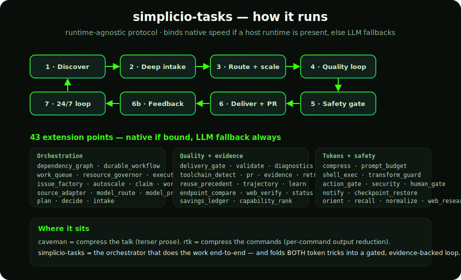

# 🔁 simplicio-tasks — सार्वभौमिक लूपिंग AI ऑर्केस्ट्रेटर

<p align="center">
  
</p>

<p align="center">
  <a href="https://github.com/wesleysimplicio/simplicio-tasks/stargazers"></a>
  <a href="#-6-स्किल्स-सुपर-प्लगइन"></a>
  <a href="#-11-रनटाइम-एक-प्रोटोकॉल"></a>
  <a href="#-43-एक्सटेंशन-पॉइंट्स"></a>
  <a href="#-टोकन-अर्थव्यवस्था"></a>
  <a href="../LICENSE"></a>
</p>

<p align="center">
  <a href="#-tldr">TL;DR</a> ·
  <a href="#-6-स्किल्स-सुपर-प्लगइन">6 स्किल्स</a> ·
  <a href="#-11-रनटाइम-एक-प्रोटोकॉल">11 रनटाइम</a> ·
  <a href="#-लूप">लूप</a> ·
  <a href="#-टोकन-अर्थव्यवस्था">टोकन अर्थव्यवस्था</a> ·
  <a href="#-जिनके-कंधों-पर-खड़ा-है">श्रेय</a> ·
  <a href="#-इंस्टॉल-करें-और-उपयोग-करें">इंस्टॉल</a>
</p>

<p align="center">
  <strong>🌍 Languages:</strong><br>
  <a href="../README.md">🇬🇧 English</a> |
  <a href="README.pt-BR.md">🇧🇷 Português</a> |
  <a href="README.es-ES.md">🇪🇸 Español</a> |
  <a href="README.fr-FR.md">🇫🇷 Français</a> |
  <a href="README.de-DE.md">🇩🇪 Deutsch</a> |
  <a href="README.it-IT.md">🇮🇹 Italiano</a> |
  <a href="README.ja-JP.md">🇯🇵 日本語</a> |
  <a href="README.ko-KR.md">🇰🇷 한국어</a> |
  <a href="README.zh-CN.md">🇨🇳 简体中文</a> |
  <a href="README.ru-RU.md">🇷🇺 Русский</a> |
  <a href="README.pl-PL.md">🇵🇱 Polski</a> |
  <a href="README.tr-TR.md">🇹🇷 Türkçe</a> |
  <a href="README.nl-NL.md">🇳🇱 Nederlands</a> |
  <a href="README.hi-IN.md">🇮🇳 हिन्दी</a> |
  <a href="README.ar-SA.md">🇸🇦 العربية</a>
</p>

---

## ⚡ TL;DR

**simplicio-tasks** एक रनटाइम-निरपेक्ष **सुपर-प्लगइन** है — एक स्वायत्त लूपिंग
ऑर्केस्ट्रेटर और साथ में **पाँच उपग्रह स्किल्स** — जो किसी भी सशक्त LLM (Claude, Codex,
Copilot, Gemini, Cursor, स्थानीय मॉडल) को एक स्व-संचालित वर्कर में बदल देता है। आप इसे किसी
कार्य-भार की ओर इशारा करते हैं — *"सभी खुले issues पूरे करो"*, *"CI कतार साफ़ करो"*, *"Jira
बोर्ड खाली करो"* — और यह पूरे जीवनचक्र को स्वयं चलाता है:

> **खोजो → समझो → निर्णय लो → कार्य करो → सत्यापित करो → सुधारो → रिकॉर्ड करो → दोहराओ**

यह किसी भी स्रोत से कार्य खोजता है, डुप्लिकेट हटाता है, आपकी मशीन के अनुसार एक एजेंट फ़्लीट को
ऑटो-स्केल करता है, प्रत्येक आइटम को एक गुणवत्ता लूप के माध्यम से लागू करता है जो **कोड को चलाता
है (केवल कंपाइल नहीं करता)**, PRs खोलता है, CI/समीक्षा फ़ीडबैक हल करता है, मर्ज करता है, और नए
कार्य के लिए **24/7** निगरानी जारी रखता है — यह सब सुरक्षा गेट्स और एक कठोर लागत किल-स्विच के
पीछे।

```text
/simplicio-tasks termine as issues abertas
→ identity + pre-flight (kill-switch, auth, watcher)
→ discover 50 issues · dedup · build dependency DAG
→ autoscale fleet = 14 · pipeline implement→review→merge
→ each item: read body+ACs → orient code → plan → edit → run → verify → PR
→ merge · close with evidence · rollback if main breaks
→ keep looping every ~2 min until the queue is dry (evidence-gated, never a false "done")
```

तीन बातें इसे अलग बनाती हैं: यह **केंद्रित स्किल्स का एक सुपर-प्लगइन** है, यह **11 रनटाइम पर
वही प्रोटोकॉल** चलाता है, और यह सब कुछ **आक्रामक, ईमानदार टोकन अर्थव्यवस्था** के साथ करता है।

---

## 🧠 6 स्किल्स (सुपर-प्लगइन)

ऑर्केस्ट्रेटर केंद्र है; पाँच उपग्रह प्रत्येक किसी सुप्रसिद्ध तकनीक का सर्वोत्तम भाग आत्मसात करते
हैं और उसे एक पुनः-उपयोग-योग्य स्किल के रूप में प्रस्तुत करते हैं। प्रत्येक उपग्रह **वैकल्पिक**
है — लोड होने पर ऑर्केस्ट्रेटर उसे सौंप देता है (समृद्ध + सस्ता); अनुपस्थित होने पर ऑर्केस्ट्रेटर
का इनलाइन प्रोटोकॉल कार्य का 100% कवर करता है। वही उलटी निर्भरता, एक स्तर ऊपर।

| स्किल | किसे आत्मसात करता है | यह क्या करता है |
|---|---|---|
| 🔁 **simplicio-tasks** | — | ऑर्केस्ट्रेटर लूप: discover → implement → verify → merge → close → 24/7 watch। 43 एक्सटेंशन पॉइंट्स, द्वि-पथ राउटर, स्व-ऑडिट अभिसरण। |
| ♾️ **simplicio-loop** | [ralph-loop](https://github.com/cursor/plugins/tree/main/ralph-loop) | कठोरीकृत Ralph लूप: हर बारी वही लक्ष्य फिर से प्रदान करता है ताकि एजेंट अपना ही कार्य देखे, और केवल एक **साक्ष्य-गेटेड `<promise>`** या किसी `max_iterations` सीमा पर ही बाहर निकलता है — कभी झूठा "done" नहीं। |
| 🧱 **simplicio-orient** | [rtk](https://github.com/rtk-ai/rtk) + [caveman](https://github.com/JuliusBrussee/caveman) | टर्मिनल-फ़र्स्ट निष्पादन: तथ्यों का उत्तर शेल से दो, LLM से कभी नहीं। आउटपुट-घटाव कैटलॉग, **विफलता पर tee-cache**, signatures-only रीड्स, वैकल्पिक auto-rewrite हुक। |
| 🔥 **simplicio-review** | [thermos](https://github.com/cursor/plugins/tree/main/thermos) | प्रतिकूल समीक्षा: अलग-अलग रूब्रिक्स पर समानांतर सब-एजेंट्स (सुरक्षा/शुद्धता + कोड-गुणवत्ता), एक ही संदेश में स्पॉन किए गए, एक निर्णय में डुप्लिकेट-मुक्त किए गए। |
| 🗜️ **simplicio-compress** | [caveman](https://github.com/JuliusBrussee/caveman) | आउटपुट + स्मृति संपीड़न: संक्षिप्त गद्य स्तर जो कोड/पाथ्स को बाइट-दर-बाइट बनाए रखते हैं, साथ ही एक बार की स्मृति संघनन जो हर बारी प्रतिफल देती है। Fail-closed `transform_guard`। |
| 🎓 **simplicio-learn** | [teaching](https://github.com/cursor/plugins/tree/main/teaching) + continual-learning | पूर्वावलोकन: किसी रन से टिकाऊ, डुप्लिकेट-मुक्त सबक निकालना और उन्हें स्मृति में लिखना ताकि अगला रन सस्ता और अधिक सही हो। |

प्रत्येक [`.claude/skills/`](../.claude/skills) के अंतर्गत एक सामान्य स्किल फ़ोल्डर है — स्टैंडअलोन
या लूप के हिस्से के रूप में उपयोग-योग्य।

---

## 🌐 11 रनटाइम, एक प्रोटोकॉल

एक सार्वभौमिक स्किल कोर + हुक्स का एक सेट हर रनटाइम को चलाता है। एक एडाप्टर पतला होता है: यह किसी
रनटाइम को बताता है कि *स्किल्स कहाँ लोड करें*, *लूप को कैसे सक्रिय करें*, और *मूल गति से कैसे
बाइंड करें*। **स्किल किसी रनटाइम का नाम नहीं लेती; रनटाइम स्किल को पहचानता है।**

| रनटाइम | स्किल लोड | लूप ड्राइव | मूल बाइंड |
|---|---|---|---|
| **Claude Code** | `.claude/skills/` + plugin | `Stop` hook | MCP |
| **Codex** | `AGENTS.md` | self-paced | MCP / adapter |
| **VS Code (Copilot)** | `copilot-instructions.md` | tasks | MCP |
| **Cursor** | `.cursor-plugin/` | `stop`+`afterAgentResponse` | MCP / rules |
| **Antigravity** | rules / `AGENTS.md` | self-paced | MCP |
| **Kiro** | `.kiro/steering/` | specs | MCP |
| **OpenCode** | `AGENTS.md` | self-paced | MCP |
| **Gemini** | `GEMINI.md` | self-paced | MCP / adapter |
| **Aider** | `CONVENTIONS.md` | self-paced | — (LLM fallback) |
| **Hermes** | native recall | native loop | **native** |
| **OpenClaw** | plugin SDK | native scheduler | **native** |

वादा: **सभी 11 पर वही प्रोटोकॉल, वही गेट्स, वही सुरक्षा — केवल गति भिन्न होती है।**
`orient_clamp.py` (टोकन अर्थव्यवस्था) हर रनटाइम पर शून्य वायरिंग के साथ काम करता है। देखें
[`adapters/MATRIX.md`](../adapters/MATRIX.md)।

<p align="center">
  
</p>

---

## 🗺️ पूरा प्रवाह — माँग से वितरण तक

ऑर्केस्ट्रेटर जिस प्रत्येक परत पर कार्य करता है, क्रम में — माँग पढ़ने (issues, tasks, assigns)
से लेकर मर्ज-किए-गए, साक्ष्य-समर्थित कार्य के वितरण तक, फिर और अधिक के लिए 24/7 लूपिंग। (आरेख
GitHub पर मूल रूप से रेंडर होता है।)

```mermaid
flowchart TD
  subgraph SRC["1 · Demand sources (any adapter)"]
    direction LR
    S1["GitHub Issues / PRs / CI"]
    S2["Jira · Azure DevOps · Linear · ClickUp · Notion"]
    S3["Assigns · TODO/FIXME · CVE · local files"]
  end
  SRC --> PF
  subgraph PF["2 · Pre-flight gates"]
    direction LR
    P1["cost kill-switch budget"]
    P2["source auth + scopes"]
    P3["arm 24/7 watcher"]
  end
  PF --> DISC
  subgraph DISC["3 · Discover + normalize"]
    direction LR
    D1["source_adapter: list metadata only"]
    D2["normalize to canonical schema"]
    D3["dedup id+title+fingerprint+branch/PR"]
    D4["dependency DAG"]
  end
  DISC --> INTK
  subgraph INTK["4 · Deep intake (per item)"]
    direction LR
    I1["body + ALL comments"]
    I2["extract acceptance criteria"]
    I3["orient code · signatures-only reads"]
    I4["plan + AC checklist + complexity"]
  end
  INTK --> RT{"5 · Route"}
  RT -->|"small and every item complexity at most 3"| FAST["Fast-path: solo, one targeted test"]
  RT -->|"large queue or any medium+"| POOL
  subgraph POOL["6 · Continuous worker pool (autoscaled, conflict-aware)"]
    direction LR
    W1["claim · branch · worktree if overlap"]
    W2["deterministic_edit"]
    W3["quality loop: edit-lint-test-fix"]
  end
  FAST --> QG
  POOL --> QG
  subgraph QG["7 · Quality gates"]
    direction LR
    Q1["AC gate = real DoD"]
    Q2["WORKS not just compiles · web_verify (Playwright)"]
    Q3["adversarial review · thermos rubrics"]
  end
  QG --> SG
  subgraph SG["8 · Safety gates (non-negotiable)"]
    direction LR
    G1["secret-scan"]
    G2["irreversible-op human gate"]
    G3["4-state verdict · attestation"]
  end
  SG --> DEL
  subgraph DEL["9 · Deliver"]
    direction LR
    L1["commit · push · Draft PR"]
    L2["close in-source + evidence"]
    L3["verify reality, not self-report"]
  end
  DEL --> FB
  subgraph FB["10 · Feedback loop to merge-ready"]
    direction LR
    F1["CI fail -> fix root cause"]
    F2["review comments -> adjust"]
    F3["branch behind main -> additive rebase"]
  end
  FB -->|"merged and closed"| DONE(["done + evidence + savings line"])
  WATCH["11 · 24/7 watcher · simplicio-loop<br/>evidence-gated promise · max-iterations cap · cost kill-switch"]
  FB -. "poll new work / comments / checks" .-> WATCH
  DONE -. "idle until new work" .-> WATCH
  WATCH -. "re-feed the goal" .-> DISC
```



**परत दर परत — क्या कार्य करता है, और वह कौन-सा संसाधन उपयोग करता है:**

| # | परत | क्या होता है | स्किल / एक्सटेंशन पॉइंट · किससे लिया गया |
|---|---|---|---|
| 1 | **माँग स्रोत** | किसी भी स्रोत से कार्य पढ़ें — issues, PRs, CI, बोर्ड, assigns, TODO, CVEs | `source_adapter` · `intake` |
| 2 | **प्री-फ़्लाइट** | `$` किल-स्विच सक्रिय करें, स्रोत प्रमाणन जाँचें, 24/7 watcher सक्रिय करें | `watcher` · लागत शासन |
| 3 | **खोज + सामान्यीकरण** | केवल मेटाडेटा से सूचीबद्ध करें, सामान्यीकृत करें, डुप्लिकेट हटाएँ, निर्भरता DAG बनाएँ | `normalize` · `dependency_graph` |
| 4 | **गहन इनटेक** | पूरा बॉडी + टिप्पणियाँ पढ़ें, ACs निकालें, कोड को orient करें, एक योजना लिखें | `orient` · signatures-read · **rtk** |
| 5 | **राउट** | फ़ास्ट-पथ (तुच्छ) बनाम भारी-पथ; फ़्लीट को मशीन के अनुसार ऑटोस्केल करें | `autoscale` · द्वि-पथ राउटर |
| 6 | **वर्कर पूल** | निरंतर, संघर्ष-सजग फ़ैन-आउट; यांत्रिक संपादन; प्रति-आइटम गुणवत्ता लूप | `execute` · `worktree` · `deterministic_edit` |
| 7 | **गुणवत्ता गेट्स** | AC गेट (असली DoD), रन-सत्यापन (UI → **Playwright** `web_verify`), प्रतिकूल समीक्षा | `validate` · **`simplicio-review`** (thermos) |
| 8 | **सुरक्षा गेट्स** | सीक्रेट-स्कैन, अपरिवर्तनीय-संचालन मानव गेट, 4-अवस्था निर्णय, प्रमाणन | `action_gate` · `human_gate` · `security` |
| 9 | **वितरण** | कमिट, पुश, Draft PR, साक्ष्य के साथ इन-सोर्स बंद करें; वास्तविकता सत्यापित करें | `pr` / `evidence` · `delivery_gate` |
| 10 | **फ़ीडबैक लूप** | CI → फिक्स, समीक्षा टिप्पणियाँ → समायोजन, branch-behind → योगात्मक rebase | `diagnostics` · `retry` |
| 11 | **24/7 watcher** | साक्ष्य-गेटेड वादे तक लक्ष्य फिर से प्रदान करें; खाली होने पर निष्क्रिय, किसी भी चीज़ पर जागें | **`simplicio-loop`** (Ralph) · `watcher` |
| ↻ | **क्रॉस-कटिंग** | टोकन अर्थव्यवस्था (टर्मिनल-फ़र्स्ट · कैटलॉग · **tee+CCR** · गद्य/स्मृति संपीड़न) · मॉडल राउटिंग L0→L4 · learn | **`simplicio-orient`** (rtk+caveman) · **`simplicio-compress`** (caveman) · **`simplicio-learn`** (teaching) · **headroom** CCR |

प्रत्येक परत में एक हमेशा-काम-करने वाला LLM फ़ॉलबैक है और जब होस्ट कोई मूल कमांड प्रदान करता है तो
वह उससे बाइंड हो जाती है — सभी 11 रनटाइम पर वही प्रोटोकॉल, केवल गति भिन्न होती है।

---

## 🔁 लूप

ऑर्केस्ट्रेटर के नीचे का ड्राइव एक **कठोरीकृत Ralph लूप** (`simplicio-loop`) है:

1. लक्ष्य एक एकल, मानव-पठनीय स्थिति फ़ाइल (`.orchestrator/loop/scratchpad.md`) में लिखा जाता
   है — तुच्छता से निरीक्षण-योग्य, संपादन-योग्य, रद्द-करने-योग्य।
2. प्रत्येक बारी के बाद एक **stop-hook** वही लक्ष्य फिर से प्रदान करता है, ताकि एजेंट अपने ही
   पूर्व संपादन देखे (git + वर्किंग ट्री के माध्यम से) और अभिसरित हो। प्रति चक्र टोकन लागत समतल
   रहती है — कोई संदर्भ भराव नहीं।
3. यह **केवल** तभी बाहर निकलता है जब एक टाइप किया गया प्रहरी `<promise>EXACT TEXT</promise>`
   उत्सर्जित हो **और** ठोस इन-टर्न साक्ष्य से समर्थित हो (एक पास होता गेट, एक मर्ज-किया-PR लिंक,
   AC रसीदें), या जब एक कठोर `max_iterations` सीमा / लागत किल-स्विच सक्रिय हो।

> **कभी झूठा वादा नहीं।** बिना साक्ष्य वाला एक `<promise>` अनदेखा कर दिया जाता है और लूप जारी
> रहता है। यह लूप को सीधे रेपो के कठोर नियम में जोड़ता है: *किसी मर्ज-किए-PR या ठोस साक्ष्य के
> बिना कार्य कभी बंद न करें।*

हुक्स रहित रनटाइम पर लूप होस्ट शेड्यूलर (cron / `/loop` / रनटाइम के टास्क रनर) के माध्यम से
**स्व-गति** करता है — वही निकास शर्तें। हुक्स क्रॉस-प्लेटफ़ॉर्म Python हैं और **fail-open** हैं:
एक हुक जो त्रुटि देता है, हमेशा एजेंट को रुकने देता है। असली गार्ड सीमा और बजट हैं, कभी हुक की
चतुराई नहीं।

---

## 📊 टोकन अर्थव्यवस्था

सबसे सस्ता टोकन वह है जो खर्च न किया जाए। `simplicio-orient` + `simplicio-compress` **rtk**
(कमांड्स संपीड़ित करो) और **caveman** (बातचीत संपीड़ित करो) का सर्वोत्तम भाग सुरक्षा रीढ़ में समेट
देते हैं:

- **टर्मिनल-फ़र्स्ट निष्पादन** — शेल तथ्यों को ठीक-ठीक जानता है; LLM उन्हें महँगे ढंग से अनुमानित
  करता है। एक क्रॉस-प्लेटफ़ॉर्म प्रतिस्थापन तालिका (Windows/macOS/Linux) `git`/`gh`/`rg`/`python3`
  के माध्यम से 30+ तथ्यों का उत्तर देती है। **किसी कमांड का कभी अनुकरण न करें — उसे चलाएँ।**
- **आउटपुट-घटाव कैटलॉग** (डेटा तालिका) — प्रति-कमांड रेसिपी + अपेक्षित-बचत% +
  `skip-if-structured` गार्ड। एक कच्चा `cargo check` पढ़ने में ~2000 टोकन लगता है; क्लैम्प्ड, ~80।
- **tee-cache + प्रतिवर्ती retrieve** *(rtk + headroom CCR)* — आक्रामक काट-छाँट तभी सुरक्षित है जब
  वह पुनर्प्राप्त-योग्य हो: विफलता पर पूरा आउटपुट `.orchestrator/tee/…log` में लिखा जाता है और केवल
  पाथ सतह पर लाया जाता है; एजेंट कमांड को **फिर से चलाए बिना** `retrieve <path> [--lines|--grep]` से
  संदर्भ पुनर्प्राप्त कर लेता है। क्लैम्प एक हानिकर निर्णय के बजाय एक प्रतिवर्ती निर्णय बन जाता है।
- **Signatures-only रीड्स** *(rtk से)* — किसी फ़ाइल की API सतह पढ़ें (घोषणाएँ, बॉडीज़ हटाई गईं):
  एक 600-पंक्ति फ़ाइल intake के दौरान ~40 पंक्तियाँ बन जाती है।
- **सिग्नल-स्तरीय कैप्स + success-collapse + dedup** — शोर के ऊपर त्रुटियाँ रखें; एक स्वच्छ रन को
  एक पंक्ति में संक्षिप्त करें; दोहराई गई पंक्तियों को `line xN` में संक्षिप्त करें — हमेशा
  `unless errors present`।
- **गद्य स्तर + स्मृति संघनन** *(caveman से)* — संक्षिप्त आउटपुट जो कोड/पाथ्स/URLs को **बाइट-दर-बाइट**
  बनाए रखता है (`transform_guard` किसी भी खोए टोकन पर fail closed होता है), साथ ही स्थायी स्मृति का
  एक बार का संघनन जो हर भविष्य की बारी पर परिशोधित होता है।
- **ईमानदार बेसलाइन** — बचत एक यथार्थवादी *"answer concisely"* नियंत्रण भुजा के विरुद्ध मापी जाती
  है (किसी वाचाल स्ट्रॉमैन के विरुद्ध नहीं), केवल **आउटपुट** टोकन गिनती है (तर्कणा नहीं), और
  **केवल एक सत्यापित-सही परिणाम पर** श्रेय पाती है। संपीड़न जो अपना गुणवत्ता गेट विफल कर दे, शून्य
  कमाता है।

प्रत्येक संदेश एक ईमानदार पंक्ति के साथ समाप्त होता है:

```
simplicio-tasks: ~<spent> tokens · baseline ~<control-arm> · saved ~<saved> (<pct>%)
```

अभी आज़माएँ, कोई वायरिंग नहीं:

```bash
python3 hooks/orient_clamp.py -- cargo test      # reduced output + tee log on failure
python3 hooks/orient_clamp.py --json -- git diff  # machine summary
```

---

## 🏗️ जिनके कंधों पर खड़ा है

simplicio-tasks को GitHub पर सर्वश्रेष्ठ लूप + टोकन-अर्थव्यवस्था कार्य का **गहन अध्ययन करने के
बाद** बनाया गया, और प्रत्येक को एक केंद्रित स्किल में समेटा गया — अनुशासन रखते हुए, तिकड़मों को
छोड़ते हुए।

| प्रोजेक्ट | हमने क्या लिया | हमने क्या छोड़ा |
|---|---|---|
| 🪨 [**caveman**](https://github.com/JuliusBrussee/caveman) | संक्षिप्त गद्य स्तर, बाइट-संरक्षित पहचानकर्ता, स्मृति संघनन, ईमानदार *"answer concisely"* बेसलाइन | व्याकरण शब्द-लोपन (कोड और पुष्टियों को घटाता है) |
| ⚙️ [**rtk**](https://github.com/rtk-ai/rtk) | प्रति-कमांड घटाव कैटलॉग, सिग्नल-स्तरीय कैप्स, **tee-cache**, signatures-read, auto-rewrite हुक + exclude सूची | प्रति-भाषा रजिस्ट्रियाँ (रनटाइम-विशिष्ट) |
| ♾️ [**ralph-loop**](https://github.com/cursor/plugins/tree/main/ralph-loop) | एकल-फ़ाइल लूप स्थिति, exact-match promise प्रहरी, दो-हुक विभाजन | trust-the-model समापन (हम इसे **साक्ष्य-गेटेड** बनाते हैं) |
| 🔥 [**thermos**](https://github.com/cursor/plugins/tree/main/thermos) | एकल-संदेश समानांतर समीक्षक, अलग रूब्रिक्स, dedup-on-synthesis | — |
| 🎓 [**teaching**](https://github.com/cursor/plugins/tree/main/teaching) | पूर्वावलोकन जो स्थिति को कायम रखता है ताकि अगला चक्र उसे फिर से न निकाले | मानव-शिक्षण क्षेत्र ही |
| 🧭 परिणाम-उन्मुख निष्पादन | अंत-स्थिति पर अभिसरण करें; नियोजित, परिक्षेत्रित, प्रतिवर्ती मध्यवर्ती भंगता | — |
| 🧠 [**headroom**](https://github.com/headroomlabs-ai/headroom) | tee-cache के ऊपर **प्रतिवर्ती** compress-cache-retrieve (CCR); सामग्री-प्रकार राउटिंग वर्गीकरण | प्रशिक्षित मॉडल + ट्रैफ़िक प्रॉक्सी (टर्मिनल-फ़र्स्ट, रनटाइम-निरपेक्ष डिज़ाइन के विरुद्ध) |
| 🎭 [**Playwright**](https://github.com/microsoft/playwright) (+[mcp](https://github.com/microsoft/playwright-mcp), [python](https://github.com/microsoft/playwright-python)) | फ़्रंट-एंड प्रमाण के लिए एक असली ब्राउज़र चलाएँ — `web_verify` साक्ष्य के रूप में स्क्रीनशॉट + ट्रेस | संदर्भ में DOM/पिक्सेल (साक्ष्य आर्टिफ़ैक्ट पाथ है, बाइट्स नहीं) |

> वे टोकन घटाते हैं; simplicio-tasks **काम करता है** और काम करते हुए टोकन घटाता है।

---

## 🧩 43 एक्सटेंशन पॉइंट्स

कार्य का प्रत्येक चरण एक **नामित एक्सटेंशन पॉइंट** पर होता है। यदि कोई होस्ट रनटाइम एक मूल क्षमता
प्रदान करता है तो वह **बाइंड** हो जाता है (नियतात्मक, लगभग शून्य टोकन); अन्यथा LLM मानक उपकरणों के
साथ **फ़ॉलबैक** करता है। skill अमूर्तन पर निर्भर करती है, किसी रनटाइम पर कभी नहीं।

<details>
<summary><strong>Orchestration & scale</strong></summary>

`orient` · `normalize` · `intake` · `source_adapter` · `autoscale` · `plan`/`decide` ·
`execute` · `issue_factory` · `claim` · `worktree` · `dependency_graph` · `durable_workflow` ·
`work_queue` · `resource_governor` · `model_route` · `model_preflight`
</details>

<details>
<summary><strong>Editing, quality & evidence</strong></summary>

`deterministic_edit` · `diagnostics` · `toolchain_detect` · `validate`/`smoke` ·
`delivery_gate` · `endpoint_compare` · `web_verify` · `pr`/`evidence` · `retry` ·
`reuse_precedent` · `trajectory` · `learn` · `status` · `capability_rank`
</details>

<details>
<summary><strong>Tokens, context & safety</strong></summary>

`recall` · `compress` · `prompt_budget` · `shell_exec` · `transform_guard` · `action_gate` ·
`security` · `human_gate` · `notify` · `checkpoint_restore` · `watcher` · `savings_ledger` ·
`web_research`
</details>

फ़ॉलबैक्स सहित पूर्ण तालिका:
[`references/extension-points.md`](../.claude/skills/simplicio-tasks/references/extension-points.md)।

---

## 🚀 इंस्टॉल करें और उपयोग करें

```bash
git clone https://github.com/wesleysimplicio/simplicio-tasks
cd simplicio-tasks

# install for your runtime (omit <runtime> to auto-detect)
bash scripts/install.sh <runtime> [--global]        # macOS / Linux
pwsh scripts/install.ps1 <runtime> [-Global]        # Windows
# <runtime> ∈ claude codex vscode cursor antigravity kiro opencode gemini aider hermes openclaw
```

या, Claude Code / Cursor पर, इसे एक मार्केटप्लेस प्लगइन के रूप में जोड़ें:

```
/plugin marketplace add wesleysimplicio/simplicio-tasks
/plugin install simplicio-tasks@simplicio
```

फिर:

```
/simplicio-tasks finish all the open issues
```

एकमात्र आवश्यकता PATH पर **python3** है (स्किल्स, हुक्स और इंस्टॉलर क्रॉस-प्लेटफ़ॉर्म Python हैं)।
GitHub स्रोतों के लिए, `git` + एक प्रमाणित `gh`। देखें [`INSTALL.md`](../INSTALL.md) और
[`adapters/MATRIX.md`](../adapters/MATRIX.md)।

**किसी अनिगरानी 24/7 रन से पहले:** `.orchestrator/loop-budget.json` में एक लागत सीमा सेट करें
(`daily_usd_ceiling > 0`), पुष्टि करें कि स्रोत प्रमाणन स्थायी है, और अपरिवर्तनीय-संचालन मानव गेट
+ सीक्रेट-स्कैन चालू रखें। `ceiling = 0` के साथ watcher अनिगरानी चलने से इनकार कर देता है
(fail-safe)।

---

## 🔒 सुरक्षा (गैर-समझौता-योग्य)

- हर diff पर **सीक्रेट-स्कैन**; हिट पर रोकें।
- **अपरिवर्तनीय-संचालन मानव गेट** — force-push, इतिहास पुनर्लेखन, prod डिप्लॉय, डेटा/स्कीमा डिलीट,
  मास-फ़ाइल डिलीट → रुको और पूछो। हेडलेस + कोई अनुमोदक नहीं → विनाशकारी क्षमता हटा दें।
- **4-अवस्था पूर्व-निष्पादन निर्णय** — अनुकूलन किसी कमांड के जोखिम स्तर को कभी नहीं बढ़ा सकता।
- **Trust-before-load** — धारणा-आकार देने वाला कॉन्फ़िग (clamp प्रोफ़ाइल, suppression सूचियाँ)
  तब तक अविश्वसनीय रहता है जब तक कोई मानव समीक्षा करके उसे hash-pin न कर दे।
- **प्रॉम्प्ट-इंजेक्शन सुदृढ़ीकरण** — आइटम/PR/टिप्पणी सामग्री अनुबंध को कभी ओवरराइड नहीं कर सकती।
- अनिगरानी रन्स के लिए कठोर **$ किल-स्विच**; **साक्ष्य-गेटेड** समापन (कभी झूठा "done" नहीं);
  **fail-open** हुक्स (एजेंट को कभी लूप में न फँसाएँ)।

---

## 📄 लाइसेंस

MIT — देखें [LICENSE](../LICENSE)। [Simplicio](https://github.com/wesleysimplicio) पारिस्थितिकी तंत्र का हिस्सा।
