# 🔁 simplicio-tasks — L'orchestratore IA universale a ciclo continuo

<p align="center">
  
</p>

<p align="center">
  <a href="https://github.com/wesleysimplicio/simplicio-tasks/stargazers"></a>
  <a href="#-le-6-skill-super-plugin"></a>
  <a href="#-11-runtime-un-protocollo"></a>
  <a href="#-i-43-extension-point"></a>
  <a href="#-economia-dei-token"></a>
  <a href="../LICENSE"></a>
</p>

<p align="center">
  <a href="#-tldr">TL;DR</a> ·
  <a href="#-le-6-skill-super-plugin">6 Skill</a> ·
  <a href="#-11-runtime-un-protocollo">11 Runtime</a> ·
  <a href="#-il-loop">Il loop</a> ·
  <a href="#-economia-dei-token">Economia dei token</a> ·
  <a href="#-sulle-spalle-di">Riconoscimenti</a> ·
  <a href="#-installazione--uso">Installazione</a>
</p>

<p align="center">
  <strong>🌍 Languages:</strong><br>
  <a href="../README.md">🇬🇧 English</a> |
  <a href="README.pt-BR.md">🇧🇷 Português</a> |
  <a href="README.es-ES.md">🇪🇸 Español</a> |
  <a href="README.fr-FR.md">🇫🇷 Français</a> |
  <a href="README.de-DE.md">🇩🇪 Deutsch</a> |
  <a href="README.it-IT.md">🇮🇹 Italiano</a> |
  <a href="README.ja-JP.md">🇯🇵 日本語</a> |
  <a href="README.ko-KR.md">🇰🇷 한국어</a> |
  <a href="README.zh-CN.md">🇨🇳 简体中文</a> |
  <a href="README.ru-RU.md">🇷🇺 Русский</a> |
  <a href="README.pl-PL.md">🇵🇱 Polski</a> |
  <a href="README.tr-TR.md">🇹🇷 Türkçe</a> |
  <a href="README.nl-NL.md">🇳🇱 Nederlands</a> |
  <a href="README.hi-IN.md">🇮🇳 हिन्दी</a> |
  <a href="README.ar-SA.md">🇸🇦 العربية</a>
</p>

---

## ⚡ TL;DR

**simplicio-tasks** è un **super-plugin** indipendente dal runtime — un unico orchestratore autonomo a
ciclo continuo più **cinque skill satellite** — che trasforma qualsiasi LLM potente (Claude, Codex,
Copilot, Gemini, Cursor, modelli locali) in un worker che si guida da solo. Lo punti verso un corpo di
lavoro — *"completa tutte le issue aperte"*, *"svuota la coda della CI"*, *"esaurisci la board di Jira"* —
e lui esegue l'intero ciclo di vita da solo:

> **scopri → comprendi → decidi → agisci → verifica → correggi → registra → ripeti**

Scopre il lavoro da qualsiasi fonte, deduplica, ridimensiona automaticamente una flotta di agenti in
base alla tua macchina, implementa ogni elemento attraverso un loop di qualità che **esegue il codice
(non si limita a compilarlo)**, apre le PR, risolve i feedback di CI/review, fa il merge e continua a
sorvegliare **24/7** in cerca di nuovo lavoro — il tutto dietro gate di sicurezza e un kill-switch
rigido sui costi.

```text
/simplicio-tasks termine as issues abertas
→ identity + pre-flight (kill-switch, auth, watcher)
→ discover 50 issues · dedup · build dependency DAG
→ autoscale fleet = 14 · pipeline implement→review→merge
→ each item: read body+ACs → orient code → plan → edit → run → verify → PR
→ merge · close with evidence · rollback if main breaks
→ keep looping every ~2 min until the queue is dry (evidence-gated, never a false "done")
```

Tre cose lo rendono diverso: è un **super-plugin di skill mirate**, esegue lo **stesso protocollo su 11
runtime** e fa tutto questo con un'**economia dei token aggressiva e onesta**.

---

## 🧠 Le 6 skill (super-plugin)

L'orchestratore è il nucleo; cinque satelliti assorbono ciascuno il meglio di una tecnica ben nota e lo
espongono come skill riutilizzabile. Ogni satellite è **opzionale** — quando è caricato, l'orchestratore
delega a esso (più ricco + più economico); quando è assente, il protocollo inline dell'orchestratore
copre il 100% del lavoro. La stessa dipendenza invertita, un livello più in alto.

| Skill | Assorbe | Cosa fa |
|---|---|---|
| 🔁 **simplicio-tasks** | — | Il loop dell'orchestratore: scopri → implementa → verifica → merge → chiudi → sorveglia 24/7. 43 extension point, router a doppio percorso, convergenza con auto-audit. |
| ♾️ **simplicio-loop** | [ralph-loop](https://github.com/cursor/plugins/tree/main/ralph-loop) | Il loop Ralph rinforzato: ri-inietta lo stesso obiettivo a ogni turno così che l'agente veda il proprio lavoro, uscendo solo con una **`<promise>` vincolata a evidenze** o un limite di `max_iterations` — mai un falso "done". |
| 🧱 **simplicio-orient** | [rtk](https://github.com/rtk-ai/rtk) + [caveman](https://github.com/JuliusBrussee/caveman) | Esecuzione terminal-first: rispondi ai fatti con la shell, mai con l'LLM. Catalogo di riduzione dell'output, **tee-cache in caso di fallimento**, letture solo-firme, hook opzionale di auto-rewrite. |
| 🔥 **simplicio-review** | [thermos](https://github.com/cursor/plugins/tree/main/thermos) | Review avversariale: sub-agenti paralleli su rubriche distinte (sicurezza/correttezza + qualità del codice), avviati in un unico messaggio, deduplicati in un solo verdetto. |
| 🗜️ **simplicio-compress** | [caveman](https://github.com/JuliusBrussee/caveman) | Compressione di output + memoria: livelli di prosa stringata che preservano codice/percorsi byte per byte, più una compattazione una-tantum della memoria che ripaga a ogni turno. `transform_guard` fail-closed. |
| 🎓 **simplicio-learn** | [teaching](https://github.com/cursor/plugins/tree/main/teaching) + continual-learning | Retrospettiva: estrai dall'esecuzione lezioni durevoli e deduplicate e scrivile in memoria così che la prossima esecuzione sia più economica e più corretta. |

Ognuna è una normale cartella di skill sotto [`.claude/skills/`](../.claude/skills) — utilizzabile in modo
autonomo o come parte del loop.

---

## 🌐 11 runtime, un protocollo

Un unico nucleo di skill universale + un unico set di hook guida ogni runtime. Un adapter è sottile: dice
a un runtime *dove caricare le skill*, *come armare il loop* e *come legarsi alla velocità nativa*. **La
skill non nomina alcun runtime; è il runtime a rilevare la skill.**

| Runtime | Caricamento skill | Drive del loop | Binding nativo |
|---|---|---|---|
| **Claude Code** | `.claude/skills/` + plugin | hook `Stop` | MCP |
| **Codex** | `AGENTS.md` | auto-ritmato | MCP / adapter |
| **VS Code (Copilot)** | `copilot-instructions.md` | tasks | MCP |
| **Cursor** | `.cursor-plugin/` | `stop`+`afterAgentResponse` | MCP / rules |
| **Antigravity** | rules / `AGENTS.md` | auto-ritmato | MCP |
| **Kiro** | `.kiro/steering/` | specs | MCP |
| **OpenCode** | `AGENTS.md` | auto-ritmato | MCP |
| **Gemini** | `GEMINI.md` | auto-ritmato | MCP / adapter |
| **Aider** | `CONVENTIONS.md` | auto-ritmato | — (fallback LLM) |
| **Hermes** | native recall | loop nativo | **nativo** |
| **OpenClaw** | plugin SDK | scheduler nativo | **nativo** |

La promessa: **stesso protocollo, stessi gate, stessa sicurezza su tutti e 11 — cambia solo la
velocità.** `orient_clamp.py` (economia dei token) funziona su ogni runtime senza alcun cablaggio. Vedi
[`adapters/MATRIX.md`](../adapters/MATRIX.md).

<p align="center">
  
</p>

---

## 🗺️ Il flusso completo — dalla richiesta alla consegna

Ogni livello su cui agisce l'orchestratore, in ordine — dalla lettura della richiesta (issue, task,
assegnazioni) fino alla consegna di lavoro mergeato e documentato, poi il loop 24/7 per altro lavoro.
(Il diagramma viene renderizzato nativamente su GitHub.)

```mermaid
flowchart TD
  subgraph SRC["1 · Demand sources (any adapter)"]
    direction LR
    S1["GitHub Issues / PRs / CI"]
    S2["Jira · Azure DevOps · Linear · ClickUp · Notion"]
    S3["Assigns · TODO/FIXME · CVE · local files"]
  end
  SRC --> PF
  subgraph PF["2 · Pre-flight gates"]
    direction LR
    P1["cost kill-switch budget"]
    P2["source auth + scopes"]
    P3["arm 24/7 watcher"]
  end
  PF --> DISC
  subgraph DISC["3 · Discover + normalize"]
    direction LR
    D1["source_adapter: list metadata only"]
    D2["normalize to canonical schema"]
    D3["dedup id+title+fingerprint+branch/PR"]
    D4["dependency DAG"]
  end
  DISC --> INTK
  subgraph INTK["4 · Deep intake (per item)"]
    direction LR
    I1["body + ALL comments"]
    I2["extract acceptance criteria"]
    I3["orient code · signatures-only reads"]
    I4["plan + AC checklist + complexity"]
  end
  INTK --> RT{"5 · Route"}
  RT -->|"small and every item complexity at most 3"| FAST["Fast-path: solo, one targeted test"]
  RT -->|"large queue or any medium+"| POOL
  subgraph POOL["6 · Continuous worker pool (autoscaled, conflict-aware)"]
    direction LR
    W1["claim · branch · worktree if overlap"]
    W2["deterministic_edit"]
    W3["quality loop: edit-lint-test-fix"]
  end
  FAST --> QG
  POOL --> QG
  subgraph QG["7 · Quality gates"]
    direction LR
    Q1["AC gate = real DoD"]
    Q2["WORKS not just compiles · web_verify (Playwright)"]
    Q3["adversarial review · thermos rubrics"]
  end
  QG --> SG
  subgraph SG["8 · Safety gates (non-negotiable)"]
    direction LR
    G1["secret-scan"]
    G2["irreversible-op human gate"]
    G3["4-state verdict · attestation"]
  end
  SG --> DEL
  subgraph DEL["9 · Deliver"]
    direction LR
    L1["commit · push · Draft PR"]
    L2["close in-source + evidence"]
    L3["verify reality, not self-report"]
  end
  DEL --> FB
  subgraph FB["10 · Feedback loop to merge-ready"]
    direction LR
    F1["CI fail -> fix root cause"]
    F2["review comments -> adjust"]
    F3["branch behind main -> additive rebase"]
  end
  FB -->|"merged and closed"| DONE(["done + evidence + savings line"])
  WATCH["11 · 24/7 watcher · simplicio-loop<br/>evidence-gated promise · max-iterations cap · cost kill-switch"]
  FB -. "poll new work / comments / checks" .-> WATCH
  DONE -. "idle until new work" .-> WATCH
  WATCH -. "re-feed the goal" .-> DISC
```



**Livello per livello — cosa agisce e quale risorsa usa:**

| # | Livello | Cosa accade | Skill / extension point · preso in prestito da |
|---|---|---|---|
| 1 | **Demand sources** | Leggere il lavoro da QUALSIASI fonte — issue, PR, CI, board, assegnazioni, TODO, CVE | `source_adapter` · `intake` |
| 2 | **Pre-flight** | Armare il kill-switch `$`, controllare l'auth della fonte, armare il watcher 24/7 | `watcher` · governance dei costi |
| 3 | **Discover + normalize** | Elencare solo per metadati, normalizzare, deduplicare, costruire il DAG delle dipendenze | `normalize` · `dependency_graph` |
| 4 | **Deep intake** | Leggere body completo + commenti, estrarre gli AC, orientare il codice, scrivere un piano | `orient` · signatures-read · **rtk** |
| 5 | **Route** | Fast-path (banale) vs heavy-path; autoscalare la flotta sulla macchina | `autoscale` · router a doppio percorso |
| 6 | **Worker pool** | Fan-out continuo e conflict-aware; edit meccanici; loop di qualità per elemento | `execute` · `worktree` · `deterministic_edit` |
| 7 | **Quality gates** | AC gate (vera DoD), verifica di esecuzione (UI → **Playwright** `web_verify`), review avversariale | `validate` · **`simplicio-review`** (thermos) |
| 8 | **Safety gates** | Secret-scan, gate umano sulle operazioni irreversibili, verdetto a 4 stati, attestazione | `action_gate` · `human_gate` · `security` |
| 9 | **Deliver** | Commit, push, Draft PR, chiusura in-source con evidenze; verificare la realtà | `pr` / `evidence` · `delivery_gate` |
| 10 | **Feedback loop** | CI → fix, commenti di review → adattare, branch indietro → rebase additivo | `diagnostics` · `retry` |
| 11 | **24/7 watcher** | Ri-iniettare l'obiettivo fino a una promise vincolata a evidenze; inattivo quando svuotato, si sveglia per qualsiasi cosa | **`simplicio-loop`** (Ralph) · `watcher` |
| ↻ | **Trasversale** | Economia dei token (terminal-first · catalogo · **tee+CCR** · compressione prosa/memoria) · routing dei modelli L0→L4 · apprendimento | **`simplicio-orient`** (rtk+caveman) · **`simplicio-compress`** (caveman) · **`simplicio-learn`** (teaching) · **headroom** CCR |

Ogni livello ha un fallback LLM che funziona sempre e si lega a un comando nativo quando l'host ne fornisce
uno — lo stesso protocollo su tutti e 11 i runtime, cambia solo la velocità.

---

## 🔁 Il loop

Il drive sotto l'orchestratore è un **loop Ralph rinforzato** (`simplicio-loop`):

1. L'obiettivo viene scritto in un unico file di stato leggibile dall'uomo
   (`.orchestrator/loop/scratchpad.md`) — banalmente ispezionabile, modificabile, annullabile.
2. Dopo ogni turno uno **stop-hook** ri-inietta lo stesso obiettivo, così l'agente vede le proprie
   modifiche precedenti (tramite git + il working tree) e converge. Il costo in token per ciclo resta
   piatto — niente context stuffing.
3. Esce **solo** quando viene emesso un sentinella tipizzato `<promise>TESTO ESATTO</promise>` **ed** è
   supportato da evidenze concrete prodotte nel turno (un gate superato, un link a una PR mergeata,
   ricevute degli AC), oppure quando scatta un limite rigido di `max_iterations` / il kill-switch dei
   costi.

> **Mai una falsa promessa.** Una `<promise>` senza evidenze viene ignorata e il loop continua. Questo
> collega il loop direttamente alla regola rigida del repo: *non chiudere mai il lavoro senza una PR
> mergeata o evidenze concrete.*

Sui runtime senza hook il loop **si auto-ritma** tramite lo scheduler dell'host (cron / `/loop` / il task
runner del runtime) — le stesse condizioni di uscita. Gli hook sono Python cross-platform e
**fail-open**: un hook che va in errore lascia sempre fermare l'agente. Le vere guardie sono il limite e
il budget, mai la furbizia degli hook.

---

## 📊 Economia dei token

Il token più economico è quello che non si spende. `simplicio-orient` + `simplicio-compress` fondono il
meglio di **rtk** (comprimi i comandi) e **caveman** (comprimi il dialogo) nella spina dorsale di
sicurezza:

- **Esecuzione terminal-first** — la shell conosce i fatti con esattezza; l'LLM li approssima a caro
  prezzo. Una tabella di sostituzione cross-platform (Windows/macOS/Linux) risponde a oltre 30 fatti
  tramite `git`/`gh`/`rg`/`python3`. **Non simulare mai un comando — eseguilo.**
- **Catalogo di riduzione dell'output** (tabella di dati) — ricetta per comando + % di risparmio atteso
  + guardia `skip-if-structured`. Un `cargo check` grezzo costa ~2000 token da leggere; con il clamping,
  ~80.
- **tee-cache + retrieve reversibile** *(rtk + headroom CCR)* — un troncamento aggressivo è sicuro solo se
  recuperabile: in caso di fallimento l'output completo viene scritto in `.orchestrator/tee/…log` e viene
  mostrato solo il percorso; l'agente recupera il contesto con `retrieve <path> [--lines|--grep]` **senza
  rieseguire** il comando. Il clamp diventa una decisione reversibile, non una con perdita.
- **Letture solo-firme** *(da rtk)* — leggi la superficie API di un file (dichiarazioni, corpi omessi):
  un file di 600 righe diventa ~40 righe durante l'intake.
- **Limiti a livelli di segnale + success-collapse + dedup** — tieni gli errori sopra il rumore;
  collassa un'esecuzione pulita in una riga; collassa righe ripetute in `line xN` — sempre `unless errors
  present`.
- **Livelli di prosa + compattazione della memoria** *(da caveman)* — output stringato che preserva
  codice/percorsi/URL **byte per byte** (`transform_guard` va in fail-closed su qualsiasi token perso),
  più una compattazione una-tantum della memoria permanente che si ammortizza su ogni turno futuro.
- **Baseline onesta** — i risparmi sono misurati rispetto a un braccio di controllo realistico *"answer
  concisely"* (non a un fantoccio prolisso), conteggiano solo i token di **output** (non il reasoning) e
  sono accreditati **solo a fronte di un esito verificato-corretto**. La compressione che non supera il
  suo gate di qualità guadagna zero.

Ogni messaggio termina con una riga onesta:

```
simplicio-tasks: ~<spent> tokens · baseline ~<control-arm> · saved ~<saved> (<pct>%)
```

Provalo ora, senza cablaggio:

```bash
python3 hooks/orient_clamp.py -- cargo test      # reduced output + tee log on failure
python3 hooks/orient_clamp.py --json -- git diff  # machine summary
```

---

## 🏗️ Sulle spalle di

simplicio-tasks è stato costruito **dopo aver studiato a fondo** il miglior lavoro su loop + economia dei
token su GitHub, e ripiega ciascuno in una skill mirata — mantenendo la disciplina, eliminando gli
espedienti.

| Progetto | Cosa abbiamo preso | Cosa abbiamo lasciato |
|---|---|---|
| 🪨 [**caveman**](https://github.com/JuliusBrussee/caveman) | livelli di prosa stringata, identificatori preservati byte per byte, compattazione della memoria, baseline onesta *"answer concisely"* | eliminazione grammaticale delle parole (degrada codice e conferme) |
| ⚙️ [**rtk**](https://github.com/rtk-ai/rtk) | catalogo di riduzione per comando, limiti a livelli di segnale, **tee-cache**, lettura solo-firme, hook di auto-rewrite + lista di esclusione | registri per linguaggio (specifici del runtime) |
| ♾️ [**ralph-loop**](https://github.com/cursor/plugins/tree/main/ralph-loop) | stato del loop in un unico file, sentinella di promise a corrispondenza esatta, suddivisione in due hook | completamento basato sulla fiducia nel modello (noi lo rendiamo **vincolato a evidenze**) |
| 🔥 [**thermos**](https://github.com/cursor/plugins/tree/main/thermos) | reviewer paralleli in un unico messaggio, rubriche separate, dedup in fase di sintesi | — |
| 🎓 [**teaching**](https://github.com/cursor/plugins/tree/main/teaching) | retrospettiva che persiste lo stato così che il ciclo successivo non debba riderivare | il dominio dell'apprendimento umano in sé |
| 🧭 esecuzione orientata all'esito | converge sullo stato finale; rotture intermedie pianificate, circoscritte, reversibili | — |
| 🧠 [**headroom**](https://github.com/headroomlabs-ai/headroom) | compress-cache-retrieve (CCR) **reversibile** sopra la tee-cache; tassonomia di routing per tipo di contenuto | il modello addestrato + il proxy del traffico (contraddicono il design terminal-first e indipendente dal runtime) |
| 🎭 [**Playwright**](https://github.com/microsoft/playwright) (+[mcp](https://github.com/microsoft/playwright-mcp), [python](https://github.com/microsoft/playwright-python)) | guidare un browser reale per la prova front-end — screenshot + trace come evidenza di `web_verify` | DOM/pixel nel contesto (l'evidenza è il percorso dell'artefatto, non i byte) |

> Loro riducono i token; simplicio-tasks **fa il lavoro** e riduce i token mentre lo fa.

---

## 🧩 I 43 extension point

Ogni step del lavoro avviene in un **extension point nominato**. Se un runtime host espone una capacità
nativa, lo step vi **si lega** (deterministico, quasi a zero token); altrimenti l'LLM esegue il
**fallback** con strumenti standard. La skill dipende dall'astrazione, mai da un runtime.

<details>
<summary><strong>Orchestrazione e scala</strong></summary>

`orient` · `normalize` · `intake` · `source_adapter` · `autoscale` · `plan`/`decide` ·
`execute` · `issue_factory` · `claim` · `worktree` · `dependency_graph` · `durable_workflow` ·
`work_queue` · `resource_governor` · `model_route` · `model_preflight`
</details>

<details>
<summary><strong>Editing, qualità ed evidenze</strong></summary>

`deterministic_edit` · `diagnostics` · `toolchain_detect` · `validate`/`smoke` ·
`delivery_gate` · `endpoint_compare` · `web_verify` · `pr`/`evidence` · `retry` ·
`reuse_precedent` · `trajectory` · `learn` · `status` · `capability_rank`
</details>

<details>
<summary><strong>Token, contesto e sicurezza</strong></summary>

`recall` · `compress` · `prompt_budget` · `shell_exec` · `transform_guard` · `action_gate` ·
`security` · `human_gate` · `notify` · `checkpoint_restore` · `watcher` · `savings_ledger` ·
`web_research`
</details>

Tabella completa con i fallback:
[`references/extension-points.md`](../.claude/skills/simplicio-tasks/references/extension-points.md).

---

## 🚀 Installazione e uso

```bash
git clone https://github.com/wesleysimplicio/simplicio-tasks
cd simplicio-tasks

# install for your runtime (omit <runtime> to auto-detect)
bash scripts/install.sh <runtime> [--global]        # macOS / Linux
pwsh scripts/install.ps1 <runtime> [-Global]        # Windows
# <runtime> ∈ claude codex vscode cursor antigravity kiro opencode gemini aider hermes openclaw
```

Oppure, su Claude Code / Cursor, aggiungilo come plugin del marketplace:

```
/plugin marketplace add wesleysimplicio/simplicio-tasks
/plugin install simplicio-tasks@simplicio
```

Poi:

```
/simplicio-tasks finish all the open issues
```

L'unico requisito è **python3** nel PATH (skill, hook e installer sono Python cross-platform). Per le
fonti GitHub, `git` + un `gh` autenticato. Vedi [`INSTALL.md`](../INSTALL.md) e
[`adapters/MATRIX.md`](../adapters/MATRIX.md).

**Prima di un'esecuzione non presidiata 24/7:** imposta un tetto di costo in
`.orchestrator/loop-budget.json` (`daily_usd_ceiling > 0`), conferma che l'auth della fonte sia
persistente e tieni attivi il gate umano sulle operazioni irreversibili + il secret-scan. Con
`ceiling = 0` il watcher rifiuta di girare in modalità non presidiata (fail-safe).

---

## 🔒 Sicurezza (non negoziabile)

- **Secret-scan** di ogni diff; blocco al primo riscontro.
- **Gate umano sulle operazioni irreversibili** — force-push, riscrittura della history, deploy in prod,
  cancellazione di dati/schema, eliminazione massiva di file → fermati e chiedi. Headless + nessun
  approvatore → rimuovi la capacità distruttiva.
- **Verdetto a 4 stati pre-esecuzione** — l'ottimizzazione non può mai alzare la fascia di rischio di un
  comando.
- **Trust-before-load** — la configurazione che plasma la percezione (profili di clamp, liste di
  soppressione) non è affidabile finché un umano non la revisiona e la fissa per hash.
- **Hardening anti prompt-injection** — il contenuto di elementi/PR/commenti non può mai sovrascrivere il
  contratto.
- **Kill-switch rigido in $** per le esecuzioni non presidiate; completamento **vincolato a evidenze**
  (mai un falso "done"); hook **fail-open** (mai intrappolare l'agente in un loop).

---

## 📄 Licenza

MIT — vedi [LICENSE](../LICENSE). Parte dell'ecosistema [Simplicio](https://github.com/wesleysimplicio).
