# 🔁 simplicio-tasks — 万能のループ型AIオーケストレーター

<p align="center">
  
</p>

<p align="center">
  <a href="https://github.com/wesleysimplicio/simplicio-tasks/stargazers"></a>
  <a href="#-6つのスキルスーパープラグイン"></a>
  <a href="#-11のランタイム1つのプロトコル"></a>
  <a href="#-43個の拡張ポイント"></a>
  <a href="#-トークンエコノミー"></a>
  <a href="../LICENSE"></a>
</p>

<p align="center">
  <a href="#-tldr">TL;DR</a> ·
  <a href="#-6つのスキルスーパープラグイン">6つのスキル</a> ·
  <a href="#-11のランタイム1つのプロトコル">11のランタイム</a> ·
  <a href="#-ループ">ループ</a> ·
  <a href="#-トークンエコノミー">トークンエコノミー</a> ·
  <a href="#-巨人の肩の上に">クレジット</a> ·
  <a href="#-インストールと使い方">インストール</a>
</p>

<p align="center">
  <strong>🌍 Languages:</strong><br>
  <a href="../README.md">🇬🇧 English</a> |
  <a href="README.pt-BR.md">🇧🇷 Português</a> |
  <a href="README.es-ES.md">🇪🇸 Español</a> |
  <a href="README.fr-FR.md">🇫🇷 Français</a> |
  <a href="README.de-DE.md">🇩🇪 Deutsch</a> |
  <a href="README.it-IT.md">🇮🇹 Italiano</a> |
  🇯🇵 <strong>日本語</strong> |
  <a href="README.ko-KR.md">🇰🇷 한국어</a> |
  <a href="README.zh-CN.md">🇨🇳 简体中文</a> |
  <a href="README.ru-RU.md">🇷🇺 Русский</a> |
  <a href="README.pl-PL.md">🇵🇱 Polski</a> |
  <a href="README.tr-TR.md">🇹🇷 Türkçe</a> |
  <a href="README.nl-NL.md">🇳🇱 Nederlands</a> |
  <a href="README.hi-IN.md">🇮🇳 हिन्दी</a> |
  <a href="README.ar-SA.md">🇸🇦 العربية</a>
</p>

---

## ⚡ TL;DR

**simplicio-tasks** はランタイム非依存の**スーパープラグイン**です——自律的にループする
オーケストレーター1つと、**5つのサテライトスキル**から成り、あらゆる高性能LLM（Claude、Codex、
Copilot、Gemini、Cursor、ローカルモデル）を自走するワーカーへと変えます。作業のまとまり——
*「開いているissueを全部片付けて」*、*「CIキューを空にして」*、*「Jiraボードを消化して」*——を
指定すれば、ライフサイクル全体を自力で回します。

> **発見 → 理解 → 決定 → 実行 → 検証 → 修正 → 記録 → 繰り返し**

任意のソースから作業を発見し、重複を排除し、マシンに合わせてエージェント群を自動スケールし、
**コードをコンパイルするだけでなく実際に実行する**品質ループを通して各項目を実装し、PRを開き、
CI／レビューのフィードバックを解消し、マージし、新しい作業がないか**24時間365日**監視し続けます——
そのすべてを安全ゲートと強制的なコストキルスイッチの背後で行います。

```text
/simplicio-tasks termine as issues abertas
→ identity + pre-flight (kill-switch, auth, watcher)
→ discover 50 issues · dedup · build dependency DAG
→ autoscale fleet = 14 · pipeline implement→review→merge
→ each item: read body+ACs → orient code → plan → edit → run → verify → PR
→ merge · close with evidence · rollback if main breaks
→ keep looping every ~2 min until the queue is dry (evidence-gated, never a false "done")
```

これを他と分けるのは3点です。**焦点を絞ったスキルのスーパープラグイン**であること、**同じ
プロトコルを11のランタイムで**走らせること、そしてそのすべてを**積極的かつ誠実なトークン
エコノミー**で行うことです。

---

## 🧠 6つのスキル（スーパープラグイン）

オーケストレーターが中核で、5つのサテライトはそれぞれ、よく知られた技法の長所を取り込み、
再利用可能なスキルとして公開します。各サテライトは**オプション**です——読み込まれていれば、
オーケストレーターはそこに委譲し（より豊かで、より安価）、なければオーケストレーターの
インラインプロトコルが作業の100%をカバーします。同じ逆転した依存関係を、1段上に持ち上げた形です。

| スキル | 取り込み元 | 何をするか |
|---|---|---|
| 🔁 **simplicio-tasks** | — | オーケストレーターのループ：発見 → 実装 → 検証 → マージ → クローズ → 24/7監視。43個の拡張ポイント、デュアルパスルーター、自己監査による収束。 |
| ♾️ **simplicio-loop** | [ralph-loop](https://github.com/cursor/plugins/tree/main/ralph-loop) | 強化されたRalphループ：毎ターン同じゴールを再投入し、エージェントが自分の作業を見られるようにし、終了するのは**エビデンスゲートを通った`<promise>`**または`max_iterations`上限のときだけ——偽の「完了」は決して出しません。 |
| 🧱 **simplicio-orient** | [rtk](https://github.com/rtk-ai/rtk) + [caveman](https://github.com/JuliusBrussee/caveman) | ターミナル優先の実行：事実はLLMではなくシェルで答える。出力削減カタログ、**失敗時のtee-cache**、シグネチャのみ読み込み、オプションの自動書き換えフック。 |
| 🔥 **simplicio-review** | [thermos](https://github.com/cursor/plugins/tree/main/thermos) | 敵対的レビュー：別々のルーブリック（セキュリティ／正しさ＋コード品質）を持つ並列サブエージェントを1つのメッセージで起動し、1つの判定に統合します。 |
| 🗜️ **simplicio-compress** | [caveman](https://github.com/JuliusBrussee/caveman) | 出力＋メモリの圧縮：コード／パスをバイト単位で保持する簡潔な散文ティアと、毎ターン元が取れる一回限りのメモリコンパクション。フェイルクローズの`transform_guard`。 |
| 🎓 **simplicio-learn** | [teaching](https://github.com/cursor/plugins/tree/main/teaching) + continual-learning | 振り返り：実行から耐久性のある重複排除済みの教訓を採掘し、次の実行がより安価でより正しくなるようメモリに書き込みます。 |

それぞれ [`.claude/skills/`](../.claude/skills) 配下の通常のスキルフォルダであり——単体でも、
ループの一部としても使えます。

---

## 🌐 11のランタイム、1つのプロトコル

1つの汎用スキルコア＋1セットのフックが、あらゆるランタイムを駆動します。アダプタは薄い層です——
ランタイムに*どこでスキルを読み込むか*、*どうループを起動するか*、*どうネイティブの高速性に
バインドするか*を伝えるだけ。**スキルはランタイムを名指ししない。ランタイムがスキルを検出する。**

| ランタイム | スキルの読み込み | ループの駆動 | ネイティブバインド |
|---|---|---|---|
| **Claude Code** | `.claude/skills/` + plugin | `Stop` フック | MCP |
| **Codex** | `AGENTS.md` | 自己ペース | MCP / adapter |
| **VS Code (Copilot)** | `copilot-instructions.md` | tasks | MCP |
| **Cursor** | `.cursor-plugin/` | `stop`+`afterAgentResponse` | MCP / rules |
| **Antigravity** | rules / `AGENTS.md` | 自己ペース | MCP |
| **Kiro** | `.kiro/steering/` | specs | MCP |
| **OpenCode** | `AGENTS.md` | 自己ペース | MCP |
| **Gemini** | `GEMINI.md` | 自己ペース | MCP / adapter |
| **Aider** | `CONVENTIONS.md` | 自己ペース | —（LLMフォールバック） |
| **Hermes** | native recall | native loop | **native** |
| **OpenClaw** | plugin SDK | native scheduler | **native** |

約束はこうです。**同じプロトコル、同じゲート、同じ安全性を11すべてで——違うのは速度だけ。**
`orient_clamp.py`（トークンエコノミー）は配線ゼロであらゆるランタイムで動きます。
[`adapters/MATRIX.md`](../adapters/MATRIX.md) を参照してください。

<p align="center">
  
</p>

---

## 🗺️ 全体フロー — 需要から提供まで

オーケストレーターが作用するすべてのレイヤーを順に——需要（issue、タスク、アサイン）を読むところから、
マージされエビデンスで裏付けられた成果を提供し、その後さらに作業を求めて24時間365日ループするところまで。
（図はGitHub上でネイティブにレンダリングされます。）

```mermaid
flowchart TD
  subgraph SRC["1 · Demand sources (any adapter)"]
    direction LR
    S1["GitHub Issues / PRs / CI"]
    S2["Jira · Azure DevOps · Linear · ClickUp · Notion"]
    S3["Assigns · TODO/FIXME · CVE · local files"]
  end
  SRC --> PF
  subgraph PF["2 · Pre-flight gates"]
    direction LR
    P1["cost kill-switch budget"]
    P2["source auth + scopes"]
    P3["arm 24/7 watcher"]
  end
  PF --> DISC
  subgraph DISC["3 · Discover + normalize"]
    direction LR
    D1["source_adapter: list metadata only"]
    D2["normalize to canonical schema"]
    D3["dedup id+title+fingerprint+branch/PR"]
    D4["dependency DAG"]
  end
  DISC --> INTK
  subgraph INTK["4 · Deep intake (per item)"]
    direction LR
    I1["body + ALL comments"]
    I2["extract acceptance criteria"]
    I3["orient code · signatures-only reads"]
    I4["plan + AC checklist + complexity"]
  end
  INTK --> RT{"5 · Route"}
  RT -->|"small and every item complexity at most 3"| FAST["Fast-path: solo, one targeted test"]
  RT -->|"large queue or any medium+"| POOL
  subgraph POOL["6 · Continuous worker pool (autoscaled, conflict-aware)"]
    direction LR
    W1["claim · branch · worktree if overlap"]
    W2["deterministic_edit"]
    W3["quality loop: edit-lint-test-fix"]
  end
  FAST --> QG
  POOL --> QG
  subgraph QG["7 · Quality gates"]
    direction LR
    Q1["AC gate = real DoD"]
    Q2["WORKS not just compiles · web_verify (Playwright)"]
    Q3["adversarial review · thermos rubrics"]
  end
  QG --> SG
  subgraph SG["8 · Safety gates (non-negotiable)"]
    direction LR
    G1["secret-scan"]
    G2["irreversible-op human gate"]
    G3["4-state verdict · attestation"]
  end
  SG --> DEL
  subgraph DEL["9 · Deliver"]
    direction LR
    L1["commit · push · Draft PR"]
    L2["close in-source + evidence"]
    L3["verify reality, not self-report"]
  end
  DEL --> FB
  subgraph FB["10 · Feedback loop to merge-ready"]
    direction LR
    F1["CI fail -> fix root cause"]
    F2["review comments -> adjust"]
    F3["branch behind main -> additive rebase"]
  end
  FB -->|"merged and closed"| DONE(["done + evidence + savings line"])
  WATCH["11 · 24/7 watcher · simplicio-loop<br/>evidence-gated promise · max-iterations cap · cost kill-switch"]
  FB -. "poll new work / comments / checks" .-> WATCH
  DONE -. "idle until new work" .-> WATCH
  WATCH -. "re-feed the goal" .-> DISC
```



**レイヤーごとに — 何が作用し、どのリソースを使うか：**

| # | レイヤー | 何が起きるか | スキル／拡張ポイント · 借用元 |
|---|---|---|---|
| 1 | **Demand sources** | あらゆるソースから作業を読む——issue、PR、CI、ボード、アサイン、TODO、CVE | `source_adapter` · `intake` |
| 2 | **Pre-flight** | `$` キルスイッチを起動し、ソース認証を確認し、24/7 watcherを起動する | `watcher` · コストガバナンス |
| 3 | **Discover + normalize** | メタデータのみで一覧化し、正規化し、重複排除し、依存DAGを構築する | `normalize` · `dependency_graph` |
| 4 | **Deep intake** | 本文＋コメント全体を読み、ACを抽出し、コードをorientし、計画を書く | `orient` · signatures-read · **rtk** |
| 5 | **Route** | ファストパス（些末）対ヘビーパス；マシンに合わせてエージェント群を自動スケール | `autoscale` · デュアルパスルーター |
| 6 | **Worker pool** | 継続的でコンフリクトを意識したファンアウト；機械的な編集；項目ごとの品質ループ | `execute` · `worktree` · `deterministic_edit` |
| 7 | **Quality gates** | ACゲート（真のDoD）、実行検証（UI → **Playwright** `web_verify`）、敵対的レビュー | `validate` · **`simplicio-review`** (thermos) |
| 8 | **Safety gates** | シークレットスキャン、不可逆操作の人間ゲート、4状態判定、アテステーション | `action_gate` · `human_gate` · `security` |
| 9 | **Deliver** | コミット、プッシュ、Draft PR、エビデンス付きでソース内クローズ；現実を検証 | `pr` / `evidence` · `delivery_gate` |
| 10 | **Feedback loop** | CI → 修正、レビューコメント → 調整、ブランチ遅れ → 加算的リベース | `diagnostics` · `retry` |
| 11 | **24/7 watcher** | エビデンスゲートを通った約束まで目標を再投入；空になればアイドル、何かあれば起動 | **`simplicio-loop`** (Ralph) · `watcher` |
| ↻ | **Cross-cutting** | トークンエコノミー（ターミナル優先 · カタログ · **tee+CCR** · 散文／メモリ圧縮） · モデルルーティング L0→L4 · learn | **`simplicio-orient`** (rtk+caveman) · **`simplicio-compress`** (caveman) · **`simplicio-learn`** (teaching) · **headroom** CCR |

すべてのレイヤーには常に機能するLLMフォールバックがあり、ホストが提供する場合はネイティブコマンドに
バインドします——11すべてのランタイムで同じプロトコル、違うのは速度だけ。

---

## 🔁 ループ

オーケストレーターの下にある駆動力は、**強化されたRalphループ**（`simplicio-loop`）です。

1. ゴールは、単一の人間が読める状態ファイル（`.orchestrator/loop/scratchpad.md`）に書き込まれます
   ——簡単に検査でき、編集でき、キャンセルできます。
2. 各ターンの後、**stop-hook**が同じゴールを再投入するので、エージェントは自分の以前の編集を
   （git＋作業ツリー経由で）見て収束します。サイクルあたりのトークンコストは平坦なまま——
   コンテキストの詰め込みはありません。
3. 終了するのは、型付きのセンチネル `<promise>EXACT TEXT</promise>` が出力され、**かつ**それが
   ターン内の具体的なエビデンス（合格したゲート、マージ済みPRのリンク、AC受領証）で裏付けられた
   とき**だけ**です。または、強制的な `max_iterations` 上限／コストキルスイッチが発火したとき。

> **偽の約束は決してしない。** エビデンスのない `<promise>` は無視され、ループは続きます。
> これはループを、リポジトリの厳格なルール——*マージ済みPRまたは具体的なエビデンスなしに作業を
> 決してクローズしない*——に直接配線します。

フックのないランタイムでは、ループはホストのスケジューラ（cron／`/loop`／ランタイムのタスク
ランナー）経由で**自己ペース**します——終了条件は同じです。フックはクロスプラットフォームの
Pythonであり、**フェイルオープン**です：エラーになったフックは常にエージェントが停止することを
許します。本当のガードは上限と予算であって、フックの小細工ではありません。

---

## 📊 トークンエコノミー

最も安価なトークンは、使わなかったトークンです。`simplicio-orient` ＋ `simplicio-compress` は、
**rtk**（コマンドを圧縮）と **caveman**（会話を圧縮）の長所を安全の背骨へ折り込みます。

- **ターミナル優先の実行** — シェルは事実を正確に知っており、LLMはそれを高コストで近似します。
  クロスプラットフォームの置換テーブル（Windows／macOS／Linux）が、`git`／`gh`／`rg`／`python3`
  経由で30以上の事実に答えます。**コマンドを決してシミュレートせず——実行する。**
- **出力削減カタログ**（データ表） — コマンドごとのレシピ＋期待される節約率%＋
  `skip-if-structured` ガード。生の `cargo check` は読むのに約2000トークンかかりますが、
  クランプ後は約80です。
- **tee-cache＋可逆なretrieve** *（rtk + headroom CCR）* — 積極的な切り詰めは、回復可能な場合にのみ
  安全です：失敗時には完全な出力が `.orchestrator/tee/…log` に書き込まれ、パスだけが提示されるので、
  エージェントはコマンドを**再実行せずに** `retrieve <path> [--lines|--grep]` でコンテキストを回復します。
  クランプは損失ではなく可逆な判断になります。
- **シグネチャのみ読み込み** *（rtk由来）* — ファイルのAPI表面（宣言、本体は省略）を読みます：
  600行のファイルが、取り込み時には約40行になります。
- **シグナル階層化された上限＋成功の集約＋重複排除** — ノイズより誤りを残し、クリーンな実行を
  1行に集約し、繰り返される行を `line xN` に集約する——常に `unless errors present`。
- **散文ティア＋メモリコンパクション** *（caveman由来）* — コード／パス／URLを**バイト単位で**
  保持する簡潔な出力（`transform_guard` は失われたトークンがあればフェイルクローズ）に加え、
  あらゆる将来のターンにわたって償却される一回限りの常駐メモリのコンパクション。
- **誠実なベースライン** — 節約は、現実的な*「簡潔に答えよ」*対照群（冗長なわら人形ではない）に
  対して測られ、**出力**トークンのみを数え（推論は数えない）、**検証で正しいと確認された結果に
  対してのみ**加点されます。品質ゲートに不合格な圧縮は加点ゼロです。

すべてのメッセージは誠実な一行で終わります：

```
simplicio-tasks: ~<spent> tokens · baseline ~<control-arm> · saved ~<saved> (<pct>%)
```

今すぐ試せます、配線不要：

```bash
python3 hooks/orient_clamp.py -- cargo test      # reduced output + tee log on failure
python3 hooks/orient_clamp.py --json -- git diff  # machine summary
```

---

## 🏗️ 巨人の肩の上に

simplicio-tasks は、GitHub上の最良のループ＋トークンエコノミーの仕事を**深く研究したうえで**
構築され、それぞれを焦点を絞ったスキルへ折り込んでいます——規律を残し、こけおどしを捨てて。

| プロジェクト | 取り入れたもの | 取り入れなかったもの |
|---|---|---|
| 🪨 [**caveman**](https://github.com/JuliusBrussee/caveman) | 簡潔な散文ティア、識別子のバイト保持、メモリコンパクション、誠実な*「簡潔に答えよ」*ベースライン | 文法的な単語の省略（コードと確認応答を低下させる） |
| ⚙️ [**rtk**](https://github.com/rtk-ai/rtk) | コマンド別の削減カタログ、シグナル階層化された上限、**tee-cache**、シグネチャ読み込み、自動書き換えフック＋除外リスト | 言語別レジストリ（ランタイム固有） |
| ♾️ [**ralph-loop**](https://github.com/cursor/plugins/tree/main/ralph-loop) | 単一ファイルのループ状態、完全一致の約束センチネル、2フックの分割 | モデルを信頼する完了（私たちは**エビデンスゲート付き**にする） |
| 🔥 [**thermos**](https://github.com/cursor/plugins/tree/main/thermos) | 単一メッセージでの並列レビュアー、別々のルーブリック、統合時の重複排除 | — |
| 🎓 [**teaching**](https://github.com/cursor/plugins/tree/main/teaching) | 状態を永続化し、次のサイクルが再導出しないようにする振り返り | 人間の学習というドメインそのもの |
| 🧭 アウトカム指向の実行 | 終了状態へ収束する。計画され、スコープが定められ、可逆な中間的破壊 | — |
| 🧠 [**headroom**](https://github.com/headroomlabs-ai/headroom) | tee-cache上の**可逆な**compress-cache-retrieve（CCR）、コンテンツタイプのルーティング分類 | 訓練済みモデル＋トラフィックプロキシ（ターミナル優先・ランタイム非依存の設計と矛盾する） |
| 🎭 [**Playwright**](https://github.com/microsoft/playwright)（＋[mcp](https://github.com/microsoft/playwright-mcp)、[python](https://github.com/microsoft/playwright-python)） | フロントエンドの証明のために実ブラウザを駆動——`web_verify` のエビデンスとしてのスクリーンショット＋トレース | コンテキスト内のDOM／ピクセル（エビデンスはバイトではなくアーティファクトのパス） |

> 彼らはトークンを削減します。simplicio-tasks は**作業を行い**、その過程でトークンを削減します。

---

## 🧩 43個の拡張ポイント

作業のすべてのステップは**名前付きの拡張ポイント**で行われます。ホストランタイムがネイティブ
機能を公開していれば、それに**バインド**します（決定論的、ほぼゼロトークン）。そうでなければ、
LLMが標準ツールで**フォールバック**を実行します。スキルは抽象に依存し、ランタイムには決して
依存しません。

<details>
<summary><strong>オーケストレーションとスケール</strong></summary>

`orient` · `normalize` · `intake` · `source_adapter` · `autoscale` · `plan`/`decide` ·
`execute` · `issue_factory` · `claim` · `worktree` · `dependency_graph` · `durable_workflow` ·
`work_queue` · `resource_governor` · `model_route` · `model_preflight`
</details>

<details>
<summary><strong>編集、品質、エビデンス</strong></summary>

`deterministic_edit` · `diagnostics` · `toolchain_detect` · `validate`/`smoke` ·
`delivery_gate` · `endpoint_compare` · `web_verify` · `pr`/`evidence` · `retry` ·
`reuse_precedent` · `trajectory` · `learn` · `status` · `capability_rank`
</details>

<details>
<summary><strong>トークン、コンテキスト、安全性</strong></summary>

`recall` · `compress` · `prompt_budget` · `shell_exec` · `transform_guard` · `action_gate` ·
`security` · `human_gate` · `notify` · `checkpoint_restore` · `watcher` · `savings_ledger` ·
`web_research`
</details>

フォールバックを含む完全な表：
[`references/extension-points.md`](../.claude/skills/simplicio-tasks/references/extension-points.md)。

---

## 🚀 インストールと使い方

```bash
git clone https://github.com/wesleysimplicio/simplicio-tasks
cd simplicio-tasks

# install for your runtime (omit <runtime> to auto-detect)
bash scripts/install.sh <runtime> [--global]        # macOS / Linux
pwsh scripts/install.ps1 <runtime> [-Global]        # Windows
# <runtime> ∈ claude codex vscode cursor antigravity kiro opencode gemini aider hermes openclaw
```

または、Claude Code／Cursor では、マーケットプレイスプラグインとして追加できます：

```
/plugin marketplace add wesleysimplicio/simplicio-tasks
/plugin install simplicio-tasks@simplicio
```

それから：

```
/simplicio-tasks finish all the open issues
```

唯一の要件は PATH 上の **python3** です（スキル、フック、インストーラはクロスプラットフォームの
Python）。GitHubソースには、`git` ＋認証済みの `gh`。[`INSTALL.md`](../INSTALL.md) と
[`adapters/MATRIX.md`](../adapters/MATRIX.md) を参照してください。

**無人の24/7実行の前に：** `.orchestrator/loop-budget.json` にコスト上限を設定し
（`daily_usd_ceiling > 0`）、ソース認証が永続的であることを確認し、不可逆操作の人間ゲート＋
シークレットスキャンを有効にしておいてください。`ceiling = 0` の場合、watcherは無人での実行を
拒否します（フェイルセーフ）。

---

## 🔒 安全性（妥協なし）

- すべての差分を**シークレットスキャン**し、ヒットしたらブロックします。
- **不可逆操作の人間ゲート** — force-push、履歴の書き換え、本番デプロイ、データ／スキーマの削除、
  大量ファイルの削除 → 停止して尋ねます。ヘッドレス＋承認者なし → 破壊的な機能を取り除きます。
- **4状態の実行前判定** — 最適化がコマンドのリスクティアを引き上げることは決して許されません。
- **読み込み前の信頼確認** — 認識を形作る設定（クランププロファイル、抑制リスト）は、人間が
  レビューしてハッシュでピン留めするまで信頼されません。
- **プロンプトインジェクション対策** — 項目／PR／コメントの内容が契約を上書きすることは決して
  できません。
- 無人実行向けの**強制的な$キルスイッチ**、**エビデンスゲート付き**の完了（偽の「完了」は決して
  なし）、**フェイルオープン**のフック（エージェントをループに閉じ込めることは決してなし）。

---

## 📄 ライセンス

MIT — [LICENSE](../LICENSE) を参照してください。[Simplicio](https://github.com/wesleysimplicio) エコシステムの一部です。
