# 🔁 simplicio-tasks — 万能のループ型AIオーケストレーター

<p align="center">
  
</p>

<p align="center">
  <a href="https://github.com/wesleysimplicio/simplicio-loop/stargazers"></a>
  <a href="#-the-10-skills--accelerators"></a>
  <a href="#-source-adapters"></a>
  <a href="#-11-runtimes-one-protocol"></a>
  <a href="#-the-43-extension-points"></a>
  <a href="#-token-economy"></a>
  <a href="../LICENSE"></a>
</p>

<p align="center">
  <a href="#-tldr">TL;DR</a> ·
  <a href="#-the-10-skills--accelerators">10のスキル</a> ·
  <a href="#-source-adapters">ソースアダプタ</a> ·
  <a href="#-11-runtimes-one-protocol">11のランタイム</a> ·
  <a href="#-the-loop">ループ</a> ·
  <a href="#-token-economy">トークンエコノミー</a> ·
  <a href="#-token-economy">キャプチャエンジン</a> ·
  <a href="#-install--use">インストール</a>
</p>

<p align="center">
  <strong>🌍 Languages:</strong><br>
  <a href="../README.md">🇬🇧 English</a> |
  <a href="README.pt-BR.md">🇧🇷 Português</a> |
  <a href="README.es-ES.md">🇪🇸 Español</a> |
  <a href="README.fr-FR.md">🇫🇷 Français</a> |
  <a href="README.de-DE.md">🇩🇪 Deutsch</a> |
  <a href="README.it-IT.md">🇮🇹 Italiano</a> |
  🇯🇵 <strong>日本語</strong> |
  <a href="README.ko-KR.md">🇰🇷 한국어</a> |
  <a href="README.zh-CN.md">🇨🇳 简体中文</a> |
  <a href="README.ru-RU.md">🇷🇺 Русский</a> |
  <a href="README.pl-PL.md">🇵🇱 Polski</a> |
  <a href="README.tr-TR.md">🇹🇷 Türkçe</a> |
  <a href="README.nl-NL.md">🇳🇱 Nederlands</a> |
  <a href="README.hi-IN.md">🇮🇳 हिन्दी</a> |
  <a href="README.ar-SA.md">🇸🇦 العربية</a>
</p>

---

## ⚡ TL;DR

**simplicio-tasks** はランタイム非依存の**スーパープラグイン**です——自律的にループする
オーケストレーター1つ（**`/simplicio-tasks`** として起動）と、**5つのサテライトスキル**から成り、
あらゆる高性能LLM（Claude、Codex、Copilot、Gemini、Cursor、ローカルモデル）を自走する
ワーカーへと変えます。作業のまとまり——*「開いているissueを全部片付けて」*、*「CIキューを空にして」*、
*「Jiraボードを消化して」*——を指定すれば、ライフサイクル全体を自力で回します。

> **発見 → 理解 → 決定 → 実行 → 検証 → 修正 → 記録 → 繰り返し**

任意のソース（GitHub Issues、Jira、Azure DevOps、agentsviewセッションなど）から作業を発見し、
重複を排除し、マシンに合わせてエージェント群を自動スケールし、**コードをコンパイルするだけでなく
実際に実行する**品質ループを通して各項目を実装し、PRを開き、CI／レビューのフィードバックを解消し、
マージし、新しい作業がないか**24時間365日**監視し続けます——そのすべてを安全ゲートと強制的な
コストキルスイッチの背後で行います。

```text
/simplicio-tasks termine as issues abertas
→ identity + pre-flight (kill-switch, auth, watcher)
→ discover 50 issues · dedup · build dependency DAG
→ autoscale fleet = 14 · pipeline implement→review→merge
→ each item: read body+ACs → orient code → plan → edit → run → verify → PR
→ merge · close with evidence · rollback if main breaks
→ keep looping every ~2 min until the queue is dry (evidence-gated, never a false "done")
```

これを他と分けるのは3点です。**焦点を絞ったスキルのスーパープラグイン**であること、**同じ
プロトコルを11のランタイムで**走らせること、そしてそのすべてを**積極的かつ誠実なトークン
エコノミー**で行うことです。

---

## 🧠 The 10 skills & accelerators

オーケストレーターの中核＋5つのサテライト＋4つのアクセラレーター。各サテライトは**オプション**です——
読み込まれていれば、オーケストレーターはそこに委譲し（より豊かで、より安価）、なければインライン
プロトコルが作業の100%をカバーします。アクセラレーターは**自動検出**されます——あれば使われ、
なければLLMフォールバックになります。

| # | 機能 | 取り込み元 | 何をするか | トークンへの影響 |
|---|---|---|---|---|
| 1 | 🔁 **simplicio-tasks** | — | オーケストレーターのループ：43個の拡張ポイント、デュアルパスルーター、自己監査による収束 | コア |
| 2 | ♾️ **simplicio-loop** | [ralph-loop](https://github.com/cursor/plugins/tree/main/ralph-loop) | 強化されたRalphループ：エビデンスゲートを通った `<promise>` 終了、max_iterations 上限 | ループの駆動 |
| 3 | 🧱 **simplicio-orient** | [rtk](https://github.com/rtk-ai/rtk) + [caveman](https://github.com/JuliusBrussee/caveman) | ターミナル優先の実行、出力削減カタログ、tee-cache、シグネチャ読み込み | L0 決定論的 |
| 4 | 🔥 **simplicio-review** | [thermos](https://github.com/cursor/plugins/tree/main/thermos) | 別々のルーブリックでの並列敵対的レビュー → 重複排除済み判定 | 品質ゲート |
| 5 | 🗜️ **simplicio-compress** | [caveman](https://github.com/JuliusBrussee/caveman) | 出力＋メモリの圧縮、フェイルクローズの `transform_guard` | 40〜60%削減 |
| 6 | 🎓 **simplicio-learn** | [teaching](https://github.com/cursor/plugins/tree/main/teaching) | 実行後の振り返り → 耐久性のある重複排除済みの教訓をメモリへ | 実行ごとに賢く |
| 7 | 🧭 **Understand Anything** | [Egonex-AI](https://github.com/Egonex-AI/Understand-Anything) | ナレッジグラフによるorient：セマンティック検索、ガイドツアー、依存グラフ | **L0 ゼロトークン** |
| 8 | 📊 **agentsview** | [kenn-io](https://github.com/kenn-io/agentsview) | セッション分析、コスト追跡、停滞セッションの発見 | **L1** SQLのみ |
| 9 | ⚡ **LMCache** | [LMCache](https://github.com/LMCache/LMCache) | ループターン間のKVキャッシュ — ローカルモデルでTTFTを40〜70%削減 | GPU時間 ↓ |
| 10 | 🗜️ **Simplicio capture engine** | `engine/simplicio_engine.py`（ネイティブ、stdlibのみ；savingsスキーマはOSSの [headroom](https://github.com/headroomlabs-ai/headroom) プロジェクトと互換） | 透過的なキャプチャプロキシ：実プロバイダへ転送し、計測＋決定論的に圧縮し、`proxy_savings.json` を書き込む | **決定論的** |

各スキルは [`.claude/skills/`](../.claude/skills) 配下にあり、各アクセラレーターは
`.claude/skills/simplicio-tasks/references/` 配下にリファレンスドキュメントを持ちます。

---

## 📡 Source adapters

オーケストレーターは、差し替え可能なアダプタを通して任意のソースから作業を発見します。各アダプタは
6つの動詞を公開します：`list_ready`、`get_details`、`claim`、`update_status`、`attach_evidence`、`close`。

| ソース | アダプタ | 目的 |
|---|---|---|
| GitHub Issues/PRs | `gh` CLI（ネイティブ） | 主要な作業項目ソース |
| Jira / Asana / ClickUp / Linear / Notion | host connector | ボード／プロジェクト管理 |
| Trello / Azure DevOps | `az boards` adapter | Azureの作業追跡 |
| **agentsview sessions** | `scripts/agentsview_adapter.py` | 停滞セッションの回復＋コスト可観測性 |
| Local files / CI queue | filesystem / CI API | 内部の作業追跡 |

各アダプタのリファレンスドキュメントは `.claude/skills/simplicio-tasks/references/` 配下を参照してください。

|---

## 🌐 11 runtimes, one protocol

1つの汎用スキルコア＋1セットのフックが、あらゆるランタイムを駆動します。アダプタは薄い層です——
ランタイムに*どこでスキルを読み込むか*、*どうループを起動するか*、*どうネイティブの高速性に
バインドするか*を伝えるだけ。**スキルはランタイムを名指ししない。ランタイムがスキルを検出する。**

| ランタイム | スキルの読み込み | ループの駆動 | ネイティブバインド |
|---|---|---|---|
| **Claude Code** | `.claude/skills/` + plugin | `Stop` フック | MCP |
| **Codex** | `AGENTS.md` | self-paced | MCP / adapter |
| **VS Code (Copilot)** | `copilot-instructions.md` | tasks | MCP |
| **Cursor** | `.cursor-plugin/` | `stop`+`afterAgentResponse` | MCP / rules |
| **Antigravity** | rules / `AGENTS.md` | self-paced | MCP |
| **Kiro** | `.kiro/steering/` | specs | MCP |
| **OpenCode** | `AGENTS.md` | self-paced | MCP |
| **Gemini** | `GEMINI.md` | self-paced | MCP / adapter |
| **Aider** | `CONVENTIONS.md` | self-paced | —（LLMフォールバック） |
| **Hermes** | native recall | native loop | **native** |
| **OpenClaw** | plugin SDK | native scheduler | **native** |

約束はこうです。**同じプロトコル、同じゲート、同じ安全性を11すべてで——違うのは速度だけ。**
`orient_clamp.py`（トークンエコノミー）は配線ゼロであらゆるランタイムで動きます。
[`adapters/MATRIX.md`](../adapters/MATRIX.md) を参照してください。

---

## 🗺️ 全体フロー — 需要から提供まで

オーケストレーターが作用するすべてのレイヤーを順に——需要（issue、タスク、アサイン）を読むところから、
マージされエビデンスで裏付けられた成果を提供し、その後さらに作業を求めて24時間365日ループするところまで。

```mermaid
flowchart TD
  subgraph SRC["1 · Demand sources (any adapter)"]
    direction LR
    S1["GitHub Issues / PRs / CI"]
    S2["Jira · Azure DevOps · Linear · ClickUp · Notion · agentsview · Understand Anything (orient)"]
    S3["Assigns · TODO/FIXME · CVE · local files · LMCache (inference accelerator)"]
  end
  SRC --> PF
  subgraph PF["2 · Pre-flight gates"]
    direction LR
    P1["cost kill-switch budget · agentsview cost check"]
    P2["source auth + scopes"]
    P3["arm 24/7 watcher"]
  end
  PF --> DISC
  subgraph DISC["3 · Discover + normalize"]
    direction LR
    D1["source_adapter: list metadata only"]
    D2["normalize to canonical schema"]
    D3["dedup id+title+fingerprint+branch/PR"]
    D4["dependency DAG"]
  end
  DISC --> INTK
  subgraph INTK["4 · Deep intake (per item)"]
    direction LR
    I1["body + ALL comments"]
    I2["extract acceptance criteria"]
    I3["orient code · signatures-only reads or Understand Anything knowledge graph"]
    I4["plan + AC checklist + complexity"]
  end
  INTK --> RT{"5 · Route"}
  RT -->|"small and every item complexity at most 3"| FAST["Fast-path: solo, one targeted test"]
  RT -->|"large queue or any medium+"| POOL
  subgraph POOL["6 · Continuous worker pool (autoscaled, conflict-aware)"]
    direction LR
    W1["claim · branch · worktree if overlap"]
    W2["deterministic_edit"]
    W3["quality loop: edit-lint-test-fix"]
  end
  FAST --> QG
  POOL --> QG
  subgraph QG["7 · Quality gates"]
    direction LR
    Q1["AC gate = real DoD"]
    Q2["WORKS not just compiles · web_verify (Playwright)"]
    Q3["adversarial review · thermos rubrics"]
  end
  QG --> SG
  subgraph SG["8 · Safety gates (non-negotiable)"]
    direction LR
    G1["secret-scan"]
    G2["irreversible-op human gate"]
    G3["4-state verdict · attestation"]
  end
  SG --> DEL
  subgraph DEL["9 · Deliver"]
    direction LR
    L1["commit · push · Draft PR"]
    L2["close in-source + evidence"]
    L3["verify reality, not self-report"]
  end
  DEL --> FB
  subgraph FB["10 · Feedback loop to merge-ready"]
    direction LR
    F1["CI fail -> fix root cause"]
    F2["review comments -> adjust"]
    F3["branch behind main -> additive rebase"]
  end
  FB -->|"merged and closed"| DONE(["done + evidence + savings line"])
  WATCH["11 · 24/7 watcher · simplicio-loop evidence-gated promise · max-iterations cap · cost kill-switch · LMCache KV cache warm"]
  FB -. "poll new work / comments / checks" .-> WATCH
  DONE -. "idle until new work" .-> WATCH
  WATCH -. "re-feed the goal" .-> DISC
```



---

## 🔁 The loop

**エビデンスゲート付きループ**が中核の仕組みです。毎ターン同じゴールを再投入するので、エージェントは
自分の以前の作業を見られます。終了するのは次のいずれかのときだけです：

1. **エビデンスゲートを通った `<promise>`** — 約束を出すターンは、同時に具体的な証拠（合格した
   テスト、マージ済みPR、クローズ済み項目の再クエリ）も必ず携えていなければなりません。エビデンスの
   ない約束＝無視されます。
2. **`max_iterations` 上限** — 強制的な安全のバックストップ
3. **予算キルスイッチ** — 支出が `daily_usd_ceiling` に達するとループを停止します
4. **STOPシグナル** — `.orchestrator/STOP` またはチャネルコマンド

ターンの間、LMCache（利用可能な場合）はKV状態をキャッシュするので、再投入のプレフィルコストは
ほぼゼロになります。

---

## 📊 Token economy

| 技法 | 節約 |
|---|---|
| `deterministic_edit`（L0） | 編集トークンの100%（ファイルは機械的に書かれ、LLMが書くことは決してない） |
| ターミナル優先の実行 | 事実はLLMの幻覚ではなくシェルから |
| 出力削減カタログ | コマンド種別ごとの上限（`CAP_ERRORS=20`、`CAP_WARNINGS=10`、`CAP_LIST=20`）— `orient_clamp.py` |
| 失敗時のTee+CCRキャッシュ | 失敗したコマンドを再実行しない——キャッシュされた出力を読む |
| シグネチャのみ読み込み | `simplicio signatures <file>` — 870行のファイル → 65行（**93%節約**）、本体は省略 |
| `simplicio-compress` | 簡潔な散文＋一回限りのメモリコンパクション |
| `orient_clamp.py` | あらゆるシェルコマンドでクランプ＋tee、配線ゼロ |
| ネイティブレスポンスキャッシュ | 繰り返される決定論的（temp=0）リクエスト → キャッシュから提供し、LLM呼び出しをスキップ（**ヒット時100%**）— `simplicio cache`、既定で有効（`SIMPLICIO_CACHE=0` で無効化） |
| Simplicioキャプチャプロキシ + MCP | 透過的な圧縮デーモンによりツール出力のトークンを60〜95%削減 |

節約は、検証で正しいと確認された結果に対してのみ加点されます。ベースライン＝同じ結果に至る、
最も安価で妥当なオーケストレーションなしの経路。`references/token-economy.md` を参照してください。

### 📈 Simplicio Token Monitor

節約を、常時稼働でライブに見られるビューです：

- **Webダッシュボード** — `http://127.0.0.1:9090` — リアルタイムのトークンチャート、節約ゲージ、
  傍受しているLLM／ランタイムと **141/144プロバイダ（98%）**、そしてライブのプロキシログ。
- **メニューバー／トレイウィジェット** — システムトレイに節約したトークンをライブ表示（macOS rumps · Windows/Linux pystray）。
- **1つのモジュール** — `scripts/simplicio-economy.sh {status|up|wire}` がキャプチャプロキシ＋モニター＋
  トレイ＋`simplicio-dev-cli` 決定論的オペレーターを立ち上げ、スタック全体を報告します。

インストールは、`scripts/setup_simplicio.sh`、またはクロスプラットフォームの
`python3 scripts/install_services.py install` を介して、3つすべてを自動起動サービス（macOS launchd · Linux systemd · Windows Startup）として登録します。
インストール後、モニター＋キャプチャは**ループを起動せずに**動作します——`references/token-capture.md` を参照してください。

### 🛠️ The capture engine — one native module, every command

[`engine/simplicio_engine.py`](../engine/simplicio_engine.py) はネイティブのSimplicioキャプチャエンジンです
（stdlibのみ、フェイルオープン）——**外部依存なしで上流の
[headroom](https://github.com/headroomlabs-ai/headroom) サーフェスを完全に再実装したもの**です。任意の
コマンドを [`scripts/simplicio-engine`](../scripts/simplicio-engine) ラッパー経由で実行します（例：`simplicio-engine doctor`）：

| コマンド | 何をするか |
|---|---|
| `proxy` | 透過的なキャプチャプロキシ——各モデルを**実**プロバイダへルーティングし、圧縮＋計測＋キャッシュ（モデルの差し替えなし） |
| `doctor` | プロキシの到達性＋累計の節約 |
| `cache` | ネイティブレスポンスキャッシュ（`stats`/`clear`）——繰り返される決定論的リクエストはキャッシュから提供され、LLM呼び出しをスキップ |
| `signatures` | ソースファイルのシグネチャのみ表示（本体は省略、コードを読むトークンを約93%削減） |
| `semantic` | 可逆的な抽出型（セマンティックライト）圧縮 |
| `kompress` | 実 `kompress-v2-base` モデルによる **ONNX** セマンティックトークンプルーニング |
| `detect` | コンテンツタイプ検出＋ブロック単位のスマートルーティング |
| `rag` | CCRメモリストア上でのTF-IDF（または `--ml` 埋め込み）検索 |
| `memory` | CCR compress-cache-retrieve ストア（`remember`/`recall`/`forget`/`list`/`stats`） |
| `mcp` | ネイティブstdio MCPサーバー（compress / retrieve / stats ツール） |
| `init` / `wrap` | Simplicioをクライアント（Claude / Codex / Copilot / OpenClaw）へ登録 · キャプチャルーティング付きでクライアントを実行 |
| `report` / `audit` / `capture` / `evals` | 節約レポート · 圧縮機会のためのツリー監査 · リクエストのドライラン · 圧縮回帰ゲート |

### 🧠 Optional real ML models — `pip install "simplicio-loop[onnx]"`

4つの**実在する**公開（Apache-2.0）ONNXモデルがネイティブで動作します——上流が使うのと同じモデルです。
このエクストラがなくても、決定論的なstdlibの経路がすべてをカバーします。モデルは初回利用時にダウンロードされます。

| モデル | コマンド | 用途 |
|---|---|---|
| `kompress-v2-base` | `simplicio kompress` | セマンティックトークンプルーニング |
| `technique-router-onnx` | `simplicio router` | 技法ルーティング |
| `all-MiniLM-L6-v2-onnx` | `simplicio embed` · `rag --ml` | 埋め込み＋セマンティックRAG |
| `siglip-image-encoder-onnx` | `simplicio image` | 画像圧縮のコンテンツ検証器 |

### ⚙️ Native Rust performance core (optional)

[`rust/`](../rust) は、上流から移植＋リブランドした4つのクレートを提供します（Apache-2.0；`NOTICE` でクレジット）：
`simplicio-core`（コンプレッサー＋smart-crusher）、`simplicio-py`（PyO3バインディング）、`simplicio-proxy`
（axumリバースプロキシ）、`simplicio-parity`（Rust↔Pythonパリティハーネス）。`maturin` でビルドします——Python
エンジンはそれらなしでも完全に動作し、クレートはネイティブの高速性を加えるだけです。

|---

## 🏛️ Design pillars (in detail)

オーケストレーションの力を担う仕組みは4つあります：

| 柱 | 焦点 | 所在 |
|---|---|---|
| **DAG＋パイプライン** | 依存関係による並列性、項目ごとに段階化 | `references/orchestration.md`（Step 3 プール＋パイプライン） |
| **Worktree分離** | ツリーを壊さない並列編集、マージゲート付き | `references/orchestration.md` |
| **敵対的検証** | 「提供」の前に懐疑者のパネル | `references/quality-safety-delivery.md` · スキル `simplicio-review` |
| **ループ予算上限** | 無限ループ防止、二重の出口 | `references/standing-loop-247.md` · スキル `simplicio-loop` |

---

## 🚀 Install & use

```bash
git clone https://github.com/wesleysimplicio/simplicio-loop
cd simplicio-loop

# install for your runtime (omit <runtime> to auto-detect)
bash scripts/install.sh <runtime> [--global]        # macOS / Linux
pwsh scripts/install.ps1 <runtime> [-Global]        # Windows
# <runtime> ∈ claude codex vscode cursor antigravity kiro opencode gemini aider hermes openclaw
```

または、Claude Code／Cursor では、マーケットプレイスプラグインとして追加できます：

```
/plugin marketplace add wesleysimplicio/simplicio-loop
/plugin install simplicio-loop@simplicio
```

それから：

```
/simplicio-tasks finish all the open issues
```

唯一の要件は PATH 上の **python3** です（スキル、フック、インストーラはクロスプラットフォームの
Python）。GitHubソースには、`git` ＋認証済みの `gh`。[`INSTALL.md`](../INSTALL.md) と
[`adapters/MATRIX.md`](../adapters/MATRIX.md) を参照してください。

**無人の24/7実行の前に：** `.orchestrator/loop-budget.json` にコスト上限を設定し
（`daily_usd_ceiling > 0`）、ソース認証が永続的であることを確認し、不可逆操作の人間ゲート＋
シークレットスキャンを有効にしておいてください。`ceiling = 0` の場合、watcherは無人での実行を
拒否します（フェイルセーフ）。

---

## 🔒 Safety (non-negotiable)

- すべての差分を**シークレットスキャン**し、ヒットしたらブロックします。
- **不可逆操作の人間ゲート** — force-push、履歴の書き換え、本番デプロイ、データ／スキーマの削除、
  大量ファイルの削除 → 停止して尋ねます。ヘッドレス＋承認者なし → 破壊的な機能を取り除きます。
- **4状態の実行前判定** — 最適化がコマンドのリスクティアを引き上げることは決して許されません。
- **読み込み前の信頼確認** — 認識を形作る設定（クランププロファイル、抑制リスト）は、人間が
  レビューしてハッシュでピン留めするまで信頼されません。
- **プロンプトインジェクション対策** — 項目／PR／コメントの内容が契約を上書きすることは決して
  できません。
- 無人実行向けの**強制的な$キルスイッチ**、**エビデンスゲート付き**の完了（偽の「完了」は決して
  なし）、**フェイルオープン**のフック（エージェントをループに閉じ込めることは決してなし）。

---

## 📄 License

MIT
