# 🔁 simplicio-tasks — 범용 반복 루프 AI 오케스트레이터

<p align="center">
  
</p>

<p align="center">
  <a href="https://github.com/wesleysimplicio/simplicio-tasks/stargazers"></a>
  <a href="#-6개의-스킬슈퍼-플러그인"></a>
  <a href="#-11개의-런타임-하나의-프로토콜"></a>
  <a href="#-43개의-확장-지점"></a>
  <a href="#-토큰-경제"></a>
  <a href="../LICENSE"></a>
</p>

<p align="center">
  <a href="#-tldr">요약</a> ·
  <a href="#-6개의-스킬슈퍼-플러그인">6개의 스킬</a> ·
  <a href="#-11개의-런타임-하나의-프로토콜">11개의 런타임</a> ·
  <a href="#-루프">루프</a> ·
  <a href="#-토큰-경제">토큰 경제</a> ·
  <a href="#-거인의-어깨-위에서">크레딧</a> ·
  <a href="#-설치--사용">설치</a>
</p>

<p align="center">
  <strong>🌍 Languages:</strong><br>
  <a href="../README.md">🇬🇧 English</a> |
  <a href="README.pt-BR.md">🇧🇷 Português</a> |
  <a href="README.es-ES.md">🇪🇸 Español</a> |
  <a href="README.fr-FR.md">🇫🇷 Français</a> |
  <a href="README.de-DE.md">🇩🇪 Deutsch</a> |
  <a href="README.it-IT.md">🇮🇹 Italiano</a> |
  <a href="README.ja-JP.md">🇯🇵 日本語</a> |
  <strong>🇰🇷 한국어</strong> |
  <a href="README.zh-CN.md">🇨🇳 简体中文</a> |
  <a href="README.ru-RU.md">🇷🇺 Русский</a> |
  <a href="README.pl-PL.md">🇵🇱 Polski</a> |
  <a href="README.tr-TR.md">🇹🇷 Türkçe</a> |
  <a href="README.nl-NL.md">🇳🇱 Nederlands</a> |
  <a href="README.hi-IN.md">🇮🇳 हिन्दी</a> |
  <a href="README.ar-SA.md">🇸🇦 العربية</a>
</p>

---

## ⚡ 요약

**simplicio-tasks**는 런타임에 종속되지 않는 **슈퍼 플러그인**입니다 — 자율 반복 루프
오케스트레이터 하나에 **다섯 개의 위성 스킬**이 더해져, 강력한 LLM(Claude, Codex, Copilot,
Gemini, Cursor, 로컬 모델)을 스스로 굴러가는 워커로 바꿔 줍니다. 처리할 작업 더미 —
*"열린 이슈를 전부 끝내라"*, *"CI 큐를 비워라"*, *"Jira 보드를 비워라"* — 를 가리키기만 하면,
전체 생애주기를 스스로 실행합니다.

> **발견 → 이해 → 결정 → 실행 → 검증 → 수정 → 기록 → 반복**

어떤 소스에서든 작업을 발견하고, 중복을 제거하며, 머신에 맞춰 에이전트 함대를 자동으로
확장하고, **코드를 단지 컴파일하는 게 아니라 실제로 실행하는** 품질 루프를 통해 각 항목을
구현하며, PR을 열고, CI/리뷰 피드백을 해결하고, 병합한 뒤, 새 작업을 찾아 **24시간 연중무휴**로
계속 감시합니다 — 이 모든 것이 안전 게이트와 강력한 비용 킬 스위치의 통제 아래에서 이뤄집니다.

```text
/simplicio-tasks termine as issues abertas
→ identity + pre-flight (kill-switch, auth, watcher)
→ discover 50 issues · dedup · build dependency DAG
→ autoscale fleet = 14 · pipeline implement→review→merge
→ each item: read body+ACs → orient code → plan → edit → run → verify → PR
→ merge · close with evidence · rollback if main breaks
→ keep looping every ~2 min until the queue is dry (evidence-gated, never a false "done")
```

이것을 남다르게 만드는 것은 세 가지입니다. **초점이 분명한 스킬들의 슈퍼 플러그인**이라는 점,
**같은 프로토콜을 11개의 런타임에서** 돌린다는 점, 그리고 이 모든 것을 **공격적이면서도 정직한
토큰 경제**로 해낸다는 점입니다.

---

## 🧠 6개의 스킬(슈퍼 플러그인)

오케스트레이터가 핵심이고, 다섯 개의 위성은 각각 잘 알려진 기법의 정수를 흡수해 재사용 가능한
스킬로 노출합니다. 각 위성은 **선택 사항**입니다 — 로드되면 오케스트레이터가 거기에
위임하고(더 풍부하고 더 저렴), 없으면 오케스트레이터의 인라인 프로토콜이 작업의 100%를
커버합니다. 같은 역전된 의존성을, 한 단계 위로 끌어올린 것이죠.

| 스킬 | 흡수한 것 | 하는 일 |
|---|---|---|
| 🔁 **simplicio-tasks** | — | 오케스트레이터 루프: 발견 → 구현 → 검증 → 병합 → 종료 → 24/7 감시. 43개의 확장 지점, 이중 경로 라우터, 자가 감사 수렴. |
| ♾️ **simplicio-loop** | [ralph-loop](https://github.com/cursor/plugins/tree/main/ralph-loop) | 강화된 Ralph 루프: 매 턴 같은 목표를 다시 투입해 에이전트가 자신의 작업을 보게 하고, **증거 게이트를 통과한 `<promise>`** 또는 `max_iterations` 상한일 때만 종료합니다 — 거짓 "완료"는 결코 내지 않습니다. |
| 🧱 **simplicio-orient** | [rtk](https://github.com/rtk-ai/rtk) + [caveman](https://github.com/JuliusBrussee/caveman) | 터미널 우선 실행: 사실은 LLM이 아니라 셸로 답합니다. 출력 축소 카탈로그, **실패 시 tee-cache**, 시그니처 전용 읽기, 선택적 자동 재작성 훅. |
| 🔥 **simplicio-review** | [thermos](https://github.com/cursor/plugins/tree/main/thermos) | 적대적 리뷰: 서로 다른 평가 기준(보안/정확성 + 코드 품질)을 가진 병렬 서브에이전트를 하나의 메시지로 띄우고, 하나의 판정으로 합칩니다. |
| 🗜️ **simplicio-compress** | [caveman](https://github.com/JuliusBrussee/caveman) | 출력 + 메모리 압축: 코드/경로를 바이트 단위로 보존하는 간결한 산문 등급과, 매 턴 본전을 뽑는 일회성 메모리 컴팩션. 페일 클로즈 `transform_guard`. |
| 🎓 **simplicio-learn** | [teaching](https://github.com/cursor/plugins/tree/main/teaching) + continual-learning | 회고: 한 번의 실행에서 내구성 있고 중복 제거된 교훈을 캐내 메모리에 기록함으로써, 다음 실행이 더 저렴하고 더 정확해지게 합니다. |

각 스킬은 [`.claude/skills/`](../.claude/skills) 아래의 평범한 스킬 폴더이며 — 단독으로도,
루프의 일부로도 쓸 수 있습니다.

---

## 🌐 11개의 런타임, 하나의 프로토콜

하나의 범용 스킬 코어 + 하나의 훅 세트가 모든 런타임을 구동합니다. 어댑터는 얇은 층입니다 —
런타임에게 *스킬을 어디서 로드할지*, *루프를 어떻게 무장할지*, *네이티브 속도에 어떻게
바인딩할지*를 알려 줄 뿐입니다. **스킬은 어떤 런타임도 명시하지 않으며, 런타임이 스킬을
감지합니다.**

| 런타임 | 스킬 로드 | 루프 구동 | 네이티브 바인딩 |
|---|---|---|---|
| **Claude Code** | `.claude/skills/` + plugin | `Stop` 훅 | MCP |
| **Codex** | `AGENTS.md` | 자기 페이스 | MCP / adapter |
| **VS Code (Copilot)** | `copilot-instructions.md` | tasks | MCP |
| **Cursor** | `.cursor-plugin/` | `stop`+`afterAgentResponse` | MCP / rules |
| **Antigravity** | rules / `AGENTS.md` | 자기 페이스 | MCP |
| **Kiro** | `.kiro/steering/` | specs | MCP |
| **OpenCode** | `AGENTS.md` | 자기 페이스 | MCP |
| **Gemini** | `GEMINI.md` | 자기 페이스 | MCP / adapter |
| **Aider** | `CONVENTIONS.md` | 자기 페이스 | —(LLM 폴백) |
| **Hermes** | native recall | native loop | **native** |
| **OpenClaw** | plugin SDK | native scheduler | **native** |

약속은 이렇습니다. **같은 프로토콜, 같은 게이트, 같은 안전성을 11개 모두에서 — 다른 것은
속도뿐.** `orient_clamp.py`(토큰 경제)는 배선 없이 모든 런타임에서 동작합니다.
[`adapters/MATRIX.md`](../adapters/MATRIX.md)를 참고하세요.

<p align="center">
  
</p>

---

## 🗺️ 전체 흐름 — 수요에서 제공까지

오케스트레이터가 작용하는 모든 계층을 순서대로 — 수요(이슈, 태스크, 할당)를 읽는 데서 시작해,
병합되고 증거로 뒷받침된 결과물을 제공하기까지, 그런 다음 더 많은 작업을 찾아 24/7로 루프합니다.
(다이어그램은 GitHub에서 네이티브로 렌더링됩니다.)

```mermaid
flowchart TD
  subgraph SRC["1 · Demand sources (any adapter)"]
    direction LR
    S1["GitHub Issues / PRs / CI"]
    S2["Jira · Azure DevOps · Linear · ClickUp · Notion"]
    S3["Assigns · TODO/FIXME · CVE · local files"]
  end
  SRC --> PF
  subgraph PF["2 · Pre-flight gates"]
    direction LR
    P1["cost kill-switch budget"]
    P2["source auth + scopes"]
    P3["arm 24/7 watcher"]
  end
  PF --> DISC
  subgraph DISC["3 · Discover + normalize"]
    direction LR
    D1["source_adapter: list metadata only"]
    D2["normalize to canonical schema"]
    D3["dedup id+title+fingerprint+branch/PR"]
    D4["dependency DAG"]
  end
  DISC --> INTK
  subgraph INTK["4 · Deep intake (per item)"]
    direction LR
    I1["body + ALL comments"]
    I2["extract acceptance criteria"]
    I3["orient code · signatures-only reads"]
    I4["plan + AC checklist + complexity"]
  end
  INTK --> RT{"5 · Route"}
  RT -->|"small and every item complexity at most 3"| FAST["Fast-path: solo, one targeted test"]
  RT -->|"large queue or any medium+"| POOL
  subgraph POOL["6 · Continuous worker pool (autoscaled, conflict-aware)"]
    direction LR
    W1["claim · branch · worktree if overlap"]
    W2["deterministic_edit"]
    W3["quality loop: edit-lint-test-fix"]
  end
  FAST --> QG
  POOL --> QG
  subgraph QG["7 · Quality gates"]
    direction LR
    Q1["AC gate = real DoD"]
    Q2["WORKS not just compiles · web_verify (Playwright)"]
    Q3["adversarial review · thermos rubrics"]
  end
  QG --> SG
  subgraph SG["8 · Safety gates (non-negotiable)"]
    direction LR
    G1["secret-scan"]
    G2["irreversible-op human gate"]
    G3["4-state verdict · attestation"]
  end
  SG --> DEL
  subgraph DEL["9 · Deliver"]
    direction LR
    L1["commit · push · Draft PR"]
    L2["close in-source + evidence"]
    L3["verify reality, not self-report"]
  end
  DEL --> FB
  subgraph FB["10 · Feedback loop to merge-ready"]
    direction LR
    F1["CI fail -> fix root cause"]
    F2["review comments -> adjust"]
    F3["branch behind main -> additive rebase"]
  end
  FB -->|"merged and closed"| DONE(["done + evidence + savings line"])
  WATCH["11 · 24/7 watcher · simplicio-loop<br/>evidence-gated promise · max-iterations cap · cost kill-switch"]
  FB -. "poll new work / comments / checks" .-> WATCH
  DONE -. "idle until new work" .-> WATCH
  WATCH -. "re-feed the goal" .-> DISC
```



**계층별로 — 무엇이 작용하고, 어떤 리소스를 쓰는가:**

| # | 계층 | 무슨 일이 일어나는가 | 스킬 / 확장 지점 · 차용 출처 |
|---|---|---|---|
| 1 | **Demand sources** | 어떤 소스에서든 작업을 읽는다 — 이슈, PR, CI, 보드, 할당, TODO, CVE | `source_adapter` · `intake` |
| 2 | **Pre-flight** | `$` 킬 스위치를 무장하고, 소스 인증을 확인하며, 24/7 watcher를 무장한다 | `watcher` · 비용 거버넌스 |
| 3 | **Discover + normalize** | 메타데이터만으로 나열하고, 정규화하고, 중복 제거하고, 의존성 DAG를 구축한다 | `normalize` · `dependency_graph` |
| 4 | **Deep intake** | 본문 + 댓글 전체를 읽고, AC를 추출하고, 코드를 orient하고, 계획을 작성한다 | `orient` · signatures-read · **rtk** |
| 5 | **Route** | 패스트패스(사소함) 대 헤비패스; 머신에 맞춰 함대를 자동 확장 | `autoscale` · 이중 경로 라우터 |
| 6 | **Worker pool** | 지속적이고 충돌을 인지하는 팬아웃; 기계적 편집; 항목별 품질 루프 | `execute` · `worktree` · `deterministic_edit` |
| 7 | **Quality gates** | AC 게이트(진짜 DoD), 실행 검증(UI → **Playwright** `web_verify`), 적대적 리뷰 | `validate` · **`simplicio-review`** (thermos) |
| 8 | **Safety gates** | 시크릿 스캔, 되돌릴 수 없는 작업의 사람 게이트, 4상태 판정, 증명 | `action_gate` · `human_gate` · `security` |
| 9 | **Deliver** | 커밋, 푸시, Draft PR, 증거와 함께 소스 내 종료; 현실을 검증 | `pr` / `evidence` · `delivery_gate` |
| 10 | **Feedback loop** | CI → 수정, 리뷰 댓글 → 조정, 브랜치 뒤처짐 → 가산적 리베이스 | `diagnostics` · `retry` |
| 11 | **24/7 watcher** | 증거 게이트를 통과한 약속까지 목표를 재투입; 비면 유휴, 무엇이든 생기면 깨어남 | **`simplicio-loop`** (Ralph) · `watcher` |
| ↻ | **Cross-cutting** | 토큰 경제(터미널 우선 · 카탈로그 · **tee+CCR** · 산문/메모리 압축) · 모델 라우팅 L0→L4 · learn | **`simplicio-orient`** (rtk+caveman) · **`simplicio-compress`** (caveman) · **`simplicio-learn`** (teaching) · **headroom** CCR |

모든 계층에는 언제나 동작하는 LLM 폴백이 있고, 호스트가 제공하면 네이티브 명령에 바인딩합니다
— 11개 런타임 모두에서 같은 프로토콜, 다른 것은 속도뿐입니다.

---

## 🔁 루프

오케스트레이터 아래에 있는 구동력은 **강화된 Ralph 루프**(`simplicio-loop`)입니다.

1. 목표는 사람이 읽을 수 있는 단일 상태 파일(`.orchestrator/loop/scratchpad.md`)에 기록됩니다
   — 손쉽게 들여다보고, 편집하고, 취소할 수 있습니다.
2. 매 턴이 끝나면 **stop-hook**이 같은 목표를 다시 투입하므로, 에이전트는 자신의 이전 편집을
   (git + 작업 트리를 통해) 보고 수렴합니다. 사이클당 토큰 비용은 평평하게 유지됩니다 —
   컨텍스트 욱여넣기는 없습니다.
3. 종료하는 것은, 타입이 있는 센티넬 `<promise>EXACT TEXT</promise>`가 출력되고 **그리고**
   그것이 턴 내의 구체적 증거(통과한 게이트, 병합된 PR 링크, AC 영수증)로 뒷받침될 때**만**
   입니다. 또는 강력한 `max_iterations` 상한 / 비용 킬 스위치가 발동할 때입니다.

> **거짓 약속은 결코 하지 않습니다.** 증거가 없는 `<promise>`는 무시되고 루프는 계속됩니다.
> 이것은 루프를 저장소의 강력한 규칙 — *병합된 PR 또는 구체적 증거 없이는 작업을 절대
> 종료하지 않는다* — 에 곧바로 연결합니다.

훅이 없는 런타임에서는 루프가 호스트 스케줄러(cron / `/loop` / 런타임의 태스크 러너)를 통해
**자기 페이스**로 진행합니다 — 종료 조건은 동일합니다. 훅은 크로스 플랫폼 Python이며
**페일 오픈**입니다: 오류가 난 훅은 언제나 에이전트가 멈추도록 허용합니다. 진짜 가드는 상한과
예산이지, 훅의 잔재주가 아닙니다.

---

## 📊 토큰 경제

가장 저렴한 토큰은 쓰지 않은 토큰입니다. `simplicio-orient` + `simplicio-compress`는
**rtk**(명령을 압축)와 **caveman**(대화를 압축)의 정수를 안전의 척추에 접어 넣습니다.

- **터미널 우선 실행** — 셸은 사실을 정확히 알고, LLM은 그것을 비싸게 근사합니다.
  크로스 플랫폼 치환 테이블(Windows/macOS/Linux)이 `git`/`gh`/`rg`/`python3`을 통해
  30가지 이상의 사실에 답합니다. **명령을 절대 시뮬레이션하지 말고 — 실행하라.**
- **출력 축소 카탈로그**(데이터 테이블) — 명령별 레시피 + 예상 절감 % + `skip-if-structured`
  가드. 원시 `cargo check`는 읽는 데 약 2000 토큰이 들지만, 클램핑하면 약 80입니다.
- **tee-cache + 되돌릴 수 있는 retrieve** *(rtk + headroom CCR)* — 공격적인 잘라내기는 복구
  가능할 때만 안전합니다: 실패 시 전체 출력이 `.orchestrator/tee/…log`에 기록되고 경로만 표면에
  드러나므로, 에이전트는 명령을 **다시 실행하지 않고** `retrieve <path> [--lines|--grep]`로
  컨텍스트를 복구합니다. 클램프는 손실이 아니라 되돌릴 수 있는 결정이 됩니다.
- **시그니처 전용 읽기** *(rtk에서)* — 파일의 API 표면(선언, 본문은 생략)을 읽습니다:
  600줄짜리 파일이 수집 단계에서 약 40줄이 됩니다.
- **신호 등급별 상한 + 성공 접기 + 중복 제거** — 노이즈보다 오류를 남기고, 깨끗한 실행을
  한 줄로 접고, 반복되는 줄을 `line xN`으로 접습니다 — 언제나 `unless errors present`.
- **산문 등급 + 메모리 컴팩션** *(caveman에서)* — 코드/경로/URL을 **바이트 단위로** 보존하는
  간결한 출력(`transform_guard`는 토큰이 하나라도 사라지면 페일 클로즈)과, 모든 미래의 턴에
  걸쳐 상각되는 일회성 상시 메모리 컴팩션.
- **정직한 기준선** — 절감은 현실적인 *"간결하게 답하라"* 대조군(장황한 허수아비가 아님)에
  대해 측정되고, **출력** 토큰만 세며(추론은 세지 않음), **검증으로 올바름이 확인된 결과에
  대해서만** 인정됩니다. 품질 게이트를 통과하지 못한 압축은 0점입니다.

모든 메시지는 정직한 한 줄로 끝납니다:

```
simplicio-tasks: ~<spent> tokens · baseline ~<control-arm> · saved ~<saved> (<pct>%)
```

지금 바로, 배선 없이 시험해 보세요:

```bash
python3 hooks/orient_clamp.py -- cargo test      # reduced output + tee log on failure
python3 hooks/orient_clamp.py --json -- git diff  # machine summary
```

---

## 🏗️ 거인의 어깨 위에서

simplicio-tasks는 GitHub에서 가장 뛰어난 루프 + 토큰 경제 작업을 **깊이 연구한 후**
만들어졌고, 각각을 초점이 분명한 스킬로 접어 넣었습니다 — 원칙은 남기고, 잔재주는 버리면서.

| 프로젝트 | 우리가 가져온 것 | 우리가 버린 것 |
|---|---|---|
| 🪨 [**caveman**](https://github.com/JuliusBrussee/caveman) | 간결한 산문 등급, 식별자 바이트 보존, 메모리 컴팩션, 정직한 *"간결하게 답하라"* 기준선 | 문법 단어 누락(코드와 확인 문구를 저하시킴) |
| ⚙️ [**rtk**](https://github.com/rtk-ai/rtk) | 명령별 축소 카탈로그, 신호 등급별 상한, **tee-cache**, 시그니처 읽기, 자동 재작성 훅 + 제외 목록 | 언어별 레지스트리(런타임 종속) |
| ♾️ [**ralph-loop**](https://github.com/cursor/plugins/tree/main/ralph-loop) | 단일 파일 루프 상태, 정확 일치 약속 센티넬, 두 훅 분할 | 모델을 믿는 완료(우리는 **증거 게이트 방식**으로 만듦) |
| 🔥 [**thermos**](https://github.com/cursor/plugins/tree/main/thermos) | 단일 메시지 병렬 리뷰어, 분리된 평가 기준, 합성 시 중복 제거 | — |
| 🎓 [**teaching**](https://github.com/cursor/plugins/tree/main/teaching) | 상태를 영속화해 다음 사이클이 다시 도출하지 않게 하는 회고 | 인간 학습이라는 도메인 그 자체 |
| 🧭 결과 지향 실행 | 종료 상태로 수렴; 계획되고, 범위가 정해지고, 되돌릴 수 있는 중간 단계의 파손 | — |
| 🧠 [**headroom**](https://github.com/headroomlabs-ai/headroom) | tee-cache 위의 **되돌릴 수 있는** compress-cache-retrieve(CCR), 콘텐츠 타입 라우팅 분류 체계 | 학습된 모델 + 트래픽 프록시(터미널 우선·런타임 비종속 설계와 상충) |
| 🎭 [**Playwright**](https://github.com/microsoft/playwright) (+[mcp](https://github.com/microsoft/playwright-mcp), [python](https://github.com/microsoft/playwright-python)) | 프런트엔드 증명을 위해 실제 브라우저를 구동 — `web_verify` 증거로서의 스크린샷 + 트레이스 | 컨텍스트 속 DOM/픽셀(증거는 바이트가 아니라 아티팩트 경로) |

> 그들은 토큰을 줄입니다. simplicio-tasks는 **일을 해내면서** 동시에 토큰을 줄입니다.

---

## 🧩 43개의 확장 지점

작업의 모든 단계는 **명명된 확장 지점**에서 일어납니다. 호스트 런타임이 네이티브 기능을
노출하면 거기에 **바인딩**되고(결정론적이며 거의 토큰을 쓰지 않음), 그렇지 않으면 LLM이 표준
도구로 **폴백**을 수행합니다. 스킬은 추상화에 의존하며, 런타임에는 절대 의존하지 않습니다.

<details>
<summary><strong>오케스트레이션 & 확장</strong></summary>

`orient` · `normalize` · `intake` · `source_adapter` · `autoscale` · `plan`/`decide` ·
`execute` · `issue_factory` · `claim` · `worktree` · `dependency_graph` · `durable_workflow` ·
`work_queue` · `resource_governor` · `model_route` · `model_preflight`
</details>

<details>
<summary><strong>편집, 품질 & 증거</strong></summary>

`deterministic_edit` · `diagnostics` · `toolchain_detect` · `validate`/`smoke` ·
`delivery_gate` · `endpoint_compare` · `web_verify` · `pr`/`evidence` · `retry` ·
`reuse_precedent` · `trajectory` · `learn` · `status` · `capability_rank`
</details>

<details>
<summary><strong>토큰, 컨텍스트 & 안전성</strong></summary>

`recall` · `compress` · `prompt_budget` · `shell_exec` · `transform_guard` · `action_gate` ·
`security` · `human_gate` · `notify` · `checkpoint_restore` · `watcher` · `savings_ledger` ·
`web_research`
</details>

폴백을 포함한 전체 표:
[`references/extension-points.md`](../.claude/skills/simplicio-tasks/references/extension-points.md).

---

## 🚀 설치 & 사용

```bash
git clone https://github.com/wesleysimplicio/simplicio-tasks
cd simplicio-tasks

# install for your runtime (omit <runtime> to auto-detect)
bash scripts/install.sh <runtime> [--global]        # macOS / Linux
pwsh scripts/install.ps1 <runtime> [-Global]        # Windows
# <runtime> ∈ claude codex vscode cursor antigravity kiro opencode gemini aider hermes openclaw
```

또는, Claude Code / Cursor에서는 마켓플레이스 플러그인으로 추가할 수 있습니다:

```
/plugin marketplace add wesleysimplicio/simplicio-tasks
/plugin install simplicio-tasks@simplicio
```

그런 다음:

```
/simplicio-tasks finish all the open issues
```

유일한 요구 사항은 PATH 상의 **python3**입니다(스킬, 훅, 설치 프로그램은 크로스 플랫폼
Python). GitHub 소스의 경우 `git` + 인증된 `gh`. [`INSTALL.md`](../INSTALL.md)와
[`adapters/MATRIX.md`](../adapters/MATRIX.md)를 참고하세요.

**무인 24/7 실행 전에:** `.orchestrator/loop-budget.json`에 비용 상한을 설정하고
(`daily_usd_ceiling > 0`), 소스 인증이 지속되는지 확인하며, 되돌릴 수 없는 작업의 사람 게이트 +
시크릿 스캔을 켜 두세요. `ceiling = 0`이면 워처는 무인 실행을 거부합니다(페일 세이프).

---

## 🔒 안전성(타협 불가)

- 모든 차분을 **시크릿 스캔**하고, 적중하면 차단합니다.
- **되돌릴 수 없는 작업의 사람 게이트** — force-push, 히스토리 재작성, 프로덕션 배포, 데이터/스키마
  삭제, 대량 파일 삭제 → 멈추고 묻습니다. 헤드리스 + 승인자 없음 → 파괴적 기능을 제거합니다.
- **4상태 실행 전 판정** — 최적화가 명령의 위험 등급을 결코 끌어올릴 수 없습니다.
- **로드 전 신뢰** — 인식을 빚어내는 설정(클램프 프로파일, 억제 목록)은 사람이 검토하고 해시로
  고정하기 전까지 신뢰되지 않습니다.
- **프롬프트 인젝션 강화** — 항목/PR/댓글 내용이 계약을 덮어쓸 수는 결코 없습니다.
- 무인 실행을 위한 **강력한 $ 킬 스위치**, **증거 게이트 방식**의 완료(거짓 "완료"는 결코 없음),
  **페일 오픈** 훅(에이전트를 루프에 가두는 일은 결코 없음).

---

## 📄 라이선스

MIT — [LICENSE](../LICENSE) 참고. [Simplicio](https://github.com/wesleysimplicio) 생태계의 일부입니다.
