# 🔁 simplicio-tasks — The Universal Looping AI Orchestrator

<p align="center">
  
</p>

<p align="center">
  <a href="https://github.com/wesleysimplicio/simplicio-loop/stargazers"></a>
  <a href="#-11개의-스킬--가속기"></a>
  <a href="#-소스-어댑터"></a>
  <a href="#-11개의-런타임-하나의-프로토콜"></a>
  <a href="#-전체-흐름--수요에서-제공까지"></a>
  <a href="#-토큰-경제"></a>
  <a href="../LICENSE"></a>
</p>

<p align="center">
  <a href="#-요약">요약</a> ·
  <a href="#-11개의-스킬--가속기">11개의 스킬</a> ·
  <a href="#-소스-어댑터">소스 어댑터</a> ·
  <a href="#-11개의-런타임-하나의-프로토콜">11개의 런타임</a> ·
  <a href="#-루프">루프</a> ·
  <a href="#-토큰-경제">토큰 경제</a> ·
  <a href="#-토큰-경제">캡처 엔진</a> ·
  <a href="#-설치--사용">설치</a>
</p>

<p align="center">
  <strong>🌍 Languages:</strong><br>
  <a href="../README.md">🇬🇧 English</a> |
  <a href="README.pt-BR.md">🇧🇷 Português</a> |
  <a href="README.es-ES.md">🇪🇸 Español</a> |
  <a href="README.fr-FR.md">🇫🇷 Français</a> |
  <a href="README.de-DE.md">🇩🇪 Deutsch</a> |
  <a href="README.it-IT.md">🇮🇹 Italiano</a> |
  <a href="README.ja-JP.md">🇯🇵 日本語</a> |
  <strong>🇰🇷 한국어</strong> |
  <a href="README.zh-CN.md">🇨🇳 简体中文</a> |
  <a href="README.ru-RU.md">🇷🇺 Русский</a> |
  <a href="README.pl-PL.md">🇵🇱 Polski</a> |
  <a href="README.tr-TR.md">🇹🇷 Türkçe</a> |
  <a href="README.nl-NL.md">🇳🇱 Nederlands</a> |
  <a href="README.hi-IN.md">🇮🇳 हिन्दी</a> |
  <a href="README.ar-SA.md">🇸🇦 العربية</a>
</p>

---

## ⚡ 요약

**simplicio-tasks**는 런타임에 종속되지 않는 **슈퍼 플러그인**입니다 — 자율 반복 루프
오케스트레이터 하나(**`/simplicio-tasks`**로 호출)에 **다섯 개의 위성 스킬**이 더해져, 강력한
LLM(Claude, Codex, Copilot, Gemini, Cursor, 로컬 모델)을 스스로 굴러가는 워커로 바꿔 줍니다.
처리할 작업 더미 — *"열린 이슈를 전부 끝내라"*, *"CI 큐를 비워라"*, *"Jira 보드를 비워라"* — 를
가리키기만 하면, 전체 생애주기를 스스로 실행합니다.

> **발견 → 이해 → 결정 → 실행 → 검증 → 수정 → 기록 → 반복**

어떤 소스(GitHub Issues, Jira, Azure DevOps, agentsview 세션 등)에서든 작업을 발견하고, 중복을
제거하며, 머신에 맞춰 에이전트 함대를 자동으로 확장하고, **코드를 단지 컴파일하는 게 아니라 실제로
실행하는** 품질 루프를 통해 각 항목을 구현하며, PR을 열고, CI/리뷰 피드백을 해결하고, 병합한 뒤,
새 작업을 찾아 **24시간 연중무휴**로 계속 감시합니다 — 이 모든 것이 안전 게이트와 강력한 비용 킬
스위치의 통제 아래에서 이뤄집니다.

```text
/simplicio-tasks termine as issues abertas
→ identity + pre-flight (kill-switch, auth, watcher)
→ discover 50 issues · dedup · build dependency DAG
→ autoscale fleet = 14 · pipeline implement→review→merge
→ each item: read body+ACs → orient code → plan → edit → run → verify → PR
→ merge · close with evidence · rollback if main breaks
→ keep looping every ~2 min until the queue is dry (evidence-gated, never a false "done")
```

이것을 남다르게 만드는 것은 세 가지입니다. **초점이 분명한 스킬들의 슈퍼 플러그인**이라는 점,
**같은 프로토콜을 11개의 런타임에서** 돌린다는 점, 그리고 이 모든 것을 **공격적이면서도 정직한
토큰 경제**로 해낸다는 점입니다.

---

## 📘 공식 역량 기록 (v3.4.0)

`simplicio-tasks`가 제공하는 것의 완전한 공식 명단입니다 — 아래의 모든 역량은 **실재하고,
실행 가능하며, 테스트되었습니다**(`python3 scripts/check.py`: claims-audit 4/4 + 24 tests). 각
항목은 해당 심층 섹션과 워커로 링크됩니다.

| 역량 | 하는 일 | 증명 / 워커 | 상세 |
|---|---|---|---|
| 🎬 **비디오 증거** (`video_evidence`) | [hyperframes](https://github.com/heygen-com/hyperframes)로 화면/기능의 **결정론적 MP4** 데모를 렌더링 — `/simplicio-tasks faça um vídeo demonstrativo da tela X`를 충족하며 UI 변경이 동작한다는 CI 재현 가능한 증거 역할도 함 | `scripts/video_evidence.py` · Node 22+/FFmpeg 없으면 BLOCKED(절대 가짜 통과 없음) | [§ 비디오 증거](#-비디오-증거--hyperframes를-통한-데모-비디오) |
| 🧠 **시도 메모리 + 정체 감지기** | 내구성 있는 실행 저널(`.orchestrator/loop/journal.jsonl`) + 정체 감지기로 루프가 **진동하는 대신 전략을 바꾸게** 함; 증분 분류(`since`)로 매 턴 델타만 읽음 | `scripts/loop_journal.py` · `selftest` 9/9 | [§ 진동 방지](#-시도-메모리--정체-감지기진동-방지) |
| 🔒 **페일 클로즈 안전 게이트** (`action_gate`) | force-push, 히스토리 재작성, 대량 삭제, 파괴적 DDL, 인프라 철거, 시크릿이 든 커밋/푸시를 **기계적으로 차단**하는 `PreToolUse`/git-pre-push 훅 — 산문이 아니라 실행 가능한 5단계 | `hooks/action_gate.py` · `selftest` 15/15 | [§ 안전성](#-안전성타협-불가) |
| 🔬 **로컬 검증** | 테스트 스위트(워커 selftest + 증거 게이트 종료를 증명하는 **루프 드라이버 e2e**) + **claims-audit**(참조된 스크립트 존재 · 카운트 일관성 · `_bundle ≡ source`) — 모두 로컬, **유료 CI 없음** | `scripts/check.py` · `scripts/claims_audit.py` · `tests/` | [§ 테스트 & 로컬 점검](#-테스트--로컬-점검유료-ci-없음) |
| ✅ **정직한 절감** | 절감 표시는 이제 **증거 게이트 방식이며 필수가 아님** — 측정된 영수증(clamp/signatures/cache/`deterministic_edit`/ledger)이 있을 때만 수치를 보여 줌; 절대 날조하지 않음 | 토큰 경제 계약 | [§ 토큰 경제](#-토큰-경제) |
| 💳 **오픈 코어 과금** | 루프가 이미 생성하는 계측(킬 스위치 + `savings_ledger`)을 바탕으로 한 결정론적·프라이버시 보존형 미터→인보이스 — 세 가지 티어(seat/run/metered) | `scripts/billing_aggregator.py` · `selftest` 11/11 | [PRICING.md](../PRICING.md) |

두 가지 루프 **모드**가 종료를 명시적으로 만듭니다. **converge**(단일 강한 태스크 — 증거 게이트를
통과한 `<promise>` 또는 정체 에스컬레이션으로 종료) 대 **drain**(큐 — 소스 재조회가 K 라운드 동안
빈 채로 유지되면 종료). 둘 다 여전히 범용 출구(promise+evidence, `max_iterations`, 예산, STOP)를
따릅니다.

> 이 일련의 작업에 대한 루프 점수: **7.5**(강한 설계, 미증명) → **9**(시도 메모리 +
> 진동 방지) → **9.5**(재현 가능한 로컬 증명) → **~10**(강제된 안전 + 완전한 루프
> 의미론). 검증 인프라는 이제 프로젝트가 성장하면서 자기 자신의 회귀를 잡아냅니다.

---

## 🧠 11개의 스킬 & 가속기

오케스트레이터 코어 + 다섯 개의 위성 + 다섯 개의 가속기/통합. 각 위성은 **선택 사항**입니다 —
로드되면 오케스트레이터가 거기에 위임하고(더 풍부하고 더 저렴), 없으면 인라인 프로토콜이 100%를
커버합니다. 가속기는 **자동 감지**됩니다 — 있으면 사용하고, 없으면 LLM 폴백.

| # | 기능 | 흡수한 것 | 하는 일 | 토큰 영향 |
|---|---|---|---|---|
| 1 | 🔁 **simplicio-tasks** | — | 오케스트레이터 루프: 44개의 확장 지점, 이중 경로 라우터, 자가 감사 수렴 | 코어 |
| 2 | ♾️ **simplicio-loop** | [ralph-loop](https://github.com/cursor/plugins/tree/main/ralph-loop) | 강화된 Ralph 루프: 증거 게이트를 통과한 `<promise>` 종료, max_iterations 상한 | 루프 구동 |
| 3 | 🧱 **simplicio-orient** | [rtk](https://github.com/rtk-ai/rtk) + [caveman](https://github.com/JuliusBrussee/caveman) | 터미널 우선 실행, 출력 축소 카탈로그, tee-cache, 시그니처 읽기 | L0 결정론적 |
| 4 | 🔥 **simplicio-review** | [thermos](https://github.com/cursor/plugins/tree/main/thermos) | 서로 다른 평가 기준의 병렬 적대적 리뷰 → 중복 제거된 판정 | 품질 게이트 |
| 5 | 🗜️ **simplicio-compress** | [caveman](https://github.com/JuliusBrussee/caveman) | 출력 + 메모리 압축, 페일 클로즈 `transform_guard` | 40-60% 감소 |
| 6 | 🎓 **simplicio-learn** | [teaching](https://github.com/cursor/plugins/tree/main/teaching) | 실행 후 회고 → 내구성 있고 중복 제거된 교훈을 메모리에 기록 | 실행마다 더 똑똑해짐 |
| 7 | 🧭 **Understand Anything** | [Egonex-AI](https://github.com/Egonex-AI/Understand-Anything) | 지식 그래프 orient: 시맨틱 검색, 가이드 투어, 의존성 그래프 | **L0 제로 토큰** |
| 8 | 📊 **agentsview** | [kenn-io](https://github.com/kenn-io/agentsview) | 세션 분석, 비용 추적, 멈춘 세션 발견 | **L1** SQL만 |
| 9 | ⚡ **LMCache** | [LMCache](https://github.com/LMCache/LMCache) | 루프 턴 사이의 KV 캐시 — 로컬 모델에서 TTFT 40-70% 감소 | GPU 시간 ↓ |
| 10 | 🗜️ **Simplicio capture engine** | `engine/simplicio_engine.py` (네이티브, stdlib 전용; OSS [headroom](https://github.com/headroomlabs-ai/headroom) 프로젝트와 savings-schema 호환) | 투명 캡처 프록시: 실제 프로바이더로 전달하고, 측정 + 결정론적으로 압축하며, `proxy_savings.json`을 기록 | **결정론적** |
| 11 | 🎬 **video_evidence (hyperframes)** | [hyperframes](https://github.com/heygen-com/hyperframes) | 화면/기능의 **결정론적 MP4** 데모 비디오를 렌더링 — `/simplicio-tasks faça um vídeo demonstrativo da tela X`를 충족하며 UI 변경이 동작한다는 CI 재현 가능한 증거 역할도 함 | 증거 생산자 |

각 스킬은 [`.claude/skills/`](../.claude/skills) 아래에 있고, 각 가속기는
`.claude/skills/simplicio-tasks/references/` 아래에 참조 문서가 있습니다(비디오 생산자:
[`video-evidence.md`](../.claude/skills/simplicio-tasks/references/video-evidence.md), 워커
[`scripts/video_evidence.py`](../scripts/video_evidence.py)).

---

## 📡 소스 어댑터

오케스트레이터는 플러그형 어댑터를 통해 어떤 소스에서든 작업을 발견합니다. 각 어댑터는 여섯 개의
동사를 노출합니다: `list_ready`, `get_details`, `claim`, `update_status`, `attach_evidence`,
`close`.

| 소스 | 어댑터 | 목적 |
|---|---|---|
| GitHub Issues/PRs | `gh` CLI (네이티브) | 주요 작업 항목 소스 |
| Jira / Asana / ClickUp / Linear / Notion | host connector | 보드/프로젝트 관리 |
| Trello / Azure DevOps | `az boards` adapter | Azure 작업 추적 |
| **agentsview sessions** | `scripts/agentsview_adapter.py` | 멈춘 세션 복구 + 비용 관측 |
| Local files / CI queue | filesystem / CI API | 내부 작업 추적 |

각 어댑터의 참조 문서는 `.claude/skills/simplicio-tasks/references/` 아래에 있습니다.

---

## 🌐 11개의 런타임, 하나의 프로토콜

하나의 범용 스킬 코어 + 하나의 훅 세트가 모든 런타임을 구동합니다. 어댑터는 얇은 층입니다 —
런타임에게 *스킬을 어디서 로드할지*, *루프를 어떻게 무장할지*, *네이티브 속도에 어떻게
바인딩할지*를 알려 줄 뿐입니다. **스킬은 어떤 런타임도 명시하지 않으며, 런타임이 스킬을
감지합니다.**

| 런타임 | 스킬 로드 | 루프 구동 | 네이티브 바인딩 |
|---|---|---|---|
| **Claude Code** | `.claude/skills/` + plugin | `Stop` 훅 | MCP |
| **Codex** | `AGENTS.md` | 자기 페이스 | MCP / adapter |
| **VS Code (Copilot)** | `copilot-instructions.md` | tasks | MCP |
| **Cursor** | `.cursor-plugin/` | `stop`+`afterAgentResponse` | MCP / rules |
| **Antigravity** | rules / `AGENTS.md` | 자기 페이스 | MCP |
| **Kiro** | `.kiro/steering/` | specs | MCP |
| **OpenCode** | `AGENTS.md` | 자기 페이스 | MCP |
| **Gemini** | `GEMINI.md` | 자기 페이스 | MCP / adapter |
| **Aider** | `CONVENTIONS.md` | 자기 페이스 | —(LLM 폴백) |
| **Hermes** | native recall | native loop | **native** |
| **OpenClaw** | plugin SDK | native scheduler | **native** |

약속은 이렇습니다. **같은 프로토콜, 같은 게이트, 같은 안전성을 11개 모두에서 — 다른 것은
속도뿐.** `orient_clamp.py`(토큰 경제)는 배선 없이 모든 런타임에서 동작합니다.
[`adapters/MATRIX.md`](../adapters/MATRIX.md)를 참고하세요.

---

## 🗺️ 전체 흐름 — 수요에서 제공까지

오케스트레이터가 작용하는 모든 계층을 순서대로 — 수요(이슈, 태스크, 할당)를 읽는 데서 시작해,
병합되고 증거로 뒷받침된 결과물을 제공하기까지, 그런 다음 더 많은 작업을 찾아 24/7로 루프합니다.

```mermaid
flowchart TD
  subgraph SRC["1 · Demand sources (any adapter)"]
    direction LR
    S1["GitHub Issues / PRs / CI"]
    S2["Jira · Azure DevOps · Linear · ClickUp · Notion · agentsview · Understand Anything (orient)"]
    S3["Assigns · TODO/FIXME · CVE · local files · LMCache (inference accelerator)"]
  end
  SRC --> PF
  subgraph PF["2 · Pre-flight gates"]
    direction LR
    P1["cost kill-switch budget · agentsview cost check"]
    P2["source auth + scopes"]
    P3["arm 24/7 watcher"]
  end
  PF --> DISC
  subgraph DISC["3 · Discover + normalize"]
    direction LR
    D1["source_adapter: list metadata only"]
    D2["normalize to canonical schema"]
    D3["dedup id+title+fingerprint+branch/PR"]
    D4["dependency DAG"]
  end
  DISC --> INTK
  subgraph INTK["4 · Deep intake (per item)"]
    direction LR
    I1["body + ALL comments"]
    I2["extract acceptance criteria"]
    I3["orient code · signatures-only reads or Understand Anything knowledge graph"]
    I4["plan + AC checklist + complexity"]
  end
  INTK --> RT{"5 · Route"}
  RT -->|"small and every item complexity at most 3"| FAST["Fast-path: solo, one targeted test"]
  RT -->|"large queue or any medium+"| POOL
  subgraph POOL["6 · Continuous worker pool (autoscaled, conflict-aware)"]
    direction LR
    W1["claim · branch · worktree if overlap"]
    W2["deterministic_edit"]
    W3["quality loop: edit-lint-test-fix"]
  end
  FAST --> QG
  POOL --> QG
  subgraph QG["7 · Quality gates"]
    direction LR
    Q1["AC gate = real DoD"]
    Q2["WORKS not just compiles · web_verify (Playwright) · video_evidence (hyperframes MP4)"]
    Q3["adversarial review · thermos rubrics"]
  end
  QG --> SG
  subgraph SG["8 · Safety gates (non-negotiable)"]
    direction LR
    G1["secret-scan"]
    G2["irreversible-op human gate"]
    G3["4-state verdict · attestation"]
  end
  SG --> DEL
  subgraph DEL["9 · Deliver"]
    direction LR
    L1["commit · push · Draft PR"]
    L2["close in-source + evidence"]
    L3["verify reality, not self-report"]
  end
  DEL --> FB
  subgraph FB["10 · Feedback loop to merge-ready"]
    direction LR
    F1["CI fail -> fix root cause"]
    F2["review comments -> adjust"]
    F3["branch behind main -> additive rebase"]
  end
  FB -->|"merged and closed"| DONE(["done + evidence + measured savings (only if a receipt exists)"])
  WATCH["11 · 24/7 watcher · simplicio-loop evidence-gated promise · max-iterations cap · cost kill-switch · LMCache KV cache warm"]
  FB -. "poll new work / comments / checks" .-> WATCH
  DONE -. "idle until new work" .-> WATCH
  WATCH -. "re-feed the goal" .-> DISC
```



---

## 🔁 루프

**증거 게이트 루프(Evidence-Gated Loop)**가 핵심 메커니즘입니다. 매 턴 같은 목표를 다시 투입해
에이전트가 자신의 이전 작업을 보게 합니다. 종료는 오직 다음을 통해서만 일어납니다.

1. **증거 게이트를 통과한 `<promise>`** — 약속을 내는 턴은 반드시 구체적 증거(통과한 테스트,
   병합된 PR, 종료된 항목 재조회)를 함께 실어야 합니다. 증거 없는 약속 = 무시됩니다.
2. **`max_iterations` 상한** — 강력한 안전 백스톱
3. **예산 킬 스위치** — `daily_usd_ceiling`이 소진되면 루프를 멈춥니다
4. **STOP 신호** — `.orchestrator/STOP` 또는 채널 명령

턴 사이에서, LMCache(사용 가능할 때)는 KV 상태를 캐시해 재투입의 프리필 비용을 거의 0으로
만듭니다.

### 🧠 시도 메모리 + 정체 감지기(진동 방지)

아무것도 기억하지 못하는 재투입 루프는 진동합니다 — X를 시도하고, 실패하고, 다시 X를 시도하고 —
상한이 소진될 때까지. simplicio-loop는 **내구성 있는 실행 저널**(`.orchestrator/loop/journal.jsonl`,
추가 전용: `iteration · action · hypothesis · gate · error-fingerprint`)과 **정체 감지기**
([`scripts/loop_journal.py`](../scripts/loop_journal.py), 결정론적 + 모델 없음)를 유지합니다.

- **에러 지문** — 실패한 게이트 출력은 줄 번호, 경로, hex/uuid, 타임스탬프, 소요 시간을
  정규화로 제거한 안정적 해시로 축소되어, 부수적 텍스트가 다르더라도 *같은* 버그가 여러 턴에
  걸쳐 인식됩니다.
- **정체 = 동일 지문 실패가 연속 K회**(기본 K=3). 지문이 바뀌면 루프가 움직이고 있는
  것(PROGRESS)이고, 같은 지문이 K번이면 헛돌고 있는 것(STALLED)입니다.
- STALLED일 때 루프는 같은 목표를 다시 투입하지 **않습니다** — 피해야 할 **막다른 행동들**을
  명명한 뒤, **전략을 바꾸거나** 지문과 함께 **사람 게이트로 에스컬레이션**합니다.
- `loop_journal.py resume`는 매 턴 맨 위에서 읽히므로, 새 프로세스가 이전 시도를 다시 도출하지
  않고 이어 가며(진짜 재개) 알려진 막다른 길을 결코 다시 시도하지 않습니다.

```bash
loop_journal.py resume                       # what was tried + dead-ends to avoid
loop_journal.py record --iteration N --action "…" --gate fail --gate-output test.log
loop_journal.py stall --k 3 --exit-code      # PROGRESS → re-feed · STALLED → switch/escalate
```

---

## 🎬 비디오 증거 — hyperframes를 통한 데모 비디오

루프는 요청에 따라 화면/기능의 **데모 비디오를 만들고**, 그 비디오를 변경이 동작한다는 증거로
재사용할 수 있습니다. 생산자는 [**hyperframes**](https://github.com/heygen-com/hyperframes)
(HeyGen 제작)입니다 — HTML/CSS/미디어 컴포지션을 **결정론적 MP4**("같은 입력, 같은
프레임, 같은 출력")로 렌더링하므로, 데모는 일회용 녹화가 아니라 CI 재현 가능한 산출물입니다. API
키 없음; 헤드리스 Chrome + FFmpeg(Node 22+)를 통한 로컬 렌더.

두 가지 방식으로 발동합니다 — 둘 다 `video_evidence` 확장 지점을 통해(워커
[`scripts/video_evidence.py`](../scripts/video_evidence.py), 계약
[`references/video-evidence.md`](../.claude/skills/simplicio-tasks/references/video-evidence.md)):

1. **요청 시 — 비디오가 곧 결과물.** 직접 요청하면 오케스트레이터가 해당 작업 항목을
   hyperframes 생산자로 라우팅합니다.

   ```text
   /simplicio-tasks faça um vídeo demonstrativo da tela de login do sistema
   → detect: video-creation request  → drive the screen with web_verify (per-step screenshots)
   → scaffold a hyperframes composition  → npx hyperframes render → deterministic MP4
   → attach the MP4 to the PR as evidence + close with the link
   ```

2. **증거로서 — 비디오가 코드 변경을 뒷받침.** UI 변경 후, 같은 MP4 워크스루는 "단지
   컴파일되는 게 아니라 동작한다"는 가장 강력한 영수증(4b단계)이자 루프를 위한 유효한 증거
   게이트 `<promise>`입니다 — 렌더링되지 않은 비디오는 가짜 통과가 아니라 **BLOCKED**를 냅니다.

두 증거 생산자는 체인을 이룹니다. `web_verify`(Playwright)가 단계별 스크린샷을 캡처하고,
`video_evidence`(hyperframes)가 이를 캡션이 달린 결정론적 MP4 워크스루로 조립합니다.
증거는 항상 **파일 경로 + 불리언 판정**이며, 컨텍스트에 비디오 바이트를 넣지 않습니다(토큰 경제).

```bash
# one-shot, outside the loop
python3 scripts/video_evidence.py detect  --goal "grave um vídeo da tela de checkout"
python3 scripts/video_evidence.py verify  --name checkout-demo \
    --frames .orchestrator/tee/web --title "Checkout" --issue 42 [--upload --pr 42]
```

---

## 📊 토큰 경제

| 기법 | 절감 |
|---|---|
| `deterministic_edit` (L0) | 편집 토큰 100%(파일은 LLM이 아니라 기계적으로 작성됨) |
| 터미널 우선 실행 | 사실은 LLM 환각이 아니라 셸에서 |
| 출력 축소 카탈로그 | 명령 유형별 상한(`CAP_ERRORS=20`, `CAP_WARNINGS=10`, `CAP_LIST=20`) — `orient_clamp.py` |
| 실패 시 Tee+CCR 캐시 | 실패한 명령을 다시 실행하지 않고 — 캐시된 출력을 읽음 |
| 시그니처 전용 읽기 | `simplicio signatures <file>` — 870줄 파일 → 65줄(**93% 절감**), 본문 제거 |
| `simplicio-compress` | 간결한 산문 + 일회성 메모리 컴팩션 |
| `orient_clamp.py` | 모든 셸 명령에 클램프 + tee, 배선 불필요 |
| 네이티브 응답 캐시 | 반복되는 결정론적(temp=0) 요청 → 캐시에서 제공, LLM 호출 생략(**적중 시 100%**) — `simplicio cache`, 기본 켜짐(`SIMPLICIO_CACHE=0`으로 비활성화) |
| Simplicio 캡처 프록시 + MCP | 투명 압축 데몬을 통해 도구 출력의 토큰을 60-95% 절감 |

절감은 검증으로 올바름이 확인된 결과에 대해서만 인정됩니다. 기준선 = 같은 결과에 이르는, 가장
저렴하고 합리적인 비-오케스트레이션 경로. **절감 보고는 증거 게이트 방식이며 필수가 아닙니다.**
절감 수치는 어떤 턴이 실제로 경제 생성 명령을 실행했고 그 수치가 측정된 영수증(clamp tee,
시그니처 읽기, 캐시 적중, `deterministic_edit`, `savings_ledger`)으로 추적될 때만 표시됩니다.
측정된 경제 없음 → 절감 표시 없음; 오케스트레이터는 기준선이나 백분율을 결코 날조하지 않습니다.
`references/token-economy.md`를 참고하세요.

### 🔎 `simplicio-tasks` 실행: 경제 vs 측정(런타임별)

**`simplicio-tasks`**를 호출할 때 두 가지 서로 다른 일이 일어나며, 런타임별로 다르게 작동합니다.

- **경제** — 압축, 출력 클램프, 시그니처 전용 읽기, `deterministic_edit` — 은 **스킬이 실행되어
  `simplicio-orient` / `simplicio-compress`를 로드할 때마다, 어떤 런타임에서든** 적용됩니다. 이는
  스킬의 동작 + 훅입니다(훅이 있는 곳에서 가장 강력: `orient_clamp.py`는 Claude와 Cursor에서 자동
  클램프; 그 외에서는 지시 기반).
- **측정** — Token Monitor의 실시간 수치 — 는 **캡처 프록시를 통과하는** 트래픽만 집계합니다.

| 런타임 | 경제(스킬) | 측정(모니터) |
|---|---|---|
| **Hermes** | ✓ | ✓ **자동** — 이미 프록시를 통해 라우팅됨(`base_url → :8788`) |
| **Claude** | ✓ (스킬 + 훅) | ✗ 기본 — Claude는 `api.anthropic.com`과 직접 통신; 라우팅된 후에만 측정됨(`simplicio wrap claude`, 또는 `ANTHROPIC_BASE_URL → http://127.0.0.1:8788`) |
| **Codex** | ✓ (스킬) | ✗ 기본 — `simplicio init codex`는 MCP 도구를 추가하지만 LLM 트래픽을 라우팅하지 않음; `simplicio wrap codex` 또는 프록시를 가리키는 OpenAI base-url로 측정됨 |

따라서: **절감은 모든 런타임에서 일어나며**; **모니터는 Hermes에서 자동으로 집계**하고,
Claude/Codex에서는 **일회성 라우팅 단계**(`simplicio wrap …` / base-url → `:8788`) 후에 집계합니다.
라우팅 없이도 경제는 여전히 적용됩니다 — 모니터가 그 토큰을 집계하지 않을 뿐.
`scripts/simplicio-economy.sh wire`가 설치 시 OpenAI 호환 클라이언트에 이 라우팅을 수행합니다.

### 📈 Simplicio Token Monitor

절감을 실시간으로, 언제나 켜진 채 보여 줍니다.

- **웹 대시보드** — `http://127.0.0.1:9090` — 실시간 토큰 차트, 절감 게이지, 우리가 가로채는
  LLM/런타임과 **141/144 프로바이더(98%)**, 그리고 실시간 프록시 로그.
- **메뉴 바 / 트레이 위젯** — 시스템 트레이에 절감된 토큰을 실시간 표시(macOS rumps · Windows/Linux pystray).
- **하나의 모듈** — `scripts/simplicio-economy.sh {status|up|wire}`가 캡처 프록시 + 모니터 +
  트레이 + `simplicio-dev-cli` 결정론적 오퍼레이터를 띄우고 전체 스택을 보고합니다.

설치 시 `scripts/setup_simplicio.sh`(또는 크로스 플랫폼 `python3 scripts/install_services.py install`)를
통해 세 가지 모두를 자동 시작 서비스로 등록합니다(macOS launchd · Linux systemd · Windows Startup).
설치 후에는 모니터 + 캡처가 **루프를 호출하지 않고도** 동작합니다 — `references/token-capture.md`를 참고하세요.

### 🛠️ 캡처 엔진 — 하나의 네이티브 모듈, 모든 명령

[`engine/simplicio_engine.py`](../engine/simplicio_engine.py)는 네이티브 Simplicio 캡처
엔진(stdlib 전용, 페일 오픈)입니다 — **외부 의존성 없이 업스트림
[headroom](https://github.com/headroomlabs-ai/headroom) 서피스를 완전히 재구현**한 것입니다.
어떤 명령이든 [`scripts/simplicio-engine`](../scripts/simplicio-engine) 래퍼를 통해 실행하세요
(예: `simplicio-engine doctor`).

| 명령 | 하는 일 |
|---|---|
| `proxy` | 투명 캡처 프록시 — 각 모델을 그 **실제** 프로바이더로 라우팅하고, 압축 + 측정 + 캐시(모델 교체 없음) |
| `doctor` | 프록시 도달 가능성 + 누적 절감 |
| `cache` | 네이티브 응답 캐시(`stats`/`clear`) — 반복되는 결정론적 요청은 캐시에서 제공되어 LLM 호출을 생략 |
| `signatures` | 소스 파일의 시그니처 전용 보기(본문 제거, 코드를 읽는 데 토큰 약 93% 감소) |
| `semantic` | 되돌릴 수 있는 추출적(semantic-lite) 압축 |
| `kompress` | 실제 `kompress-v2-base` 모델을 통한 **ONNX** 시맨틱 토큰 가지치기 |
| `detect` | 콘텐츠 타입 감지 + 블록별 스마트 라우팅 |
| `rag` | CCR 메모리 저장소에 대한 TF-IDF(또는 `--ml` 임베딩) 검색 |
| `memory` | CCR compress-cache-retrieve 저장소(`remember`/`recall`/`forget`/`list`/`stats`) |
| `mcp` | 네이티브 stdio MCP 서버(compress / retrieve / stats 도구) |
| `init` / `wrap` | Simplicio를 클라이언트(Claude / Codex / Copilot / OpenClaw)에 등록 · 캡처 라우팅으로 클라이언트 실행 |
| `report` / `audit` / `capture` / `evals` | 절감 리포트 · 트리의 압축 기회 감사 · 요청 드라이런 · 압축 회귀 게이트 |

### 🧠 선택적 실제 ML 모델 — `pip install "simplicio-loop[onnx]"`

네 개의 **실제**, 공개(Apache-2.0) ONNX 모델이 네이티브로 동작합니다 — 업스트림이 쓰는 것과
같은 모델입니다. 이 추가 옵션 없이도 결정론적 stdlib 경로가 모든 것을 커버하며, 모델은 최초
사용 시 다운로드됩니다.

| 모델 | 명령 | 용도 |
|---|---|---|
| `kompress-v2-base` | `simplicio kompress` | 시맨틱 토큰 가지치기 |
| `technique-router-onnx` | `simplicio router` | 기법 라우팅 |
| `all-MiniLM-L6-v2-onnx` | `simplicio embed` · `rag --ml` | 임베딩 + 시맨틱 RAG |
| `siglip-image-encoder-onnx` | `simplicio image` | 이미지 압축 콘텐츠 검증기 |

### ⚙️ 네이티브 Rust 성능 코어(선택)

[`rust/`](rust)는 업스트림에서 포팅 + 리브랜딩한 네 개의 크레이트를 제공합니다(Apache-2.0; `NOTICE`가
이를 명시): `simplicio-core`(압축기 + smart-crusher), `simplicio-py`(PyO3 바인딩), `simplicio-proxy`
(axum 리버스 프록시), `simplicio-parity`(Rust↔Python 패리티 하니스). `maturin`으로 빌드합니다 — Python
엔진은 이들 없이도 완전히 동작하며, 크레이트는 네이티브 속도만 더합니다.

---

## 🏛️ 설계 기둥(상세)

오케스트레이션의 힘을 떠받치는 메커니즘은 네 가지입니다.

| 기둥 | 초점 | 위치 |
|---|---|---|
| **DAG + 파이프라인** | 의존성에 따른 병렬성, 항목별 단계화 | `references/orchestration.md`(Step 3 풀 + 파이프라인) |
| **Worktree 격리** | 트리를 망가뜨리지 않는 병렬 편집, 병합 게이트 적용 | `references/orchestration.md` |
| **적대적 검증** | "제공" 전에 회의론자 패널 | `references/quality-safety-delivery.md` · 스킬 `simplicio-review` |
| **루프 예산 상한** | 무한 루프 방지, 이중 출구 | `references/standing-loop-247.md` · 스킬 `simplicio-loop` |

---

## 🚀 설치 & 사용

```bash
git clone https://github.com/wesleysimplicio/simplicio-loop
cd simplicio-loop

# install for your runtime (omit <runtime> to auto-detect)
bash scripts/install.sh <runtime> [--global]        # macOS / Linux
pwsh scripts/install.ps1 <runtime> [-Global]        # Windows
# <runtime> ∈ claude codex vscode cursor antigravity kiro opencode gemini aider hermes openclaw
```

또는, Claude Code / Cursor에서는 최신 GitHub 릴리스에서 직접 설치할 수 있습니다(마켓플레이스 불필요):

```bash
gh release download --repo wesleysimplicio/simplicio-loop --archive tar.gz
tar xzf simplicio-loop-*.tar.gz && cd simplicio-loop-*/
bash scripts/install.sh claude    # or: bash scripts/install.sh cursor
```

그런 다음:

```
/simplicio-tasks finish all the open issues
```

유일한 요구 사항은 PATH 상의 **python3**입니다(스킬, 훅, 설치 프로그램은 크로스 플랫폼
Python). GitHub 소스의 경우 `git` + 인증된 `gh`. [`INSTALL.md`](../INSTALL.md)와
[`adapters/MATRIX.md`](../adapters/MATRIX.md)를 참고하세요.

**무인 24/7 실행 전에:** `.orchestrator/loop-budget.json`에 비용 상한을 설정하고
(`daily_usd_ceiling > 0`), 소스 인증이 지속되는지 확인하며, 되돌릴 수 없는 작업의 사람 게이트 +
시크릿 스캔을 켜 두세요. `ceiling = 0`이면 워처는 무인 실행을 거부합니다(페일 세이프).

---

## 🔒 안전성(타협 불가)

- 모든 차분을 **시크릿 스캔**하고, 적중하면 차단합니다.
- **되돌릴 수 없는 작업의 사람 게이트** — force-push, 히스토리 재작성, 프로덕션 배포, 데이터/스키마
  삭제, 대량 파일 삭제 → 멈추고 묻습니다. 헤드리스 + 승인자 없음 → 파괴적 기능을 제거합니다.
- **약속이 아니라 강제됨** — `hooks/action_gate.py`는 위 항목(및 시크릿이 든 커밋)을 실행 *전에*
  기계적으로 차단하는 **페일 클로즈** `PreToolUse` / git-pre-push 훅입니다. 모델이 잊더라도 안전
  계약은 유지됩니다. `selftest`가 규칙셋을 증명합니다(14/14).
- **4상태 실행 전 판정** — 최적화가 명령의 위험 등급을 결코 끌어올릴 수 없습니다.
- **로드 전 신뢰** — 인식을 빚어내는 설정(클램프 프로파일, 억제 목록)은 사람이 검토하고 해시로
  고정하기 전까지 신뢰되지 않습니다.
- **프롬프트 인젝션 강화** — 항목/PR/댓글 내용이 계약을 덮어쓸 수는 결코 없습니다.
- 무인 실행을 위한 **강력한 $ 킬 스위치**, **증거 게이트 방식**의 완료(거짓 "완료"는 결코 없음),
  **페일 오픈** 훅(에이전트를 루프에 가두는 일은 결코 없음).

---

## ✅ 테스트 & 로컬 점검(유료 CI 없음)

주장은 단지 단언되는 게 아니라 검증됩니다 — 그리고 게이트는 **로컬에서**, CI 비용 0으로 실행됩니다.

```bash
python3 scripts/check.py            # the whole gate (audit + tests)
```

- **테스트 스위트**(`tests/`) — 워커의 결정론적 `selftest`, 그리고 **루프 드라이버 e2e**
  (`hooks/loop_stop.py`): 루프가 **증거에서 멈추고**, **맨몸의 `<promise>`를 무시하며**, **상한에서
  멈추는 것**을 서로 다른 출구로 증명하고 — 증거 생산자가 자신의 툴체인이 없을 때 (가짜 통과 없이)
  **BLOCK**한다는 것도 증명합니다. `pytest` 아래에서 실행되거나, pip이 전혀 없을 때 맨 python3에서
  자체 실행됩니다(`python3 tests/test_*.py`).
- **Claims audit**(`scripts/claims_audit.py`, 페일 클로즈) — 문서가 참조하는 모든 `scripts/*.py`가
  존재 · 확장 지점 카운트가 모든 파일에서 일치 · 인용된 각 워커 명령이 실제로 실행 · 제공된
  `simplicio_loop/_bundle/` 스킬이 소스와 **바이트 단위로 동일**.
- **git pre-push 훅으로 배선**해 `main`을 공짜로 정직하게 유지하세요:
  ```bash
  printf '#!/bin/sh\npython3 scripts/check.py\n' > .git/hooks/pre-push && chmod +x .git/hooks/pre-push
  ```

`pip install "simplicio-loop[dev]"`는 더 보기 좋은 출력을 위해 pytest를 추가합니다; 결코 필수는 아닙니다.

---

## 📄 라이선스

MIT
