# 🔁 simplicio-tasks — The Universal Looping AI Orchestrator

<p align="center">
  
</p>

<p align="center">
  <a href="https://github.com/wesleysimplicio/simplicio-loop/stargazers"></a>
  <a href="#-de-11-skills--accelerators"></a>
  <a href="#-source-adapters"></a>
  <a href="#-11-runtimes-één-protocol"></a>
  <a href="#-de-44-uitbreidingspunten"></a>
  <a href="#-token-economie"></a>
  <a href="../LICENSE"></a>
</p>

<p align="center">
  <a href="#-tldr">TL;DR</a> ·
  <a href="#-de-11-skills--accelerators">11 Skills</a> ·
  <a href="#-source-adapters">Source Adapters</a> ·
  <a href="#-11-runtimes-één-protocol">11 Runtimes</a> ·
  <a href="#-de-lus">De lus</a> ·
  <a href="#-token-economie">Token-economie</a> ·
  <a href="#-token-economie">Capture Engine</a> ·
  <a href="#-installeren--gebruiken">Installeren</a>
</p>

<p align="center">
  <strong>🌍 Languages:</strong><br>
  <a href="../README.md">🇬🇧 English</a> |
  <a href="README.pt-BR.md">🇧🇷 Português</a> |
  <a href="README.es-ES.md">🇪🇸 Español</a> |
  <a href="README.fr-FR.md">🇫🇷 Français</a> |
  <a href="README.de-DE.md">🇩🇪 Deutsch</a> |
  <a href="README.it-IT.md">🇮🇹 Italiano</a> |
  <a href="README.ja-JP.md">🇯🇵 日本語</a> |
  <a href="README.ko-KR.md">🇰🇷 한국어</a> |
  <a href="README.zh-CN.md">🇨🇳 简体中文</a> |
  <a href="README.ru-RU.md">🇷🇺 Русский</a> |
  <a href="README.pl-PL.md">🇵🇱 Polski</a> |
  <a href="README.tr-TR.md">🇹🇷 Türkçe</a> |
  <a href="README.nl-NL.md">🇳🇱 Nederlands</a> |
  <a href="README.hi-IN.md">🇮🇳 हिन्दी</a> |
  <a href="README.ar-SA.md">🇸🇦 العربية</a>
</p>

---

## ⚡ TL;DR

**simplicio-tasks** is een runtime-onafhankelijk **super-plugin** — één autonome lussende
orkestrator (aangeroepen als **`/simplicio-tasks`**) plus **vijf satelliet-skills** — dat elke
sterke LLM (Claude, Codex, Copilot, Gemini, Cursor, lokale modellen) verandert in een zelfsturende
worker. Je wijst hem op een hoeveelheid werk — *"maak alle open issues af"*, *"werk de CI-wachtrij
weg"*, *"leeg het Jira-board"* — en hij draait de hele levenscyclus helemaal zelf:

> **ontdekken → begrijpen → beslissen → handelen → verifiëren → corrigeren → vastleggen → herhalen**

Hij ontdekt werk uit elke bron (GitHub Issues, Jira, Azure DevOps, agentsview-sessies, en meer),
ontdubbelt, schaalt automatisch een agentvloot op naar jouw machine, implementeert elk item via een
kwaliteitslus die **de code uitvoert (niet alleen compileert)**, opent PR's, verwerkt
CI-/reviewfeedback, merget, en blijft **24/7** speuren naar nieuw werk — allemaal achter
veiligheidspoorten en een harde kostennoodstop.

```text
/simplicio-tasks finish all open issues
→ identity + pre-flight (kill-switch, auth, watcher)
→ discover 50 issues · dedup · build dependency DAG
→ autoscale fleet = 14 · pipeline implement→review→merge
→ each item: read body+ACs → orient code → plan → edit → run → verify → PR
→ merge · close with evidence · rollback if main breaks
→ keep looping every ~2 min until the queue is dry (evidence-gated, never a false "done")
```

Drie dingen maken het anders: het is een **super-plugin van toegespitste skills**, het draait
**hetzelfde protocol op 11 runtimes**, en het doet dit alles met **agressieve, eerlijke
token-economie**.

---

## 📘 Officieel capaciteitsregister (v3.10.1)

Het complete, officiële overzicht van wat `simplicio-tasks` levert — elke capaciteit hieronder is
**echt, uitvoerbaar en getest** (`python3 scripts/check.py`: claims-audit 4/4 + 28 tests). Elk
verwijst naar zijn uitgebreide sectie en zijn worker.

| Capaciteit | Wat het doet | Bewijs / worker | Details |
|---|---|---|---|
| 🎬 **Video-bewijs** (`video_evidence`) | Legt de **echte browsersessie** vast als bewegend bewijs dat een UI-wijziging werkt (Playwright, standaard); rendert een **deterministische, ondertitelde MP4** met [hyperframes](https://github.com/heygen-com/hyperframes) voor een expliciet verzoek om een uitlegvideo (`/simplicio-tasks make a video of screen X`) | `scripts/video_evidence.py` · GEBLOKKEERD (nooit fake-pass) zonder de toolchain | [§ Video-bewijs](#-video-evidence--playwright-by-default-hyperframes-on-request) |
| 🧠 **Pogingengeheugen + stall-detector** | Een duurzaam run-journal (`.orchestrator/loop/journal.jsonl`) + een stall-detector zodat de lus **van strategie verandert in plaats van te oscilleren**; incrementele triage (`since`) leest elke beurt alleen het verschil | `scripts/loop_journal.py` · `selftest` 9/9 | [§ Anti-oscillatie](#-pogingengeheugen--stall-detector-anti-oscillatie) |
| 🔒 **Fail-closed veiligheidspoort** (`action_gate`) | Een `PreToolUse`-/git-pre-push-hook die **mechanisch** force-push, history-herschrijving, massa-verwijdering, destructieve DDL, infra-afbraak en commits/pushes vol secrets **blokkeert** — Stap 5 uitvoerbaar gemaakt, niet als proza | `hooks/action_gate.py` · `selftest` 15/15 | [§ Veiligheid](#-veiligheid-niet-onderhandelbaar) |
| 🔬 **Lokale verificatie** | Een testsuite (worker-selftests + een **e2e van de loop-driver** die bewijs-gepoorte uitgang aantoont) + een **claims-audit** (gerefereerde scripts bestaan · tellingen consistent · `_bundle ≡ source`) — allemaal lokaal, **geen betaalde CI** | `scripts/check.py` · `scripts/claims_audit.py` · `tests/` | [§ Tests & lokale checks](#-tests--lokale-checks-geen-betaalde-ci) |
| ✅ **Eerlijke besparing** | De besparingsregel is nu **bewijs-gepoort, niet verplicht** — een getal wordt alleen getoond met een gemeten bewijsstuk (clamp/signatures/cache/`deterministic_edit`/ledger); nooit verzonnen | token-economie-contract | [§ Token-economie](#-token-economie) |

Twee lus-**modi** maken terminatie expliciet: **converge** (één harde taak — eindigt op de
bewijs-gepoorte `<promise>` of een stall-escalatie) versus **drain** (een wachtrij — eindigt wanneer
de herbevraging van de bron K rondes leeg blijft). Beide gehoorzamen nog steeds de universele
uitgangen (promise+bewijs, `max_iterations`, budget, STOP).

> Lusscore over deze lijn van werk: **7.5** (sterk ontwerp, onbewezen) → **9** (pogingengeheugen +
> anti-oscillatie) → **9.5** (reproduceerbaar lokaal bewijs) → **~10** (afgedwongen veiligheid +
> complete lus-semantiek). De verificatie-infra vangt nu de eigen regressies van het project op
> naarmate het groeit.

---

## 🧠 De 11 skills & accelerators

De orkestrator-kern + vijf satellieten + vijf accelerators/integraties. Elke satelliet is
**optioneel** — wanneer geladen, delegeert de orkestrator eraan (rijker + goedkoper); wanneer
afwezig, dekt het inline-protocol 100%. Accelerators worden **automatisch gedetecteerd** — aanwezig
= gebruikt, afwezig = LLM-fallback.

| # | Capaciteit | Neemt over van | Wat het doet | Token-impact |
|---|---|---|---|---|
| 1 | 🔁 **simplicio-tasks** | — | De orkestrator-lus: 44 uitbreidingspunten, dual-path-router, zelfaudit-convergentie | Kern |
| 2 | ♾️ **simplicio-loop** | [ralph-loop](https://github.com/cursor/plugins/tree/main/ralph-loop) | Geharde Ralph-lus: bewijs-gepoorte `<promise>`-uitgang, max_iterations-plafond | Lusaandrijving |
| 3 | 🧱 **simplicio-orient** | [rtk](https://github.com/rtk-ai/rtk) + [caveman](https://github.com/JuliusBrussee/caveman) | Terminal-first uitvoering, output-reductiecatalogus, tee-cache, signatures-read | L0 deterministisch |
| 4 | 🔥 **simplicio-review** | [thermos](https://github.com/cursor/plugins/tree/main/thermos) | Parallelle adversariële review op afzonderlijke rubrieken → gededupliceerd oordeel | Kwaliteitspoort |
| 5 | 🗜️ **simplicio-compress** | [caveman](https://github.com/JuliusBrussee/caveman) | Output- + geheugencompressie, fail-closed `transform_guard` | 40-60% minder |
| 6 | 🎓 **simplicio-learn** | [teaching](https://github.com/cursor/plugins/tree/main/teaching) | Post-run-retrospectief → duurzame, gededupliceerde lessen in het geheugen | Slimmer per run |
| 7 | 🧭 **Understand Anything** | [Egonex-AI](https://github.com/Egonex-AI/Understand-Anything) | Kennisgrafiek-oriëntatie: semantisch zoeken, geleide tours, afhankelijkheidsgrafiek | **L0 nul tokens** |
| 8 | 📊 **agentsview** | [kenn-io](https://github.com/kenn-io/agentsview) | Sessie-analyse, kostenregistratie, ontdekking van vastgelopen sessies | **L1** alleen SQL |
| 9 | ⚡ **LMCache** | [LMCache](https://github.com/LMCache/LMCache) | KV-cache tussen lusbeurten — 40-70% TTFT-reductie op lokale modellen | GPU-tijd ↓ |
| 10 | 🗜️ **Simplicio capture engine** | `engine/simplicio_engine.py` (native, alleen-stdlib; savings-schema compatibel met het OSS-project [headroom](https://github.com/headroomlabs-ai/headroom)) | Transparante capture-proxy: stuurt door naar de echte provider, meet + comprimeert deterministisch, schrijft `proxy_savings.json` | **deterministisch** |
| 11 | 🎬 **video_evidence** | Playwright (standaard) · [hyperframes](https://github.com/heygen-com/hyperframes) (op verzoek) | Legt de **echte sessie** vast als bewegend bewijs van een UI-wijziging (Playwright); rendert een **deterministische, ondertitelde MP4**-uitlegvideo met hyperframes wanneer de video ZÉLF het op te leveren product is | Bewijsproducent |

Elke skill leeft onder [`.claude/skills/`](../.claude/skills); elke accelerator heeft een
referentiedocument onder `.claude/skills/simplicio-tasks/references/` (de video-producent:
[`video-evidence.md`](../.claude/skills/simplicio-tasks/references/video-evidence.md), worker
[`scripts/video_evidence.py`](../scripts/video_evidence.py)).

---

## 📡 Source adapters

De orkestrator ontdekt werk uit elke bron via pluggable adapters. Elke biedt zes werkwoorden:
`list_ready`, `get_details`, `claim`, `update_status`, `attach_evidence`, `close`.

| Bron | Adapter | Doel |
|---|---|---|
| GitHub Issues/PR's | `gh` CLI (native) | Primaire bron voor werkitems |
| Jira / Asana / ClickUp / Linear / Notion | host-connector | Board-/projectbeheer |
| Trello / Azure DevOps | `az boards`-adapter | Azure work tracking |
| **agentsview-sessies** | `scripts/agentsview_adapter.py` | Herstel van vastgelopen sessies + kostenzichtbaarheid |
| Lokale bestanden / CI-wachtrij | filesystem / CI API | Intern werkbeheer |

Zie het referentiedocument van elke adapter onder `.claude/skills/simplicio-tasks/references/`.

---

## 🌐 11 runtimes, één protocol

Eén universele skill-kern + één set hooks drijft elke runtime aan. Een adapter is dun: hij vertelt
een runtime *waar de skills te laden*, *hoe de lus scherp te stellen* en *hoe de native snelheid te
binden*. **De skill noemt geen enkele runtime; de runtime detecteert de skill.**

| Runtime | Skill-laden | Lusaandrijving | Native binding |
|---|---|---|---|
| **Claude Code** | `.claude/skills/` + plugin | `Stop`-hook | MCP |
| **Codex** | `AGENTS.md` | zelf-getimed | MCP / adapter |
| **VS Code (Copilot)** | `copilot-instructions.md` | tasks | MCP |
| **Cursor** | `.cursor-plugin/` | `stop`+`afterAgentResponse` | MCP / rules |
| **Antigravity** | rules / `AGENTS.md` | zelf-getimed | MCP |
| **Kiro** | `.kiro/steering/` | specs | MCP |
| **OpenCode** | `AGENTS.md` | zelf-getimed | MCP |
| **Gemini** | `GEMINI.md` | zelf-getimed | MCP / adapter |
| **Aider** | `CONVENTIONS.md` | zelf-getimed | — (LLM-fallback) |
| **Hermes** | native recall | native lus | **native** |
| **OpenClaw** | plugin SDK | native scheduler | **native** |

De belofte: **hetzelfde protocol, dezelfde poorten, dezelfde veiligheid op alle 11 — alleen de
snelheid verschilt.** `orient_clamp.py` (token-economie) werkt op elke runtime zonder enige
bedrading. Zie [`adapters/MATRIX.md`](../adapters/MATRIX.md).

---

## 🗺️ De volledige flow — van vraag tot oplevering

Elke laag waarop de orkestrator inwerkt, op volgorde — van het lezen van de vraag (issues, taken,
toewijzingen) tot het opleveren van gemerged, onderbouwd werk, en dan 24/7 lussen voor meer.

```mermaid
flowchart TD
  subgraph SRC["1 · Demand sources (any adapter)"]
    direction LR
    S1["GitHub Issues / PRs / CI"]
    S2["Jira · Azure DevOps · Linear · ClickUp · Notion · agentsview · Understand Anything (orient)"]
    S3["Assigns · TODO/FIXME · CVE · local files · LMCache (inference accelerator)"]
  end
  SRC --> PF
  subgraph PF["2 · Pre-flight gates"]
    direction LR
    P1["cost kill-switch budget · agentsview cost check"]
    P2["source auth + scopes"]
    P3["arm 24/7 watcher"]
  end
  PF --> DISC
  subgraph DISC["3 · Discover + normalize"]
    direction LR
    D1["source_adapter: list metadata only"]
    D2["normalize to canonical schema"]
    D3["dedup id+title+fingerprint+branch/PR"]
    D4["dependency DAG"]
  end
  DISC --> INTK
  subgraph INTK["4 · Deep intake (per item)"]
    direction LR
    I1["body + ALL comments"]
    I2["extract acceptance criteria"]
    I3["orient code · signatures-only reads or Understand Anything knowledge graph"]
    I4["plan + AC checklist + complexity"]
  end
  INTK --> RT{"5 · Route"}
  RT -->|"small and every item complexity at most 3"| FAST["Fast-path: solo, one targeted test"]
  RT -->|"large queue or any medium+"| POOL
  subgraph POOL["6 · Continuous worker pool (autoscaled, conflict-aware)"]
    direction LR
    W1["claim · branch · worktree if overlap"]
    W2["deterministic_edit"]
    W3["quality loop: edit-lint-test-fix"]
  end
  FAST --> QG
  POOL --> QG
  subgraph QG["7 · Quality gates"]
    direction LR
    Q1["AC gate = real DoD"]
    Q2["WORKS not just compiles · web_verify (Playwright) · video_evidence (Playwright recording · hyperframes on request)"]
    Q3["adversarial review · thermos rubrics"]
  end
  QG --> SG
  subgraph SG["8 · Safety gates (non-negotiable)"]
    direction LR
    G1["secret-scan"]
    G2["irreversible-op human gate"]
    G3["4-state verdict · attestation"]
  end
  SG --> DEL
  subgraph DEL["9 · Deliver"]
    direction LR
    L1["commit · push · Draft PR"]
    L2["close in-source + evidence"]
    L3["verify reality, not self-report"]
  end
  DEL --> FB
  subgraph FB["10 · Feedback loop to merge-ready"]
    direction LR
    F1["CI fail -> fix root cause"]
    F2["review comments -> adjust"]
    F3["branch behind main -> additive rebase"]
  end
  FB -->|"merged and closed"| DONE(["done + evidence + measured savings (only if a receipt exists)"])
  WATCH["11 · 24/7 watcher · simplicio-loop evidence-gated promise · max-iterations cap · cost kill-switch · LMCache KV cache warm"]
  FB -. "poll new work / comments / checks" .-> WATCH
  DONE -. "idle until new work" .-> WATCH
  WATCH -. "re-feed the goal" .-> DISC
```



---

## 🔁 De lus

De **bewijs-gepoorte lus** is het kernmechanisme. Hij voert hetzelfde doel elke beurt opnieuw in
zodat de agent zijn eigen eerdere werk ziet. Uitgang is ALLEEN via:

1. **Bewijs-gepoorte `<promise>`** — de beurt die de belofte uitzendt MOET ook concreet bewijs
   dragen (geslaagde test, gemergede PR, herbevraging van gesloten item). Een belofte zonder bewijs
   = genegeerd.
2. **`max_iterations`-plafond** — harde veiligheidsbackstop
3. **Budgetnoodstop** — `daily_usd_ceiling` legt de lus stil zodra het besteed is
4. **STOP-signaal** — `.orchestrator/STOP` of kanaalcommando

Tussen beurten cachet LMCache (indien beschikbaar) de KV-toestand zodat herinvoer bijna-nul prefill
kost.

### 🧠 Pogingengeheugen + stall-detector (anti-oscillatie)

Een herinvoer-lus die niets onthoudt oscilleert — probeer X, faal, probeer X opnieuw — totdat het
plafond opbrandt. simplicio-loop houdt een **duurzaam run-journal** bij
(`.orchestrator/loop/journal.jsonl`, append-only:
`iteration · action · hypothesis · gate · error-fingerprint`) en een **stall-detector**
([`scripts/loop_journal.py`](../scripts/loop_journal.py), deterministisch + modelvrij):

- **Error fingerprint** — de output van de falende poort wordt gereduceerd tot een stabiele hash met
  regelnummers, paden, hex/uuids, timestamps en duraties weg-genormaliseerd, zodat dezelfde bug over
  beurten heen wordt herkend, zelfs wanneer de bijkomstige tekst verschilt.
- **Stall = K identieke-fingerprint-falingen op rij** (standaard K=3). Een veranderende fingerprint
  betekent dat de lus beweegt (PROGRESS); dezelfde K keer betekent dat hij rondtolt (STALLED).
- Bij STALLED voert de lus **niet** hetzelfde doel opnieuw in — hij benoemt de te vermijden
  **doodlopende acties**, en **wisselt dan van strategie** of **escaleert naar de menselijke poort**
  met de fingerprint.
- `loop_journal.py resume` wordt aan het begin van elke beurt gelezen, zodat een vers proces
  doorgaat zonder eerdere pogingen opnieuw af te leiden (echte resume) en nooit een bekende
  doodlopende weg opnieuw probeert.

```bash
loop_journal.py resume                       # what was tried + dead-ends to avoid
loop_journal.py record --iteration N --action "…" --gate fail --gate-output test.log
loop_journal.py stall --k 3 --exit-code      # PROGRESS → re-feed · STALLED → switch/escalate
```

---

## 🎬 Video evidence — Playwright by default, hyperframes on request

De lus produceert **demovideo's** als bewijs dat een wijziging werkt — **twee engines**, één
`video_evidence`-uitbreidingspunt (worker
[`scripts/video_evidence.py`](../scripts/video_evidence.py), contract
[`references/video-evidence.md`](../.claude/skills/simplicio-tasks/references/video-evidence.md)):

1. **Standaard — de normale bewijsstroom gebruikt Playwright.** Na een UI-wijziging legt
   `video_evidence` de **echte browsersessie** vast die het scherm aanstuurt (Playwright-native
   video → `.webm`, → `.mp4` met FFmpeg) — het sterkste "werkt, niet alleen compileert"-bewijsstuk
   (Stap 4b) en een geldige bewijs-gepoorte `<promise>`.

   ```bash
   python3 scripts/video_evidence.py verify --url http://localhost:3000/login \
       --name login-demo --expect "Sign in" --issue 42 [--upload --pr 42]
   ```

2. **Op verzoek — een gepersonaliseerde uitlegvideo gebruikt hyperframes.** Wanneer de video zélf
   het op te leveren product is ("make an explainer video of screen X"), rendert de orkestrator een
   **deterministische, ondertitelde diavoorstelling** van de `web_verify`-screenshots met
   [**hyperframes**](https://github.com/heygen-com/hyperframes) (van HeyGen — "dezelfde input,
   dezelfde frames, dezelfde output", CI-reproduceerbaar, geen API-sleutels, lokale render via
   headless Chrome + FFmpeg).

   ```text
   /simplicio-tasks make an explainer video of the system login screen
   → detect: video-creation request → web_verify captures the screens
   → video_evidence verify --engine hyperframes → deterministic MP4 → attached to the PR
   ```

Beide engines: een video die nooit opgenomen/gerenderd werd levert **BLOCKED** op, nooit een
nep-pass. Bewijs is altijd een **bestandspad + booleaans oordeel** — nooit videobytes in context
(token-economie).

---

## 📊 Token-economie

| Techniek | Besparing |
|---|---|
| `deterministic_edit` (L0) | 100% van de edit-tokens (bestand mechanisch geschreven, nooit door de LLM) |
| Terminal-first uitvoering | Feiten uit de shell, geen LLM-hallucinatie |
| Output-reductiecatalogus | Plafonds per commandotype (`CAP_ERRORS=20`, `CAP_WARNINGS=10`, `CAP_LIST=20`) — `orient_clamp.py` |
| Tee+CCR-cache bij falen | Voer een gefaald commando nooit opnieuw uit — lees de gecachete output |
| Signatures-only leesmodus | `simplicio-cli signatures <file>` — bestand van 870 regels → 65 regels (**93% bespaard**), bodies weggelaten |
| `simplicio-compress` | Beknopte proza + eenmalige geheugencompactie |
| `orient_clamp.py` | Clamp + tee op elk shell-commando, zonder bedrading |
| Native response-cache | herhaald deterministisch (temp=0) verzoek → bediend vanuit de cache, slaat de LLM-call over (**100% bij hit**) — `simplicio-cli cache`, standaard aan (`SIMPLICIO_CACHE=0` om uit te zetten) |
| Simplicio capture-proxy + MCP | 60-95% minder tokens op tool-outputs via een transparante compressiedaemon |

Besparingen tellen alleen bij een geverifieerd-correcte uitkomst. Baseline = het goedkoopste
verstandige niet-georkestreerde pad naar hetzelfde resultaat. **Besparingsrapportage is
bewijs-gepoort, niet verplicht:** een besparingscijfer wordt alleen getoond wanneer een beurt
daadwerkelijk een economie-producerend commando heeft uitgevoerd en het getal traceerbaar is naar
een gemeten bewijsstuk (clamp-tee, signatures-read, cache-hit, `deterministic_edit`,
`savings_ledger`). Geen gemeten economie → geen besparingsregel; de orkestrator verzint nooit een
baseline of een percentage. Zie `references/token-economy.md`.

### 🔎 `simplicio-tasks` draaien: economie versus meting (per runtime)

Twee verschillende dingen gebeuren wanneer je **`simplicio-tasks`** aanroept, en ze gedragen zich
verschillend per runtime:

- **Economie** — compressie, output-clamps, signatures-only leesmodus, `deterministic_edit` — geldt
  **elke keer dat de skill draait en `simplicio-orient` / `simplicio-compress` laadt, op elke
  runtime.** Het is het gedrag van de skill plus de hooks (het sterkst waar hooks bestaan:
  `orient_clamp.py` clamp't automatisch op Claude en Cursor; elders is het instructie-gedreven).
- **Meting** — de live-getallen van de Token Monitor — telt alleen verkeer dat **door de
  capture-proxy** stroomt.

| Runtime | Economie (skill) | Meting (monitor) |
|---|---|---|
| **Hermes** | ✓ | ✓ **automatisch** — al gerouteerd via de proxy (`base_url → :8788`) |
| **Claude** | ✓ (skill + hooks) | ✗ standaard — Claude praat rechtstreeks met `api.anthropic.com`; alleen gemeten zodra gerouteerd (`simplicio-cli wrap claude`, of `ANTHROPIC_BASE_URL → http://127.0.0.1:8788`) |
| **Codex** | ✓ (skill) | ✗ standaard — `simplicio-cli init codex` voegt de MCP-tools toe maar routeert geen LLM-verkeer; gemeten met `simplicio-cli wrap codex` of een OpenAI base-url die naar de proxy wijst |

Dus: de **besparingen gebeuren op elke runtime**; de **monitor telt ze automatisch op Hermes**, en
op Claude/Codex na een **eenmalige routeringsstap** (`simplicio-cli wrap …` / base-url → `:8788`).
Zonder routering geldt de economie nog steeds — de monitor telt die tokens alleen niet.
`scripts/simplicio-economy.sh wire` doet deze routering voor OpenAI-compatibele clients bij de
installatie.

### 📈 Simplicio Token Monitor

Een live, altijd-aan zicht op de besparingen:

- **Web-dashboard** — `http://127.0.0.1:9090` — realtime token-grafiek, besparingsmeter, de
  LLMs/runtimes en **141/144 providers (98%)** die we onderscheppen, en een live proxy-log.
- **Menubalk- / tray-widget** — live bespaarde tokens in de systeemtray (macOS rumps · Windows/Linux pystray).
- **Eén module** — `scripts/simplicio-economy.sh {status|up|wire}` brengt de capture-proxy + monitor
  + tray + de deterministische `simplicio-dev-cli`-operator op en rapporteert de hele stack.

De installatie registreert alle drie als auto-start-services (macOS launchd · Linux systemd ·
Windows Startup) via `scripts/setup_simplicio.sh`, of de cross-platform
`python3 scripts/install_services.py install`. Na installatie draaien de monitor + capture **zonder
de lus aan te roepen** — zie `references/token-capture.md`.

### 🛠️ De capture engine — één native module, elk commando

[`engine/simplicio_engine.py`](../engine/simplicio_engine.py) is de native Simplicio capture engine
(alleen-stdlib, fail-open) — een **volledige herimplementatie van het upstream
[headroom](https://github.com/headroomlabs-ai/headroom)-oppervlak zonder externe afhankelijkheid**.
Voer elk commando uit via de [`scripts/simplicio-engine`](../scripts/simplicio-engine)-wrapper
(bijv. `simplicio-engine doctor`):

| Commando | Wat het doet |
|---|---|
| `proxy` | de transparante capture-proxy — routeert elk model naar zijn **echte** provider, comprimeert + meet + cachet (geen model-swap) |
| `doctor` | bereikbaarheid van de proxy + levenslange besparingen |
| `cache` | native response-cache (`stats`/`clear`) — een herhaald deterministisch verzoek wordt vanuit de cache bediend en slaat de LLM-call over |
| `signatures` | signatures-only weergave van een bronbestand (bodies weggelaten, ~93% minder tokens om code te lezen) |
| `semantic` | omkeerbare extractieve (semantic-lite) compressie |
| `kompress` | **ONNX** semantisch token-snoeien via het echte `kompress-v2-base`-model |
| `detect` | content-type-detectie + slimme routering per blok |
| `rag` | TF-IDF (of `--ml` embedding) retrieval over de CCR-geheugenopslag |
| `memory` | CCR compress-cache-retrieve-opslag (`remember`/`recall`/`forget`/`list`/`stats`) |
| `mcp` | native stdio MCP-server (compress / retrieve / stats tools) |
| `init` / `wrap` | registreer Simplicio in een client (Claude / Codex / Copilot / OpenClaw) · draai een client met capture-routering |
| `report` / `audit` / `capture` / `evals` | besparingsrapport · audit een boom op compressiekansen · dry-run van een verzoek · compressie-regressiepoort |

### 🧠 Optionele echte ML-modellen — `pip install "simplicio-loop[onnx]"`

Vier **echte**, publieke (Apache-2.0) ONNX-modellen draaien native — dezelfde modellen die de
upstream gebruikt. Zonder de extra dekt het deterministische stdlib-pad alles; modellen worden bij
het eerste gebruik gedownload.

| Model | Commando | Gebruik |
|---|---|---|
| `kompress-v2-base` | `simplicio-cli kompress` | semantisch token-snoeien |
| `technique-router-onnx` | `simplicio-cli router` | techniekroutering |
| `all-MiniLM-L6-v2-onnx` | `simplicio-cli embed` · `rag --ml` | embeddings + semantische RAG |
| `siglip-image-encoder-onnx` | `simplicio-cli image` | content-verifier voor beeldcompressie |

### ⚙️ Native Rust performance-kern (optioneel)

[`rust/`](../rust) levert vier crates die geport + omgedoopt zijn vanuit de upstream (Apache-2.0;
`NOTICE` crediteert het): `simplicio-core` (compressors + smart-crusher), `simplicio-py`
(PyO3-bindingen), `simplicio-proxy` (axum reverse proxy), `simplicio-parity`
(Rust↔Python-pariteitsharness). Bouw met `maturin` — de Python-engine werkt volledig zonder hen; de
crates voegen alleen native snelheid toe.

---

## 🏛️ Ontwerppijlers (in detail)

Vier mechanismen dragen de orkestratiekracht:

| Pijler | Focus | Leeft in |
|---|---|---|
| **DAG + pipeline** | parallellisme per afhankelijkheid, gefaseerd per item | `references/orchestration.md` (Stap 3 pool + pipeline) |
| **Worktree-isolatie** | parallelle edits zonder de boom te corrumperen, merge-gepoort | `references/orchestration.md` |
| **Adversariële verificatie** | een panel van sceptici vóór "delivered" | `references/quality-safety-delivery.md` · skill `simplicio-review` |
| **Lusbudgetplafond** | anti-oneindige-lus, dubbele uitgang | `references/standing-loop-247.md` · skill `simplicio-loop` |

---

## 🚀 Installeren & gebruiken

```bash
git clone https://github.com/wesleysimplicio/simplicio-loop
cd simplicio-loop

# install for your runtime (omit <runtime> to auto-detect)
bash scripts/install.sh <runtime> [--global]        # macOS / Linux
pwsh scripts/install.ps1 <runtime> [-Global]        # Windows
# <runtime> ∈ claude codex vscode cursor antigravity kiro opencode gemini aider hermes openclaw
```

Of installeer het op Claude Code / Cursor rechtstreeks vanuit de nieuwste GitHub-release (geen marketplace):

```bash
gh release download --repo wesleysimplicio/simplicio-loop --archive tar.gz
tar xzf simplicio-loop-*.tar.gz && cd simplicio-loop-*/
bash scripts/install.sh claude    # or: bash scripts/install.sh cursor
```

Dan:

```
/simplicio-tasks finish all the open issues
```

De enige vereiste is **python3** op het PATH (skills, hooks en installer zijn cross-platform
Python). Voor GitHub-bronnen, `git` + een geauthenticeerde `gh`. Zie [`INSTALL.md`](../INSTALL.md)
en [`adapters/MATRIX.md`](../adapters/MATRIX.md).

**Vóór een onbewaakte 24/7-run:** stel een kostenplafond in in `.orchestrator/loop-budget.json`
(`daily_usd_ceiling > 0`), bevestig dat bronauthenticatie persistent is, en houd de menselijke poort
voor onomkeerbare operaties + de secret-scan aan. Met `ceiling = 0` weigert de watcher onbewaakt te
draaien (fail-safe).

---

## 🔒 Veiligheid (niet onderhandelbaar)

- **Secret-scan** van elke diff; blokkeer bij een treffer.
- **Menselijke poort voor onomkeerbare operaties** — force-push, history-herschrijving, prod-deploy,
  data-/schemaverwijdering, massale bestandsverwijdering → stop en vraag het. Headless + geen
  goedkeurder → verwijder de destructieve capaciteit.
- **Afgedwongen, niet alleen beloofd** — `hooks/action_gate.py` is een **fail-closed**
  `PreToolUse`-/git-pre-push-hook die het bovenstaande (en commits vol secrets) mechanisch blokkeert
  *voordat* ze draaien. Het veiligheidscontract houdt stand zelfs als het model het vergeet.
  `selftest` bewijst de regelset (14/14).
- **4-status pre-executieoordeel** — optimalisatie mag de risicotier van een commando nooit verhogen.
- **Trust-before-load** — perceptie-vormende config (clamp-profielen, suppressielijsten) is niet
  vertrouwd totdat een mens haar reviewt en per hash vastpint.
- **Verharding tegen prompt-injectie** — inhoud van item/PR/commentaar kan het contract nooit
  overschrijven.
- **Harde $-noodstop** voor onbewaakte runs; **bewijs-gepoorte** voltooiing (nooit een vals "done");
  **fail-open** hooks (sluit de agent nooit op in een lus).

---

## ✅ Tests & lokale checks (geen betaalde CI)

Claims worden geverifieerd, niet alleen beweerd — en de poort draait **lokaal**, met nul CI-kosten:

```bash
python3 scripts/check.py            # the whole gate (audit + tests)
```

- **Testsuite** (`tests/`) — de deterministische `selftest`s van de workers, plus een **e2e van de
  loop-driver** (`hooks/loop_stop.py`): hij bewijst dat de lus **stopt op bewijs**, **een kale
  `<promise>` negeert** en **stopt op het plafond** als afzonderlijke uitgangen — en dat de
  bewijsproducenten **BLOKKEREN** (nooit fake-pass) wanneer hun toolchain afwezig is. Draait onder
  `pytest` *of*, zonder enige pip, zelf-draaiend op kale python3 (`python3 tests/test_*.py`).
- **Claims-audit** (`scripts/claims_audit.py`, fail-closed) — elke `scripts/*.py` waar de docs naar
  verwijzen bestaat · het aantal uitbreidingspunten klopt over alle bestanden · elk geciteerd
  worker-commando draait daadwerkelijk · de meegeleverde `simplicio_loop/_bundle/`-skills zijn
  **byte-identiek** aan de bron.
- **Draad het als git-pre-push-hook** om `main` gratis eerlijk te houden:
  ```bash
  printf '#!/bin/sh\npython3 scripts/check.py\n' > .git/hooks/pre-push && chmod +x .git/hooks/pre-push
  ```

`pip install "simplicio-loop[dev]"` voegt pytest toe voor mooiere output; het is nooit vereist.

---

## 📄 Licentie

MIT
