# 🔁 simplicio-tasks — The Universal Looping AI Orchestrator

<p align="center">
  
</p>

<p align="center">
  <a href="https://github.com/wesleysimplicio/simplicio-loop/stargazers"></a>
  <a href="#-11-skilli--akceleratorów"></a>
  <a href="#-adaptery-źródeł"></a>
  <a href="#-11-środowisk-uruchomieniowych-jeden-protokół"></a>
  <a href="#-44-punkty-rozszerzeń"></a>
  <a href="#-ekonomia-tokenów"></a>
  <a href="../LICENSE"></a>
</p>

<p align="center">
  <a href="#-tldr">TL;DR</a> ·
  <a href="#-11-skilli--akceleratorów">11 skilli</a> ·
  <a href="#-adaptery-źródeł">Adaptery źródeł</a> ·
  <a href="#-11-środowisk-uruchomieniowych-jeden-protokół">11 środowisk</a> ·
  <a href="#-pętla">Pętla</a> ·
  <a href="#-ekonomia-tokenów">Ekonomia tokenów</a> ·
  <a href="#-ekonomia-tokenów">Silnik przechwytywania</a> ·
  <a href="#-instalacja--użycie">Instalacja</a>
</p>

<p align="center">
  <strong>🌍 Languages:</strong><br>
  <a href="../README.md">🇬🇧 English</a> |
  <a href="README.pt-BR.md">🇧🇷 Português</a> |
  <a href="README.es-ES.md">🇪🇸 Español</a> |
  <a href="README.fr-FR.md">🇫🇷 Français</a> |
  <a href="README.de-DE.md">🇩🇪 Deutsch</a> |
  <a href="README.it-IT.md">🇮🇹 Italiano</a> |
  <a href="README.ja-JP.md">🇯🇵 日本語</a> |
  <a href="README.ko-KR.md">🇰🇷 한국어</a> |
  <a href="README.zh-CN.md">🇨🇳 简体中文</a> |
  <a href="README.ru-RU.md">🇷🇺 Русский</a> |
  <a href="README.pl-PL.md">🇵🇱 Polski</a> |
  <a href="README.tr-TR.md">🇹🇷 Türkçe</a> |
  <a href="README.nl-NL.md">🇳🇱 Nederlands</a> |
  <a href="README.hi-IN.md">🇮🇳 हिन्दी</a> |
  <a href="README.ar-SA.md">🇸🇦 العربية</a>
</p>

---

## ⚡ TL;DR

**simplicio-tasks** to niezależny od środowiska uruchomieniowego **super-plugin** — jeden
autonomiczny zapętlony orkiestrator (wywoływany jako **`/simplicio-tasks`**) plus **pięć skilli
satelitarnych** — który zamienia dowolny mocny LLM (Claude, Codex, Copilot, Gemini, Cursor, modele
lokalne) w samosterującego pracownika. Wskazujesz mu pewien zakres pracy — *„dokończ wszystkie
otwarte zgłoszenia"*, *„opróżnij kolejkę CI"*, *„rozładuj tablicę Jira"* — a on samodzielnie
przeprowadza cały cykl życia:

> **discover → understand → decide → act → verify → correct → record → repeat**

Odkrywa pracę z dowolnego źródła (GitHub Issues, Jira, Azure DevOps, sesje agentsview i wiele
innych), usuwa duplikaty, automatycznie skaluje flotę agentów do Twojej maszyny, realizuje każdy
element w pętli jakościowej, która **uruchamia kod (a nie tylko go kompiluje)**, otwiera PR-y,
rozwiązuje uwagi z CI/przeglądu, scala zmiany i nieprzerwanie obserwuje **24/7** w poszukiwaniu
nowej pracy — wszystko za bramkami bezpieczeństwa i twardym wyłącznikiem awaryjnym kosztów.

```text
/simplicio-tasks finish all open issues
→ identity + pre-flight (kill-switch, auth, watcher)
→ discover 50 issues · dedup · build dependency DAG
→ autoscale fleet = 14 · pipeline implement→review→merge
→ each item: read body+ACs → orient code → plan → edit → run → verify → PR
→ merge · close with evidence · rollback if main breaks
→ keep looping every ~2 min until the queue is dry (evidence-gated, never a false "done")
```

Trzy rzeczy wyróżniają go na tle innych: jest **super-pluginem skupionych skilli**, uruchamia
**ten sam protokół na 11 środowiskach uruchomieniowych** i robi to wszystko z **agresywną,
uczciwą ekonomią tokenów**.

---

## 📘 Oficjalny rejestr możliwości (v3.10.1)

Kompletny, oficjalny spis tego, co dostarcza `simplicio-tasks` — każda możliwość poniżej jest
**realna, uruchamialna i przetestowana** (`python3 scripts/check.py`: claims-audit 4/4 + 28 testów).
Każda linkuje do swojej szczegółowej sekcji i swojego workera.

| Możliwość | Co robi | Dowód / worker | Szczegóły |
|---|---|---|---|
| 🎬 **Dowód wideo** (`video_evidence`) | Nagrywa **rzeczywistą sesję przeglądarki** jako ruchomy dowód, że zmiana UI działa (Playwright, domyślnie); renderuje **deterministyczne MP4 z napisami** przez [hyperframes](https://github.com/heygen-com/hyperframes) na wyraźną prośbę o film objaśniający (`/simplicio-tasks make a video of screen X`) | `scripts/video_evidence.py` · BLOKOWANE (nigdy fałszywe zaliczenie) bez wymaganego toolchainu | [§ Dowód wideo](#-dowód-wideo--playwright-domyślnie-hyperframes-na-żądanie) |
| 🧠 **Pamięć prób + detektor zastoju** | Trwały dziennik przebiegu (`.orchestrator/loop/journal.jsonl`) + detektor zastoju, dzięki czemu pętla **zmienia strategię zamiast oscylować**; przyrostowy triage (`since`) odczytuje tylko deltę w każdej turze | `scripts/loop_journal.py` · `selftest` 9/9 | [§ Anty-oscylacja](#-pamięć-prób--detektor-zastoju-anty-oscylacja) |
| 🔒 **Bramka bezpieczeństwa fail-closed** (`action_gate`) | Hook `PreToolUse`/git-pre-push, który **mechanicznie blokuje** force-push, przepisanie historii, masowe usunięcie, destrukcyjny DDL, demontaż infrastruktury i commity/pushe z sekretami — Krok 5 zrobiony wykonywalnym, nie prozą | `hooks/action_gate.py` · `selftest` 15/15 | [§ Bezpieczeństwo](#-bezpieczeństwo-nie-podlega-negocjacji) |
| 🔬 **Lokalna weryfikacja** | Zestaw testów (selftesty workerów + **e2e sterownika pętli** dowodzący wyjścia bramkowanego dowodami) + **claims-audit** (przywoływane skrypty istnieją · liczby spójne · `_bundle ≡ source`) — wszystko lokalnie, **bez płatnego CI** | `scripts/check.py` · `scripts/claims_audit.py` · `tests/` | [§ Testy i lokalne kontrole](#-testy-i-lokalne-kontrole-bez-płatnego-ci) |
| ✅ **Uczciwe oszczędności** | Linia oszczędności jest teraz **bramkowana dowodami, nie obowiązkowa** — liczba pokazywana jest tylko z mierzonym pokwitowaniem (clamp/sygnatury/cache/`deterministic_edit`/ledger); nigdy fabrykowana | kontrakt ekonomii tokenów | [§ Ekonomia tokenów](#-ekonomia-tokenów) |

Dwa **tryby** pętli czynią zakończenie jednoznacznym: **converge** (pojedyncze twarde zadanie —
kończy się na bramkowanym dowodami `<promise>` lub eskalacji zastoju) vs **drain** (kolejka —
kończy się, gdy ponowne zapytanie do źródła pozostaje puste przez K rund). Oba nadal podlegają
uniwersalnym wyjściom (promise+dowód, `max_iterations`, budżet, STOP).

> Punktacja pętli w tej linii prac: **7.5** (mocny projekt, nieudowodniony) → **9** (pamięć prób +
> anty-oscylacja) → **9.5** (odtwarzalny lokalny dowód) → **~10** (egzekwowane bezpieczeństwo +
> kompletna semantyka pętli). Infrastruktura weryfikacji wyłapuje teraz własne regresje projektu w
> miarę jego rozwoju.

---

## 🧠 11 skilli i akceleratorów

Rdzeń orkiestratora + pięć satelitów + pięć akceleratorów/integracji. Każdy satelita jest
**opcjonalny** — gdy jest załadowany, orkiestrator deleguje do niego (bogaciej + taniej); gdy go
brak, wbudowany protokół pokrywa 100%. Akceleratory są **wykrywane automatycznie** — obecny =
używany, nieobecny = ścieżka awaryjna LLM.

| # | Zdolność | Wchłania | Co robi | Wpływ na tokeny |
|---|---|---|---|---|
| 1 | 🔁 **simplicio-tasks** | — | Pętla orkiestratora: 44 punkty rozszerzeń, router dwuścieżkowy, zbieżność przez autoaudyt | Rdzeń |
| 2 | ♾️ **simplicio-loop** | [ralph-loop](https://github.com/cursor/plugins/tree/main/ralph-loop) | Utwardzona pętla Ralph: wyjście przez bramkowany dowodami `<promise>`, pułap max_iterations | Napęd pętli |
| 3 | 🧱 **simplicio-orient** | [rtk](https://github.com/rtk-ai/rtk) + [caveman](https://github.com/JuliusBrussee/caveman) | Wykonanie terminal-first, katalog redukcji wyjścia, tee-cache, odczyt sygnatur | L0 deterministyczny |
| 4 | 🔥 **simplicio-review** | [thermos](https://github.com/cursor/plugins/tree/main/thermos) | Równoległy przegląd adwersarialny na odrębnych rubrykach → zdeduplikowany werdykt | Bramka jakości |
| 5 | 🗜️ **simplicio-compress** | [caveman](https://github.com/JuliusBrussee/caveman) | Kompresja wyjścia + pamięci, fail-closed `transform_guard` | 40-60% mniej |
| 6 | 🎓 **simplicio-learn** | [teaching](https://github.com/cursor/plugins/tree/main/teaching) | Retrospektywa po przebiegu → trwałe, zdeduplikowane lekcje w pamięci | Mądrzejszy z każdym przebiegiem |
| 7 | 🧭 **Understand Anything** | [Egonex-AI](https://github.com/Egonex-AI/Understand-Anything) | Orientacja przez graf wiedzy: wyszukiwanie semantyczne, prowadzone tury, graf zależności | **L0 zero tokenów** |
| 8 | 📊 **agentsview** | [kenn-io](https://github.com/kenn-io/agentsview) | Analityka sesji, śledzenie kosztów, wykrywanie zawieszonych sesji | **L1** tylko SQL |
| 9 | ⚡ **LMCache** | [LMCache](https://github.com/LMCache/LMCache) | Cache KV między turami pętli — redukcja TTFT o 40-70% na modelach lokalnych | Czas GPU ↓ |
| 10 | 🗜️ **Silnik przechwytywania Simplicio** | `engine/simplicio_engine.py` (natywny, tylko stdlib; schemat oszczędności zgodny z projektem OSS [headroom](https://github.com/headroomlabs-ai/headroom)) | Przezroczyste proxy przechwytujące: przekazuje do prawdziwego dostawcy, mierzy + deterministycznie kompresuje, zapisuje `proxy_savings.json` | **deterministyczny** |
| 11 | 🎬 **video_evidence** | Playwright (domyślnie) · [hyperframes](https://github.com/heygen-com/hyperframes) (na żądanie) | Nagrywa **rzeczywistą sesję** jako ruchomy dowód zmiany UI (Playwright); renderuje **deterministyczne MP4 z napisami** jako film objaśniający przez hyperframes, gdy to wideo JEST produktem | Producent dowodów |

Każdy skill mieszka pod [`.claude/skills/`](../.claude/skills); każdy akcelerator ma dokument
referencyjny pod `.claude/skills/simplicio-tasks/references/` (producent wideo:
[`video-evidence.md`](../.claude/skills/simplicio-tasks/references/video-evidence.md), worker
[`scripts/video_evidence.py`](../scripts/video_evidence.py)).

---

## 📡 Adaptery źródeł

Orkiestrator odkrywa pracę z dowolnego źródła przez wymienne adaptery. Każdy wystawia sześć
czasowników: `list_ready`, `get_details`, `claim`, `update_status`, `attach_evidence`, `close`.

| Źródło | Adapter | Cel |
|---|---|---|
| GitHub Issues/PRs | `gh` CLI (natywne) | Główne źródło elementów pracy |
| Jira / Asana / ClickUp / Linear / Notion | konektor hosta | Zarządzanie tablicą/projektem |
| Trello / Azure DevOps | adapter `az boards` | Śledzenie pracy w Azure |
| **sesje agentsview** | `scripts/agentsview_adapter.py` | Odzyskiwanie zawieszonych sesji + obserwowalność kosztów |
| Pliki lokalne / kolejka CI | system plików / API CI | Wewnętrzne śledzenie pracy |

Zobacz dokument referencyjny każdego adaptera pod `.claude/skills/simplicio-tasks/references/`.

---

## 🌐 11 środowisk uruchomieniowych, jeden protokół

Jeden uniwersalny rdzeń skilla + jeden zestaw hooków napędzają każde środowisko uruchomieniowe.
Adapter jest cienki: mówi środowisku *gdzie załadować skille*, *jak uzbroić pętlę* i *jak związać
natywną szybkość*. **Skill nie wskazuje żadnego środowiska uruchomieniowego; to środowisko wykrywa
skill.**

| Środowisko | Ładowanie skilla | Napęd pętli | Wiązanie natywne |
|---|---|---|---|
| **Claude Code** | `.claude/skills/` + plugin | hook `Stop` | MCP |
| **Codex** | `AGENTS.md` | własne tempo | MCP / adapter |
| **VS Code (Copilot)** | `copilot-instructions.md` | tasks | MCP |
| **Cursor** | `.cursor-plugin/` | `stop`+`afterAgentResponse` | MCP / rules |
| **Antigravity** | rules / `AGENTS.md` | własne tempo | MCP |
| **Kiro** | `.kiro/steering/` | specs | MCP |
| **OpenCode** | `AGENTS.md` | własne tempo | MCP |
| **Gemini** | `GEMINI.md` | własne tempo | MCP / adapter |
| **Aider** | `CONVENTIONS.md` | własne tempo | — (awaryjny LLM) |
| **Hermes** | natywna pamięć | natywna pętla | **natywne** |
| **OpenClaw** | plugin SDK | natywny harmonogram | **natywne** |

Obietnica: **ten sam protokół, te same bramki, to samo bezpieczeństwo na wszystkich 11 — różni się
tylko szybkość.** `orient_clamp.py` (ekonomia tokenów) działa na każdym środowisku bez żadnego
podłączania. Zobacz [`adapters/MATRIX.md`](../adapters/MATRIX.md).

---

## 🗺️ Pełny przepływ — od popytu do dostawy

Każda warstwa, na której działa orkiestrator, po kolei — od odczytu popytu (zgłoszenia, zadania,
przypisania) do dostarczenia scalonej, popartej dowodami pracy, a następnie pętla 24/7 w
poszukiwaniu kolejnej.

```mermaid
flowchart TD
  subgraph SRC["1 · Demand sources (any adapter)"]
    direction LR
    S1["GitHub Issues / PRs / CI"]
    S2["Jira · Azure DevOps · Linear · ClickUp · Notion · agentsview · Understand Anything (orient)"]
    S3["Assigns · TODO/FIXME · CVE · local files · LMCache (inference accelerator)"]
  end
  SRC --> PF
  subgraph PF["2 · Pre-flight gates"]
    direction LR
    P1["cost kill-switch budget · agentsview cost check"]
    P2["source auth + scopes"]
    P3["arm 24/7 watcher"]
  end
  PF --> DISC
  subgraph DISC["3 · Discover + normalize"]
    direction LR
    D1["source_adapter: list metadata only"]
    D2["normalize to canonical schema"]
    D3["dedup id+title+fingerprint+branch/PR"]
    D4["dependency DAG"]
  end
  DISC --> INTK
  subgraph INTK["4 · Deep intake (per item)"]
    direction LR
    I1["body + ALL comments"]
    I2["extract acceptance criteria"]
    I3["orient code · signatures-only reads or Understand Anything knowledge graph"]
    I4["plan + AC checklist + complexity"]
  end
  INTK --> RT{"5 · Route"}
  RT -->|"small and every item complexity at most 3"| FAST["Fast-path: solo, one targeted test"]
  RT -->|"large queue or any medium+"| POOL
  subgraph POOL["6 · Continuous worker pool (autoscaled, conflict-aware)"]
    direction LR
    W1["claim · branch · worktree if overlap"]
    W2["deterministic_edit"]
    W3["quality loop: edit-lint-test-fix"]
  end
  FAST --> QG
  POOL --> QG
  subgraph QG["7 · Quality gates"]
    direction LR
    Q1["AC gate = real DoD"]
    Q2["WORKS not just compiles · web_verify (Playwright) · video_evidence (Playwright recording · hyperframes on request)"]
    Q3["adversarial review · thermos rubrics"]
  end
  QG --> SG
  subgraph SG["8 · Safety gates (non-negotiable)"]
    direction LR
    G1["secret-scan"]
    G2["irreversible-op human gate"]
    G3["4-state verdict · attestation"]
  end
  SG --> DEL
  subgraph DEL["9 · Deliver"]
    direction LR
    L1["commit · push · Draft PR"]
    L2["close in-source + evidence"]
    L3["verify reality, not self-report"]
  end
  DEL --> FB
  subgraph FB["10 · Feedback loop to merge-ready"]
    direction LR
    F1["CI fail -> fix root cause"]
    F2["review comments -> adjust"]
    F3["branch behind main -> additive rebase"]
  end
  FB -->|"merged and closed"| DONE(["done + evidence + measured savings (only if a receipt exists)"])
  WATCH["11 · 24/7 watcher · simplicio-loop evidence-gated promise · max-iterations cap · cost kill-switch · LMCache KV cache warm"]
  FB -. "poll new work / comments / checks" .-> WATCH
  DONE -. "idle until new work" .-> WATCH
  WATCH -. "re-feed the goal" .-> DISC
```



---

## 🔁 Pętla

**Pętla bramkowana dowodami** to mechanizm rdzenia. Podaje ten sam cel ponownie w każdej turze, by
agent widział własną wcześniejszą pracę. Wyjście następuje WYŁĄCZNIE przez:

1. **Bramkowany dowodami `<promise>`** — tura emitująca obietnicę MUSI również nieść konkretny
   dowód (przechodzący test, scalony PR, ponowne zapytanie o zamknięty element). Obietnica bez
   dowodu = ignorowana.
2. **Pułap `max_iterations`** — twardy zawór bezpieczeństwa
3. **Wyłącznik awaryjny budżetu** — `daily_usd_ceiling` zatrzymuje pętlę po wyczerpaniu środków
4. **Sygnał STOP** — `.orchestrator/STOP` lub polecenie z kanału

Między turami LMCache (gdy dostępny) buforuje stan KV, więc ponowne podanie celu kosztuje niemal
zerowy prefill.

### 🧠 Pamięć prób + detektor zastoju (anty-oscylacja)

Pętla z ponownym podawaniem celu, która niczego nie pamięta, oscyluje — spróbuj X, niepowodzenie,
spróbuj X ponownie — aż pułap się wypali. simplicio-loop prowadzi **trwały dziennik przebiegu**
(`.orchestrator/loop/journal.jsonl`, tylko-dopisywanie:
`iteration · action · hypothesis · gate · error-fingerprint`) i **detektor zastoju**
([`scripts/loop_journal.py`](../scripts/loop_journal.py), deterministyczny + bez modelu):

- **Odcisk błędu** — wyjście niepowodzenia bramki jest redukowane do stabilnego hasha z
  numerami linii, ścieżkami, hex/uuidami, znacznikami czasu i czasami trwania znormalizowanymi do
  pominięcia, tak że *ten sam* błąd jest rozpoznawany w kolejnych turach, nawet gdy poboczny tekst
  się różni.
- **Zastój = K kolejnych niepowodzeń o identycznym odcisku** (domyślnie K=3). Zmieniający się
  odcisk oznacza, że pętla się porusza (PROGRESS); ten sam K razy oznacza, że kręci się w miejscu
  (STALLED).
- Przy STALLED pętla **nie** podaje ponownie tego samego celu — nazywa **akcje ślepej uliczki**,
  których należy unikać, po czym **zmienia strategię** lub **eskaluje do bramki ludzkiej** wraz z
  odciskiem.
- `loop_journal.py resume` jest odczytywany na początku każdej tury, więc świeży proces kontynuuje
  bez ponownego wyprowadzania wcześniejszych prób (prawdziwe wznowienie) i nigdy nie powtarza znanej
  ślepej uliczki.

```bash
loop_journal.py resume                       # what was tried + dead-ends to avoid
loop_journal.py record --iteration N --action "…" --gate fail --gate-output test.log
loop_journal.py stall --k 3 --exit-code      # PROGRESS → re-feed · STALLED → switch/escalate
```

---

## 🎬 Dowód wideo — Playwright domyślnie, hyperframes na żądanie

Pętla wytwarza **filmy demonstracyjne** jako dowód, że zmiana działa — **dwa silniki**, jeden punkt
rozszerzenia `video_evidence` (worker [`scripts/video_evidence.py`](../scripts/video_evidence.py),
kontrakt [`references/video-evidence.md`](../.claude/skills/simplicio-tasks/references/video-evidence.md)):

1. **Domyślnie — normalny przepływ dowodowy używa Playwrighta.** Po zmianie UI `video_evidence`
   nagrywa **rzeczywistą sesję przeglądarki** sterującą ekranem (natywne wideo Playwrighta → `.webm`,
   → `.mp4` przez FFmpeg) — najmocniejsze pokwitowanie „działa, nie tylko kompiluje się" (Krok 4b)
   i prawidłowy bramkowany dowodami `<promise>`.

   ```bash
   python3 scripts/video_evidence.py verify --url http://localhost:3000/login \
       --name login-demo --expect "Sign in" --issue 42 [--upload --pr 42]
   ```

2. **Na żądanie — spersonalizowany film objaśniający używa hyperframes.** Gdy produktem JEST wideo
   („make an explainer video of screen X"), orkiestrator renderuje **deterministyczny pokaz slajdów
   z napisami** ze zrzutów ekranu z `web_verify` przez
   [**hyperframes**](https://github.com/heygen-com/hyperframes) (autorstwa HeyGen — „to samo wejście,
   te same klatki, to samo wyjście", odtwarzalny w CI, bez kluczy API, lokalny render przez headless
   Chrome + FFmpeg).

   ```text
   /simplicio-tasks make an explainer video of the system login screen
   → detect: video-creation request → web_verify captures the screens
   → video_evidence verify --engine hyperframes → deterministic MP4 → attached to the PR
   ```

Każdy silnik: wideo, które nigdy się nie nagrało/wyrenderowało, daje **BLOKOWANE**, nigdy fałszywe
zaliczenie. Dowód to zawsze **ścieżka do pliku + werdykt logiczny** — nigdy bajty wideo w kontekście
(ekonomia tokenów).

---

## 📊 Ekonomia tokenów

| Technika | Oszczędności |
|---|---|
| `deterministic_edit` (L0) | 100% tokenów edycji (plik zapisany mechanicznie, nigdy przez LLM) |
| Wykonanie terminal-first | Fakty z powłoki, nie halucynacja LLM |
| Katalog redukcji wyjścia | Limity per typ polecenia (`CAP_ERRORS=20`, `CAP_WARNINGS=10`, `CAP_LIST=20`) — `orient_clamp.py` |
| Tee+CCR cache przy awarii | Nigdy nie uruchamiaj ponownie nieudanego polecenia — odczytaj buforowane wyjście |
| Odczyt tylko sygnatur | `simplicio-cli signatures <file>` — plik 870-liniowy → 65 linii (**93% zaoszczędzone**), ciała pominięte |
| `simplicio-compress` | Zwięzła proza + jednorazowa kompakcja pamięci |
| `orient_clamp.py` | Przytnij + tee na każdym poleceniu powłoki, zero podłączania |
| Natywny cache odpowiedzi | powtórzone deterministyczne (temp=0) żądanie → obsłużone z cache, pomija wywołanie LLM (**100% przy trafieniu**) — `simplicio-cli cache`, włączony domyślnie (`SIMPLICIO_CACHE=0` aby wyłączyć) |
| Proxy przechwytujące Simplicio + MCP | 60-95% mniej tokenów na wyjściach narzędzi przez przezroczysty demon kompresji |

Oszczędności liczą się tylko przy zweryfikowanym poprawnym wyniku. Linia bazowa = najtańsza
rozsądna nieorkiestrowana ścieżka do tego samego rezultatu. **Raportowanie oszczędności jest
bramkowane dowodami, nie obowiązkowe:** liczba oszczędności pokazywana jest tylko wtedy, gdy tura
faktycznie uruchomiła polecenie produkujące ekonomię, a liczba prowadzi do mierzonego pokwitowania
(clamp tee, odczyt sygnatur, trafienie cache, `deterministic_edit`, `savings_ledger`). Brak
mierzonej ekonomii → brak linii oszczędności; orkiestrator nigdy nie fabrykuje linii bazowej ani
procentu. Zobacz `references/token-economy.md`.

### 🔎 Uruchamianie `simplicio-tasks`: ekonomia vs pomiar (per środowisko)

Gdy wywołujesz **`simplicio-tasks`**, dzieją się dwie różne rzeczy, które zachowują się różnie w
zależności od środowiska:

- **Ekonomia** — kompresja, przycinanie wyjścia, odczyty tylko sygnatur, `deterministic_edit` —
  obowiązuje **za każdym razem, gdy skill działa i ładuje `simplicio-orient` / `simplicio-compress`,
  na dowolnym środowisku.** To zachowanie skilla plus hooki (najsilniejsze tam, gdzie hooki istnieją:
  `orient_clamp.py` automatycznie przycina na Claude i Cursor; gdzie indziej jest sterowane
  instrukcjami).
- **Pomiar** — żywe liczby Token Monitora — liczy tylko ruch, który przepływa **przez proxy
  przechwytujące.**

| Środowisko | Ekonomia (skill) | Pomiar (monitor) |
|---|---|---|
| **Hermes** | ✓ | ✓ **automatyczny** — już skierowany przez proxy (`base_url → :8788`) |
| **Claude** | ✓ (skill + hooki) | ✗ domyślnie — Claude rozmawia bezpośrednio z `api.anthropic.com`; mierzony dopiero po skierowaniu (`simplicio-cli wrap claude`, lub `ANTHROPIC_BASE_URL → http://127.0.0.1:8788`) |
| **Codex** | ✓ (skill) | ✗ domyślnie — `simplicio-cli init codex` dodaje narzędzia MCP, ale nie kieruje ruchu LLM; mierzony przy `simplicio-cli wrap codex` lub base-url OpenAI wskazującym na proxy |

Zatem: **oszczędności występują na każdym środowisku**; **monitor zlicza je automatycznie na
Hermes**, a na Claude/Codex po **jednorazowym kroku kierowania** (`simplicio-cli wrap …` / base-url →
`:8788`). Bez kierowania ekonomia nadal obowiązuje — monitor po prostu nie zliczy tych tokenów.
`scripts/simplicio-economy.sh wire` wykonuje to kierowanie dla klientów kompatybilnych z OpenAI w
czasie instalacji.

### 📈 Simplicio Token Monitor

Żywy, zawsze włączony widok oszczędności:

- **Web dashboard** — `http://127.0.0.1:9090` — wykres tokenów w czasie rzeczywistym, miernik oszczędności, LLM-y/środowiska
  i **141/144 dostawców (98%)**, których przechwytujemy, oraz żywy log proxy.
- **Widget na pasku menu / w zasobniku** — żywo zaoszczędzone tokeny w zasobniku systemowym (macOS rumps · Windows/Linux pystray).
- **Jeden moduł** — `scripts/simplicio-economy.sh {status|up|wire}` podnosi proxy przechwytujące + monitor +
  zasobnik + deterministyczny operator `simplicio-dev-cli` i raportuje cały stos.

Instalacja rejestruje wszystkie trzy jako usługi automatycznego startu (macOS launchd · Linux systemd · Windows Startup) przez
`scripts/setup_simplicio.sh`, lub wieloplatformowy `python3 scripts/install_services.py install`. Po
instalacji monitor + przechwytywanie działają **bez uruchamiania pętli** — zobacz `references/token-capture.md`.

### 🛠️ Silnik przechwytywania — jeden natywny moduł, każde polecenie

[`engine/simplicio_engine.py`](../engine/simplicio_engine.py) to natywny silnik przechwytywania Simplicio
(tylko stdlib, fail-open) — **pełna reimplementacja powierzchni upstreamowego
[headroom](https://github.com/headroomlabs-ai/headroom) bez zewnętrznej zależności**. Uruchom dowolne
polecenie przez wrapper [`scripts/simplicio-engine`](../scripts/simplicio-engine) (np. `simplicio-engine doctor`):

| Polecenie | Co robi |
|---|---|
| `proxy` | przezroczyste proxy przechwytujące — kieruje każdy model do jego **prawdziwego** dostawcy, kompresuje + mierzy + buforuje (bez podmiany modelu) |
| `doctor` | osiągalność proxy + oszczędności od początku działania |
| `cache` | natywny cache odpowiedzi (`stats`/`clear`) — powtórzone deterministyczne żądanie jest obsługiwane z cache, pomijając wywołanie LLM |
| `signatures` | widok pliku źródłowego tylko z sygnaturami (ciała pominięte, ~93% mniej tokenów na odczyt kodu) |
| `semantic` | odwracalna ekstraktywna (semantic-lite) kompresja |
| `kompress` | **ONNX** semantyczne przycinanie tokenów przez prawdziwy model `kompress-v2-base` |
| `detect` | wykrywanie typu treści + inteligentne kierowanie per blok |
| `rag` | wyszukiwanie TF-IDF (lub osadzeniowe `--ml`) w magazynie pamięci CCR |
| `memory` | magazyn CCR compress-cache-retrieve (`remember`/`recall`/`forget`/`list`/`stats`) |
| `mcp` | natywny serwer MCP stdio (narzędzia compress / retrieve / stats) |
| `init` / `wrap` | zarejestruj Simplicio w kliencie (Claude / Codex / Copilot / OpenClaw) · uruchom klienta z kierowaniem przez przechwytywanie |
| `report` / `audit` / `capture` / `evals` | raport oszczędności · audyt drzewa pod kątem możliwości kompresji · suchy przebieg żądania · bramka regresji kompresji |

### 🧠 Opcjonalne prawdziwe modele ML — `pip install "simplicio-loop[onnx]"`

Cztery **prawdziwe**, publiczne (Apache-2.0) modele ONNX działają natywnie — te same modele, których
używa upstream. Bez tego dodatku deterministyczna ścieżka stdlib pokrywa wszystko; modele pobierają się przy pierwszym użyciu.

| Model | Polecenie | Zastosowanie |
|---|---|---|
| `kompress-v2-base` | `simplicio-cli kompress` | semantyczne przycinanie tokenów |
| `technique-router-onnx` | `simplicio-cli router` | routing technik |
| `all-MiniLM-L6-v2-onnx` | `simplicio-cli embed` · `rag --ml` | osadzenia + semantyczny RAG |
| `siglip-image-encoder-onnx` | `simplicio-cli image` | weryfikator treści przy kompresji obrazów |

### ⚙️ Natywny rdzeń wydajności w Rust (opcjonalny)

[`rust/`](../rust) dostarcza cztery skrzynki przeniesione + przemarkowane z upstreamu (Apache-2.0; `NOTICE` to odnotowuje):
`simplicio-core` (kompresory + smart-crusher), `simplicio-py` (wiązania PyO3), `simplicio-proxy`
(odwrotne proxy axum), `simplicio-parity` (harnesa parzystości Rust↔Python). Buduj przez `maturin` — silnik Pythona
działa w pełni bez nich; skrzynki dodają tylko natywną szybkość.

---

## 🏛️ Filary projektu (szczegółowo)

Cztery mechanizmy dźwigają moc orkiestracji:

| Filar | Skupienie | Żyje w |
|---|---|---|
| **DAG + potok** | równoległość wg zależności, etapowo per element | `references/orchestration.md` (Krok 3 pula + potok) |
| **Izolacja przez worktree** | równoległe edycje bez psucia drzewa, bramkowane scaleniem | `references/orchestration.md` |
| **Weryfikacja adwersarialna** | panel sceptyków przed „dostarczone" | `references/quality-safety-delivery.md` · skill `simplicio-review` |
| **Pułap budżetu pętli** | anty-nieskończona-pętla, podwójne wyjście | `references/standing-loop-247.md` · skill `simplicio-loop` |

---

## 🚀 Instalacja i użycie

```bash
git clone https://github.com/wesleysimplicio/simplicio-loop
cd simplicio-loop

# install for your runtime (omit <runtime> to auto-detect)
bash scripts/install.sh <runtime> [--global]        # macOS / Linux
pwsh scripts/install.ps1 <runtime> [-Global]        # Windows
# <runtime> ∈ claude codex vscode cursor antigravity kiro opencode gemini aider hermes openclaw
```

Albo, na Claude Code / Cursor, zainstaluj go bezpośrednio z najnowszego wydania GitHub (bez marketplace):

```bash
gh release download --repo wesleysimplicio/simplicio-loop --archive tar.gz
tar xzf simplicio-loop-*.tar.gz && cd simplicio-loop-*/
bash scripts/install.sh claude    # or: bash scripts/install.sh cursor
```

Następnie:

```
/simplicio-tasks finish all the open issues
```

Jedynym wymaganiem jest **python3** w PATH (skille, hooki i instalator to wieloplatformowy
Python). Dla źródeł GitHub — `git` + uwierzytelniony `gh`. Zobacz [`INSTALL.md`](../INSTALL.md) i
[`adapters/MATRIX.md`](../adapters/MATRIX.md).

**Przed bezobsługowym przebiegiem 24/7:** ustaw pułap kosztów w `.orchestrator/loop-budget.json`
(`daily_usd_ceiling > 0`), potwierdź, że uwierzytelnienie źródła jest trwałe, i pozostaw włączone
bramkę ludzką dla operacji nieodwracalnych + skan sekretów. Przy `ceiling = 0` obserwator odmawia
działania bez nadzoru (fail-safe).

---

## 🔒 Bezpieczeństwo (nie podlega negocjacji)

- **Skan sekretów** każdego diffu; blokada przy trafieniu.
- **Bramka ludzka dla operacji nieodwracalnych** — force-push, przepisanie historii, deploy na
  prod, usunięcie danych/schematu, masowe usunięcie plików → zatrzymaj się i zapytaj. Headless +
  brak zatwierdzającego → usuń destrukcyjną zdolność.
- **Egzekwowane, nie tylko obiecane** — `hooks/action_gate.py` to **fail-closed** hook `PreToolUse` /
  git-pre-push, który mechanicznie blokuje powyższe (oraz commity z sekretami) *zanim* się wykonają.
  Kontrakt bezpieczeństwa obowiązuje nawet jeśli model o nim zapomni. `selftest` dowodzi zestawu
  reguł (14/14).
- **Werdykt 4-stanowy przed wykonaniem** — optymalizacja nigdy nie może podnieść poziomu ryzyka
  polecenia.
- **Zaufaj-przed-załadowaniem** — konfiguracja kształtująca percepcję (profile przycinania, listy
  tłumienia) jest niezaufana, dopóki człowiek jej nie sprawdzi i nie przypnie hashem.
- **Utwardzenie przeciw wstrzykiwaniu promptów** — treść elementu/PR/komentarza nigdy nie może
  nadpisać kontraktu.
- **Twardy wyłącznik awaryjny $** dla przebiegów bez nadzoru; ukończenie **bramkowane dowodami**
  (nigdy fałszywe „gotowe"); hooki **fail-open** (nigdy nie zamykają agenta w pętli).

---

## ✅ Testy i lokalne kontrole (bez płatnego CI)

Twierdzenia są weryfikowane, nie tylko zapewniane — a bramka działa **lokalnie**, z zerowym kosztem CI:

```bash
python3 scripts/check.py            # the whole gate (audit + tests)
```

- **Zestaw testów** (`tests/`) — deterministyczne `selftest`y workerów, plus **e2e sterownika
  pętli** (`hooks/loop_stop.py`): dowodzi, że pętla **zatrzymuje się na dowodzie**, **ignoruje goły
  `<promise>`** i **zatrzymuje się na pułapie** jako odrębne wyjścia — oraz że producenci dowodów
  **BLOKUJĄ** (nigdy fałszywe zaliczenie), gdy ich łańcuch narzędzi jest nieobecny. Działa pod
  `pytest` *lub*, bez żadnego pip, samodzielnie na gołym python3 (`python3 tests/test_*.py`).
- **Audyt twierdzeń** (`scripts/claims_audit.py`, fail-closed) — każdy `scripts/*.py`, do którego
  odwołuje się dokumentacja, istnieje · liczba punktów rozszerzeń zgadza się we wszystkich plikach ·
  każde przywoływane polecenie workera faktycznie działa · dostarczone skille
  `simplicio_loop/_bundle/` są **bajt-identyczne** ze źródłem.
- **Podłącz jako git pre-push hook**, by utrzymać `main` uczciwy za darmo:
  ```bash
  printf '#!/bin/sh\npython3 scripts/check.py\n' > .git/hooks/pre-push && chmod +x .git/hooks/pre-push
  ```

`pip install "simplicio-loop[dev]"` dodaje pytest dla ładniejszego wyjścia; nigdy nie jest wymagany.

---

## 📄 Licencja

MIT
