# 🔁 simplicio-tasks — Uniwersalny zapętlony orkiestrator AI

<p align="center">
  
</p>

<p align="center">
  <a href="https://github.com/wesleysimplicio/simplicio-tasks/stargazers"></a>
  <a href="#-6-skilli-super-plugin"></a>
  <a href="#-11-środowisk-uruchomieniowych-jeden-protokół"></a>
  <a href="#-43-punkty-rozszerzeń"></a>
  <a href="#-ekonomia-tokenów"></a>
  <a href="../LICENSE"></a>
</p>

<p align="center">
  <a href="#-tldr">TL;DR</a> ·
  <a href="#-6-skilli-super-plugin">6 skilli</a> ·
  <a href="#-11-środowisk-uruchomieniowych-jeden-protokół">11 środowisk</a> ·
  <a href="#-pętla">Pętla</a> ·
  <a href="#-ekonomia-tokenów">Ekonomia tokenów</a> ·
  <a href="#-na-barkach-gigantów">Podziękowania</a> ·
  <a href="#-instalacja--użycie">Instalacja</a>
</p>

<p align="center">
  <strong>🌍 Languages:</strong><br>
  <a href="../README.md">🇬🇧 English</a> |
  <a href="README.pt-BR.md">🇧🇷 Português</a> |
  <a href="README.es-ES.md">🇪🇸 Español</a> |
  <a href="README.fr-FR.md">🇫🇷 Français</a> |
  <a href="README.de-DE.md">🇩🇪 Deutsch</a> |
  <a href="README.it-IT.md">🇮🇹 Italiano</a> |
  <a href="README.ja-JP.md">🇯🇵 日本語</a> |
  <a href="README.ko-KR.md">🇰🇷 한국어</a> |
  <a href="README.zh-CN.md">🇨🇳 简体中文</a> |
  <a href="README.ru-RU.md">🇷🇺 Русский</a> |
  <a href="README.pl-PL.md">🇵🇱 Polski</a> |
  <a href="README.tr-TR.md">🇹🇷 Türkçe</a> |
  <a href="README.nl-NL.md">🇳🇱 Nederlands</a> |
  <a href="README.hi-IN.md">🇮🇳 हिन्दी</a> |
  <a href="README.ar-SA.md">🇸🇦 العربية</a>
</p>

---

## ⚡ TL;DR

**simplicio-tasks** to niezależny od środowiska uruchomieniowego **super-plugin** — jeden
autonomiczny zapętlony orkiestrator plus **pięć skilli satelitarnych** — który zamienia dowolny
mocny LLM (Claude, Codex, Copilot, Gemini, Cursor, modele lokalne) w samosterującego pracownika.
Wskazujesz mu pewien zakres pracy — *„dokończ wszystkie otwarte zgłoszenia"*, *„opróżnij kolejkę
CI"*, *„rozładuj tablicę Jira"* — a on samodzielnie przeprowadza cały cykl życia:

> **odkryj → zrozum → zdecyduj → działaj → zweryfikuj → popraw → zapisz → powtórz**

Odkrywa pracę z dowolnego źródła, usuwa duplikaty, automatycznie skaluje flotę agentów do
możliwości Twojej maszyny, realizuje każdy element w pętli jakościowej, która **uruchamia kod
(a nie tylko go kompiluje)**, otwiera PR-y, rozwiązuje uwagi z CI/przeglądu, scala zmiany i
nieprzerwanie obserwuje **24/7** w poszukiwaniu nowej pracy — wszystko za bramkami bezpieczeństwa
i twardym wyłącznikiem awaryjnym kosztów.

```text
/simplicio-tasks termine as issues abertas
→ identity + pre-flight (kill-switch, auth, watcher)
→ discover 50 issues · dedup · build dependency DAG
→ autoscale fleet = 14 · pipeline implement→review→merge
→ each item: read body+ACs → orient code → plan → edit → run → verify → PR
→ merge · close with evidence · rollback if main breaks
→ keep looping every ~2 min until the queue is dry (evidence-gated, never a false "done")
```

Trzy rzeczy wyróżniają go na tle innych: jest **super-pluginem skupionych skilli**, uruchamia
**ten sam protokół na 11 środowiskach uruchomieniowych** i robi to wszystko z **agresywną,
uczciwą ekonomią tokenów**.

---

## 🧠 6 skilli (super-plugin)

Orkiestrator jest rdzeniem; pięć satelitów, z których każdy wchłania to, co najlepsze z dobrze
znanej techniki, i udostępnia to jako wielokrotnego użytku skill. Każdy satelita jest
**opcjonalny** — gdy jest załadowany, orkiestrator deleguje do niego (bogaciej + taniej); gdy go
brak, wbudowany protokół orkiestratora pokrywa 100% pracy. Ta sama odwrócona zależność, poziom
wyżej.

| Skill | Wchłania | Co robi |
|---|---|---|
| 🔁 **simplicio-tasks** | — | Pętla orkiestratora: discover → implement → verify → merge → close → watch 24/7. 43 punkty rozszerzeń, router dwuścieżkowy, zbieżność przez autoaudyt. |
| ♾️ **simplicio-loop** | [ralph-loop](https://github.com/cursor/plugins/tree/main/ralph-loop) | Utwardzona pętla Ralph: podaje ten sam cel ponownie w każdej turze, by agent widział własną pracę, wychodząc wyłącznie przy **bramkowanym dowodami `<promise>`** lub pułapie `max_iterations` — nigdy przy fałszywym „gotowe". |
| 🧱 **simplicio-orient** | [rtk](https://github.com/rtk-ai/rtk) + [caveman](https://github.com/JuliusBrussee/caveman) | Wykonanie terminal-first: odpowiadaj na fakty powłoką, nigdy LLM-em. Katalog redukcji wyjścia, **tee-cache przy awarii**, odczyt tylko sygnatur, opcjonalny hook auto-przepisywania. |
| 🔥 **simplicio-review** | [thermos](https://github.com/cursor/plugins/tree/main/thermos) | Przegląd adwersarialny: równoległe podagenty na odrębnych rubrykach (bezpieczeństwo/poprawność + jakość kodu), uruchomione w jednej wiadomości, zdeduplikowane w jeden werdykt. |
| 🗜️ **simplicio-compress** | [caveman](https://github.com/JuliusBrussee/caveman) | Kompresja wyjścia + pamięci: poziomy zwięzłej prozy zachowujące kod/ścieżki bajt w bajt, plus jednorazowa kompakcja pamięci, która zwraca się w każdej turze. Fail-closed `transform_guard`. |
| 🎓 **simplicio-learn** | [teaching](https://github.com/cursor/plugins/tree/main/teaching) + continual-learning | Retrospektywa: wydobądź trwałe, zdeduplikowane lekcje z przebiegu i zapisz je do pamięci, by następny przebieg był tańszy i bardziej poprawny. |

Każdy to zwykły folder skilla w [`.claude/skills/`](../.claude/skills) — używalny samodzielnie
lub jako część pętli.

---

## 🌐 11 środowisk uruchomieniowych, jeden protokół

Jeden uniwersalny rdzeń skilla + jeden zestaw hooków napędzają każde środowisko uruchomieniowe.
Adapter jest cienki: mówi środowisku *gdzie załadować skille*, *jak uzbroić pętlę* i *jak związać
natywną szybkość*. **Skill nie wskazuje żadnego środowiska uruchomieniowego; to środowisko wykrywa
skill.**

| Środowisko | Ładowanie skilla | Napęd pętli | Wiązanie natywne |
|---|---|---|---|
| **Claude Code** | `.claude/skills/` + plugin | hook `Stop` | MCP |
| **Codex** | `AGENTS.md` | własne tempo | MCP / adapter |
| **VS Code (Copilot)** | `copilot-instructions.md` | tasks | MCP |
| **Cursor** | `.cursor-plugin/` | `stop`+`afterAgentResponse` | MCP / rules |
| **Antigravity** | rules / `AGENTS.md` | własne tempo | MCP |
| **Kiro** | `.kiro/steering/` | specs | MCP |
| **OpenCode** | `AGENTS.md` | własne tempo | MCP |
| **Gemini** | `GEMINI.md` | własne tempo | MCP / adapter |
| **Aider** | `CONVENTIONS.md` | własne tempo | — (awaryjny LLM) |
| **Hermes** | natywna pamięć | natywna pętla | **natywne** |
| **OpenClaw** | plugin SDK | natywny harmonogram | **natywne** |

Obietnica: **ten sam protokół, te same bramki, to samo bezpieczeństwo na wszystkich 11 — różni się
tylko szybkość.** `orient_clamp.py` (ekonomia tokenów) działa na każdym środowisku bez żadnego
podłączania. Zobacz [`adapters/MATRIX.md`](../adapters/MATRIX.md).

<p align="center">
  
</p>

---

## 🗺️ Pełny przepływ — od popytu do dostawy

Każda warstwa, na której działa orkiestrator, po kolei — od odczytu popytu (zgłoszenia, zadania,
przypisania) do dostarczenia scalonej, popartej dowodami pracy, a następnie pętla 24/7 w
poszukiwaniu kolejnej. (Diagram renderuje się natywnie na GitHubie.)

```mermaid
flowchart TD
  subgraph SRC["1 · Demand sources (any adapter)"]
    direction LR
    S1["GitHub Issues / PRs / CI"]
    S2["Jira · Azure DevOps · Linear · ClickUp · Notion"]
    S3["Assigns · TODO/FIXME · CVE · local files"]
  end
  SRC --> PF
  subgraph PF["2 · Pre-flight gates"]
    direction LR
    P1["cost kill-switch budget"]
    P2["source auth + scopes"]
    P3["arm 24/7 watcher"]
  end
  PF --> DISC
  subgraph DISC["3 · Discover + normalize"]
    direction LR
    D1["source_adapter: list metadata only"]
    D2["normalize to canonical schema"]
    D3["dedup id+title+fingerprint+branch/PR"]
    D4["dependency DAG"]
  end
  DISC --> INTK
  subgraph INTK["4 · Deep intake (per item)"]
    direction LR
    I1["body + ALL comments"]
    I2["extract acceptance criteria"]
    I3["orient code · signatures-only reads"]
    I4["plan + AC checklist + complexity"]
  end
  INTK --> RT{"5 · Route"}
  RT -->|"small and every item complexity at most 3"| FAST["Fast-path: solo, one targeted test"]
  RT -->|"large queue or any medium+"| POOL
  subgraph POOL["6 · Continuous worker pool (autoscaled, conflict-aware)"]
    direction LR
    W1["claim · branch · worktree if overlap"]
    W2["deterministic_edit"]
    W3["quality loop: edit-lint-test-fix"]
  end
  FAST --> QG
  POOL --> QG
  subgraph QG["7 · Quality gates"]
    direction LR
    Q1["AC gate = real DoD"]
    Q2["WORKS not just compiles · web_verify (Playwright)"]
    Q3["adversarial review · thermos rubrics"]
  end
  QG --> SG
  subgraph SG["8 · Safety gates (non-negotiable)"]
    direction LR
    G1["secret-scan"]
    G2["irreversible-op human gate"]
    G3["4-state verdict · attestation"]
  end
  SG --> DEL
  subgraph DEL["9 · Deliver"]
    direction LR
    L1["commit · push · Draft PR"]
    L2["close in-source + evidence"]
    L3["verify reality, not self-report"]
  end
  DEL --> FB
  subgraph FB["10 · Feedback loop to merge-ready"]
    direction LR
    F1["CI fail -> fix root cause"]
    F2["review comments -> adjust"]
    F3["branch behind main -> additive rebase"]
  end
  FB -->|"merged and closed"| DONE(["done + evidence + savings line"])
  WATCH["11 · 24/7 watcher · simplicio-loop<br/>evidence-gated promise · max-iterations cap · cost kill-switch"]
  FB -. "poll new work / comments / checks" .-> WATCH
  DONE -. "idle until new work" .-> WATCH
  WATCH -. "re-feed the goal" .-> DISC
```



**Warstwa po warstwie — co działa i jakiego zasobu używa:**

| # | Warstwa | Co się dzieje | Skill / punkt rozszerzenia · zaczerpnięte z |
|---|---|---|---|
| 1 | **Demand sources** | Odczyt pracy z DOWOLNEGO źródła — zgłoszenia, PR-y, CI, tablice, przypisania, TODO, CVE | `source_adapter` · `intake` |
| 2 | **Pre-flight** | Uzbrój wyłącznik awaryjny `$`, sprawdź uwierzytelnienie źródła, uzbrój obserwatora 24/7 | `watcher` · zarządzanie kosztami |
| 3 | **Discover + normalize** | Wylistuj tylko po metadanych, znormalizuj, zdeduplikuj, zbuduj graf zależności DAG | `normalize` · `dependency_graph` |
| 4 | **Deep intake** | Odczytaj pełną treść + komentarze, wyodrębnij AC, zorientuj się w kodzie, napisz plan | `orient` · signatures-read · **rtk** |
| 5 | **Route** | Szybka ścieżka (trywialne) vs ciężka ścieżka; autoskalowanie floty do maszyny | `autoscale` · router dwuścieżkowy |
| 6 | **Worker pool** | Ciągły, świadomy konfliktów fan-out; mechaniczne edycje; pętla jakości per element | `execute` · `worktree` · `deterministic_edit` |
| 7 | **Quality gates** | Bramka AC (prawdziwy DoD), weryfikacja uruchomieniowa (UI → **Playwright** `web_verify`), przegląd adwersarialny | `validate` · **`simplicio-review`** (thermos) |
| 8 | **Safety gates** | Skan sekretów, bramka ludzka dla operacji nieodwracalnych, werdykt 4-stanowy, atestacja | `action_gate` · `human_gate` · `security` |
| 9 | **Deliver** | Commit, push, Draft PR, zamknięcie w źródle z dowodami; weryfikacja rzeczywistości | `pr` / `evidence` · `delivery_gate` |
| 10 | **Feedback loop** | CI → napraw, komentarze przeglądu → dostosuj, gałąź w tyle → addytywny rebase | `diagnostics` · `retry` |
| 11 | **24/7 watcher** | Podawaj cel ponownie aż do bramkowanej dowodami obietnicy; bezczynnie przy opróżnieniu, budź się na cokolwiek | **`simplicio-loop`** (Ralph) · `watcher` |
| ↻ | **Cross-cutting** | Ekonomia tokenów (terminal-first · katalog · **tee+CCR** · kompresja prozy/pamięci) · routing modeli L0→L4 · uczenie | **`simplicio-orient`** (rtk+caveman) · **`simplicio-compress`** (caveman) · **`simplicio-learn`** (teaching) · **headroom** CCR |

Każda warstwa ma zawsze-działającą ścieżkę awaryjną LLM i wiąże natywne polecenie, gdy host je
udostępnia — ten sam protokół na wszystkich 11 środowiskach uruchomieniowych, różni się tylko
szybkość.

---

## 🔁 Pętla

Napędem pod orkiestratorem jest **utwardzona pętla Ralph** (`simplicio-loop`):

1. Cel jest zapisywany do jednego, czytelnego dla człowieka pliku stanu
   (`.orchestrator/loop/scratchpad.md`) — trywialnie podglądalnego, edytowalnego, anulowalnego.
2. Po każdej turze **stop-hook** podaje ten sam cel ponownie, więc agent widzi własne wcześniejsze
   edycje (przez git + drzewo robocze) i zbiega się. Koszt tokenów na cykl pozostaje płaski —
   żadnego upychania kontekstu.
3. Wychodzi **wyłącznie** wtedy, gdy wyemitowano typowany wartownik
   `<promise>DOKŁADNY TEKST</promise>` **i** poparto go konkretnymi dowodami z danej tury
   (przejęta bramka, link do scalonego PR, potwierdzenia AC), albo gdy zadziała twardy pułap
   `max_iterations` / wyłącznik awaryjny kosztów.

> **Nigdy fałszywej obietnicy.** `<promise>` bez dowodów jest ignorowany, a pętla trwa dalej.
> To wpina pętlę bezpośrednio w twardą zasadę repozytorium: *nigdy nie zamykaj pracy bez
> scalonego PR lub konkretnych dowodów.*

Na środowiskach bez hooków pętla **sama narzuca sobie tempo** przez harmonogram hosta (cron /
`/loop` / runner zadań danego środowiska) — te same warunki wyjścia. Hooki to
wieloplatformowy Python i są **fail-open**: hook, który zwróci błąd, zawsze pozwala agentowi się
zatrzymać. Prawdziwymi strażnikami są pułap i budżet, nigdy spryt hooków.

---

## 📊 Ekonomia tokenów

Najtańszy token to ten niewydany. `simplicio-orient` + `simplicio-compress` składają to, co
najlepsze z **rtk** (kompresuj polecenia) i **caveman** (kompresuj rozmowę) w kręgosłup
bezpieczeństwa:

- **Wykonanie terminal-first** — powłoka zna fakty dokładnie; LLM przybliża je kosztownie.
  Wieloplatformowa tablica podstawień (Windows/macOS/Linux) odpowiada na 30+ faktów przez
  `git`/`gh`/`rg`/`python3`. **Nigdy nie symuluj polecenia — uruchom je.**
- **Katalog redukcji wyjścia** (tablica danych) — przepis per polecenie + oczekiwane
  oszczędności % + ochrona `skip-if-structured`. Surowy `cargo check` kosztuje ~2000 tokenów na
  odczyt; przycięty, ~80.
- **tee-cache + odwracalny retrieve** *(rtk + headroom CCR)* — agresywne ucinanie jest bezpieczne
  tylko, gdy odwracalne: przy awarii pełne wyjście jest zapisywane do `.orchestrator/tee/…log`, a
  na zewnątrz wystawiana jest tylko ścieżka; agent odzyskuje kontekst przez
  `retrieve <path> [--lines|--grep]` **bez ponownego uruchamiania** polecenia. Przycięcie staje się
  decyzją odwracalną, a nie stratną.
- **Odczyt tylko sygnatur** *(z rtk)* — odczytaj powierzchnię API pliku (deklaracje, ciała
  pominięte): plik 600-liniowy staje się ~40 liniami podczas wczytywania.
- **Limity warstwowane sygnałem + zwinięcie sukcesu + dedup** — zachowuj błędy ponad szumem;
  zwiń czysty przebieg do jednej linii; zwiń powtórzone linie do `line xN` — zawsze
  `unless errors present`.
- **Poziomy prozy + kompakcja pamięci** *(z caveman)* — zwięzłe wyjście zachowujące
  kod/ścieżki/URL-e **bajt w bajt** (`transform_guard` zamyka się fail-closed przy każdym
  utraconym tokenie), plus jednorazowa kompakcja stałej pamięci, amortyzowana przez każdą przyszłą
  turę.
- **Uczciwa linia bazowa** — oszczędności mierzone względem realistycznego ramienia kontrolnego
  *„odpowiadaj zwięźle"* (a nie rozwlekłego chochoła), liczą tylko tokeny **wyjściowe** (nie
  rozumowania) i są zaliczane **tylko przy zweryfikowanym poprawnym wyniku**. Kompresja, która
  nie przejdzie swojej bramki jakości, zdobywa zero.

Każda wiadomość kończy się uczciwą linią:

```
simplicio-tasks: ~<spent> tokens · baseline ~<control-arm> · saved ~<saved> (<pct>%)
```

Wypróbuj od razu, bez żadnego podłączania:

```bash
python3 hooks/orient_clamp.py -- cargo test      # reduced output + tee log on failure
python3 hooks/orient_clamp.py --json -- git diff  # machine summary
```

---

## 🏗️ Na barkach gigantów

simplicio-tasks powstał **po dogłębnym przestudiowaniu** najlepszych prac dotyczących pętli +
ekonomii tokenów na GitHubie i składa każdą w skupiony skill — zachowując dyscyplinę, porzucając
sztuczki.

| Projekt | Co zaczerpnęliśmy | Co pominęliśmy |
|---|---|---|
| 🪨 [**caveman**](https://github.com/JuliusBrussee/caveman) | poziomy zwięzłej prozy, bajtowe zachowanie identyfikatorów, kompakcja pamięci, uczciwa linia bazowa *„odpowiadaj zwięźle"* | upuszczanie słów na poziomie gramatyki (pogarsza kod i potwierdzenia) |
| ⚙️ [**rtk**](https://github.com/rtk-ai/rtk) | katalog redukcji per polecenie, limity warstwowane sygnałem, **tee-cache**, odczyt sygnatur, hook auto-przepisywania + lista wykluczeń | rejestry per język (specyficzne dla środowiska) |
| ♾️ [**ralph-loop**](https://github.com/cursor/plugins/tree/main/ralph-loop) | jednoplikowy stan pętli, wartownik-obietnica z dokładnym dopasowaniem, podział na dwa hooki | ukończenie „zaufaj modelowi" (my czynimy je **bramkowanym dowodami**) |
| 🔥 [**thermos**](https://github.com/cursor/plugins/tree/main/thermos) | równolegli recenzenci w jednej wiadomości, osobne rubryki, dedup przy syntezie | — |
| 🎓 [**teaching**](https://github.com/cursor/plugins/tree/main/teaching) | retrospektywa, która utrwala stan, by następny cykl nie wyprowadzał wszystkiego od nowa | sama dziedzina ludzkiego uczenia się |
| 🧭 wykonanie zorientowane na rezultat | zbiegaj do stanu końcowego; planowana, ograniczona, odwracalna pośrednia awaria | — |
| 🧠 [**headroom**](https://github.com/headroomlabs-ai/headroom) | **odwracalny** compress-cache-retrieve (CCR) na tee-cache; taksonomia routingu wg typu treści | wytrenowany model + proxy ruchu (przeczą projektowi terminal-first, niezależnemu od środowiska) |
| 🎭 [**Playwright**](https://github.com/microsoft/playwright) (+[mcp](https://github.com/microsoft/playwright-mcp), [python](https://github.com/microsoft/playwright-python)) | sterowanie prawdziwą przeglądarką dla dowodu front-endu — zrzut ekranu + ślad jako dowód `web_verify` | DOM/piksele w kontekście (dowodem jest ścieżka artefaktu, nie bajty) |

> One redukują tokeny; simplicio-tasks **wykonuje pracę** i przy tym redukuje tokeny.

---

## 🧩 43 punkty rozszerzeń

Każdy krok pracy odbywa się w **nazwanym punkcie rozszerzenia**. Jeśli środowisko hostujące
udostępnia natywną zdolność, następuje **wiązanie** (deterministyczne, niemal zerotokenowe); w
przeciwnym razie LLM realizuje **ścieżkę awaryjną** standardowymi narzędziami. Skill zależy od
abstrakcji, nigdy od konkretnego środowiska uruchomieniowego.

<details>
<summary><strong>Orkiestracja i skala</strong></summary>

`orient` · `normalize` · `intake` · `source_adapter` · `autoscale` · `plan`/`decide` ·
`execute` · `issue_factory` · `claim` · `worktree` · `dependency_graph` · `durable_workflow` ·
`work_queue` · `resource_governor` · `model_route` · `model_preflight`
</details>

<details>
<summary><strong>Edycja, jakość i dowody</strong></summary>

`deterministic_edit` · `diagnostics` · `toolchain_detect` · `validate`/`smoke` ·
`delivery_gate` · `endpoint_compare` · `web_verify` · `pr`/`evidence` · `retry` ·
`reuse_precedent` · `trajectory` · `learn` · `status` · `capability_rank`
</details>

<details>
<summary><strong>Tokeny, kontekst i bezpieczeństwo</strong></summary>

`recall` · `compress` · `prompt_budget` · `shell_exec` · `transform_guard` · `action_gate` ·
`security` · `human_gate` · `notify` · `checkpoint_restore` · `watcher` · `savings_ledger` ·
`web_research`
</details>

Pełna tabela ze ścieżkami awaryjnymi:
[`references/extension-points.md`](../.claude/skills/simplicio-tasks/references/extension-points.md).

---

## 🚀 Instalacja i użycie

```bash
git clone https://github.com/wesleysimplicio/simplicio-tasks
cd simplicio-tasks

# install for your runtime (omit <runtime> to auto-detect)
bash scripts/install.sh <runtime> [--global]        # macOS / Linux
pwsh scripts/install.ps1 <runtime> [-Global]        # Windows
# <runtime> ∈ claude codex vscode cursor antigravity kiro opencode gemini aider hermes openclaw
```

Albo, na Claude Code / Cursor, dodaj go jako plugin z marketplace:

```
/plugin marketplace add wesleysimplicio/simplicio-tasks
/plugin install simplicio-tasks@simplicio
```

Następnie:

```
/simplicio-tasks finish all the open issues
```

Jedynym wymaganiem jest **python3** w PATH (skille, hooki i instalator to wieloplatformowy
Python). Dla źródeł GitHub — `git` + uwierzytelniony `gh`. Zobacz [`INSTALL.md`](../INSTALL.md) i
[`adapters/MATRIX.md`](../adapters/MATRIX.md).

**Przed bezobsługowym przebiegiem 24/7:** ustaw pułap kosztów w `.orchestrator/loop-budget.json`
(`daily_usd_ceiling > 0`), potwierdź, że uwierzytelnienie źródła jest trwałe, i pozostaw włączone
bramkę ludzką dla operacji nieodwracalnych + skan sekretów. Przy `ceiling = 0` obserwator odmawia
działania bez nadzoru (fail-safe).

---

## 🔒 Bezpieczeństwo (nie podlega negocjacji)

- **Skan sekretów** każdego diffu; blokada przy trafieniu.
- **Bramka ludzka dla operacji nieodwracalnych** — force-push, przepisanie historii, deploy na
  prod, usunięcie danych/schematu, masowe usunięcie plików → zatrzymaj się i zapytaj. Headless +
  brak zatwierdzającego → usuń destrukcyjną zdolność.
- **Werdykt 4-stanowy przed wykonaniem** — optymalizacja nigdy nie może podnieść poziomu ryzyka
  polecenia.
- **Zaufaj-przed-załadowaniem** — konfiguracja kształtująca percepcję (profile przycinania, listy
  tłumienia) jest niezaufana, dopóki człowiek jej nie sprawdzi i nie przypnie hashem.
- **Utwardzenie przeciw wstrzykiwaniu promptów** — treść elementu/PR/komentarza nigdy nie może
  nadpisać kontraktu.
- **Twardy wyłącznik awaryjny $** dla przebiegów bez nadzoru; ukończenie **bramkowane dowodami**
  (nigdy fałszywe „gotowe"); hooki **fail-open** (nigdy nie zamykają agenta w pętli).

---

## 📄 Licencja

MIT — zobacz [LICENSE](../LICENSE). Część ekosystemu [Simplicio](https://github.com/wesleysimplicio).
