# 🔁 simplicio-loop — O Orquestrador de IA Universal em Loop

<p align="center">
  
</p>

<p align="center">
  <a href="https://github.com/wesleysimplicio/simplicio-loop/stargazers"></a>
  <a href="#-as-11-skills--aceleradores"></a>
  <a href="#-adaptadores-de-fonte"></a>
  <a href="#-11-runtimes-um-protocolo"></a>
  <a href="#-os-44-pontos-de-extensão"></a>
  <a href="#-economia-de-tokens"></a>
  <a href="../LICENSE"></a>
</p>

<p align="center">
  <a href="#-tldr">TL;DR</a> ·
  <a href="#-as-11-skills--aceleradores">11 Skills</a> ·
  <a href="#-adaptadores-de-fonte">Adaptadores de fonte</a> ·
  <a href="#-11-runtimes-um-protocolo">11 Runtimes</a> ·
  <a href="#-o-loop">O Loop</a> ·
  <a href="#-economia-de-tokens">Economia de Tokens</a> ·
  <a href="#-economia-de-tokens">Engine de Captura</a> ·
  <a href="#-instalação--uso">Instalação</a>
</p>

<p align="center">
  <strong>🌍 Languages:</strong><br>
  <a href="../README.md">🇬🇧 English</a> |
  <a href="README.pt-BR.md">🇧🇷 Português</a> |
  <a href="README.es-ES.md">🇪🇸 Español</a> |
  <a href="README.fr-FR.md">🇫🇷 Français</a> |
  <a href="README.de-DE.md">🇩🇪 Deutsch</a> |
  <a href="README.it-IT.md">🇮🇹 Italiano</a> |
  <a href="README.ja-JP.md">🇯🇵 日本語</a> |
  <a href="README.ko-KR.md">🇰🇷 한국어</a> |
  <a href="README.zh-CN.md">🇨🇳 简体中文</a> |
  <a href="README.ru-RU.md">🇷🇺 Русский</a> |
  <a href="README.pl-PL.md">🇵🇱 Polski</a> |
  <a href="README.tr-TR.md">🇹🇷 Türkçe</a> |
  <a href="README.nl-NL.md">🇳🇱 Nederlands</a> |
  <a href="README.hi-IN.md">🇮🇳 हिन्दी</a> |
  <a href="README.ar-SA.md">🇸🇦 العربية</a>
</p>

---

## ⚡ TL;DR

O **simplicio-loop** é um **super-plugin** agnóstico de runtime — um orquestrador autônomo em loop
(invocado como **`/simplicio-tasks`**) mais **cinco skills satélites** — que transforma qualquer
LLM forte (Claude, Codex, Copilot, Gemini, Cursor, modelos locais) em um worker autônomo. Você
aponta para um corpo de trabalho — *"finalize todas as issues abertas"*, *"limpe a fila de CI"*, *"esvazie o board do Jira"* — e ele
executa todo o ciclo de vida sozinho:

> **descobrir → entender → decidir → agir → verificar → corrigir → registrar → repetir**

Ele descobre trabalho de qualquer fonte (GitHub Issues, Jira, Azure DevOps, sessões agentsview e
mais), deduplica, autoescala uma frota de agentes para a sua máquina, implementa cada item por um loop
de qualidade que **roda o código (não só compila)**, abre PRs, resolve feedback de CI/review, mergeia
e segue vigiando **24/7** por novo trabalho — tudo por trás de gates de segurança e um kill-switch
de custo rígido.

```text
/simplicio-tasks termine as issues abertas
→ identity + pre-flight (kill-switch, auth, watcher)
→ discover 50 issues · dedup · build dependency DAG
→ autoscale fleet = 14 · pipeline implement→review→merge
→ each item: read body+ACs → orient code → plan → edit → run → verify → PR
→ merge · close with evidence · rollback if main breaks
→ keep looping every ~2 min until the queue is dry (evidence-gated, never a false "done")
```

Três coisas o tornam diferente: ele é um **super-plugin de skills focadas**, ele roda o **mesmo
protocolo em 11 runtimes** e faz tudo isso com **economia de tokens agressiva e honesta**.

---

## 🧠 As 11 skills & aceleradores

O core do orquestrador + cinco satélites + cinco aceleradores/integrações. Cada satélite é
**opcional** — quando carregado, o orquestrador delega para ele (mais rico + mais barato); quando
ausente, o protocolo inline cobre 100%. Aceleradores são **autodetectados** — presente = usado,
ausente = fallback do LLM.

| # | Capacidade | Absorve | O que faz | Impacto em tokens |
|---|---|---|---|---|
| 1 | 🔁 **simplicio-tasks** | — | O loop do orquestrador: 44 pontos de extensão, roteador de caminho duplo, convergência por autoauditoria | Core |
| 2 | ♾️ **simplicio-loop** | [ralph-loop](https://github.com/cursor/plugins/tree/main/ralph-loop) | Loop Ralph endurecido: saída por `<promise>` com evidência, limite de max_iterations | Motor do loop |
| 3 | 🧱 **simplicio-orient** | [rtk](https://github.com/rtk-ai/rtk) + [caveman](https://github.com/JuliusBrussee/caveman) | Execução terminal-first, catálogo de redução de saída, tee-cache, signatures-read | L0 determinístico |
| 4 | 🔥 **simplicio-review** | [thermos](https://github.com/cursor/plugins/tree/main/thermos) | Revisão adversarial paralela em rubricas distintas → veredito deduplicado | Gate de qualidade |
| 5 | 🗜️ **simplicio-compress** | [caveman](https://github.com/JuliusBrussee/caveman) | Compressão de saída + memória, `transform_guard` fail-closed | 40-60% menos |
| 6 | 🎓 **simplicio-learn** | [teaching](https://github.com/cursor/plugins/tree/main/teaching) | Retrospectiva pós-execução → lições duráveis e deduplicadas na memória | Mais esperto a cada run |
| 7 | 🧭 **Understand Anything** | [Egonex-AI](https://github.com/Egonex-AI/Understand-Anything) | Orient por grafo de conhecimento: busca semântica, tours guiados, grafo de dependências | **L0 zero tokens** |
| 8 | 📊 **agentsview** | [kenn-io](https://github.com/kenn-io/agentsview) | Analytics de sessão, rastreio de custo, descoberta de sessões paradas | **L1** só SQL |
| 9 | ⚡ **LMCache** | [LMCache](https://github.com/LMCache/LMCache) | KV cache entre turnos do loop — 40-70% de redução de TTFT em modelos locais | Tempo de GPU ↓ |
| 10 | 🗜️ **Simplicio capture engine** | `engine/simplicio_engine.py` (nativo, só stdlib; schema de savings compatível com o projeto OSS [headroom](https://github.com/headroomlabs-ai/headroom)) | Proxy de captura transparente: encaminha para o provedor real, mede + comprime deterministicamente, escreve `proxy_savings.json` | **determinístico** |
| 11 | 🎬 **video_evidence (hyperframes)** | [hyperframes](https://github.com/heygen-com/hyperframes) | Renderiza um **MP4 determinístico** demonstrando uma tela/funcionalidade — atende `/simplicio-tasks faça um vídeo demonstrativo da tela X` E serve como prova reproduzível (CI) de que a alteração na UI funciona | Produtor de evidência |

Cada skill vive em [`.claude/skills/`](../.claude/skills); cada acelerador tem um doc de referência
em `.claude/skills/simplicio-tasks/references/` (o produtor de vídeo:
[`video-evidence.md`](../.claude/skills/simplicio-tasks/references/video-evidence.md), worker
[`scripts/video_evidence.py`](../scripts/video_evidence.py)).

---

## 📡 Adaptadores de fonte

O orquestrador descobre trabalho de qualquer fonte via adaptadores plugáveis. Cada um expõe seis verbos:
`list_ready`, `get_details`, `claim`, `update_status`, `attach_evidence`, `close`.

| Fonte | Adaptador | Propósito |
|---|---|---|
| GitHub Issues/PRs | `gh` CLI (nativo) | Fonte primária de work-items |
| Jira / Asana / ClickUp / Linear / Notion | connector do host | Gerenciamento de board/projeto |
| Trello / Azure DevOps | `az boards` adapter | Azure work tracking |
| **sessões agentsview** | `scripts/agentsview_adapter.py` | Recuperação de sessões paradas + observabilidade de custo |
| Arquivos locais / fila de CI | filesystem / CI API | Work tracking interno |

Veja o doc de referência de cada adaptador em `.claude/skills/simplicio-tasks/references/`.

|---

## 🌐 11 runtimes, um protocolo

Um core de skill universal + um conjunto de hooks dirige cada runtime. Um adaptador é fino: ele diz a um
runtime *onde carregar as skills*, *como armar o loop* e *como vincular a velocidade nativa*. **A
skill não nomeia nenhum runtime; o runtime detecta a skill.**

| Runtime | Carga da skill | Motor do loop | Bind nativo |
|---|---|---|---|
| **Claude Code** | `.claude/skills/` + plugin | `Stop` hook | MCP |
| **Codex** | `AGENTS.md` | self-paced | MCP / adapter |
| **VS Code (Copilot)** | `copilot-instructions.md` | tasks | MCP |
| **Cursor** | `.cursor-plugin/` | `stop`+`afterAgentResponse` | MCP / rules |
| **Antigravity** | rules / `AGENTS.md` | self-paced | MCP |
| **Kiro** | `.kiro/steering/` | specs | MCP |
| **OpenCode** | `AGENTS.md` | self-paced | MCP |
| **Gemini** | `GEMINI.md` | self-paced | MCP / adapter |
| **Aider** | `CONVENTIONS.md` | self-paced | — (fallback do LLM) |
| **Hermes** | native recall | native loop | **native** |
| **OpenClaw** | plugin SDK | native scheduler | **native** |

A promessa: **mesmo protocolo, mesmos gates, mesma segurança nos 11 — só a velocidade difere.**
`orient_clamp.py` (economia de tokens) funciona em todos os runtimes sem fiação. Veja
[`adapters/MATRIX.md`](../adapters/MATRIX.md).

---

## 🗺️ O fluxo completo — da demanda à entrega

Cada camada em que o orquestrador atua, em ordem — da leitura da demanda (issues, tarefas, atribuições)
à entrega de trabalho mergeado e evidenciado, depois fazendo loop 24/7 por mais.

```mermaid
flowchart TD
  subgraph SRC["1 · Demand sources (any adapter)"]
    direction LR
    S1["GitHub Issues / PRs / CI"]
    S2["Jira · Azure DevOps · Linear · ClickUp · Notion · agentsview · Understand Anything (orient)"]
    S3["Assigns · TODO/FIXME · CVE · local files · LMCache (inference accelerator)"]
  end
  SRC --> PF
  subgraph PF["2 · Pre-flight gates"]
    direction LR
    P1["cost kill-switch budget · agentsview cost check"]
    P2["source auth + scopes"]
    P3["arm 24/7 watcher"]
  end
  PF --> DISC
  subgraph DISC["3 · Discover + normalize"]
    direction LR
    D1["source_adapter: list metadata only"]
    D2["normalize to canonical schema"]
    D3["dedup id+title+fingerprint+branch/PR"]
    D4["dependency DAG"]
  end
  DISC --> INTK
  subgraph INTK["4 · Deep intake (per item)"]
    direction LR
    I1["body + ALL comments"]
    I2["extract acceptance criteria"]
    I3["orient code · signatures-only reads or Understand Anything knowledge graph"]
    I4["plan + AC checklist + complexity"]
  end
  INTK --> RT{"5 · Route"}
  RT -->|"small and every item complexity at most 3"| FAST["Fast-path: solo, one targeted test"]
  RT -->|"large queue or any medium+"| POOL
  subgraph POOL["6 · Continuous worker pool (autoscaled, conflict-aware)"]
    direction LR
    W1["claim · branch · worktree if overlap"]
    W2["deterministic_edit"]
    W3["quality loop: edit-lint-test-fix"]
  end
  FAST --> QG
  POOL --> QG
  subgraph QG["7 · Quality gates"]
    direction LR
    Q1["AC gate = real DoD"]
    Q2["WORKS not just compiles · web_verify (Playwright) · video_evidence (MP4 hyperframes)"]
    Q3["adversarial review · thermos rubrics"]
  end
  QG --> SG
  subgraph SG["8 · Safety gates (non-negotiable)"]
    direction LR
    G1["secret-scan"]
    G2["irreversible-op human gate"]
    G3["4-state verdict · attestation"]
  end
  SG --> DEL
  subgraph DEL["9 · Deliver"]
    direction LR
    L1["commit · push · Draft PR"]
    L2["close in-source + evidence"]
    L3["verify reality, not self-report"]
  end
  DEL --> FB
  subgraph FB["10 · Feedback loop to merge-ready"]
    direction LR
    F1["CI fail -> fix root cause"]
    F2["review comments -> adjust"]
    F3["branch behind main -> additive rebase"]
  end
  FB -->|"merged and closed"| DONE(["done + evidence + savings line"])
  WATCH["11 · 24/7 watcher · simplicio-loop evidence-gated promise · max-iterations cap · cost kill-switch · LMCache KV cache warm"]
  FB -. "poll new work / comments / checks" .-> WATCH
  DONE -. "idle until new work" .-> WATCH
  WATCH -. "re-feed the goal" .-> DISC
```



---

## 🔁 O loop

O **Loop com Gate de Evidência** é o mecanismo central. Ele re-alimenta o mesmo objetivo a cada turno
para que o agente veja seu próprio trabalho anterior. A saída é APENAS via:

1. **`<promise>` com gate de evidência** — o turno que emite a promessa DEVE também carregar prova
   concreta (teste passando, PR mergeado, re-query do item fechado). Uma promessa sem evidência = ignorada.
2. **Limite de `max_iterations`** — backstop de segurança rígido
3. **Kill-switch de orçamento** — `daily_usd_ceiling` interrompe o loop quando o gasto é atingido
4. **Sinal de STOP** — `.orchestrator/STOP` ou comando de canal

Entre turnos, o LMCache (quando disponível) cacheia o estado KV para que a re-alimentação custe um
prefill próximo de zero.

---

## 🎬 Evidência em vídeo — vídeos demonstrativos via hyperframes

O loop pode **criar vídeos demonstrativos** de uma tela/funcionalidade quando solicitado, e reusar
esse vídeo como prova de que a alteração funciona. O produtor é
[**hyperframes**](https://github.com/heygen-com/hyperframes) (da HeyGen) — renderiza composições
HTML/CSS/mídia para um **MP4 determinístico** ("mesma entrada, mesmos frames, mesma saída"), então o
demo é um artefato reproduzível em CI, não uma gravação descartável. Sem chaves de API; render local
via Chrome headless + FFmpeg (Node 22+).

Dispara de duas formas — ambas pelo ponto de extensão `video_evidence` (worker
[`scripts/video_evidence.py`](../scripts/video_evidence.py), contrato
[`references/video-evidence.md`](../.claude/skills/simplicio-tasks/references/video-evidence.md)):

1. **Sob demanda — o vídeo É a entrega.** Peça diretamente e o orquestrador roteia o work-item para
   o produtor hyperframes:

   ```text
   /simplicio-tasks faça um vídeo demonstrativo da tela de login do sistema
   → detect: pedido de criação de vídeo  → dirige a tela com web_verify (screenshots por passo)
   → monta uma composição hyperframes  → npx hyperframes render → MP4 determinístico
   → anexa o MP4 ao PR como evidência + fecha com o link
   ```

2. **Como prova — o vídeo respalda uma alteração de código.** Após uma mudança de UI, o mesmo
   walkthrough em MP4 é o recibo mais forte de "funciona, não só compila" (Step 4b) e uma `<promise>`
   válida com gate de evidência para o loop — um vídeo que não renderizou resulta em **BLOCKED**,
   nunca um falso "passou".

Os dois produtores se encadeiam: `web_verify` (Playwright) captura os screenshots por passo,
`video_evidence` (hyperframes) os monta num walkthrough MP4 legendado e determinístico. Evidência é
sempre um **caminho de arquivo + veredito booleano** — nunca os bytes do vídeo no contexto.

---

## 📊 Economia de tokens

| Técnica | Economia |
|---|---|
| `deterministic_edit` (L0) | 100% dos tokens de edição (arquivo escrito mecanicamente, nunca pelo LLM) |
| Execução terminal-first | Fatos do shell, não alucinação do LLM |
| Catálogo de redução de saída | Limites por tipo de comando (`CAP_ERRORS=20`, `CAP_WARNINGS=10`, `CAP_LIST=20`) — `orient_clamp.py` |
| Cache Tee+CCR em falha | Nunca re-roda um comando que falhou — lê a saída cacheada |
| Leituras só de assinaturas | `simplicio signatures <file>` — arquivo de 870 linhas → 65 linhas (**93% economizado**), corpos removidos |
| `simplicio-compress` | Prosa terse + compactação única da memória |
| `orient_clamp.py` | Clamp + tee em todo comando de shell, sem fiação |
| Cache de resposta nativo | requisição determinística repetida (temp=0) → servida do cache, pula a chamada ao LLM (**100% no acerto**) — `simplicio cache`, ligado por padrão (`SIMPLICIO_CACHE=0` para desativar) |
| Proxy de captura Simplicio + MCP | 60-95% menos tokens em saídas de ferramentas via um daemon de compressão transparente |

A economia só conta em um resultado verificado-correto. Baseline = o caminho não-orquestrado mais barato
e sensato para o mesmo resultado. Veja `references/token-economy.md`.

### 📈 Simplicio Token Monitor

Uma visão ao vivo e sempre ligada da economia:

- **Dashboard web** — `http://127.0.0.1:9090` — gráfico de tokens em tempo real, medidor de economia, os LLMs/runtimes
  e **141/144 provedores (98%)** que interceptamos, e um log de proxy ao vivo.
- **Widget na barra de menus / bandeja** — tokens economizados ao vivo na bandeja do sistema (macOS rumps · Windows/Linux pystray).
- **Um módulo** — `scripts/simplicio-economy.sh {status|up|wire}` sobe o proxy de captura + monitor +
  bandeja + o operador determinístico `simplicio-dev-cli` e reporta a stack inteira.

A instalação registra os três como serviços de auto-start (macOS launchd · Linux systemd · Windows Startup) via
`scripts/setup_simplicio.sh`, ou o `python3 scripts/install_services.py install` multiplataforma. Após a
instalação, o monitor + captura rodam **sem invocar o loop** — veja `references/token-capture.md`.

### 🛠️ A engine de captura — um módulo nativo, todo comando

[`engine/simplicio_engine.py`](../engine/simplicio_engine.py) é a engine de captura Simplicio nativa
(só stdlib, fail-open) — uma **reimplementação completa da superfície do
[headroom](https://github.com/headroomlabs-ai/headroom) upstream sem dependência externa**. Rode qualquer
comando via o wrapper [`scripts/simplicio-engine`](../scripts/simplicio-engine) (ex.: `simplicio-engine doctor`):

| Comando | O que faz |
|---|---|
| `proxy` | o proxy de captura transparente — roteia cada modelo ao seu provedor **real**, comprime + mede + cacheia (sem troca de modelo) |
| `doctor` | alcançabilidade do proxy + economia acumulada |
| `cache` | cache de resposta nativo (`stats`/`clear`) — uma requisição determinística repetida é servida do cache, pulando a chamada ao LLM |
| `signatures` | visão só de assinaturas de um arquivo-fonte (corpos removidos, ~93% menos tokens para ler código) |
| `semantic` | compressão extrativa reversível (semantic-lite) |
| `kompress` | poda semântica de tokens via **ONNX** com o modelo real `kompress-v2-base` |
| `detect` | detecção de tipo de conteúdo + roteamento inteligente por bloco |
| `rag` | recuperação TF-IDF (ou embedding `--ml`) sobre o store de memória CCR |
| `memory` | store CCR compress-cache-retrieve (`remember`/`recall`/`forget`/`list`/`stats`) |
| `mcp` | servidor MCP stdio nativo (ferramentas compress / retrieve / stats) |
| `init` / `wrap` | registra o Simplicio em um cliente (Claude / Codex / Copilot / OpenClaw) · roda um cliente com roteamento de captura |
| `report` / `audit` / `capture` / `evals` | relatório de economia · audita uma árvore por oportunidade de compressão · dry-run de uma requisição · gate de regressão de compressão |

### 🧠 Modelos de ML reais opcionais — `pip install "simplicio-loop[onnx]"`

Quatro modelos ONNX **reais** e públicos (Apache-2.0) rodam nativamente — os mesmos modelos que o upstream usa.
Sem o extra, o caminho determinístico de stdlib cobre tudo; os modelos baixam no primeiro uso.

| Modelo | Comando | Uso |
|---|---|---|
| `kompress-v2-base` | `simplicio kompress` | poda semântica de tokens |
| `technique-router-onnx` | `simplicio router` | roteamento de técnica |
| `all-MiniLM-L6-v2-onnx` | `simplicio embed` · `rag --ml` | embeddings + RAG semântico |
| `siglip-image-encoder-onnx` | `simplicio image` | verificador de conteúdo de compressão de imagem |

### ⚙️ Core de performance nativo em Rust (opcional)

[`rust/`](../rust) traz quatro crates portadas + rebatizadas do upstream (Apache-2.0; o `NOTICE` credita):
`simplicio-core` (compressores + smart-crusher), `simplicio-py` (bindings PyO3), `simplicio-proxy`
(reverse proxy axum), `simplicio-parity` (harness de paridade Rust↔Python). Compile com `maturin` — a engine
Python funciona totalmente sem elas; as crates só adicionam velocidade nativa.

|---

## 🏛️ Pilares de design (em detalhe)

Quatro mecanismos sustentam o poder de orquestração:

| Pilar | Foco | Vive em |
|---|---|---|
| **DAG + pipeline** | paralelismo por dependência, estagiado por item | `references/orchestration.md` (Step 3 pool + pipeline) |
| **Isolamento por worktree** | edições paralelas sem corromper a árvore, com gate de merge | `references/orchestration.md` |
| **Verify adversarial** | painel de céticos antes do "entregue" | `references/quality-safety-delivery.md` · skill `simplicio-review` |
| **Limite de orçamento do loop** | anti-loop-infinito, saída dupla | `references/standing-loop-247.md` · skill `simplicio-loop` |

---

## 🚀 Instalação & uso

```bash
git clone https://github.com/wesleysimplicio/simplicio-loop
cd simplicio-loop

# install for your runtime (omit <runtime> to auto-detect)
bash scripts/install.sh <runtime> [--global]        # macOS / Linux
pwsh scripts/install.ps1 <runtime> [-Global]        # Windows
# <runtime> ∈ claude codex vscode cursor antigravity kiro opencode gemini aider hermes openclaw
```

Ou, no Claude Code / Cursor, adicione como um plugin de marketplace:

```
/plugin marketplace add wesleysimplicio/simplicio-loop
/plugin install simplicio-loop@simplicio
```

Depois:

```
/simplicio-tasks finish all the open issues
```

O único requisito é **python3** no PATH (skills, hooks e instalador são Python multiplataforma).
Para fontes GitHub, `git` + um `gh` autenticado. Veja [`INSTALL.md`](../INSTALL.md) e
[`adapters/MATRIX.md`](../adapters/MATRIX.md).

**Antes de uma run 24/7 não supervisionada:** defina um teto de custo em `.orchestrator/loop-budget.json`
(`daily_usd_ceiling > 0`), confirme que a auth da fonte é persistente e mantenha o gate humano de op
irreversível + secret-scan ligados. Com `ceiling = 0` o watcher se recusa a rodar sem supervisão (fail-safe).

---

## 🔒 Segurança (inegociável)

- **Secret-scan** em todo diff; bloqueia no acerto.
- **Gate humano de op irreversível** — force-push, reescrita de histórico, deploy de prod, delete de dados/schema,
  delete em massa de arquivos → para e pergunta. Headless + sem aprovador → remove a capacidade destrutiva.
- **Veredito de pré-execução de 4 estados** — a otimização nunca pode elevar o nível de risco de um comando.
- **Trust-before-load** — config que molda a percepção (perfis de clamp, listas de supressão) é
  não-confiável até um humano revisar e fixar o hash.
- **Hardening contra prompt-injection** — conteúdo de item/PR/comentário nunca pode sobrepor o contrato.
- **Kill-switch de $ rígido** para runs não supervisionadas; conclusão **com gate de evidência** (nunca um falso
  "done"); hooks **fail-open** (nunca prendem o agente em um loop).

---

## 📄 Licença

MIT
