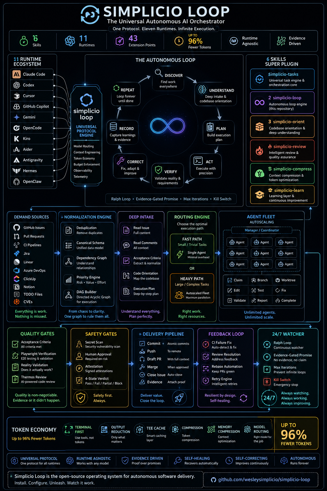
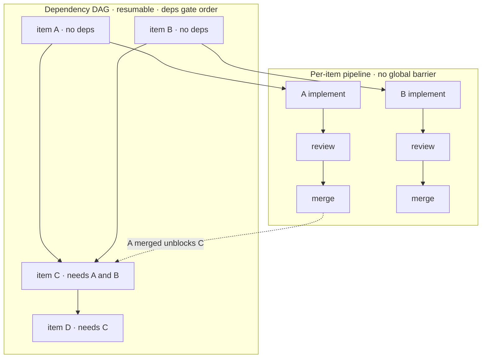
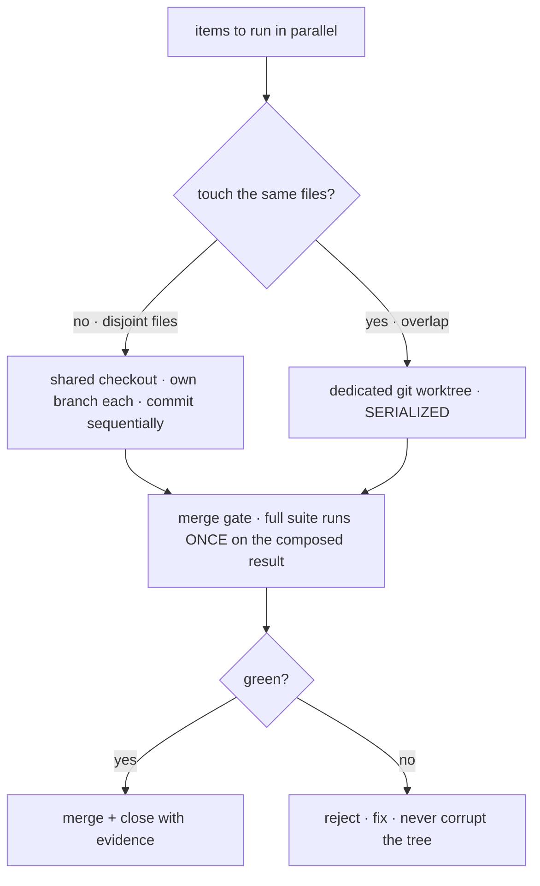
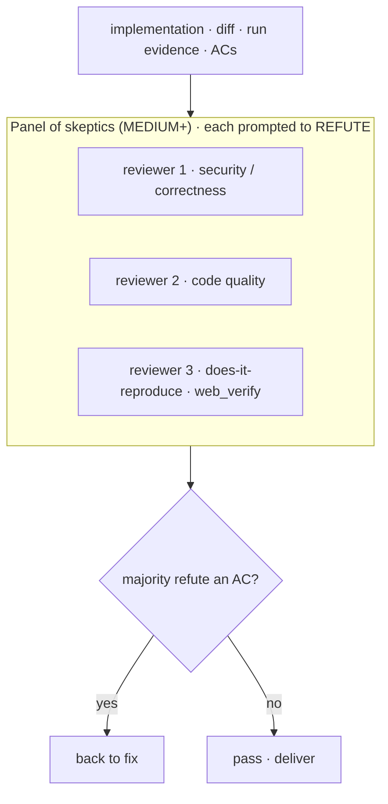
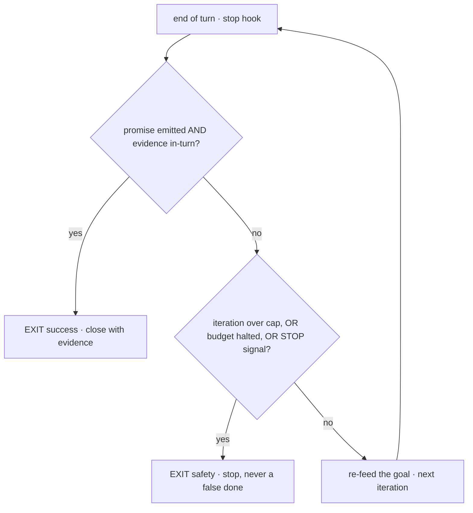

# 🔁 simplicio-loop — O Orquestrador de IA Universal em Loop

<p align="center">
  
</p>

<p align="center">
  <a href="https://github.com/wesleysimplicio/simplicio-loop/stargazers"></a>
  <a href="#-as-6-skills-super-plugin"></a>
  <a href="#-11-runtimes-um-protocolo"></a>
  <a href="#-os-43-pontos-de-extensão"></a>
  <a href="#-economia-de-tokens"></a>
  <a href="../LICENSE"></a>
</p>

<p align="center">
  <a href="#-tldr">TL;DR</a> ·
  <a href="#-as-6-skills-super-plugin">6 Skills</a> ·
  <a href="#-11-runtimes-um-protocolo">11 Runtimes</a> ·
  <a href="#-o-loop">O Loop</a> ·
  <a href="#-economia-de-tokens">Economia de Tokens</a> ·
  <a href="#-construído-sobre-os-ombros-de">Créditos</a> ·
  <a href="#-instalação--uso">Instalação</a>
</p>

<p align="center">
  <strong>🌍 Languages:</strong><br>
  <a href="../README.md">🇬🇧 English</a> |
  <a href="README.pt-BR.md">🇧🇷 Português</a> |
  <a href="README.es-ES.md">🇪🇸 Español</a> |
  <a href="README.fr-FR.md">🇫🇷 Français</a> |
  <a href="README.de-DE.md">🇩🇪 Deutsch</a> |
  <a href="README.it-IT.md">🇮🇹 Italiano</a> |
  <a href="README.ja-JP.md">🇯🇵 日本語</a> |
  <a href="README.ko-KR.md">🇰🇷 한국어</a> |
  <a href="README.zh-CN.md">🇨🇳 简体中文</a> |
  <a href="README.ru-RU.md">🇷🇺 Русский</a> |
  <a href="README.pl-PL.md">🇵🇱 Polski</a> |
  <a href="README.tr-TR.md">🇹🇷 Türkçe</a> |
  <a href="README.nl-NL.md">🇳🇱 Nederlands</a> |
  <a href="README.hi-IN.md">🇮🇳 हिन्दी</a> |
  <a href="README.ar-SA.md">🇸🇦 العربية</a>
</p>

---

## ⚡ TL;DR

O **simplicio-loop** é um **super-plugin** agnóstico de runtime — um único orquestrador
autônomo em loop mais **cinco skills satélites** — que transforma qualquer LLM forte (Claude, Codex,
Copilot, Gemini, Cursor, modelos locais) em um worker autônomo. Você o aponta para um corpo de
trabalho — *"finalize todas as issues abertas"*, *"limpe a fila do CI"*, *"esvazie o board do Jira"* — e ele
executa todo o ciclo de vida sozinho:

> **descobrir → entender → decidir → agir → verificar → corrigir → registrar → repetir**

Ele descobre trabalho a partir de qualquer fonte, faz deduplicação, autoescala uma frota de agentes
de acordo com a sua máquina, implementa cada item através de um loop de qualidade que **roda o código
(não apenas o compila)**, abre PRs, resolve feedback de CI/revisão, faz merge e segue observando
**24/7** por novo trabalho — tudo por trás de portões de segurança e um kill-switch de custo rígido.

```text
/simplicio-tasks termine as issues abertas
→ identity + pre-flight (kill-switch, auth, watcher)
→ discover 50 issues · dedup · build dependency DAG
→ autoscale fleet = 14 · pipeline implement→review→merge
→ each item: read body+ACs → orient code → plan → edit → run → verify → PR
→ merge · close with evidence · rollback if main breaks
→ keep looping every ~2 min until the queue is dry (evidence-gated, never a false "done")
```

Três coisas o tornam diferente: ele é um **super-plugin de skills focadas**, roda o **mesmo
protocolo em 11 runtimes** e faz tudo isso com **economia de tokens agressiva e honesta**.

---

## 🧠 As 6 skills (super-plugin)

O orquestrador é o núcleo; cinco satélites absorvem cada um o melhor de uma técnica consagrada e a
expõem como uma skill reutilizável. Cada satélite é **opcional** — quando carregado, o orquestrador
delega a ele (mais rico + mais barato); quando ausente, o protocolo inline do orquestrador cobre 100%
do trabalho. A mesma dependência invertida, um nível acima.

| Skill | Absorve | O que faz |
|---|---|---|
| 🔁 **simplicio-tasks** | — | O loop do orquestrador: descobrir → implementar → verificar → merge → fechar → observar 24/7. 43 pontos de extensão, roteador de caminho duplo, convergência por autoauditoria. |
| ♾️ **simplicio-loop** | [ralph-loop](https://github.com/cursor/plugins/tree/main/ralph-loop) | O loop Ralph endurecido: re-alimenta o mesmo objetivo a cada turno para que o agente veja seu próprio trabalho, saindo apenas com um **`<promise>` vinculado a evidências** ou um teto de `max_iterations` — nunca um falso "done". |
| 🧱 **simplicio-orient** | [rtk](https://github.com/rtk-ai/rtk) + [caveman](https://github.com/JuliusBrussee/caveman) | Execução terminal-first: responder fatos com o shell, nunca com o LLM. Catálogo de redução de saída, **tee-cache em caso de falha**, leituras só de assinaturas, hook opcional de auto-reescrita. |
| 🔥 **simplicio-review** | [thermos](https://github.com/cursor/plugins/tree/main/thermos) | Revisão adversarial: subagentes paralelos em rubricas distintas (segurança/correção + qualidade de código), disparados em uma única mensagem, deduplicados em um único veredito. |
| 🗜️ **simplicio-compress** | [caveman](https://github.com/JuliusBrussee/caveman) | Compressão de saída + memória: níveis de prosa concisa que preservam código/caminhos byte a byte, mais uma compactação única de memória que rende dividendos a cada turno. `transform_guard` fail-closed. |
| 🎓 **simplicio-learn** | [teaching](https://github.com/cursor/plugins/tree/main/teaching) + continual-learning | Retrospectiva: minerar lições duráveis e deduplicadas de uma execução e gravá-las na memória para que a próxima execução seja mais barata e mais correta. |

Cada uma é uma pasta de skill normal sob [`.claude/skills/`](../.claude/skills) — utilizável de forma
isolada ou como parte do loop.

---

## 🌐 11 runtimes, um protocolo

Um único núcleo de skill universal + um único conjunto de hooks dirige cada runtime. Um adaptador é
fino: ele diz a um runtime *onde carregar as skills*, *como armar o loop* e *como vincular a velocidade
nativa*. **A skill não nomeia nenhum runtime; o runtime detecta a skill.**

| Runtime | Carga da skill | Drive do loop | Vínculo nativo |
|---|---|---|---|
| **Claude Code** | `.claude/skills/` + plugin | Hook `Stop` | MCP |
| **Codex** | `AGENTS.md` | self-paced | MCP / adaptador |
| **VS Code (Copilot)** | `copilot-instructions.md` | tasks | MCP |
| **Cursor** | `.cursor-plugin/` | `stop`+`afterAgentResponse` | MCP / rules |
| **Antigravity** | rules / `AGENTS.md` | self-paced | MCP |
| **Kiro** | `.kiro/steering/` | specs | MCP |
| **OpenCode** | `AGENTS.md` | self-paced | MCP |
| **Gemini** | `GEMINI.md` | self-paced | MCP / adaptador |
| **Aider** | `CONVENTIONS.md` | self-paced | — (fallback de LLM) |
| **Hermes** | recall nativo | loop nativo | **nativo** |
| **OpenClaw** | plugin SDK | scheduler nativo | **nativo** |

A promessa: **mesmo protocolo, mesmos portões, mesma segurança em todos os 11 — só a velocidade
muda.** O `orient_clamp.py` (economia de tokens) funciona em todos os runtimes sem nenhuma fiação. Veja
[`adapters/MATRIX.md`](../adapters/MATRIX.md).

<p align="center">
  
</p>

---

## 🗺️ O fluxo completo — da demanda à entrega

Cada camada sobre a qual o orquestrador atua, em ordem — desde a leitura da demanda (issues, tarefas,
atribuições) até a entrega de trabalho mergeado e comprovado, e então o loop 24/7 por mais. (O diagrama
renderiza nativamente no GitHub.)

```mermaid
flowchart TD
  subgraph SRC["1 · Demand sources (any adapter)"]
    direction LR
    S1["GitHub Issues / PRs / CI"]
    S2["Jira · Azure DevOps · Linear · ClickUp · Notion · agentsview"]
    S3["Assigns · TODO/FIXME · CVE · local files"]
  end
  SRC --> PF
  subgraph PF["2 · Pre-flight gates"]
    direction LR
    P1["cost kill-switch budget"]
    P2["source auth + scopes"]
    P3["arm 24/7 watcher"]
  end
  PF --> DISC
  subgraph DISC["3 · Discover + normalize"]
    direction LR
    D1["source_adapter: list metadata only"]
    D2["normalize to canonical schema"]
    D3["dedup id+title+fingerprint+branch/PR"]
    D4["dependency DAG"]
  end
  DISC --> INTK
  subgraph INTK["4 · Deep intake (per item)"]
    direction LR
    I1["body + ALL comments"]
    I2["extract acceptance criteria"]
    I3["orient code · signatures-only reads"]
    I4["plan + AC checklist + complexity"]
  end
  INTK --> RT{"5 · Route"}
  RT -->|"small and every item complexity at most 3"| FAST["Fast-path: solo, one targeted test"]
  RT -->|"large queue or any medium+"| POOL
  subgraph POOL["6 · Continuous worker pool (autoscaled, conflict-aware)"]
    direction LR
    W1["claim · branch · worktree if overlap"]
    W2["deterministic_edit"]
    W3["quality loop: edit-lint-test-fix"]
  end
  FAST --> QG
  POOL --> QG
  subgraph QG["7 · Quality gates"]
    direction LR
    Q1["AC gate = real DoD"]
    Q2["WORKS not just compiles · web_verify (Playwright)"]
    Q3["adversarial review · thermos rubrics"]
  end
  QG --> SG
  subgraph SG["8 · Safety gates (non-negotiable)"]
    direction LR
    G1["secret-scan"]
    G2["irreversible-op human gate"]
    G3["4-state verdict · attestation"]
  end
  SG --> DEL
  subgraph DEL["9 · Deliver"]
    direction LR
    L1["commit · push · Draft PR"]
    L2["close in-source + evidence"]
    L3["verify reality, not self-report"]
  end
  DEL --> FB
  subgraph FB["10 · Feedback loop to merge-ready"]
    direction LR
    F1["CI fail -> fix root cause"]
    F2["review comments -> adjust"]
    F3["branch behind main -> additive rebase"]
  end
  FB -->|"merged and closed"| DONE(["done + evidence + savings line"])
  WATCH["11 · 24/7 watcher · simplicio-loop<br/>evidence-gated promise · max-iterations cap · cost kill-switch"]
  FB -. "poll new work / comments / checks" .-> WATCH
  DONE -. "idle until new work" .-> WATCH
  WATCH -. "re-feed the goal" .-> DISC
```



**Camada por camada — o que atua e o recurso que utiliza:**

| # | Camada | O que acontece | Skill / ponto de extensão · emprestado de |
|---|---|---|---|
| 1 | **Demand sources** | Ler o trabalho de QUALQUER fonte — issues, PRs, CI, boards, atribuições, TODO, CVEs | `source_adapter` · `intake` |
| 2 | **Pre-flight** | Armar o kill-switch de `$`, checar a auth da fonte, armar o watcher 24/7 | `watcher` · governança de custo |
| 3 | **Discover + normalize** | Listar só por metadados, normalizar, deduplicar, construir o DAG de dependências | `normalize` · `dependency_graph` |
| 4 | **Deep intake** | Ler corpo + comentários completos, extrair ACs, orientar o código, escrever um plano | `orient` · signatures-read · **rtk** |
| 5 | **Route** | Fast-path (trivial) vs heavy-path; autoescalar a frota para a máquina | `autoscale` · roteador de caminho duplo |
| 6 | **Worker pool** | Fan-out contínuo e consciente de conflitos; edições mecânicas; loop de qualidade por item | `execute` · `worktree` · `deterministic_edit` |
| 7 | **Quality gates** | Portão de AC (DoD real), verificação por execução (UI → **Playwright** `web_verify`), revisão adversarial | `validate` · **`simplicio-review`** (thermos) |
| 8 | **Safety gates** | Varredura de segredos, portão humano para op irreversível, veredito de 4 estados, atestação | `action_gate` · `human_gate` · `security` |
| 9 | **Deliver** | Commit, push, Draft PR, fechar na fonte com evidência; verificar a realidade | `pr` / `evidence` · `delivery_gate` |
| 10 | **Feedback loop** | CI → corrigir, comentários de revisão → ajustar, branch atrasada → rebase aditivo | `diagnostics` · `retry` |
| 11 | **24/7 watcher** | Re-alimentar o objetivo até uma promessa vinculada a evidências; ociar quando esvaziado, acordar a qualquer coisa | **`simplicio-loop`** (Ralph) · `watcher` |
| ↻ | **Transversal** | Economia de tokens (terminal-first · catálogo · **tee+CCR** · compressão de prosa/memória) · roteamento de modelos L0→L4 · learn | **`simplicio-orient`** (rtk+caveman) · **`simplicio-compress`** (caveman) · **`simplicio-learn`** (teaching) · **headroom** CCR |

Cada camada tem um fallback de LLM que sempre funciona e vincula um comando nativo quando o host fornece
um — o mesmo protocolo em todos os 11 runtimes, só a velocidade muda.

---

## 🏛️ Pilares de design (em detalhe)

Quatro mecanismos sustentam o poder de orquestração. Cada um já está integrado à skill — aqui está
exatamente **onde ele vive** e como funciona, desenhado em detalhe.

| Pilar | Foco | Vive em | Labels |
|---|---|---|---|
| **DAG + pipeline** | paralelismo por dependência, estagiado por item | `dependency_graph` · [`references/orchestration.md`](../.claude/skills/simplicio-tasks/references/orchestration.md) (Passo 3 pool + 3c pipeline) | `enhancement` `orchestrator` `performance` `runtime` |
| **Isolamento por worktree** | edições paralelas sem corromper a árvore, com merge controlado por portão | `worktree` · orchestration.md "Conflict-AWARE isolation" + merge gate | `enhancement` `orchestrator` `runtime` |
| **Verificação adversarial** | um painel de céticos antes de "entregue" | [`quality-safety-delivery.md`](../.claude/skills/simplicio-tasks/references/quality-safety-delivery.md) Passo 4c · skill `simplicio-review` | `enhancement` `quality` `runtime` |
| **Teto de orçamento do loop** | anti-loop-infinito, saída dupla | [`standing-loop-247.md`](../.claude/skills/simplicio-tasks/references/standing-loop-247.md) §4 · skill `simplicio-loop` · `hooks/loop_stop.py` | `enhancement` `coding-loop` `runtime` |

### 1 · DAG + pipeline — paralelismo por dependência, estagiado



Os independentes (A, B) saem em paralelo de imediato; os dependentes (C, D) aguardam no DAG. Cada item
flui implementar → revisar → merge por conta própria, então A faz merge enquanto B ainda está sendo
construído — **estagiado, nunca uma barreira global**. As re-execuções pulam os nós já concluídos
(resumível).

### 2 · Isolamento por worktree — edições paralelas, com merge controlado por portão



Itens disjuntos compartilham um único checkout (barato, sem re-link N×); apenas itens sobrepostos pagam
por um worktree dedicado e são serializados. A custosa suíte completa roda **uma única vez** sobre o
resultado mergeado — um portão de saída mais forte do que N verificações parciais.

### 3 · Verificação adversarial — um painel de céticos antes da entrega



Para itens MEDIUM+, 2–3 revisores independentes tentam, cada um, REFUTAR (assumem "não concluído" em
caso de dúvida). A refutação pela maioria de qualquer critério de aceitação o devolve para correção.
TRIVIAL/SMALL mantêm uma única autorrevisão. (Delegado ao `simplicio-review`; diffs de front-end exigem
uma entrada `web_verify`.)

### 4 · Teto de orçamento do loop — anti-loop-infinito, saída dupla



O loop tem **duas saídas independentes**: uma saída de *sucesso* (um `<promise>` vinculado a evidências
que é genuinamente verdadeiro) e uma saída de *segurança* (teto de `max_iterations`, o kill-switch de
orçamento `$` ou um sinal STOP). Ele nunca sai com um "done" autorreportado — e nunca roda para sempre.
Isto é o `hooks/loop_stop.py` (fail-open: qualquer erro de hook → permite parar).

---

## 🔁 O loop

O drive sob o orquestrador é um **loop Ralph endurecido** (`simplicio-loop`):

1. O objetivo é gravado em um único arquivo de estado legível por humanos
   (`.orchestrator/loop/scratchpad.md`) — trivialmente inspecionável, editável, cancelável.
2. Após cada turno, um **stop-hook** re-alimenta o mesmo objetivo, de modo que o agente veja suas
   próprias edições anteriores (via git + a working tree) e convirja. O custo de tokens por ciclo
   permanece estável — sem entupir o contexto.
3. Ele sai **apenas** quando um sentinela tipado `<promise>TEXTO EXATO</promise>` é emitido **e**
   respaldado por evidência concreta no próprio turno (um portão aprovado, um link de PR mergeado,
   recibos de AC), ou quando um teto rígido de `max_iterations` / o kill-switch de custo dispara.

> **Nunca uma falsa promessa.** Um `<promise>` sem evidência é ignorado e o loop continua. Isso
> conecta o loop diretamente à regra rígida do repositório: *nunca feche um trabalho sem um PR
> mergeado ou evidência concreta.*

Em runtimes sem hooks, o loop **se autorregula** (self-paces) via o scheduler do host (cron / `/loop`
/ o task runner do runtime) — as mesmas condições de saída. Os hooks são Python multiplataforma e
**fail-open**: um hook que dá erro sempre deixa o agente parar. Os guardas reais são o teto e o
orçamento, nunca a esperteza do hook.

---

## 📊 Economia de tokens

O token mais barato é aquele que não é gasto. O `simplicio-orient` + `simplicio-compress` dobram o
melhor do **rtk** (comprimir os comandos) e do **caveman** (comprimir a conversa) dentro da espinha
de segurança:

- **Execução terminal-first** — o shell sabe os fatos com exatidão; o LLM os aproxima de forma cara.
  Uma tabela de substituição multiplataforma (Windows/macOS/Linux) responde 30+ fatos via
  `git`/`gh`/`rg`/`python3`. **Nunca simule um comando — rode-o.**
- **Catálogo de redução de saída** (tabela de dados) — receita por comando + % de economia esperada +
  guarda `skip-if-structured`. Um `cargo check` cru custa ~2000 tokens para ler; clampado, ~80.
- **tee-cache + retrieve reversível** *(rtk + headroom CCR)* — a truncagem agressiva só é segura se for
  recuperável: em caso de falha, a saída completa é gravada em `.orchestrator/tee/…log` e apenas o
  caminho é exibido; o agente recupera contexto com `retrieve <path> [--lines|--grep]` **sem re-rodar**
  o comando. O clamp vira uma decisão reversível, não uma com perdas.
- **Leituras só de assinaturas** *(do rtk)* — ler a superfície de API de um arquivo (declarações,
  corpos elididos): um arquivo de 600 linhas vira ~40 linhas durante o intake.
- **Limites por nível de sinal + success-collapse + dedup** — manter erros sobre o ruído; colapsar
  uma execução limpa em uma linha; colapsar linhas repetidas em `line xN` — sempre `unless errors
  present`.
- **Níveis de prosa + compactação de memória** *(do caveman)* — saída concisa que preserva
  código/caminhos/URLs **byte a byte** (`transform_guard` falha fechado a qualquer token perdido),
  mais uma compactação única da memória permanente que se amortiza ao longo de todo turno futuro.
- **Baseline honesto** — a economia é medida contra um braço de controle realista *"answer
  concisely"* (não um espantalho verboso), conta apenas tokens de **saída** (não de raciocínio) e é
  creditada **somente em um resultado verificado-correto**. Compressão que reprova no seu portão de
  qualidade rende zero.

Toda mensagem termina com uma linha honesta:

```
simplicio-tasks: ~<spent> tokens · baseline ~<control-arm> · saved ~<saved> (<pct>%)
```

Experimente agora, sem fiação:

```bash
python3 hooks/orient_clamp.py -- cargo test      # reduced output + tee log on failure
python3 hooks/orient_clamp.py --json -- git diff  # machine summary
```

---

## 🏗️ Construído sobre os ombros de

O simplicio-loop foi construído **após estudar a fundo** o melhor trabalho de loop + economia de
tokens no GitHub, e dobra cada um em uma skill focada — mantendo a disciplina, descartando os
truques.

| Projeto | O que pegamos | O que deixamos |
|---|---|---|
| 🪨 [**caveman**](https://github.com/JuliusBrussee/caveman) | níveis de prosa concisa, preservação byte a byte de identificadores, compactação de memória, baseline honesto *"answer concisely"* | corte de palavras gramaticais (degrada código e confirmações) |
| ⚙️ [**rtk**](https://github.com/rtk-ai/rtk) | catálogo de redução por comando, limites por nível de sinal, **tee-cache**, leitura de assinaturas, hook de auto-reescrita + lista de exclusão | registros por linguagem (específicos de runtime) |
| ♾️ [**ralph-loop**](https://github.com/cursor/plugins/tree/main/ralph-loop) | estado de loop em arquivo único, sentinela de promessa por correspondência exata, divisão em dois hooks | conclusão por confiar-no-modelo (nós a tornamos **vinculada a evidências**) |
| 🔥 [**thermos**](https://github.com/cursor/plugins/tree/main/thermos) | revisores paralelos em mensagem única, rubricas separadas, dedup na síntese | — |
| 🎓 [**teaching**](https://github.com/cursor/plugins/tree/main/teaching) | retrospectiva que persiste estado para que o próximo ciclo não tenha de re-derivar | o próprio domínio de aprendizado humano |
| 🧭 execução orientada a resultado | convergir no estado final; quebra intermediária planejada, escopada, reversível | — |
| 🧠 [**headroom**](https://github.com/headroomlabs-ai/headroom) | compress-cache-retrieve (CCR) **reversível** sobre o tee-cache; taxonomia de roteamento por tipo de conteúdo | o modelo treinado + proxy de tráfego (contradizem o design terminal-first, agnóstico de runtime) |
| 🎭 [**Playwright**](https://github.com/microsoft/playwright) (+[mcp](https://github.com/microsoft/playwright-mcp), [python](https://github.com/microsoft/playwright-python)) | dirigir um navegador real para prova de front-end — screenshot + trace como evidência de `web_verify` | DOM/pixels no contexto (a evidência é o caminho do artefato, não os bytes) |

> Eles reduzem tokens; o simplicio-loop **faz o trabalho** e reduz tokens enquanto o faz.

---

## 🧩 Os 43 pontos de extensão

Cada passo do trabalho acontece em um **ponto de extensão nomeado**. Se um runtime hospedeiro expõe
uma capacidade nativa, ele **se vincula** (determinístico, quase-zero token); caso contrário, o LLM
executa o **fallback** com ferramentas padrão. A skill depende da abstração, nunca de um runtime.

<details>
<summary><strong>Orquestração e escala</strong></summary>

`orient` · `normalize` · `intake` · `source_adapter` · `autoscale` · `plan`/`decide` ·
`execute` · `issue_factory` · `claim` · `worktree` · `dependency_graph` · `durable_workflow` ·
`work_queue` · `resource_governor` · `model_route` · `model_preflight`
</details>

<details>
<summary><strong>Edição, qualidade e evidência</strong></summary>

`deterministic_edit` · `diagnostics` · `toolchain_detect` · `validate`/`smoke` ·
`delivery_gate` · `endpoint_compare` · `web_verify` · `pr`/`evidence` · `retry` ·
`reuse_precedent` · `trajectory` · `learn` · `status` · `capability_rank`
</details>

<details>
<summary><strong>Tokens, contexto e segurança</strong></summary>

`recall` · `compress` · `prompt_budget` · `shell_exec` · `transform_guard` · `action_gate` ·
`security` · `human_gate` · `notify` · `checkpoint_restore` · `watcher` · `savings_ledger` ·
`web_research`
</details>

Tabela completa com fallbacks:
[`references/extension-points.md`](../.claude/skills/simplicio-tasks/references/extension-points.md).

---

## 🚀 Instalação & uso

```bash
git clone https://github.com/wesleysimplicio/simplicio-loop
cd simplicio-loop

# install for your runtime (omit <runtime> to auto-detect)
bash scripts/install.sh <runtime> [--global]        # macOS / Linux
pwsh scripts/install.ps1 <runtime> [-Global]        # Windows
# <runtime> ∈ claude codex vscode cursor antigravity kiro opencode gemini aider hermes openclaw
```

Ou, no Claude Code / Cursor, adicione-o como um plugin de marketplace:

```
/plugin marketplace add wesleysimplicio/simplicio-loop
/plugin install simplicio-loop@simplicio
```

Então:

```
/simplicio-tasks finish all the open issues
```

O único requisito é **python3** no PATH (skills, hooks e instalador são Python multiplataforma). Para
fontes do GitHub, `git` + um `gh` autenticado. Veja [`INSTALL.md`](../INSTALL.md) e
[`adapters/MATRIX.md`](../adapters/MATRIX.md).

**Antes de uma execução 24/7 desassistida:** defina um teto de custo em
`.orchestrator/loop-budget.json` (`daily_usd_ceiling > 0`), confirme que a autenticação da fonte é
persistente e mantenha ligados o portão humano para op irreversível + a varredura de segredos. Com
`ceiling = 0`, o watcher se recusa a rodar desassistido (fail-safe).

---

## 🔒 Segurança (inegociável)

- **Varredura de segredos** em todo diff; bloquear em caso de acerto.
- **Portão humano para op irreversível** — force-push, reescrita de histórico, deploy em prod, delete
  de dados/schema, delete em massa de arquivos → parar e perguntar. Headless + sem aprovador → remover
  a capacidade destrutiva.
- **Veredito de 4 estados pré-execução** — a otimização nunca pode elevar o nível de risco de um
  comando.
- **Trust-before-load** — config que molda a percepção (perfis de clamp, listas de supressão) é não
  confiável até que um humano a revise e a fixe por hash.
- **Blindagem contra prompt-injection** — conteúdo de item/PR/comentário nunca pode sobrepor o
  contrato.
- **Kill-switch rígido de $** para execuções desassistidas; conclusão **vinculada a evidências**
  (nunca um falso "done"); hooks **fail-open** (nunca prender o agente em um loop).

---

## 📄 Licença

MIT — veja [LICENSE](../LICENSE). Parte do ecossistema [Simplicio](https://github.com/wesleysimplicio).
