# 🔁 simplicio-tasks — Универсальный циклический ИИ-оркестратор

<p align="center">
  
</p>

<p align="center">
  <a href="https://github.com/wesleysimplicio/simplicio-tasks/stargazers"></a>
  <a href="#-6-навыков-супер-плагин"></a>
  <a href="#-11-сред-выполнения-один-протокол"></a>
  <a href="#-43-точки-расширения"></a>
  <a href="#-экономия-токенов"></a>
  <a href="../LICENSE"></a>
</p>

<p align="center">
  <a href="#-tldr">TL;DR</a> ·
  <a href="#-6-навыков-супер-плагин">6 навыков</a> ·
  <a href="#-11-сред-выполнения-один-протокол">11 сред выполнения</a> ·
  <a href="#-цикл">Цикл</a> ·
  <a href="#-экономия-токенов">Экономия токенов</a> ·
  <a href="#-на-плечах-гигантов">Благодарности</a> ·
  <a href="#-установка--использование">Установка</a>
</p>

<p align="center">
  <strong>🌍 Languages:</strong><br>
  <a href="../README.md">🇬🇧 English</a> |
  <a href="README.pt-BR.md">🇧🇷 Português</a> |
  <a href="README.es-ES.md">🇪🇸 Español</a> |
  <a href="README.fr-FR.md">🇫🇷 Français</a> |
  <a href="README.de-DE.md">🇩🇪 Deutsch</a> |
  <a href="README.it-IT.md">🇮🇹 Italiano</a> |
  <a href="README.ja-JP.md">🇯🇵 日本語</a> |
  <a href="README.ko-KR.md">🇰🇷 한국어</a> |
  <a href="README.zh-CN.md">🇨🇳 简体中文</a> |
  <a href="README.ru-RU.md">🇷🇺 Русский</a> |
  <a href="README.pl-PL.md">🇵🇱 Polski</a> |
  <a href="README.tr-TR.md">🇹🇷 Türkçe</a> |
  <a href="README.nl-NL.md">🇳🇱 Nederlands</a> |
  <a href="README.hi-IN.md">🇮🇳 हिन्दी</a> |
  <a href="README.ar-SA.md">🇸🇦 العربية</a>
</p>

---

## ⚡ TL;DR

**simplicio-tasks** — это не зависящий от среды выполнения **супер-плагин**: один автономный
циклический оркестратор плюс **пять навыков-сателлитов**, — который превращает любую сильную LLM
(Claude, Codex, Copilot, Gemini, Cursor, локальные модели) в самоуправляемого воркера. Вы
указываете ему на объём работы — *«закрой все открытые issue»*, *«разгреби очередь CI»*,
*«опустоши доску Jira»* — и он самостоятельно прогоняет весь жизненный цикл:

> **обнаружить → понять → решить → действовать → проверить → исправить → зафиксировать → повторить**

Он обнаруживает работу из любого источника, устраняет дубликаты, автоматически масштабирует флот
агентов под вашу машину, реализует каждый пункт через цикл обеспечения качества, который
**запускает код (а не просто компилирует его)**, открывает PR, разрешает замечания CI/ревью,
выполняет слияние и продолжает следить за новой работой **24/7** — всё это за предохранительными
воротами и жёстким аварийным выключателем расходов.

```text
/simplicio-tasks termine as issues abertas
→ identity + pre-flight (kill-switch, auth, watcher)
→ discover 50 issues · dedup · build dependency DAG
→ autoscale fleet = 14 · pipeline implement→review→merge
→ each item: read body+ACs → orient code → plan → edit → run → verify → PR
→ merge · close with evidence · rollback if main breaks
→ keep looping every ~2 min until the queue is dry (evidence-gated, never a false "done")
```

Три вещи делают его особенным: это **супер-плагин из сфокусированных навыков**, он прогоняет
**один и тот же протокол на 11 средах выполнения**, и делает всё это с **агрессивной, честной
экономией токенов**.

---

## 🧠 6 навыков (супер-плагин)

Оркестратор — это ядро; пять сателлитов каждый вбирают в себя лучшее из известной техники и
выставляют его как переиспользуемый навык. Каждый сателлит **опционален**: когда он загружен,
оркестратор делегирует ему (богаче + дешевле); когда отсутствует — встроенный протокол
оркестратора покрывает 100% работы. Та же инвертированная зависимость, на уровень выше.

| Навык | Вбирает | Что он делает |
|---|---|---|
| 🔁 **simplicio-tasks** | — | Цикл оркестратора: discover → implement → verify → merge → close → watch 24/7. 43 точки расширения, двухпутевой маршрутизатор, сходимость через самоаудит. |
| ♾️ **simplicio-loop** | [ralph-loop](https://github.com/cursor/plugins/tree/main/ralph-loop) | Закалённый цикл Ralph: повторно подаёт ту же цель каждый ход, чтобы агент видел собственную работу, выходя только по **подтверждённому доказательствами `<promise>`** или достижению лимита `max_iterations` — никогда по ложному «готово». |
| 🧱 **simplicio-orient** | [rtk](https://github.com/rtk-ai/rtk) + [caveman](https://github.com/JuliusBrussee/caveman) | Выполнение в первую очередь в терминале: отвечать на факты через shell, а не через LLM. Каталог сокращения вывода, **tee-кэш при сбое**, чтение только сигнатур, опциональный хук авто-переписывания. |
| 🔥 **simplicio-review** | [thermos](https://github.com/cursor/plugins/tree/main/thermos) | Состязательное ревью: параллельные субагенты по разным рубрикам (безопасность/корректность + качество кода), запущенные одним сообщением, сведённые в один вердикт. |
| 🗜️ **simplicio-compress** | [caveman](https://github.com/JuliusBrussee/caveman) | Сжатие вывода + памяти: уровни лаконичной прозы, сохраняющие код/пути байт-в-байт, плюс одноразовая компактизация памяти, которая окупается каждый ход. Отказоустойчивый `transform_guard`. |
| 🎓 **simplicio-learn** | [teaching](https://github.com/cursor/plugins/tree/main/teaching) + continual-learning | Ретроспектива: добывает устойчивые, дедуплицированные уроки из прогона и записывает их в память, чтобы следующий прогон был дешевле и корректнее. |

Каждый — это обычная папка навыка в [`.claude/skills/`](../.claude/skills) — пригодная к
использованию как отдельно, так и в составе цикла.

---

## 🌐 11 сред выполнения, один протокол

Одно универсальное ядро навыка + один набор хуков управляют каждой средой выполнения. Адаптер
тонок: он сообщает среде *где загрузить навыки*, *как взвести цикл* и *как привязать нативную
скорость*. **Навык не называет ни одну среду выполнения; среда выполнения обнаруживает навык.**

| Среда выполнения | Загрузка навыка | Привод цикла | Нативная привязка |
|---|---|---|---|
| **Claude Code** | `.claude/skills/` + plugin | хук `Stop` | MCP |
| **Codex** | `AGENTS.md` | самостоятельный темп | MCP / адаптер |
| **VS Code (Copilot)** | `copilot-instructions.md` | tasks | MCP |
| **Cursor** | `.cursor-plugin/` | `stop`+`afterAgentResponse` | MCP / rules |
| **Antigravity** | rules / `AGENTS.md` | самостоятельный темп | MCP |
| **Kiro** | `.kiro/steering/` | specs | MCP |
| **OpenCode** | `AGENTS.md` | самостоятельный темп | MCP |
| **Gemini** | `GEMINI.md` | самостоятельный темп | MCP / адаптер |
| **Aider** | `CONVENTIONS.md` | самостоятельный темп | — (LLM-фолбэк) |
| **Hermes** | нативная память | нативный цикл | **нативная** |
| **OpenClaw** | plugin SDK | нативный планировщик | **нативная** |

Обещание: **один и тот же протокол, те же ворота, та же безопасность на всех 11 — различается
лишь скорость.** `orient_clamp.py` (экономия токенов) работает на каждой среде выполнения без
какой-либо настройки. См. [`adapters/MATRIX.md`](../adapters/MATRIX.md).

<p align="center">
  
</p>

---

## 🗺️ Полный поток — от спроса до поставки

Каждый слой, на котором действует оркестратор, по порядку — от чтения спроса (issue, задачи,
назначения) до поставки слитой, подкреплённой доказательствами работы, а затем цикл 24/7 в
поисках новой. (Диаграмма нативно отрисовывается на GitHub.)

```mermaid
flowchart TD
  subgraph SRC["1 · Demand sources (any adapter)"]
    direction LR
    S1["GitHub Issues / PRs / CI"]
    S2["Jira · Azure DevOps · Linear · ClickUp · Notion"]
    S3["Assigns · TODO/FIXME · CVE · local files"]
  end
  SRC --> PF
  subgraph PF["2 · Pre-flight gates"]
    direction LR
    P1["cost kill-switch budget"]
    P2["source auth + scopes"]
    P3["arm 24/7 watcher"]
  end
  PF --> DISC
  subgraph DISC["3 · Discover + normalize"]
    direction LR
    D1["source_adapter: list metadata only"]
    D2["normalize to canonical schema"]
    D3["dedup id+title+fingerprint+branch/PR"]
    D4["dependency DAG"]
  end
  DISC --> INTK
  subgraph INTK["4 · Deep intake (per item)"]
    direction LR
    I1["body + ALL comments"]
    I2["extract acceptance criteria"]
    I3["orient code · signatures-only reads"]
    I4["plan + AC checklist + complexity"]
  end
  INTK --> RT{"5 · Route"}
  RT -->|"small and every item complexity at most 3"| FAST["Fast-path: solo, one targeted test"]
  RT -->|"large queue or any medium+"| POOL
  subgraph POOL["6 · Continuous worker pool (autoscaled, conflict-aware)"]
    direction LR
    W1["claim · branch · worktree if overlap"]
    W2["deterministic_edit"]
    W3["quality loop: edit-lint-test-fix"]
  end
  FAST --> QG
  POOL --> QG
  subgraph QG["7 · Quality gates"]
    direction LR
    Q1["AC gate = real DoD"]
    Q2["WORKS not just compiles · web_verify (Playwright)"]
    Q3["adversarial review · thermos rubrics"]
  end
  QG --> SG
  subgraph SG["8 · Safety gates (non-negotiable)"]
    direction LR
    G1["secret-scan"]
    G2["irreversible-op human gate"]
    G3["4-state verdict · attestation"]
  end
  SG --> DEL
  subgraph DEL["9 · Deliver"]
    direction LR
    L1["commit · push · Draft PR"]
    L2["close in-source + evidence"]
    L3["verify reality, not self-report"]
  end
  DEL --> FB
  subgraph FB["10 · Feedback loop to merge-ready"]
    direction LR
    F1["CI fail -> fix root cause"]
    F2["review comments -> adjust"]
    F3["branch behind main -> additive rebase"]
  end
  FB -->|"merged and closed"| DONE(["done + evidence + savings line"])
  WATCH["11 · 24/7 watcher · simplicio-loop<br/>evidence-gated promise · max-iterations cap · cost kill-switch"]
  FB -. "poll new work / comments / checks" .-> WATCH
  DONE -. "idle until new work" .-> WATCH
  WATCH -. "re-feed the goal" .-> DISC
```



**Слой за слоем — что действует и какой ресурс использует:**

| # | Слой | Что происходит | Навык / точка расширения · заимствовано из |
|---|---|---|---|
| 1 | **Demand sources** | Чтение работы из ЛЮБОГО источника — issue, PR, CI, доски, назначения, TODO, CVE | `source_adapter` · `intake` |
| 2 | **Pre-flight** | Взвести `$`-аварийный выключатель, проверить аутентификацию источника, взвести watcher 24/7 | `watcher` · управление расходами |
| 3 | **Discover + normalize** | Перечислить только по метаданным, нормализовать, дедуп, построить граф зависимостей DAG | `normalize` · `dependency_graph` |
| 4 | **Deep intake** | Прочитать полное тело + комментарии, извлечь AC, сориентироваться в коде, написать план | `orient` · signatures-read · **rtk** |
| 5 | **Route** | Быстрый путь (тривиальное) против тяжёлого; автомасштабирование флота под машину | `autoscale` · двухпутевой маршрутизатор |
| 6 | **Worker pool** | Непрерывный, учитывающий конфликты веер; механические правки; цикл качества на каждый пункт | `execute` · `worktree` · `deterministic_edit` |
| 7 | **Quality gates** | AC-ворота (настоящий DoD), верификация запуском (UI → **Playwright** `web_verify`), состязательное ревью | `validate` · **`simplicio-review`** (thermos) |
| 8 | **Safety gates** | Скан секретов, человеческие ворота для необратимых операций, вердикт из 4 состояний, аттестация | `action_gate` · `human_gate` · `security` |
| 9 | **Deliver** | Коммит, push, Draft PR, закрытие в источнике с доказательствами; проверка реальности | `pr` / `evidence` · `delivery_gate` |
| 10 | **Feedback loop** | CI → исправить, комментарии ревью → скорректировать, ветка отстаёт → аддитивный rebase | `diagnostics` · `retry` |
| 11 | **24/7 watcher** | Повторно подавать цель до подтверждённого доказательствами обещания; простаивать при опустошении, просыпаться на что угодно | **`simplicio-loop`** (Ralph) · `watcher` |
| ↻ | **Cross-cutting** | Экономия токенов (терминал-первый · каталог · **tee+CCR** · сжатие прозы/памяти) · маршрутизация моделей L0→L4 · обучение | **`simplicio-orient`** (rtk+caveman) · **`simplicio-compress`** (caveman) · **`simplicio-learn`** (teaching) · **headroom** CCR |

У каждого слоя есть всегда-работающий LLM-фолбэк, и он привязывает нативную команду, когда хост её
предоставляет — один и тот же протокол на всех 11 средах выполнения, различается лишь скорость.

---

## 🔁 Цикл

Привод под оркестратором — это **закалённый цикл Ralph** (`simplicio-loop`):

1. Цель записывается в единый, читаемый человеком файл состояния
   (`.orchestrator/loop/scratchpad.md`) — тривиально проверяемый, редактируемый, отменяемый.
2. После каждого хода **стоп-хук** повторно подаёт ту же цель, так что агент видит собственные
   прежние правки (через git + рабочее дерево) и сходится. Стоимость токенов за цикл остаётся
   плоской — никакого набивания контекста.
3. Он выходит **только** тогда, когда испущен типизированный сигнал
   `<promise>ТОЧНЫЙ ТЕКСТ</promise>` **и** подкреплён конкретными внутриходовыми доказательствами
   (пройденные ворота, ссылка на слитый PR, квитанции по AC), либо когда срабатывает жёсткий
   лимит `max_iterations` / аварийный выключатель расходов.

> **Никогда ложного обещания.** `<promise>` без доказательств игнорируется, и цикл продолжается.
> Это напрямую вшивает цикл в жёсткое правило репозитория: *никогда не закрывать работу без
> слитого PR или конкретных доказательств.*

На средах выполнения без хуков цикл **задаёт темп самостоятельно** через планировщик хоста
(cron / `/loop` / исполнитель задач среды) — те же условия выхода. Хуки — это кросс-платформенный
Python и **отказоустойчивы**: хук, давший сбой, всегда позволяет агенту остановиться. Настоящие
стражи — это лимит и бюджет, а не хитрость хуков.

---

## 📊 Экономия токенов

Самый дешёвый токен — тот, что не потрачен. `simplicio-orient` + `simplicio-compress` складывают
лучшее из **rtk** (сжать команды) и **caveman** (сжать разговор) в предохранительный хребет:

- **Выполнение в первую очередь в терминале** — shell знает факты точно; LLM приближает их
  дорого. Кросс-платформенная таблица замен (Windows/macOS/Linux) отвечает на 30+ фактов через
  `git`/`gh`/`rg`/`python3`. **Никогда не симулируй команду — запусти её.**
- **Каталог сокращения вывода** (таблица данных) — рецепт для каждой команды + ожидаемая
  экономия % + защита `skip-if-structured`. Сырой `cargo check` стоит ~2000 токенов на чтение;
  ограниченный — ~80.
- **tee-кэш + обратимый retrieve** *(rtk + headroom CCR)* — агрессивное усечение безопасно только
  если восстановимо: при сбое полный вывод записывается в `.orchestrator/tee/…log`, и наружу
  выдаётся только путь; агент восстанавливает контекст через `retrieve <path> [--lines|--grep]`
  **без повторного запуска** команды. Ограничение становится обратимым решением, а не теряющим
  данные.
- **Чтение только сигнатур** *(из rtk)* — прочитать API-поверхность файла (объявления, тела
  опущены): файл в 600 строк превращается в ~40 строк при приёме.
- **Лимиты по уровням сигнала + схлопывание успеха + дедуп** — оставить ошибки над шумом;
  схлопнуть чистый прогон в одну строку; схлопнуть повторяющиеся строки в `line xN` — всегда
  `unless errors present`.
- **Уровни прозы + компактизация памяти** *(из caveman)* — лаконичный вывод, сохраняющий
  код/пути/URL **байт-в-байт** (`transform_guard` отказоустойчиво срабатывает на любой
  потерянный токен), плюс одноразовая компактизация постоянной памяти, амортизируемая по всем
  будущим ходам.
- **Честный базовый уровень** — экономия измеряется относительно реалистичной контрольной группы
  *«отвечай лаконично»* (а не многословного чучела), считаются только **выходные** токены (не
  рассуждения), и засчитывается она **только при проверенно-корректном результате**. Сжатие,
  провалившее свои ворота качества, получает ноль.

Каждое сообщение завершается честной строкой:

```
simplicio-tasks: ~<spent> tokens · baseline ~<control-arm> · saved ~<saved> (<pct>%)
```

Попробуйте прямо сейчас, без какой-либо настройки:

```bash
python3 hooks/orient_clamp.py -- cargo test      # reduced output + tee log on failure
python3 hooks/orient_clamp.py --json -- git diff  # machine summary
```

---

## 🏗️ На плечах гигантов

simplicio-tasks был создан **после глубокого изучения** лучших работ по циклам + экономии токенов
на GitHub и складывает каждую в сфокусированный навык — сохраняя дисциплину, отбрасывая трюки.

| Проект | Что мы взяли | Что мы оставили в стороне |
|---|---|---|
| 🪨 [**caveman**](https://github.com/JuliusBrussee/caveman) | уровни лаконичной прозы, байт-сохранение идентификаторов, компактизация памяти, честный базовый уровень *«отвечай лаконично»* | грамматическое выбрасывание слов (ухудшает код и подтверждения) |
| ⚙️ [**rtk**](https://github.com/rtk-ai/rtk) | каталог сокращения по каждой команде, лимиты по уровням сигнала, **tee-кэш**, чтение сигнатур, хук авто-переписывания + список исключений | реестры по языкам (привязаны к конкретной среде) |
| ♾️ [**ralph-loop**](https://github.com/cursor/plugins/tree/main/ralph-loop) | однофайловое состояние цикла, сигнал-обещание с точным совпадением, разделение на два хука | завершение «доверься модели» (мы делаем его **подтверждённым доказательствами**) |
| 🔥 [**thermos**](https://github.com/cursor/plugins/tree/main/thermos) | параллельные ревьюеры в одном сообщении, отдельные рубрики, дедуп при синтезе | — |
| 🎓 [**teaching**](https://github.com/cursor/plugins/tree/main/teaching) | ретроспектива, сохраняющая состояние, чтобы следующий цикл не выводил всё заново | сам домен человеческого обучения |
| 🧭 выполнение, ориентированное на результат | сходиться к конечному состоянию; планируемая, ограниченная, обратимая промежуточная поломка | — |
| 🧠 [**headroom**](https://github.com/headroomlabs-ai/headroom) | **обратимый** compress-cache-retrieve (CCR) поверх tee-кэша; таксономия маршрутизации по типу контента | обученная модель + traffic proxy (противоречат дизайну «терминал-первый», не зависящему от среды) |
| 🎭 [**Playwright**](https://github.com/microsoft/playwright) (+[mcp](https://github.com/microsoft/playwright-mcp), [python](https://github.com/microsoft/playwright-python)) | управлять реальным браузером для фронтенд-доказательства — скриншот + трейс как доказательство `web_verify` | DOM/пиксели в контексте (доказательство — путь к артефакту, а не байты) |

> Они сокращают токены; simplicio-tasks **делает работу** и сокращает токены в процессе.

---

## 🧩 43 точки расширения

Каждый шаг работы происходит в **именованной точке расширения**. Если хост-среда предоставляет
нативную возможность, точка **привязывается** к ней (детерминированно, почти без токенов); в
противном случае LLM выполняет **фолбэк** стандартными инструментами. Навык зависит от
абстракции, а не от конкретной среды выполнения.

<details>
<summary><strong>Оркестрация и масштаб</strong></summary>

`orient` · `normalize` · `intake` · `source_adapter` · `autoscale` · `plan`/`decide` ·
`execute` · `issue_factory` · `claim` · `worktree` · `dependency_graph` · `durable_workflow` ·
`work_queue` · `resource_governor` · `model_route` · `model_preflight`
</details>

<details>
<summary><strong>Редактирование, качество и доказательства</strong></summary>

`deterministic_edit` · `diagnostics` · `toolchain_detect` · `validate`/`smoke` ·
`delivery_gate` · `endpoint_compare` · `web_verify` · `pr`/`evidence` · `retry` ·
`reuse_precedent` · `trajectory` · `learn` · `status` · `capability_rank`
</details>

<details>
<summary><strong>Токены, контекст и безопасность</strong></summary>

`recall` · `compress` · `prompt_budget` · `shell_exec` · `transform_guard` · `action_gate` ·
`security` · `human_gate` · `notify` · `checkpoint_restore` · `watcher` · `savings_ledger` ·
`web_research`
</details>

Полная таблица с фолбэками:
[`references/extension-points.md`](../.claude/skills/simplicio-tasks/references/extension-points.md).

---

## 🚀 Установка и использование

```bash
git clone https://github.com/wesleysimplicio/simplicio-tasks
cd simplicio-tasks

# install for your runtime (omit <runtime> to auto-detect)
bash scripts/install.sh <runtime> [--global]        # macOS / Linux
pwsh scripts/install.ps1 <runtime> [-Global]        # Windows
# <runtime> ∈ claude codex vscode cursor antigravity kiro opencode gemini aider hermes openclaw
```

Или, на Claude Code / Cursor, добавьте его как маркетплейс-плагин:

```
/plugin marketplace add wesleysimplicio/simplicio-tasks
/plugin install simplicio-tasks@simplicio
```

Затем:

```
/simplicio-tasks finish all the open issues
```

Единственное требование — **python3** в PATH (навыки, хуки и установщик — кросс-платформенный
Python). Для источников GitHub — `git` + аутентифицированный `gh`. См. [`INSTALL.md`](../INSTALL.md) и
[`adapters/MATRIX.md`](../adapters/MATRIX.md).

**Перед прогоном 24/7 без присмотра:** установите потолок расходов в
`.orchestrator/loop-budget.json` (`daily_usd_ceiling > 0`), убедитесь, что аутентификация
источника постоянна, и держите включёнными человеческие ворота для необратимых операций +
скан секретов. При `ceiling = 0` watcher отказывается работать без присмотра (отказоустойчиво).

---

## 🔒 Безопасность (не подлежит обсуждению)

- **Скан секретов** каждого диффа; блокировка при обнаружении.
- **Человеческие ворота для необратимых операций** — force-push, переписывание истории,
  prod-деплой, удаление данных/схемы, массовое удаление файлов → остановиться и спросить.
  Headless + нет одобряющего → удалить разрушительную возможность.
- **Вердикт из 4 состояний перед выполнением** — оптимизация никогда не может повысить уровень
  риска команды.
- **Доверять перед загрузкой** — конфигурация, формирующая восприятие (профили ограничения,
  списки подавления), не доверена, пока человек не проверит её и не закрепит хешем.
- **Защита от prompt-инъекций** — содержимое элемента/PR/комментария никогда не может перебить
  контракт.
- **Жёсткий $-аварийный выключатель** для прогонов без присмотра; **подтверждённое
  доказательствами** завершение (никогда ложное «готово»); **отказоустойчивые** хуки (никогда не
  запирают агента в цикле).

---

## 📄 Лицензия

MIT — см. [LICENSE](../LICENSE). Часть экосистемы [Simplicio](https://github.com/wesleysimplicio).
