# 🔁 simplicio-tasks — The Universal Looping AI Orchestrator

<p align="center">
  
</p>

<p align="center">
  <a href="https://github.com/wesleysimplicio/simplicio-loop/stargazers"></a>
  <a href="#-11-навыков-и-ускорителей"></a>
  <a href="#-адаптеры-источников"></a>
  <a href="#-11-сред-выполнения-один-протокол"></a>
  <a href="#-44-точки-расширения"></a>
  <a href="#-экономия-токенов"></a>
  <a href="../LICENSE"></a>
</p>

<p align="center">
  <a href="#-tldr">TL;DR</a> ·
  <a href="#-11-навыков-и-ускорителей">11 навыков</a> ·
  <a href="#-адаптеры-источников">Адаптеры источников</a> ·
  <a href="#-11-сред-выполнения-один-протокол">11 сред выполнения</a> ·
  <a href="#-цикл">Цикл</a> ·
  <a href="#-экономия-токенов">Экономия токенов</a> ·
  <a href="#-экономия-токенов">Движок захвата</a> ·
  <a href="#-установка-и-использование">Установка</a>
</p>

<p align="center">
  <strong>🌍 Languages:</strong><br>
  <a href="../README.md">🇬🇧 English</a> |
  <a href="README.pt-BR.md">🇧🇷 Português</a> |
  <a href="README.es-ES.md">🇪🇸 Español</a> |
  <a href="README.fr-FR.md">🇫🇷 Français</a> |
  <a href="README.de-DE.md">🇩🇪 Deutsch</a> |
  <a href="README.it-IT.md">🇮🇹 Italiano</a> |
  <a href="README.ja-JP.md">🇯🇵 日本語</a> |
  <a href="README.ko-KR.md">🇰🇷 한국어</a> |
  <a href="README.zh-CN.md">🇨🇳 简体中文</a> |
  <a href="README.ru-RU.md">🇷🇺 Русский</a> |
  <a href="README.pl-PL.md">🇵🇱 Polski</a> |
  <a href="README.tr-TR.md">🇹🇷 Türkçe</a> |
  <a href="README.nl-NL.md">🇳🇱 Nederlands</a> |
  <a href="README.hi-IN.md">🇮🇳 हिन्दी</a> |
  <a href="README.ar-SA.md">🇸🇦 العربية</a>
</p>

---

## ⚡ TL;DR

**simplicio-tasks** — это не зависящий от среды выполнения **супер-плагин**: один автономный
циклический оркестратор (вызывается как **`/simplicio-tasks`**) плюс **пять навыков-сателлитов**, —
который превращает любую сильную LLM (Claude, Codex, Copilot, Gemini, Cursor, локальные модели) в
самоуправляемого воркера. Вы указываете ему на объём работы — *«закрой все открытые issue»*,
*«разгреби очередь CI»*, *«опустоши доску Jira»* — и он самостоятельно прогоняет весь жизненный цикл:

> **обнаружить → понять → решить → действовать → проверить → исправить → зафиксировать → повторить**

Он обнаруживает работу из любого источника (GitHub Issues, Jira, Azure DevOps, сессии agentsview и
другие), устраняет дубликаты, автоматически масштабирует флот агентов под вашу машину, реализует
каждый пункт через цикл качества, который **запускает код (а не просто компилирует его)**, открывает
PR, разрешает замечания CI/ревью, выполняет слияние и продолжает следить за новой работой **24/7** —
всё это за предохранительными воротами и жёстким аварийным выключателем расходов.

```text
/simplicio-tasks finish all open issues
→ identity + pre-flight (kill-switch, auth, watcher)
→ discover 50 issues · dedup · build dependency DAG
→ autoscale fleet = 14 · pipeline implement→review→merge
→ each item: read body+ACs → orient code → plan → edit → run → verify → PR
→ merge · close with evidence · rollback if main breaks
→ keep looping every ~2 min until the queue is dry (evidence-gated, never a false "done")
```

Три вещи делают его особенным: это **супер-плагин из сфокусированных навыков**, он прогоняет
**один и тот же протокол на 11 средах выполнения**, и делает всё это с **агрессивной, честной
экономией токенов**.

---

## 📘 Официальный реестр возможностей (v3.10.1)

Полный официальный перечень того, что поставляет `simplicio-tasks` — каждая возможность ниже
**реальна, запускаема и протестирована** (`python3 scripts/check.py`: claims-audit 4/4 + 28 тестов).
Каждая ведёт к своему подробному разделу и своему воркеру.

| Возможность | Что делает | Доказательство / воркер | Подробности |
|---|---|---|---|
| 🎬 **Видеодоказательство** (`video_evidence`) | Записывает **реальную сессию браузера** как движущееся доказательство того, что UI-изменение работает (Playwright, по умолчанию); рендерит **детерминированный MP4 с подписями** через [hyperframes](https://github.com/heygen-com/hyperframes) по явному запросу на пояснительное видео (`/simplicio-tasks make a video of screen X`) | `scripts/video_evidence.py` · BLOCKED (никогда не фейковый pass) без нужного тулчейна | [§ Видеодоказательство](#-видеодоказательство--playwright-по-умолчанию-hyperframes-по-запросу) |
| 🧠 **Память о попытках + детектор застревания** | Устойчивый run-journal (`.orchestrator/loop/journal.jsonl`) + детектор застревания, чтобы цикл **менял стратегию вместо колебаний**; инкрементальная сортировка (`since`) читает только дельту каждый ход | `scripts/loop_journal.py` · `selftest` 9/9 | [§ Анти-колебание](#-память-о-попытках--детектор-застревания-анти-колебание) |
| 🔒 **Отказоустойчивые ворота действий** (`action_gate`) | Хук `PreToolUse`/git-pre-push, который **механически блокирует** force-push, переписывание истории, массовое удаление, разрушительный DDL, демонтаж инфраструктуры и коммиты/пуши с секретами — Шаг 5 сделан исполняемым, а не прозой | `hooks/action_gate.py` · `selftest` 15/15 | [§ Безопасность](#-безопасность-не-подлежит-обсуждению) |
| 🔬 **Локальная верификация** | Набор тестов (selftest'ы воркеров + **e2e драйвера цикла**, доказывающий выход с воротами по доказательствам) + **claims-audit** (упомянутые скрипты существуют · счётчики согласованы · `_bundle ≡ source`) — всё локально, **без платного CI** | `scripts/check.py` · `scripts/claims_audit.py` · `tests/` | [§ Тесты и локальные проверки](#-тесты-и-локальные-проверки-без-платного-ci) |
| ✅ **Честная экономия** | Строка экономии теперь **с воротами по доказательствам, а не обязательна** — число показывается только при измеренной квитанции (clamp/signatures/cache/`deterministic_edit`/ledger); никогда не выдумывается | контракт экономии токенов | [§ Экономия токенов](#-экономия-токенов) |

Два **режима** цикла делают завершение явным: **converge** (одна жёсткая задача — завершается на
подтверждённом доказательствами `<promise>` или эскалации застревания) против **drain** (очередь —
завершается, когда повторный запрос к источнику остаётся пустым K раундов). Оба по-прежнему
подчиняются универсальным выходам (promise+доказательство, `max_iterations`, бюджет, STOP).

> Оценка цикла по этой линии работы: **7.5** (сильный дизайн, недоказанный) → **9** (память о
> попытках + анти-колебание) → **9.5** (воспроизводимое локальное доказательство) → **~10**
> (принудительная безопасность + полная семантика цикла). Инфраструктура верификации теперь ловит
> собственные регрессии проекта по мере его роста.

---

## 🧠 11 навыков и ускорителей

Ядро оркестратора + пять сателлитов + пять ускорителей/интеграций. Каждый сателлит **опционален** —
когда он загружен, оркестратор делегирует ему (богаче + дешевле); когда отсутствует — встроенный
протокол покрывает 100%. Ускорители **обнаруживаются автоматически** — присутствует = используется,
отсутствует = LLM-фолбэк.

| # | Возможность | Вбирает | Что он делает | Влияние на токены |
|---|---|---|---|---|
| 1 | 🔁 **simplicio-tasks** | — | Цикл оркестратора: 44 точки расширения, двухпутевой маршрутизатор, сходимость через самоаудит | Ядро |
| 2 | ♾️ **simplicio-loop** | [ralph-loop](https://github.com/cursor/plugins/tree/main/ralph-loop) | Закалённый цикл Ralph: выход по подтверждённому доказательствами `<promise>`, лимит max_iterations | Привод цикла |
| 3 | 🧱 **simplicio-orient** | [rtk](https://github.com/rtk-ai/rtk) + [caveman](https://github.com/JuliusBrussee/caveman) | Выполнение в первую очередь в терминале, каталог сокращения вывода, tee-кэш, чтение сигнатур | L0 детерминированный |
| 4 | 🔥 **simplicio-review** | [thermos](https://github.com/cursor/plugins/tree/main/thermos) | Параллельное состязательное ревью по разным рубрикам → дедуплицированный вердикт | Ворота качества |
| 5 | 🗜️ **simplicio-compress** | [caveman](https://github.com/JuliusBrussee/caveman) | Сжатие вывода + памяти, отказоустойчивый `transform_guard` | 40-60% меньше |
| 6 | 🎓 **simplicio-learn** | [teaching](https://github.com/cursor/plugins/tree/main/teaching) | Ретроспектива после прогона → устойчивые, дедуплицированные уроки в памяти | Умнее с каждым прогоном |
| 7 | 🧭 **Understand Anything** | [Egonex-AI](https://github.com/Egonex-AI/Understand-Anything) | Ориентация по графу знаний: семантический поиск, направляемые туры, граф зависимостей | **L0 ноль токенов** |
| 8 | 📊 **agentsview** | [kenn-io](https://github.com/kenn-io/agentsview) | Аналитика сессий, отслеживание расходов, обнаружение зависших сессий | **L1** только SQL |
| 9 | ⚡ **LMCache** | [LMCache](https://github.com/LMCache/LMCache) | KV-кэш между ходами цикла — снижение TTFT на 40-70% на локальных моделях | Время GPU ↓ |
| 10 | 🗜️ **Движок захвата Simplicio** | `engine/simplicio_engine.py` (нативный, только stdlib; схема savings совместима с OSS-проектом [headroom](https://github.com/headroomlabs-ai/headroom)) | Прозрачный прокси захвата: перенаправляет реальному провайдеру, измеряет + детерминированно сжимает, пишет `proxy_savings.json` | **детерминированный** |
| 11 | 🎬 **video_evidence** | Playwright (по умолчанию) · [hyperframes](https://github.com/heygen-com/hyperframes) (по запросу) | Записывает **реальную сессию** как движущееся доказательство UI-изменения (Playwright); рендерит **детерминированный MP4 с подписями** через hyperframes, когда видео ЯВЛЯЕТСЯ результатом поставки | Производитель доказательств |

Каждый навык живёт в [`.claude/skills/`](../.claude/skills); у каждого ускорителя есть справочный
документ в `.claude/skills/simplicio-tasks/references/` (производитель видео:
[`video-evidence.md`](../.claude/skills/simplicio-tasks/references/video-evidence.md), воркер
[`scripts/video_evidence.py`](../scripts/video_evidence.py)).

---

## 📡 Адаптеры источников

Оркестратор обнаруживает работу из любого источника через подключаемые адаптеры. Каждый
предоставляет шесть глаголов: `list_ready`, `get_details`, `claim`, `update_status`,
`attach_evidence`, `close`.

| Источник | Адаптер | Назначение |
|---|---|---|
| GitHub Issues/PRs | `gh` CLI (нативно) | Основной источник рабочих элементов |
| Jira / Asana / ClickUp / Linear / Notion | коннектор хоста | Управление досками/проектами |
| Trello / Azure DevOps | адаптер `az boards` | Отслеживание работы в Azure |
| **сессии agentsview** | `scripts/agentsview_adapter.py` | Восстановление зависших сессий + наблюдаемость расходов |
| Локальные файлы / очередь CI | файловая система / CI API | Внутреннее отслеживание работы |

См. справочный документ каждого адаптера в `.claude/skills/simplicio-tasks/references/`.

---

## 🌐 11 сред выполнения, один протокол

Одно универсальное ядро навыка + один набор хуков управляют каждой средой выполнения. Адаптер
тонок: он сообщает среде *где загрузить навыки*, *как взвести цикл* и *как привязать нативную
скорость*. **Навык не называет ни одну среду выполнения; среда выполнения обнаруживает навык.**

| Среда выполнения | Загрузка навыка | Привод цикла | Нативная привязка |
|---|---|---|---|
| **Claude Code** | `.claude/skills/` + plugin | хук `Stop` | MCP |
| **Codex** | `AGENTS.md` | самостоятельный темп | MCP / адаптер |
| **VS Code (Copilot)** | `copilot-instructions.md` | tasks | MCP |
| **Cursor** | `.cursor-plugin/` | `stop`+`afterAgentResponse` | MCP / rules |
| **Antigravity** | rules / `AGENTS.md` | самостоятельный темп | MCP |
| **Kiro** | `.kiro/steering/` | specs | MCP |
| **OpenCode** | `AGENTS.md` | самостоятельный темп | MCP |
| **Gemini** | `GEMINI.md` | самостоятельный темп | MCP / адаптер |
| **Aider** | `CONVENTIONS.md` | самостоятельный темп | — (LLM-фолбэк) |
| **Hermes** | нативная память | нативный цикл | **нативная** |
| **OpenClaw** | plugin SDK | нативный планировщик | **нативная** |

Обещание: **один и тот же протокол, те же ворота, та же безопасность на всех 11 — различается
лишь скорость.** `orient_clamp.py` (экономия токенов) работает на каждой среде выполнения без
какой-либо настройки. См. [`adapters/MATRIX.md`](../adapters/MATRIX.md).

---

## 🗺️ Полный поток — от спроса до поставки

Каждый слой, на котором действует оркестратор, по порядку — от чтения спроса (issue, задачи,
назначения) до поставки слитой, подкреплённой доказательствами работы, а затем цикл 24/7 в
поисках новой.

```mermaid
flowchart TD
  subgraph SRC["1 · Demand sources (any adapter)"]
    direction LR
    S1["GitHub Issues / PRs / CI"]
    S2["Jira · Azure DevOps · Linear · ClickUp · Notion · agentsview · Understand Anything (orient)"]
    S3["Assigns · TODO/FIXME · CVE · local files · LMCache (inference accelerator)"]
  end
  SRC --> PF
  subgraph PF["2 · Pre-flight gates"]
    direction LR
    P1["cost kill-switch budget · agentsview cost check"]
    P2["source auth + scopes"]
    P3["arm 24/7 watcher"]
  end
  PF --> DISC
  subgraph DISC["3 · Discover + normalize"]
    direction LR
    D1["source_adapter: list metadata only"]
    D2["normalize to canonical schema"]
    D3["dedup id+title+fingerprint+branch/PR"]
    D4["dependency DAG"]
  end
  DISC --> INTK
  subgraph INTK["4 · Deep intake (per item)"]
    direction LR
    I1["body + ALL comments"]
    I2["extract acceptance criteria"]
    I3["orient code · signatures-only reads or Understand Anything knowledge graph"]
    I4["plan + AC checklist + complexity"]
  end
  INTK --> RT{"5 · Route"}
  RT -->|"small and every item complexity at most 3"| FAST["Fast-path: solo, one targeted test"]
  RT -->|"large queue or any medium+"| POOL
  subgraph POOL["6 · Continuous worker pool (autoscaled, conflict-aware)"]
    direction LR
    W1["claim · branch · worktree if overlap"]
    W2["deterministic_edit"]
    W3["quality loop: edit-lint-test-fix"]
  end
  FAST --> QG
  POOL --> QG
  subgraph QG["7 · Quality gates"]
    direction LR
    Q1["AC gate = real DoD"]
    Q2["WORKS not just compiles · web_verify (Playwright) · video_evidence (Playwright recording · hyperframes on request)"]
    Q3["adversarial review · thermos rubrics"]
  end
  QG --> SG
  subgraph SG["8 · Safety gates (non-negotiable)"]
    direction LR
    G1["secret-scan"]
    G2["irreversible-op human gate"]
    G3["4-state verdict · attestation"]
  end
  SG --> DEL
  subgraph DEL["9 · Deliver"]
    direction LR
    L1["commit · push · Draft PR"]
    L2["close in-source + evidence"]
    L3["verify reality, not self-report"]
  end
  DEL --> FB
  subgraph FB["10 · Feedback loop to merge-ready"]
    direction LR
    F1["CI fail -> fix root cause"]
    F2["review comments -> adjust"]
    F3["branch behind main -> additive rebase"]
  end
  FB -->|"merged and closed"| DONE(["done + evidence + measured savings (only if a receipt exists)"])
  WATCH["11 · 24/7 watcher · simplicio-loop evidence-gated promise · max-iterations cap · cost kill-switch · LMCache KV cache warm"]
  FB -. "poll new work / comments / checks" .-> WATCH
  DONE -. "idle until new work" .-> WATCH
  WATCH -. "re-feed the goal" .-> DISC
```



---

## 🔁 Цикл

**Цикл с воротами по доказательствам** — это центральный механизм. Он повторно подаёт ту же цель
каждый ход, так что агент видит собственную прежнюю работу. Выход возможен ТОЛЬКО через:

1. **`<promise>` с воротами по доказательствам** — ход, испускающий обещание, ОБЯЗАН также нести
   конкретное доказательство (пройденный тест, слитый PR, повторный запрос закрытого элемента).
   Обещание без доказательств = игнорируется.
2. **Лимит `max_iterations`** — жёсткая предохранительная заглушка
3. **Аварийный выключатель бюджета** — `daily_usd_ceiling` останавливает цикл при израсходовании
4. **Сигнал STOP** — `.orchestrator/STOP` или команда канала

Между ходами LMCache (когда доступен) кэширует KV-состояние, так что повторная подача стоит
почти нулевого prefill.

### 🧠 Память о попытках + детектор застревания (анти-колебание)

Цикл повторной подачи, который ничего не помнит, колеблется — попробовать X, провалиться,
снова попробовать X — пока не сгорит лимит. simplicio-loop ведёт **устойчивый run-journal**
(`.orchestrator/loop/journal.jsonl`, только дозапись:
`iteration · action · hypothesis · gate · error-fingerprint`) и **детектор застревания**
([`scripts/loop_journal.py`](../scripts/loop_journal.py), детерминированный + без модели):

- **Отпечаток ошибки** — вывод упавших ворот сводится к стабильному хешу с нормализованными
  номерами строк, путями, hex/uuid, временными метками и длительностями, так что *одна и та же*
  ошибка распознаётся между ходами, даже когда побочный текст различается.
- **Застревание = K провалов подряд с одинаковым отпечатком** (по умолчанию K=3). Меняющийся
  отпечаток означает, что цикл движется (PROGRESS); один и тот же K раз означает, что он крутится
  вхолостую (STALLED).
- При STALLED цикл **не** повторно подаёт ту же цель — он называет **тупиковые действия**, которых
  следует избегать, затем **меняет стратегию** или **эскалирует к человеческим воротам** с отпечатком.
- `loop_journal.py resume` читается в начале каждого хода, так что свежий процесс продолжает работу
  без переоткрытия прежних попыток (настоящее возобновление) и никогда не повторяет известный тупик.

```bash
loop_journal.py resume                       # what was tried + dead-ends to avoid
loop_journal.py record --iteration N --action "…" --gate fail --gate-output test.log
loop_journal.py stall --k 3 --exit-code      # PROGRESS → re-feed · STALLED → switch/escalate
```

---

## 🎬 Видеодоказательство — Playwright по умолчанию, hyperframes по запросу

Цикл производит **демонстрационные видео** как доказательство того, что изменение работает — **два
движка**, одна точка расширения `video_evidence` (воркер
[`scripts/video_evidence.py`](../scripts/video_evidence.py), контракт
[`references/video-evidence.md`](../.claude/skills/simplicio-tasks/references/video-evidence.md)):

1. **По умолчанию — обычный поток доказательств использует Playwright.** После UI-изменения
   `video_evidence` записывает **реальную сессию браузера**, управляющую экраном (нативное видео
   Playwright → `.webm`, → `.mp4` через FFmpeg) — сильнейшая квитанция «работает, а не просто
   компилируется» (Шаг 4b) и валидный подтверждённый доказательствами `<promise>`.

   ```bash
   python3 scripts/video_evidence.py verify --url http://localhost:3000/login \
       --name login-demo --expect "Sign in" --issue 42 [--upload --pr 42]
   ```

2. **По запросу — персональное пояснительное видео использует hyperframes.** Когда результатом
   поставки ЯВЛЯЕТСЯ видео («make an explainer video of screen X»), оркестратор рендерит
   **детерминированное слайд-шоу с подписями** из скриншотов `web_verify` с помощью
   [**hyperframes**](https://github.com/heygen-com/hyperframes) (от HeyGen — «тот же ввод, те же
   кадры, тот же вывод», CI-воспроизводимо, без API-ключей, локальный рендеринг через headless
   Chrome + FFmpeg).

   ```text
   /simplicio-tasks make an explainer video of the system login screen
   → detect: video-creation request → web_verify captures the screens
   → video_evidence verify --engine hyperframes → deterministic MP4 → attached to the PR
   ```

Любой движок: видео, которое так и не записалось/отрендерилось, даёт **BLOCKED**, никогда фейковый
pass. Доказательство всегда — это **путь к файлу + булев вердикт** — никогда байты видео в контексте
(экономия токенов).

---

## 📊 Экономия токенов

| Техника | Экономия |
|---|---|
| `deterministic_edit` (L0) | 100% токенов правки (файл пишется механически, никогда не LLM) |
| Выполнение в первую очередь в терминале | Факты из shell, а не галлюцинация LLM |
| Каталог сокращения вывода | Лимиты по типу команды (`CAP_ERRORS=20`, `CAP_WARNINGS=10`, `CAP_LIST=20`) — `orient_clamp.py` |
| Кэш Tee+CCR при сбое | Никогда не перезапускай упавшую команду — читай кэшированный вывод |
| Чтение только сигнатур | `simplicio-cli signatures <file>` — файл в 870 строк → 65 строк (**93% экономии**), тела опущены |
| `simplicio-compress` | Лаконичная проза + одноразовая компактизация памяти |
| `orient_clamp.py` | Ограничение + tee на каждой shell-команде, без настройки |
| Нативный кэш ответов | повторный детерминированный (temp=0) запрос → выдаётся из кэша, минуя вызов LLM (**100% при попадании**) — `simplicio-cli cache`, включён по умолчанию (`SIMPLICIO_CACHE=0` для отключения) |
| Прокси захвата Simplicio + MCP | 60-95% меньше токенов на выводах инструментов через прозрачный демон сжатия |

Экономия засчитывается только при проверенно-корректном результате. Базовый уровень = самый дешёвый
разумный неоркестрированный путь к тому же результату. **Отчёт об экономии — с воротами по
доказательствам, а не обязателен:** цифра экономии показывается только тогда, когда ход
действительно запустил команду, производящую экономию, и число прослеживается до измеренной
квитанции (clamp tee, чтение сигнатур, попадание в кэш, `deterministic_edit`, `savings_ledger`).
Нет измеренной экономии → нет строки экономии; оркестратор никогда не выдумывает базовый уровень
или процент. См. `references/token-economy.md`.

### 🔎 Запуск `simplicio-tasks`: экономия против измерения (по средам выполнения)

При вызове **`simplicio-tasks`** происходят две разные вещи, и они ведут себя по-разному в зависимости от среды:

- **Экономия** — сжатие, ограничения вывода, чтение только сигнатур, `deterministic_edit` — применяется
  **каждый раз, когда навык запускается и загружает `simplicio-orient` / `simplicio-compress`, на любой среде.**
  Это поведение навыка плюс хуки (сильнее всего там, где хуки есть: `orient_clamp.py` авто-ограничивает на
  Claude и Cursor; в остальных местах это управляется инструкциями).
- **Измерение** — живые числа Token Monitor — учитывает только трафик, который течёт **через прокси захвата.**

| Среда выполнения | Экономия (навык) | Измерение (монитор) |
|---|---|---|
| **Hermes** | ✓ | ✓ **автоматически** — уже маршрутизировано через прокси (`base_url → :8788`) |
| **Claude** | ✓ (навык + хуки) | ✗ по умолчанию — Claude обращается к `api.anthropic.com` напрямую; измеряется только после маршрутизации (`simplicio-cli wrap claude`, или `ANTHROPIC_BASE_URL → http://127.0.0.1:8788`) |
| **Codex** | ✓ (навык) | ✗ по умолчанию — `simplicio-cli init codex` добавляет MCP-инструменты, но не маршрутизирует LLM-трафик; измеряется с `simplicio-cli wrap codex` или OpenAI base-url, указывающим на прокси |

Итак: **экономия происходит на каждой среде выполнения**; **монитор подсчитывает её автоматически на Hermes**,
а на Claude/Codex — после **одноразового шага маршрутизации** (`simplicio-cli wrap …` / base-url → `:8788`). Без
маршрутизации экономия всё равно применяется — монитор просто не подсчитает эти токены.
`scripts/simplicio-economy.sh wire` выполняет эту маршрутизацию для OpenAI-совместимых клиентов при установке.

### 📈 Simplicio Token Monitor

Живой, всегда включённый обзор экономии:

- **Веб-панель** — `http://127.0.0.1:9090` — график токенов в реальном времени, индикатор экономии, LLM/среды
  выполнения и **141/144 провайдеров (98%)**, которые мы перехватываем, плюс живой лог прокси.
- **Виджет в строке меню / трее** — сэкономленные токены в реальном времени в системном трее (macOS rumps · Windows/Linux pystray).
- **Один модуль** — `scripts/simplicio-economy.sh {status|up|wire}` поднимает прокси захвата + монитор +
  трей + детерминированный оператор `simplicio-dev-cli` и отчитывается обо всём стеке.

Установка регистрирует все три как сервисы автозапуска (macOS launchd · Linux systemd · Windows Startup) через
`scripts/setup_simplicio.sh` или кросс-платформенный `python3 scripts/install_services.py install`. После
установки монитор + захват работают **без вызова цикла** — см. `references/token-capture.md`.

### 🛠️ Движок захвата — один нативный модуль, каждая команда

[`engine/simplicio_engine.py`](../engine/simplicio_engine.py) — это нативный движок захвата Simplicio
(только stdlib, отказоустойчивый) — **полная переработка поверхности апстрима
[headroom](https://github.com/headroomlabs-ai/headroom) без внешних зависимостей**. Запускайте любую
команду через обёртку [`scripts/simplicio-engine`](../scripts/simplicio-engine) (например, `simplicio-engine doctor`):

| Команда | Что она делает |
|---|---|
| `proxy` | прозрачный прокси захвата — направляет каждую модель её **реальному** провайдеру, сжимает + измеряет + кэширует (без подмены модели) |
| `doctor` | доступность прокси + экономия за всё время |
| `cache` | нативный кэш ответов (`stats`/`clear`) — повторный детерминированный запрос выдаётся из кэша, минуя вызов LLM |
| `signatures` | вид файла-исходника только по сигнатурам (тела опущены, ~93% меньше токенов на чтение кода) |
| `semantic` | обратимое экстрактивное (semantic-lite) сжатие |
| `kompress` | семантическое отсечение токенов через **ONNX** реальной модели `kompress-v2-base` |
| `detect` | определение типа контента + умная маршрутизация по блокам |
| `rag` | поиск TF-IDF (или `--ml` embedding) по хранилищу памяти CCR |
| `memory` | хранилище CCR compress-cache-retrieve (`remember`/`recall`/`forget`/`list`/`stats`) |
| `mcp` | нативный stdio MCP-сервер (инструменты compress / retrieve / stats) |
| `init` / `wrap` | регистрация Simplicio в клиенте (Claude / Codex / Copilot / OpenClaw) · запуск клиента с маршрутизацией захвата |
| `report` / `audit` / `capture` / `evals` | отчёт об экономии · аудит дерева на возможность сжатия · сухой прогон запроса · ворота регрессии сжатия |

### 🧠 Опциональные реальные ML-модели — `pip install "simplicio-loop[onnx]"`

Четыре **реальные**, публичные (Apache-2.0) ONNX-модели работают нативно — те же модели, что
использует апстрим. Без этого экстра детерминированный путь stdlib покрывает всё; модели
скачиваются при первом использовании.

| Модель | Команда | Применение |
|---|---|---|
| `kompress-v2-base` | `simplicio-cli kompress` | семантическое отсечение токенов |
| `technique-router-onnx` | `simplicio-cli router` | маршрутизация техник |
| `all-MiniLM-L6-v2-onnx` | `simplicio-cli embed` · `rag --ml` | embeddings + семантический RAG |
| `siglip-image-encoder-onnx` | `simplicio-cli image` | верификатор контента сжатия изображений |

### ⚙️ Нативное ядро производительности на Rust (опционально)

[`rust/`](../rust) поставляет четыре crate, портированных + переименованных из апстрима (Apache-2.0; `NOTICE` это указывает):
`simplicio-core` (компрессоры + smart-crusher), `simplicio-py` (PyO3-привязки), `simplicio-proxy`
(reverse-прокси на axum), `simplicio-parity` (стенд паритета Rust↔Python). Сборка через `maturin` — Python-движок
работает полностью без них; crate только добавляют нативную скорость.

---

## 🏛️ Принципы дизайна (подробно)

Четыре механизма несут на себе мощь оркестрации:

| Принцип | Фокус | Где живёт |
|---|---|---|
| **DAG + конвейер** | параллелизм по зависимостям, поэтапно на каждый пункт | `references/orchestration.md` (Шаг 3 пул + конвейер) |
| **Изоляция worktree** | параллельные правки без порчи дерева, через merge-ворота | `references/orchestration.md` |
| **Состязательная проверка** | панель скептиков перед «поставлено» | `references/quality-safety-delivery.md` · навык `simplicio-review` |
| **Лимит бюджета цикла** | анти-бесконечный-цикл, двойной выход | `references/standing-loop-247.md` · навык `simplicio-loop` |

---

## 🚀 Установка и использование

```bash
git clone https://github.com/wesleysimplicio/simplicio-loop
cd simplicio-loop

# install for your runtime (omit <runtime> to auto-detect)
bash scripts/install.sh <runtime> [--global]        # macOS / Linux
pwsh scripts/install.ps1 <runtime> [-Global]        # Windows
# <runtime> ∈ claude codex vscode cursor antigravity kiro opencode gemini aider hermes openclaw
```

Или, на Claude Code / Cursor, установите его напрямую из последнего релиза GitHub (без маркетплейса):

```bash
gh release download --repo wesleysimplicio/simplicio-loop --archive tar.gz
tar xzf simplicio-loop-*.tar.gz && cd simplicio-loop-*/
bash scripts/install.sh claude    # or: bash scripts/install.sh cursor
```

Затем:

```
/simplicio-tasks finish all the open issues
```

Единственное требование — **python3** в PATH (навыки, хуки и установщик — кросс-платформенный
Python). Для источников GitHub — `git` + аутентифицированный `gh`. См. [`INSTALL.md`](../INSTALL.md) и
[`adapters/MATRIX.md`](../adapters/MATRIX.md).

**Перед прогоном 24/7 без присмотра:** установите потолок расходов в
`.orchestrator/loop-budget.json` (`daily_usd_ceiling > 0`), убедитесь, что аутентификация
источника постоянна, и держите включёнными человеческие ворота для необратимых операций +
скан секретов. При `ceiling = 0` watcher отказывается работать без присмотра (отказоустойчиво).

---

## 🔒 Безопасность (не подлежит обсуждению)

- **Скан секретов** каждого диффа; блокировка при обнаружении.
- **Человеческие ворота для необратимых операций** — force-push, переписывание истории,
  prod-деплой, удаление данных/схемы, массовое удаление файлов → остановиться и спросить.
  Headless + нет одобряющего → удалить разрушительную возможность.
- **Принудительно, а не просто обещано** — `hooks/action_gate.py` — это **отказоустойчивый**
  хук `PreToolUse` / git-pre-push, который механически блокирует вышеперечисленное (и коммиты с
  секретами) *перед* их выполнением. Контракт безопасности держится, даже если модель о нём забудет.
  `selftest` доказывает набор правил (14/14).
- **Вердикт из 4 состояний перед выполнением** — оптимизация никогда не может повысить уровень
  риска команды.
- **Доверять перед загрузкой** — конфигурация, формирующая восприятие (профили ограничения,
  списки подавления), не доверена, пока человек не проверит её и не закрепит хешем.
- **Защита от prompt-инъекций** — содержимое элемента/PR/комментария никогда не может перебить
  контракт.
- **Жёсткий $-аварийный выключатель** для прогонов без присмотра; **подтверждённое
  доказательствами** завершение (никогда ложное «готово»); **отказоустойчивые** хуки (никогда не
  запирают агента в цикле).

---

## ✅ Тесты и локальные проверки (без платного CI)

Утверждения проверяются, а не просто декларируются — и ворота запускаются **локально**, с нулевой стоимостью CI:

```bash
python3 scripts/check.py            # the whole gate (audit + tests)
```

- **Набор тестов** (`tests/`) — детерминированные `selftest`'ы воркеров плюс **e2e драйвера цикла**
  (`hooks/loop_stop.py`): он доказывает, что цикл **останавливается по доказательству**, **игнорирует
  голый `<promise>`** и **останавливается на лимите** как отдельные выходы — и что производители
  доказательств **БЛОКИРУЮТ** (никогда фейковый pass), когда их тулчейн отсутствует. Запускается под
  `pytest` *или*, вообще без pip, самостоятельно на голом python3 (`python3 tests/test_*.py`).
- **Аудит утверждений** (`scripts/claims_audit.py`, отказоустойчивый) — каждый `scripts/*.py`,
  упомянутый в документации, существует · счётчик точек расширения согласован по всем файлам · каждая
  цитируемая команда воркера действительно запускается · поставляемые навыки `simplicio_loop/_bundle/`
  **побайтово идентичны** исходнику.
- **Подключите его как git pre-push хук**, чтобы держать `main` честным бесплатно:
  ```bash
  printf '#!/bin/sh\npython3 scripts/check.py\n' > .git/hooks/pre-push && chmod +x .git/hooks/pre-push
  ```

`pip install "simplicio-loop[dev]"` добавляет pytest для более приятного вывода; он никогда не требуется.

---

## 📄 Лицензия

MIT
