# 🔁 simplicio-loop — Evrensel Döngülü Yapay Zeka Orkestratörü

<p align="center">
  
</p>

<p align="center">
  <a href="https://github.com/wesleysimplicio/simplicio-loop/stargazers"></a>
  <a href="#-10-skill--hızlandırıcı"></a>
  <a href="#-kaynak-adaptörleri"></a>
  <a href="#-11-runtime-tek-protokol"></a>
  <a href="#-43-genişletme-noktası"></a>
  <a href="#-token-ekonomisi"></a>
  <a href="../LICENSE"></a>
</p>

<p align="center">
  <a href="#-tldr">TL;DR</a> ·
  <a href="#-10-skill--hızlandırıcı">10 Skill</a> ·
  <a href="#-kaynak-adaptörleri">Kaynak Adaptörleri</a> ·
  <a href="#-11-runtime-tek-protokol">11 Runtime</a> ·
  <a href="#-döngü">Döngü</a> ·
  <a href="#-token-ekonomisi">Token Ekonomisi</a> ·
  <a href="#-token-ekonomisi">Yakalama Motoru</a> ·
  <a href="#-kurulum--kullanım">Kurulum</a>
</p>

<p align="center">
  <strong>🌍 Languages:</strong><br>
  <a href="../README.md">🇬🇧 English</a> |
  <a href="README.pt-BR.md">🇧🇷 Português</a> |
  <a href="README.es-ES.md">🇪🇸 Español</a> |
  <a href="README.fr-FR.md">🇫🇷 Français</a> |
  <a href="README.de-DE.md">🇩🇪 Deutsch</a> |
  <a href="README.it-IT.md">🇮🇹 Italiano</a> |
  <a href="README.ja-JP.md">🇯🇵 日本語</a> |
  <a href="README.ko-KR.md">🇰🇷 한국어</a> |
  <a href="README.zh-CN.md">🇨🇳 简体中文</a> |
  <a href="README.ru-RU.md">🇷🇺 Русский</a> |
  <a href="README.pl-PL.md">🇵🇱 Polski</a> |
  <a href="README.tr-TR.md">🇹🇷 Türkçe</a> |
  <a href="README.nl-NL.md">🇳🇱 Nederlands</a> |
  <a href="README.hi-IN.md">🇮🇳 हिन्दी</a> |
  <a href="README.ar-SA.md">🇸🇦 العربية</a>
</p>

---

## ⚡ TL;DR

**simplicio-loop**, runtime'dan bağımsız bir **süper-eklentidir** — tek bir otonom döngülü
orkestratör (**`/simplicio-tasks`** olarak çağrılır) artı **beş uydu skill** — ve güçlü herhangi
bir LLM'i (Claude, Codex, Copilot, Gemini, Cursor, yerel modeller) kendi kendini süren bir işçiye
dönüştürür. Onu bir iş yığınına yönlendirirsiniz — *"tüm açık issue'ları bitir"*, *"CI kuyruğunu
boşalt"*, *"Jira board'unu temizle"* — ve tüm yaşam döngüsünü kendi başına yürütür:

> **keşfet → anla → karar ver → uygula → doğrula → düzelt → kaydet → tekrarla**

İşi herhangi bir kaynaktan keşfeder (GitHub Issues, Jira, Azure DevOps, agentsview oturumları ve
dahası), yinelenenleri ayıklar, makinenize göre bir ajan filosunu otomatik ölçeklendirir, her bir
öğeyi **kodu (sadece derlemekle kalmayıp) çalıştıran** bir kalite döngüsüyle uygular, PR'lar açar,
CI/inceleme geri bildirimlerini çözer, birleştirir ve yeni iş için **7/24** izlemeyi sürdürür —
hepsi güvenlik kapılarının ve sıkı bir maliyet acil durdurma anahtarının arkasında.

```text
/simplicio-tasks termine as issues abertas
→ identity + pre-flight (kill-switch, auth, watcher)
→ discover 50 issues · dedup · build dependency DAG
→ autoscale fleet = 14 · pipeline implement→review→merge
→ each item: read body+ACs → orient code → plan → edit → run → verify → PR
→ merge · close with evidence · rollback if main breaks
→ keep looping every ~2 min until the queue is dry (evidence-gated, never a false "done")
```

Onu farklı kılan üç şey: **odaklanmış skill'lerden oluşan bir süper-eklenti** olması, **aynı
protokolü 11 runtime'da** çalıştırması ve tüm bunları **agresif, dürüst bir token ekonomisiyle**
yapmasıdır.

---

## 🧠 10 skill & hızlandırıcı

Orkestratör çekirdeği + beş uydu + dört hızlandırıcı. Her uydu **isteğe bağlıdır** — yüklendiğinde
orkestratör ona devreder (daha zengin + daha ucuz); yokken dahili protokol işin %100'ünü kapsar.
Hızlandırıcılar **otomatik algılanır** — mevcut = kullanılır, yok = LLM yedeği.

| # | Yetenek | Özümsediği | Ne yapar | Token etkisi |
|---|---|---|---|---|
| 1 | 🔁 **simplicio-tasks** | — | Orkestratör döngüsü: 43 genişletme noktası, çift-yollu yönlendirici, öz-denetimle yakınsama | Çekirdek |
| 2 | ♾️ **simplicio-loop** | [ralph-loop](https://github.com/cursor/plugins/tree/main/ralph-loop) | Sertleştirilmiş Ralph döngüsü: kanıt-kapılı `<promise>` çıkışı, max_iterations tavanı | Döngü sürücüsü |
| 3 | 🧱 **simplicio-orient** | [rtk](https://github.com/rtk-ai/rtk) + [caveman](https://github.com/JuliusBrussee/caveman) | Terminal-öncelikli yürütme, çıktı-azaltma kataloğu, tee-cache, imza-okuma | L0 deterministik |
| 4 | 🔥 **simplicio-review** | [thermos](https://github.com/cursor/plugins/tree/main/thermos) | Ayrı rubriklerde paralel çekişmeli inceleme → deduplike edilmiş karar | Kalite kapısı |
| 5 | 🗜️ **simplicio-compress** | [caveman](https://github.com/JuliusBrussee/caveman) | Çıktı + bellek sıkıştırması, fail-closed `transform_guard` | %40-60 daha az |
| 6 | 🎓 **simplicio-learn** | [teaching](https://github.com/cursor/plugins/tree/main/teaching) | Koşu-sonrası retrospektif → bellekte kalıcı, deduplike dersler | Her koşuda daha akıllı |
| 7 | 🧭 **Understand Anything** | [Egonex-AI](https://github.com/Egonex-AI/Understand-Anything) | Bilgi grafiği yönlendirme: semantik arama, rehberli turlar, bağımlılık grafiği | **L0 sıfır token** |
| 8 | 📊 **agentsview** | [kenn-io](https://github.com/kenn-io/agentsview) | Oturum analitiği, maliyet takibi, takılı-oturum keşfi | **L1** yalnızca SQL |
| 9 | ⚡ **LMCache** | [LMCache](https://github.com/LMCache/LMCache) | Döngü turları arasında KV cache — yerel modellerde %40-70 TTFT azalması | GPU süresi ↓ |
| 10 | 🗜️ **Simplicio yakalama motoru** | `engine/simplicio_engine.py` (yerel, yalnızca stdlib; OSS [headroom](https://github.com/headroomlabs-ai/headroom) projesiyle savings-schema uyumlu) | Şeffaf yakalama proxy'si: gerçek sağlayıcıya iletir, ölçer + deterministik olarak sıkıştırır, `proxy_savings.json` yazar | **deterministik** |

Her skill [`.claude/skills/`](../.claude/skills) altında yaşar; her hızlandırıcının
`.claude/skills/simplicio-tasks/references/` altında bir referans dokümanı vardır.

---

## 📡 Kaynak adaptörleri

Orkestratör, takılabilir adaptörler aracılığıyla işi herhangi bir kaynaktan keşfeder. Her biri altı
fiil sunar: `list_ready`, `get_details`, `claim`, `update_status`, `attach_evidence`, `close`.

| Kaynak | Adaptör | Amaç |
|---|---|---|
| GitHub Issues/PRs | `gh` CLI (yerel) | Birincil iş-öğesi kaynağı |
| Jira / Asana / ClickUp / Linear / Notion | host connector | Board/proje yönetimi |
| Trello / Azure DevOps | `az boards` adaptörü | Azure iş takibi |
| **agentsview oturumları** | `scripts/agentsview_adapter.py` | Takılı oturum kurtarma + maliyet gözlemlenebilirliği |
| Yerel dosyalar / CI kuyruğu | dosya sistemi / CI API | Dahili iş takibi |

Her adaptörün referans dokümanına `.claude/skills/simplicio-tasks/references/` altında bakın.

|---

## 🌐 11 runtime, tek protokol

Tek bir evrensel skill çekirdeği + tek bir hook seti her runtime'ı sürer. Bir adaptör incedir:
runtime'a *skill'leri nereye yükleyeceğini*, *döngüyü nasıl kuracağını* ve *yerel hızı nasıl
bağlayacağını* söyler. **Skill hiçbir runtime'ı adlandırmaz; runtime skill'i algılar.**

| Runtime | Skill yükleme | Döngü sürücüsü | Yerel bağlama |
|---|---|---|---|
| **Claude Code** | `.claude/skills/` + plugin | `Stop` hook'u | MCP |
| **Codex** | `AGENTS.md` | kendi temposunda | MCP / adaptör |
| **VS Code (Copilot)** | `copilot-instructions.md` | tasks | MCP |
| **Cursor** | `.cursor-plugin/` | `stop`+`afterAgentResponse` | MCP / rules |
| **Antigravity** | rules / `AGENTS.md` | kendi temposunda | MCP |
| **Kiro** | `.kiro/steering/` | specs | MCP |
| **OpenCode** | `AGENTS.md` | kendi temposunda | MCP |
| **Gemini** | `GEMINI.md` | kendi temposunda | MCP / adaptör |
| **Aider** | `CONVENTIONS.md` | kendi temposunda | — (LLM yedeği) |
| **Hermes** | yerel bellek | yerel döngü | **yerel** |
| **OpenClaw** | plugin SDK | yerel zamanlayıcı | **yerel** |

Söz: **aynı protokol, aynı kapılar, 11'inin hepsinde aynı güvenlik — yalnızca hız farklıdır.**
`orient_clamp.py` (token ekonomisi) sıfır bağlantıyla her runtime'da çalışır. Bkz.
[`adapters/MATRIX.md`](../adapters/MATRIX.md).

---

## 🗺️ Tüm akış — talepten teslimata

Orkestratörün üzerinde işlem yaptığı her katman, sırayla — talebi okumaktan (issue'lar, görevler,
atamalar) birleştirilmiş, kanıtlanmış işi teslim etmeye, ardından daha fazlası için 7/24 döngüye
kadar.

```mermaid
flowchart TD
  subgraph SRC["1 · Demand sources (any adapter)"]
    direction LR
    S1["GitHub Issues / PRs / CI"]
    S2["Jira · Azure DevOps · Linear · ClickUp · Notion · agentsview · Understand Anything (orient)"]
    S3["Assigns · TODO/FIXME · CVE · local files · LMCache (inference accelerator)"]
  end
  SRC --> PF
  subgraph PF["2 · Pre-flight gates"]
    direction LR
    P1["cost kill-switch budget · agentsview cost check"]
    P2["source auth + scopes"]
    P3["arm 24/7 watcher"]
  end
  PF --> DISC
  subgraph DISC["3 · Discover + normalize"]
    direction LR
    D1["source_adapter: list metadata only"]
    D2["normalize to canonical schema"]
    D3["dedup id+title+fingerprint+branch/PR"]
    D4["dependency DAG"]
  end
  DISC --> INTK
  subgraph INTK["4 · Deep intake (per item)"]
    direction LR
    I1["body + ALL comments"]
    I2["extract acceptance criteria"]
    I3["orient code · signatures-only reads or Understand Anything knowledge graph"]
    I4["plan + AC checklist + complexity"]
  end
  INTK --> RT{"5 · Route"}
  RT -->|"small and every item complexity at most 3"| FAST["Fast-path: solo, one targeted test"]
  RT -->|"large queue or any medium+"| POOL
  subgraph POOL["6 · Continuous worker pool (autoscaled, conflict-aware)"]
    direction LR
    W1["claim · branch · worktree if overlap"]
    W2["deterministic_edit"]
    W3["quality loop: edit-lint-test-fix"]
  end
  FAST --> QG
  POOL --> QG
  subgraph QG["7 · Quality gates"]
    direction LR
    Q1["AC gate = real DoD"]
    Q2["WORKS not just compiles · web_verify (Playwright)"]
    Q3["adversarial review · thermos rubrics"]
  end
  QG --> SG
  subgraph SG["8 · Safety gates (non-negotiable)"]
    direction LR
    G1["secret-scan"]
    G2["irreversible-op human gate"]
    G3["4-state verdict · attestation"]
  end
  SG --> DEL
  subgraph DEL["9 · Deliver"]
    direction LR
    L1["commit · push · Draft PR"]
    L2["close in-source + evidence"]
    L3["verify reality, not self-report"]
  end
  DEL --> FB
  subgraph FB["10 · Feedback loop to merge-ready"]
    direction LR
    F1["CI fail -> fix root cause"]
    F2["review comments -> adjust"]
    F3["branch behind main -> additive rebase"]
  end
  FB -->|"merged and closed"| DONE(["done + evidence + savings line"])
  WATCH["11 · 24/7 watcher · simplicio-loop evidence-gated promise · max-iterations cap · cost kill-switch · LMCache KV cache warm"]
  FB -. "poll new work / comments / checks" .-> WATCH
  DONE -. "idle until new work" .-> WATCH
  WATCH -. "re-feed the goal" .-> DISC
```



---

## 🔁 Döngü

**Kanıt-Kapılı Döngü** çekirdek mekanizmadır. Her turda aynı hedefi yeniden besler, böylece ajan
kendi önceki çalışmasını görür. Çıkış YALNIZCA şunlarla olur:

1. **Kanıt-kapılı `<promise>`** — sözü yayan tur, AYNI ZAMANDA somut kanıt taşımalıdır (geçen bir
   test, birleştirilmiş bir PR, kapatılmış-öğe yeniden sorgusu). Kanıtsız bir söz = yok sayılır.
2. **`max_iterations` tavanı** — sıkı güvenlik desteği
3. **Bütçe acil durdurma anahtarı** — `daily_usd_ceiling` harcandığında döngüyü durdurur
4. **STOP sinyali** — `.orchestrator/STOP` veya kanal komutu

Turlar arasında, LMCache (mevcut olduğunda) KV durumunu cache'ler, böylece yeniden besleme neredeyse
sıfır prefill maliyeti tutar.

---

## 📊 Token ekonomisi

| Teknik | Tasarruf |
|---|---|
| `deterministic_edit` (L0) | Düzenleme token'larının %100'ü (dosya mekanik olarak yazılır, asla LLM tarafından değil) |
| Terminal-öncelikli yürütme | Olgular LLM halüsinasyonundan değil, kabuktan |
| Çıktı-azaltma kataloğu | Komut türü başına tavanlar (`CAP_ERRORS=20`, `CAP_WARNINGS=10`, `CAP_LIST=20`) — `orient_clamp.py` |
| Hatada tee+CCR cache | Başarısız bir komutu asla yeniden çalıştırma — cache'lenmiş çıktıyı oku |
| Yalnızca-imza okumaları | `simplicio signatures <file>` — 870 satırlık dosya → 65 satır (**%93 tasarruf**), gövdeler atlanmış |
| `simplicio-compress` | Öz düzyazı + tek seferlik bellek kompaksiyonu |
| `orient_clamp.py` | Her kabuk komutunda kırpma + tee, sıfır bağlantı |
| Yerel yanıt cache'i | tekrarlanan deterministik (temp=0) istek → cache'ten sunulur, LLM çağrısını atlar (**isabet halinde %100**) — `simplicio cache`, varsayılan olarak açık (devre dışı bırakmak için `SIMPLICIO_CACHE=0`) |
| Simplicio yakalama proxy'si + MCP | Şeffaf bir sıkıştırma daemon'ı aracılığıyla araç çıktılarında %60-95 daha az token |

Tasarruflar yalnızca doğrulanmış-doğru bir sonuçta sayılır. Baz çizgi = aynı sonuca giden en ucuz
makul orkestrasyonsuz yol. Bkz. `references/token-economy.md`.

### 📈 Simplicio Token Monitor

Tasarrufların canlı, her zaman açık bir görünümü:

- **Web panosu** — `http://127.0.0.1:9090` — gerçek zamanlı token grafiği, tasarruf göstergesi,
  araya girdiğimiz LLM'ler/runtime'lar ve **141/144 sağlayıcı (%98)** ve canlı bir proxy günlüğü.
- **Menü-çubuğu / tepsi widget'ı** — sistem tepsisinde canlı kaydedilen token'lar (macOS rumps · Windows/Linux pystray).
- **Tek modül** — `scripts/simplicio-economy.sh {status|up|wire}` yakalama proxy'sini + monitörü +
  tepsiyi + `simplicio-dev-cli` deterministik operatörünü çalıştırır ve tüm yığını raporlar.

Kurulum, üçünü de otomatik-başlatma servisleri (macOS launchd · Linux systemd · Windows Startup)
olarak `scripts/setup_simplicio.sh` ya da platformlar-arası `python3 scripts/install_services.py install`
aracılığıyla kaydeder. Kurulumdan sonra monitör + yakalama **döngüyü çağırmadan** çalışır — bkz.
`references/token-capture.md`.

### 🛠️ Yakalama motoru — tek yerel modül, her komut

[`engine/simplicio_engine.py`](../engine/simplicio_engine.py) yerel Simplicio yakalama motorudur
(yalnızca stdlib, fail-open) — **upstream [headroom](https://github.com/headroomlabs-ai/headroom)
yüzeyinin harici bağımlılık olmadan tam bir yeniden uygulaması**. Herhangi bir komutu
[`scripts/simplicio-engine`](../scripts/simplicio-engine) sarmalayıcısı aracılığıyla çalıştırın
(ör. `simplicio-engine doctor`):

| Komut | Ne yapar |
|---|---|
| `proxy` | şeffaf yakalama proxy'si — her modeli **gerçek** sağlayıcısına yönlendirir, sıkıştırır + ölçer + cache'ler (model değişimi yok) |
| `doctor` | proxy erişilebilirliği + ömür boyu tasarruflar |
| `cache` | yerel yanıt cache'i (`stats`/`clear`) — tekrarlanan deterministik bir istek cache'ten sunulur, LLM çağrısını atlar |
| `signatures` | bir kaynak dosyanın yalnızca-imza görünümü (gövdeler atlanmış, kodu okumak için ~%93 daha az token) |
| `semantic` | tersine çevrilebilir çıkarımsal (semantic-lite) sıkıştırma |
| `kompress` | gerçek `kompress-v2-base` modeli aracılığıyla **ONNX** semantik token-budama |
| `detect` | içerik-türü algılama + blok başına akıllı yönlendirme |
| `rag` | CCR bellek deposu üzerinde TF-IDF (veya `--ml` gömme) erişimi |
| `memory` | CCR compress-cache-retrieve deposu (`remember`/`recall`/`forget`/`list`/`stats`) |
| `mcp` | yerel stdio MCP sunucusu (compress / retrieve / stats araçları) |
| `init` / `wrap` | Simplicio'yu bir istemciye kaydet (Claude / Codex / Copilot / OpenClaw) · bir istemciyi yakalama yönlendirmesiyle çalıştır |
| `report` / `audit` / `capture` / `evals` | tasarruf raporu · bir ağacı sıkıştırma fırsatı için denetle · bir isteği kuru-çalıştır · sıkıştırma regresyon kapısı |

### 🧠 İsteğe bağlı gerçek ML modelleri — `pip install "simplicio-loop[onnx]"`

Dört **gerçek**, herkese açık (Apache-2.0) ONNX modeli yerel olarak çalışır — upstream'in kullandığı
aynı modeller. Ekstra olmadan, deterministik stdlib yolu her şeyi kapsar; modeller ilk kullanımda
indirilir.

| Model | Komut | Kullanım |
|---|---|---|
| `kompress-v2-base` | `simplicio kompress` | semantik token budama |
| `technique-router-onnx` | `simplicio router` | teknik yönlendirme |
| `all-MiniLM-L6-v2-onnx` | `simplicio embed` · `rag --ml` | gömmeler + semantik RAG |
| `siglip-image-encoder-onnx` | `simplicio image` | görüntü-sıkıştırma içerik doğrulayıcısı |

### ⚙️ Yerel Rust performans çekirdeği (isteğe bağlı)

[`rust/`](../rust) upstream'den taşınmış + yeniden markalanmış dört crate sunar (Apache-2.0; `NOTICE`
buna atıfta bulunur): `simplicio-core` (sıkıştırıcılar + smart-crusher), `simplicio-py` (PyO3 bağlamaları),
`simplicio-proxy` (axum ters proxy), `simplicio-parity` (Rust↔Python parite koşum takımı). `maturin`
ile derleyin — Python motoru onlar olmadan tam çalışır; crate'ler yalnızca yerel hız ekler.

|---

## 🏛️ Tasarım sütunları (ayrıntılı)

Orkestrasyon gücünü dört mekanizma taşır:

| Sütun | Odak | Yaşadığı yer |
|---|---|---|
| **DAG + boru hattı** | bağımlılığa göre paralellik, öğe başına aşamalı | `references/orchestration.md` (Adım 3 havuz + boru hattı) |
| **Worktree yalıtımı** | ağacı bozmadan paralel düzenlemeler, birleştirme-kapılı | `references/orchestration.md` |
| **Çekişmeli doğrulama** | "teslim edildi"den önce bir şüpheciler paneli | `references/quality-safety-delivery.md` · skill `simplicio-review` |
| **Döngü bütçesi tavanı** | anti-sonsuz-döngü, çift çıkış | `references/standing-loop-247.md` · skill `simplicio-loop` |

---

## 🚀 Kurulum & kullanım

```bash
git clone https://github.com/wesleysimplicio/simplicio-loop
cd simplicio-loop

# install for your runtime (omit <runtime> to auto-detect)
bash scripts/install.sh <runtime> [--global]        # macOS / Linux
pwsh scripts/install.ps1 <runtime> [-Global]        # Windows
# <runtime> ∈ claude codex vscode cursor antigravity kiro opencode gemini aider hermes openclaw
```

Veya, Claude Code / Cursor üzerinde, onu bir marketplace eklentisi olarak ekleyin:

```
/plugin marketplace add wesleysimplicio/simplicio-loop
/plugin install simplicio-loop@simplicio
```

Ardından:

```
/simplicio-tasks finish all the open issues
```

Tek gereksinim, PATH'te **python3**'tür (skill'ler, hook'lar ve yükleyici platformlar-arası
Python'dur). GitHub kaynakları için `git` + kimliği doğrulanmış bir `gh`. Bkz.
[`INSTALL.md`](../INSTALL.md) ve [`adapters/MATRIX.md`](../adapters/MATRIX.md).

**Gözetimsiz bir 7/24 koşusundan önce:** `.orchestrator/loop-budget.json` içinde bir maliyet
tavanı belirleyin (`daily_usd_ceiling > 0`), kaynak kimlik doğrulamasının kalıcı olduğunu
onaylayın ve geri-alınamaz-işlem insan kapısını + gizli-taramayı açık tutun. `ceiling = 0` ile
watcher gözetimsiz çalışmayı reddeder (fail-safe).

---

## 🔒 Güvenlik (pazarlığa kapalı)

- Her diff'i **gizli-tara**; isabet halinde engelle.
- **Geri-alınamaz-işlem insan kapısı** — force-push, geçmiş yeniden yazma, prod dağıtımı,
  veri/şema silme, toplu-dosya silme → dur ve sor. Headless + onaylayan yok → yıkıcı yeteneği
  kaldır.
- **4 durumlu yürütme-öncesi karar** — optimizasyon, bir komutun risk kademesini asla yükseltemez.
- **Yüklemeden-önce-güven** — algıyı şekillendiren yapılandırma (kırpma profilleri, bastırma
  listeleri), bir insan onu inceleyip hash ile sabitleyene dek güvenilmezdir.
- **Prompt-injection sertleştirme** — öğe/PR/yorum içeriği sözleşmeyi asla geçersiz kılamaz.
- Gözetimsiz koşular için **sıkı $ acil durdurma anahtarı**; **kanıt-kapılı** tamamlama (asla sahte
  "bitti"); **fail-open** hook'lar (ajanı bir döngüye asla hapsetmez).

---

## 📄 Lisans

MIT
