# 🔁 simplicio-tasks — Evrensel Döngülü Yapay Zeka Orkestratörü

<p align="center">
  
</p>

<p align="center">
  <a href="https://github.com/wesleysimplicio/simplicio-tasks/stargazers"></a>
  <a href="#-6-skill-süper-eklenti"></a>
  <a href="#-11-runtime-tek-protokol"></a>
  <a href="#-43-genişletme-noktası"></a>
  <a href="#-token-ekonomisi"></a>
  <a href="../LICENSE"></a>
</p>

<p align="center">
  <a href="#-tldr">TL;DR</a> ·
  <a href="#-6-skill-süper-eklenti">6 Skill</a> ·
  <a href="#-11-runtime-tek-protokol">11 Runtime</a> ·
  <a href="#-döngü">Döngü</a> ·
  <a href="#-token-ekonomisi">Token Ekonomisi</a> ·
  <a href="#-devlerin-omuzlarında">Teşekkürler</a> ·
  <a href="#-kurulum--kullanım">Kurulum</a>
</p>

<p align="center">
  <strong>🌍 Languages:</strong><br>
  <a href="../README.md">🇬🇧 English</a> |
  <a href="README.pt-BR.md">🇧🇷 Português</a> |
  <a href="README.es-ES.md">🇪🇸 Español</a> |
  <a href="README.fr-FR.md">🇫🇷 Français</a> |
  <a href="README.de-DE.md">🇩🇪 Deutsch</a> |
  <a href="README.it-IT.md">🇮🇹 Italiano</a> |
  <a href="README.ja-JP.md">🇯🇵 日本語</a> |
  <a href="README.ko-KR.md">🇰🇷 한국어</a> |
  <a href="README.zh-CN.md">🇨🇳 简体中文</a> |
  <a href="README.ru-RU.md">🇷🇺 Русский</a> |
  <a href="README.pl-PL.md">🇵🇱 Polski</a> |
  <a href="README.tr-TR.md">🇹🇷 Türkçe</a> |
  <a href="README.nl-NL.md">🇳🇱 Nederlands</a> |
  <a href="README.hi-IN.md">🇮🇳 हिन्दी</a> |
  <a href="README.ar-SA.md">🇸🇦 العربية</a>
</p>

---

## ⚡ TL;DR

**simplicio-tasks**, runtime'dan bağımsız bir **süper-eklentidir** — tek bir otonom döngülü
orkestratör artı **beş uydu skill** — ve güçlü herhangi bir LLM'i (Claude, Codex, Copilot,
Gemini, Cursor, yerel modeller) kendi kendini süren bir işçiye dönüştürür. Onu bir iş yığınına
yönlendirirsiniz — *"tüm açık issue'ları bitir"*, *"CI kuyruğunu boşalt"*, *"Jira board'unu
temizle"* — ve tüm yaşam döngüsünü kendi başına yürütür:

> **keşfet → anla → karar ver → uygula → doğrula → düzelt → kaydet → tekrarla**

İşi herhangi bir kaynaktan keşfeder, yinelenenleri ayıklar, makinenize göre bir ajan filosunu
otomatik ölçeklendirir, her bir öğeyi **kodu (sadece derlemekle kalmayıp) çalıştıran** bir kalite
döngüsüyle uygular, PR'lar açar, CI/inceleme geri bildirimlerini çözer, birleştirir ve yeni iş
için **7/24** izlemeyi sürdürür — hepsi güvenlik kapılarının ve sıkı bir maliyet acil durdurma
anahtarının arkasında.

```text
/simplicio-tasks termine as issues abertas
→ identity + pre-flight (kill-switch, auth, watcher)
→ discover 50 issues · dedup · build dependency DAG
→ autoscale fleet = 14 · pipeline implement→review→merge
→ each item: read body+ACs → orient code → plan → edit → run → verify → PR
→ merge · close with evidence · rollback if main breaks
→ keep looping every ~2 min until the queue is dry (evidence-gated, never a false "done")
```

Onu farklı kılan üç şey: **odaklanmış skill'lerden oluşan bir süper-eklenti** olması, **aynı
protokolü 11 runtime'da** çalıştırması ve tüm bunları **agresif, dürüst bir token ekonomisiyle**
yapmasıdır.

---

## 🧠 6 skill (süper-eklenti)

Orkestratör çekirdektir; beş uydunun her biri iyi bilinen bir tekniğin en iyisini özümser ve onu
yeniden kullanılabilir bir skill olarak sunar. Her uydu **isteğe bağlıdır** — yüklendiğinde
orkestratör ona devreder (daha zengin + daha ucuz); yokken orkestratörün dahili protokolü işin
%100'ünü kapsar. Aynı tersine çevrilmiş bağımlılık, bir seviye üstte.

| Skill | Özümsediği | Ne yapar |
|---|---|---|
| 🔁 **simplicio-tasks** | — | Orkestratör döngüsü: discover → implement → verify → merge → close → watch 7/24. 43 genişletme noktası, çift-yollu yönlendirici, öz-denetimle yakınsama. |
| ♾️ **simplicio-loop** | [ralph-loop](https://github.com/cursor/plugins/tree/main/ralph-loop) | Sertleştirilmiş Ralph döngüsü: her turda aynı hedefi yeniden besler, böylece ajan kendi çalışmasını görür; yalnızca **kanıt-kapılı bir `<promise>`** ile veya bir `max_iterations` tavanıyla çıkar — asla sahte bir "bitti" ile değil. |
| 🧱 **simplicio-orient** | [rtk](https://github.com/rtk-ai/rtk) + [caveman](https://github.com/JuliusBrussee/caveman) | Terminal-öncelikli yürütme: olgulara LLM ile değil, kabukla yanıt ver. Çıktı-azaltma kataloğu, **hata anında tee-cache**, yalnızca-imza okuma, isteğe bağlı otomatik-yeniden-yazma hook'u. |
| 🔥 **simplicio-review** | [thermos](https://github.com/cursor/plugins/tree/main/thermos) | Çekişmeli inceleme: ayrı rubriklerde (güvenlik/doğruluk + kod-kalitesi) paralel alt-ajanlar, tek bir mesajda başlatılır, tek bir karara deduplike edilir. |
| 🗜️ **simplicio-compress** | [caveman](https://github.com/JuliusBrussee/caveman) | Çıktı + bellek sıkıştırması: kodu/yolları bayt-bayt koruyan öz düzyazı kademeleri, artı her turda kendini amorti eden tek seferlik bir bellek kompaksiyonu. Fail-closed `transform_guard`. |
| 🎓 **simplicio-learn** | [teaching](https://github.com/cursor/plugins/tree/main/teaching) + continual-learning | Retrospektif: bir koşudan kalıcı, deduplike edilmiş dersler çıkar ve onları belleğe yaz, böylece sonraki koşu daha ucuz ve daha doğru olsun. |

Her biri [`.claude/skills/`](../.claude/skills) altında normal bir skill klasörüdür — tek başına
veya döngünün parçası olarak kullanılabilir.

---

## 🌐 11 runtime, tek protokol

Tek bir evrensel skill çekirdeği + tek bir hook seti her runtime'ı sürer. Bir adaptör incedir:
runtime'a *skill'leri nereye yükleyeceğini*, *döngüyü nasıl kuracağını* ve *yerel hızı nasıl
bağlayacağını* söyler. **Skill hiçbir runtime'ı adlandırmaz; runtime skill'i algılar.**

| Runtime | Skill yükleme | Döngü sürücüsü | Yerel bağlama |
|---|---|---|---|
| **Claude Code** | `.claude/skills/` + plugin | `Stop` hook'u | MCP |
| **Codex** | `AGENTS.md` | kendi temposunda | MCP / adaptör |
| **VS Code (Copilot)** | `copilot-instructions.md` | tasks | MCP |
| **Cursor** | `.cursor-plugin/` | `stop`+`afterAgentResponse` | MCP / rules |
| **Antigravity** | rules / `AGENTS.md` | kendi temposunda | MCP |
| **Kiro** | `.kiro/steering/` | specs | MCP |
| **OpenCode** | `AGENTS.md` | kendi temposunda | MCP |
| **Gemini** | `GEMINI.md` | kendi temposunda | MCP / adaptör |
| **Aider** | `CONVENTIONS.md` | kendi temposunda | — (LLM yedeği) |
| **Hermes** | yerel bellek | yerel döngü | **yerel** |
| **OpenClaw** | plugin SDK | yerel zamanlayıcı | **yerel** |

Söz: **aynı protokol, aynı kapılar, 11'inin hepsinde aynı güvenlik — yalnızca hız farklıdır.**
`orient_clamp.py` (token ekonomisi) sıfır bağlantıyla her runtime'da çalışır. Bkz.
[`adapters/MATRIX.md`](../adapters/MATRIX.md).

<p align="center">
  
</p>

---

## 🗺️ Tüm akış — talepten teslimata

Orkestratörün üzerinde işlem yaptığı her katman, sırayla — talebi okumaktan (issue'lar, görevler,
atamalar) birleştirilmiş, kanıtlanmış işi teslim etmeye, ardından daha fazlası için 7/24
döngüye kadar. (Diyagram GitHub'da yerel olarak işlenir.)

```mermaid
flowchart TD
  subgraph SRC["1 · Demand sources (any adapter)"]
    direction LR
    S1["GitHub Issues / PRs / CI"]
    S2["Jira · Azure DevOps · Linear · ClickUp · Notion"]
    S3["Assigns · TODO/FIXME · CVE · local files"]
  end
  SRC --> PF
  subgraph PF["2 · Pre-flight gates"]
    direction LR
    P1["cost kill-switch budget"]
    P2["source auth + scopes"]
    P3["arm 24/7 watcher"]
  end
  PF --> DISC
  subgraph DISC["3 · Discover + normalize"]
    direction LR
    D1["source_adapter: list metadata only"]
    D2["normalize to canonical schema"]
    D3["dedup id+title+fingerprint+branch/PR"]
    D4["dependency DAG"]
  end
  DISC --> INTK
  subgraph INTK["4 · Deep intake (per item)"]
    direction LR
    I1["body + ALL comments"]
    I2["extract acceptance criteria"]
    I3["orient code · signatures-only reads"]
    I4["plan + AC checklist + complexity"]
  end
  INTK --> RT{"5 · Route"}
  RT -->|"small and every item complexity at most 3"| FAST["Fast-path: solo, one targeted test"]
  RT -->|"large queue or any medium+"| POOL
  subgraph POOL["6 · Continuous worker pool (autoscaled, conflict-aware)"]
    direction LR
    W1["claim · branch · worktree if overlap"]
    W2["deterministic_edit"]
    W3["quality loop: edit-lint-test-fix"]
  end
  FAST --> QG
  POOL --> QG
  subgraph QG["7 · Quality gates"]
    direction LR
    Q1["AC gate = real DoD"]
    Q2["WORKS not just compiles · web_verify (Playwright)"]
    Q3["adversarial review · thermos rubrics"]
  end
  QG --> SG
  subgraph SG["8 · Safety gates (non-negotiable)"]
    direction LR
    G1["secret-scan"]
    G2["irreversible-op human gate"]
    G3["4-state verdict · attestation"]
  end
  SG --> DEL
  subgraph DEL["9 · Deliver"]
    direction LR
    L1["commit · push · Draft PR"]
    L2["close in-source + evidence"]
    L3["verify reality, not self-report"]
  end
  DEL --> FB
  subgraph FB["10 · Feedback loop to merge-ready"]
    direction LR
    F1["CI fail -> fix root cause"]
    F2["review comments -> adjust"]
    F3["branch behind main -> additive rebase"]
  end
  FB -->|"merged and closed"| DONE(["done + evidence + savings line"])
  WATCH["11 · 24/7 watcher · simplicio-loop<br/>evidence-gated promise · max-iterations cap · cost kill-switch"]
  FB -. "poll new work / comments / checks" .-> WATCH
  DONE -. "idle until new work" .-> WATCH
  WATCH -. "re-feed the goal" .-> DISC
```



**Katman katman — ne işlem yapar ve hangi kaynağı kullanır:**

| # | Katman | Ne olur | Skill / genişletme noktası · ödünç alındığı yer |
|---|---|---|---|
| 1 | **Demand sources** | İşi HERHANGİ bir kaynaktan oku — issue'lar, PR'lar, CI, board'lar, atamalar, TODO, CVE'ler | `source_adapter` · `intake` |
| 2 | **Pre-flight** | `$` acil durdurma anahtarını kur, kaynak kimlik doğrulamasını denetle, 7/24 watcher'ı kur | `watcher` · maliyet yönetimi |
| 3 | **Discover + normalize** | Yalnızca metaveriye göre listele, normalleştir, dedup, bağımlılık DAG'ını oluştur | `normalize` · `dependency_graph` |
| 4 | **Deep intake** | Tam gövdeyi + yorumları oku, AC'leri çıkar, kodda yönünü bul, bir plan yaz | `orient` · signatures-read · **rtk** |
| 5 | **Route** | Hızlı yol (önemsiz) vs ağır yol; filoyu makineye göre otomatik ölçeklendir | `autoscale` · çift-yollu yönlendirici |
| 6 | **Worker pool** | Sürekli, çakışma-farkında fan-out; mekanik düzenlemeler; öğe başına kalite döngüsü | `execute` · `worktree` · `deterministic_edit` |
| 7 | **Quality gates** | AC kapısı (gerçek DoD), çalıştırma-doğrulaması (UI → **Playwright** `web_verify`), çekişmeli inceleme | `validate` · **`simplicio-review`** (thermos) |
| 8 | **Safety gates** | Gizli-tarama, geri-alınamaz-işlem insan kapısı, 4-durumlu karar, atestasyon | `action_gate` · `human_gate` · `security` |
| 9 | **Deliver** | Commit, push, Draft PR, kaynakta kanıtla kapatma; gerçekliği doğrula | `pr` / `evidence` · `delivery_gate` |
| 10 | **Feedback loop** | CI → düzelt, inceleme yorumları → ayarla, gerideki dal → eklemeli rebase | `diagnostics` · `retry` |
| 11 | **24/7 watcher** | Kanıt-kapılı bir söze ulaşana dek hedefi yeniden besle; boşaldığında bekle, her şeye uyan | **`simplicio-loop`** (Ralph) · `watcher` |
| ↻ | **Cross-cutting** | Token ekonomisi (terminal-öncelikli · katalog · **tee+CCR** · düzyazı/bellek sıkıştırma) · model yönlendirme L0→L4 · öğrenme | **`simplicio-orient`** (rtk+caveman) · **`simplicio-compress`** (caveman) · **`simplicio-learn`** (teaching) · **headroom** CCR |

Her katmanın her zaman-çalışan bir LLM yedeği vardır ve host bir komut sağladığında yerel komutu
bağlar — 11 runtime'ın hepsinde aynı protokol, yalnızca hız farklıdır.

---

## 🔁 Döngü

Orkestratörün altındaki sürücü, **sertleştirilmiş bir Ralph döngüsüdür** (`simplicio-loop`):

1. Hedef, tek, insan tarafından okunabilir bir durum dosyasına
   (`.orchestrator/loop/scratchpad.md`) yazılır — son derece kolay incelenebilir, düzenlenebilir,
   iptal edilebilir.
2. Her turdan sonra bir **stop-hook** aynı hedefi yeniden besler, böylece ajan kendi önceki
   düzenlemelerini görür (git + çalışma ağacı aracılığıyla) ve yakınsar. Döngü başına token
   maliyeti sabit kalır — bağlam tıkıştırması yok.
3. **Yalnızca** tipli bir `<promise>TAM METİN</promise>` işareti yayıldığında **ve** somut
   tur-içi kanıtlarla (geçen bir kapı, birleştirilmiş-PR bağlantısı, AC makbuzları) desteklendiğinde
   veya sıkı bir `max_iterations` tavanı / maliyet acil durdurma anahtarı tetiklendiğinde çıkar.

> **Asla sahte bir söz.** Kanıtsız bir `<promise>` yok sayılır ve döngü devam eder. Bu, döngüyü
> doğrudan deponun sıkı kuralına bağlar: *birleştirilmiş bir PR veya somut kanıt olmadan asla işi
> kapatma.*

Hook'u olmayan runtime'larda döngü, host zamanlayıcısı (cron / `/loop` / runtime'ın görev
çalıştırıcısı) aracılığıyla **kendi temposunu belirler** — aynı çıkış koşulları. Hook'lar
platformlar-arası Python'dur ve **fail-open**'dır: hata veren bir hook her zaman ajanın durmasına
izin verir. Gerçek korumalar, hook hilekârlığı değil, tavan ve bütçedir.

---

## 📊 Token ekonomisi

En ucuz token, harcanmayandır. `simplicio-orient` + `simplicio-compress`, **rtk**'nin
(komutları sıkıştır) ve **caveman**'in (konuşmayı sıkıştır) en iyilerini güvenlik omurgasına
katlar:

- **Terminal-öncelikli yürütme** — kabuk olguları tam olarak bilir; LLM onları pahalıya
  yaklaşıklar. Platformlar-arası bir ikame tablosu (Windows/macOS/Linux) 30+ olguyu
  `git`/`gh`/`rg`/`python3` aracılığıyla yanıtlar. **Bir komutu asla simüle etme — onu çalıştır.**
- **Çıktı-azaltma kataloğu** (veri tablosu) — komut başına tarif + beklenen-tasarruf % +
  `skip-if-structured` koruması. Ham bir `cargo check` okumak ~2000 token tutar; kırpılınca ~80.
- **tee-cache + tersine çevrilebilir retrieve** *(rtk + headroom CCR)* — agresif kesme yalnızca
  geri kazanılabilirse güvenlidir: hatada tam çıktı `.orchestrator/tee/…log`'a yazılır ve dışarıya
  yalnızca yol verilir; ajan bağlamı `retrieve <path> [--lines|--grep]` ile komutu **yeniden
  çalıştırmadan** geri kazanır. Kırpma, kayıplı değil tersine çevrilebilir bir karara dönüşür.
- **Yalnızca-imza okumaları** *(rtk'den)* — bir dosyanın API yüzeyini oku (bildirimler, gövdeler
  atlanmış): 600-satırlık bir dosya, alım sırasında ~40 satır olur.
- **Sinyal-kademeli tavanlar + başarı-toplama + dedup** — gürültü yerine hataları koru; temiz bir
  koşuyu tek bir satıra topla; tekrarlanan satırları `line xN` olarak topla — her zaman
  `unless errors present`.
- **Düzyazı kademeleri + bellek kompaksiyonu** *(caveman'den)* — kodu/yolları/URL'leri
  **bayt-bayt** koruyan öz çıktı (`transform_guard`, kaybolan herhangi bir token'da fail-closed
  olur), artı her gelecek tur boyunca amorti edilen, sabit belleğin tek seferlik bir
  kompaksiyonu.
- **Dürüst baz çizgi** — tasarruflar gerçekçi bir *"öz yanıtla"* kontrol koluna göre ölçülür
  (abartılı bir korkuluğa değil), yalnızca **çıktı** token'larını sayar (akıl yürütmeyi değil) ve
  **yalnızca doğrulanmış-doğru bir sonuçta** kredilendirilir. Kalite kapısını geçemeyen sıkıştırma
  sıfır kazanır.

Her mesaj dürüst bir satırla biter:

```
simplicio-tasks: ~<spent> tokens · baseline ~<control-arm> · saved ~<saved> (<pct>%)
```

Şimdi deneyin, hiçbir bağlantı gerekmez:

```bash
python3 hooks/orient_clamp.py -- cargo test      # reduced output + tee log on failure
python3 hooks/orient_clamp.py --json -- git diff  # machine summary
```

---

## 🏗️ Devlerin omuzlarında

simplicio-tasks, GitHub'daki en iyi döngü + token-ekonomisi çalışmalarını **derinlemesine
inceledikten sonra** geliştirildi ve her birini odaklanmış bir skill'e katlar — disiplini
koruyup, hileleri bırakarak.

| Proje | Aldıklarımız | Bıraktıklarımız |
|---|---|---|
| 🪨 [**caveman**](https://github.com/JuliusBrussee/caveman) | öz düzyazı kademeleri, tanımlayıcıları bayt-koruma, bellek kompaksiyonu, dürüst *"öz yanıtla"* baz çizgisi | dilbilgisi kelime-atma (kodu ve onayları kötüleştirir) |
| ⚙️ [**rtk**](https://github.com/rtk-ai/rtk) | komut başına azaltma kataloğu, sinyal-kademeli tavanlar, **tee-cache**, imza-okuma, otomatik-yeniden-yazma hook'u + hariç tutma listesi | dil başına kayıtlar (runtime'a özgü) |
| ♾️ [**ralph-loop**](https://github.com/cursor/plugins/tree/main/ralph-loop) | tek-dosya döngü durumu, tam-eşleşme söz işareti, iki-hook bölünmesi | modele-güven tamamlaması (biz onu **kanıt-kapılı** yaparız) |
| 🔥 [**thermos**](https://github.com/cursor/plugins/tree/main/thermos) | tek-mesaj paralel inceleyiciler, ayrı rubrikler, sentezde-dedup | — |
| 🎓 [**teaching**](https://github.com/cursor/plugins/tree/main/teaching) | durumu kalıcılaştıran retrospektif, böylece sonraki döngü her şeyi yeniden türetmesin | insan-öğrenimi alanının kendisi |
| 🧭 sonuç-odaklı yürütme | son duruma yakınsa; planlı, kapsamlı, geri-alınabilir ara bozulma | — |
| 🧠 [**headroom**](https://github.com/headroomlabs-ai/headroom) | tee-cache üzerinde **tersine çevrilebilir** compress-cache-retrieve (CCR); içerik-türü yönlendirme taksonomisi | eğitilmiş model + trafik proxy'si (terminal-öncelikli, runtime'dan bağımsız tasarımla çelişir) |
| 🎭 [**Playwright**](https://github.com/microsoft/playwright) (+[mcp](https://github.com/microsoft/playwright-mcp), [python](https://github.com/microsoft/playwright-python)) | ön-yüz kanıtı için gerçek bir tarayıcı sür — `web_verify` kanıtı olarak ekran görüntüsü + iz | bağlamdaki DOM/pikseller (kanıt, bayt değil, artefakt yoludur) |

> Onlar token azaltır; simplicio-tasks **işi yapar** ve bunu yaparken token'ı azaltır.

---

## 🧩 43 genişletme noktası

İşin her adımı **adlandırılmış bir genişletme noktasında** gerçekleşir. Bir host runtime yerel
bir yetenek sunarsa ona **bağlanır** (deterministik, token'a neredeyse sıfır maliyet); aksi halde
LLM, standart araçlarla **yedeği** yürütür. Skill, soyutlamaya bağımlıdır, asla belirli bir
runtime'a değil.

<details>
<summary><strong>Orkestrasyon & ölçek</strong></summary>

`orient` · `normalize` · `intake` · `source_adapter` · `autoscale` · `plan`/`decide` ·
`execute` · `issue_factory` · `claim` · `worktree` · `dependency_graph` · `durable_workflow` ·
`work_queue` · `resource_governor` · `model_route` · `model_preflight`
</details>

<details>
<summary><strong>Düzenleme, kalite & kanıt</strong></summary>

`deterministic_edit` · `diagnostics` · `toolchain_detect` · `validate`/`smoke` ·
`delivery_gate` · `endpoint_compare` · `web_verify` · `pr`/`evidence` · `retry` ·
`reuse_precedent` · `trajectory` · `learn` · `status` · `capability_rank`
</details>

<details>
<summary><strong>Token'lar, bağlam & güvenlik</strong></summary>

`recall` · `compress` · `prompt_budget` · `shell_exec` · `transform_guard` · `action_gate` ·
`security` · `human_gate` · `notify` · `checkpoint_restore` · `watcher` · `savings_ledger` ·
`web_research`
</details>

Yedeklerle birlikte tam tablo:
[`references/extension-points.md`](../.claude/skills/simplicio-tasks/references/extension-points.md).

---

## 🚀 Kurulum & kullanım

```bash
git clone https://github.com/wesleysimplicio/simplicio-tasks
cd simplicio-tasks

# install for your runtime (omit <runtime> to auto-detect)
bash scripts/install.sh <runtime> [--global]        # macOS / Linux
pwsh scripts/install.ps1 <runtime> [-Global]        # Windows
# <runtime> ∈ claude codex vscode cursor antigravity kiro opencode gemini aider hermes openclaw
```

Veya, Claude Code / Cursor üzerinde, onu bir marketplace eklentisi olarak ekleyin:

```
/plugin marketplace add wesleysimplicio/simplicio-tasks
/plugin install simplicio-tasks@simplicio
```

Ardından:

```
/simplicio-tasks finish all the open issues
```

Tek gereksinim, PATH'te **python3**'tür (skill'ler, hook'lar ve yükleyici platformlar-arası
Python'dur). GitHub kaynakları için `git` + kimliği doğrulanmış bir `gh`. Bkz.
[`INSTALL.md`](../INSTALL.md) ve [`adapters/MATRIX.md`](../adapters/MATRIX.md).

**Gözetimsiz bir 7/24 koşusundan önce:** `.orchestrator/loop-budget.json` içinde bir maliyet
tavanı belirleyin (`daily_usd_ceiling > 0`), kaynak kimlik doğrulamasının kalıcı olduğunu
onaylayın ve geri-alınamaz-işlem insan kapısını + gizli-taramayı açık tutun. `ceiling = 0` ile
watcher gözetimsiz çalışmayı reddeder (fail-safe).

---

## 🔒 Güvenlik (pazarlığa kapalı)

- Her diff'i **gizli-tara**; isabet halinde engelle.
- **Geri-alınamaz-işlem insan kapısı** — force-push, geçmiş yeniden yazma, prod dağıtımı,
  veri/şema silme, toplu-dosya silme → dur ve sor. Headless + onaylayan yok → yıkıcı yeteneği
  kaldır.
- **4 durumlu yürütme-öncesi karar** — optimizasyon, bir komutun risk kademesini asla
  yükseltemez.
- **Yüklemeden-önce-güven** — algıyı şekillendiren yapılandırma (kırpma profilleri, bastırma
  listeleri), bir insan onu inceleyip hash ile sabitleyene dek güvenilmezdir.
- **Prompt-injection sertleştirme** — öğe/PR/yorum içeriği sözleşmeyi asla geçersiz kılamaz.
- Gözetimsiz koşular için **sıkı $ acil durdurma anahtarı**; **kanıt-kapılı** tamamlama (asla
  sahte "bitti"); **fail-open** hook'lar (ajanı bir döngüye asla hapsetmez).

---

## 📄 Lisans

MIT — bkz. [LICENSE](../LICENSE). [Simplicio](https://github.com/wesleysimplicio) ekosisteminin
bir parçasıdır.
