# 🔁 simplicio-tasks —— 通用循环式 AI 编排器

<p align="center">
  
</p>

<p align="center">
  <a href="https://github.com/wesleysimplicio/simplicio-tasks/stargazers"></a>
  <a href="#-6-个-skill超级插件"></a>
  <a href="#-11-个运行时一套协议"></a>
  <a href="#-43-个扩展点"></a>
  <a href="#-token-经济"></a>
  <a href="../LICENSE"></a>
</p>

<p align="center">
  <a href="#-tldr">摘要</a> ·
  <a href="#-6-个-skill超级插件">6 个 Skill</a> ·
  <a href="#-11-个运行时一套协议">11 个运行时</a> ·
  <a href="#-循环">循环</a> ·
  <a href="#-token-经济">Token 经济</a> ·
  <a href="#-站在巨人的肩膀上">致谢</a> ·
  <a href="#-安装与使用">安装</a>
</p>

<p align="center">
  <strong>🌍 语言：</strong><br>
  <a href="../README.md">🇬🇧 English</a> |
  <a href="README.pt-BR.md">🇧🇷 Português</a> |
  <a href="README.es-ES.md">🇪🇸 Español</a> |
  <a href="README.fr-FR.md">🇫🇷 Français</a> |
  <a href="README.de-DE.md">🇩🇪 Deutsch</a> |
  <a href="README.it-IT.md">🇮🇹 Italiano</a> |
  <a href="README.ja-JP.md">🇯🇵 日本語</a> |
  <a href="README.ko-KR.md">🇰🇷 한국어</a> |
  <strong>🇨🇳 简体中文</strong> |
  <a href="README.ru-RU.md">🇷🇺 Русский</a> |
  <a href="README.pl-PL.md">🇵🇱 Polski</a> |
  <a href="README.tr-TR.md">🇹🇷 Türkçe</a> |
  <a href="README.nl-NL.md">🇳🇱 Nederlands</a> |
  <a href="README.hi-IN.md">🇮🇳 हिन्दी</a> |
  <a href="README.ar-SA.md">🇸🇦 العربية</a>
</p>

---

## ⚡ TL;DR

**simplicio-tasks** 是一个与运行时无关的**超级插件** —— 一个自主循环式编排器，外加
**五个卫星 skill** —— 它能把任何强大的 LLM（Claude、Codex、Copilot、Gemini、Cursor、本地模型）
变成一个自动驾驶的工作者。你只需把它指向一批工作 —— *“完成所有未关闭的 issue”*、
*“清空 CI 队列”*、*“清干净 Jira 看板”* —— 它就会自行运转完整的生命周期：

> **发现 → 理解 → 决策 → 行动 → 验证 → 纠正 → 记录 → 重复**

它会从任意来源发现工作、去重、按你的机器自动伸缩一支智能体队伍，通过一个**真正运行代码
（而不仅仅是编译）**的质量循环来实现每一项工作，开 PR、处理 CI/评审反馈、合并，并持续
**7×24** 监视新工作 —— 这一切都在安全门控和一个硬性成本急停开关的背后进行。

```text
/simplicio-tasks termine as issues abertas
→ identity + pre-flight (kill-switch, auth, watcher)
→ discover 50 issues · dedup · build dependency DAG
→ autoscale fleet = 14 · pipeline implement→review→merge
→ each item: read body+ACs → orient code → plan → edit → run → verify → PR
→ merge · close with evidence · rollback if main breaks
→ keep looping every ~2 min until the queue is dry (evidence-gated, never a false "done")
```

让它与众不同的有三点：它是一个**由专注型 skill 组成的超级插件**，它在 **11 个运行时上运行
同一套协议**，而且它在做这一切时贯彻着**激进而诚实的 token 经济**。

---

## 🧠 6 个 skill（超级插件）

编排器是核心；五个卫星各自吸收某项知名技术的精华，并将其作为可复用的 skill 暴露出来。
每个卫星都是**可选的** —— 加载后，编排器会委派给它（更丰富、更便宜）；缺席时，编排器的内联
协议覆盖 100% 的工作。同样的反转依赖，只是上移了一层。

| Skill | 吸收自 | 它做什么 |
|---|---|---|
| 🔁 **simplicio-tasks** | — | 编排器循环：发现 → 实现 → 验证 → 合并 → 关闭 → 7×24 监视。43 个扩展点、双路径路由器、自审收敛。 |
| ♾️ **simplicio-loop** | [ralph-loop](https://github.com/cursor/plugins/tree/main/ralph-loop) | 强化版 Ralph 循环：每一轮重新投喂同一目标，让智能体看见自己的工作，仅在**经证据门控的 `<promise>`** 或 `max_iterations` 上限时退出 —— 绝不给出虚假的“完成”。 |
| 🧱 **simplicio-orient** | [rtk](https://github.com/rtk-ai/rtk) + [caveman](https://github.com/JuliusBrussee/caveman) | 终端优先执行：事实用 shell 回答，而非 LLM。输出缩减目录、**失败时 tee-cache**、仅签名读取、可选的自动重写钩子。 |
| 🔥 **simplicio-review** | [thermos](https://github.com/cursor/plugins/tree/main/thermos) | 对抗式评审：在一条消息中并行启动按不同评分标准（安全/正确性 + 代码质量）分工的子智能体，再去重合并为一个裁决。 |
| 🗜️ **simplicio-compress** | [caveman](https://github.com/JuliusBrussee/caveman) | 输出 + 记忆压缩：逐字节保留代码/路径的精简散文分级，外加一次性记忆压实，每一轮都回本。fail-closed 的 `transform_guard`。 |
| 🎓 **simplicio-learn** | [teaching](https://github.com/cursor/plugins/tree/main/teaching) + continual-learning | 复盘：从一次运行中挖掘出耐久、去重的经验并写入记忆，让下一次运行更便宜、更正确。 |

每一个都是 [`.claude/skills/`](../.claude/skills) 下的一个普通 skill 文件夹 —— 既可单独使用，
也可作为循环的一部分。

---

## 🌐 11 个运行时，一套协议

一个通用的 skill 内核 + 一套钩子驱动每一个运行时。适配器很薄：它告诉运行时*去哪里加载
skill*、*如何武装循环*、*如何绑定原生速度*。**skill 不指名任何运行时；是运行时来探测 skill。**

| 运行时 | Skill 加载 | 循环驱动 | 原生绑定 |
|---|---|---|---|
| **Claude Code** | `.claude/skills/` + plugin | `Stop` 钩子 | MCP |
| **Codex** | `AGENTS.md` | 自定步 | MCP / adapter |
| **VS Code (Copilot)** | `copilot-instructions.md` | tasks | MCP |
| **Cursor** | `.cursor-plugin/` | `stop`+`afterAgentResponse` | MCP / rules |
| **Antigravity** | rules / `AGENTS.md` | 自定步 | MCP |
| **Kiro** | `.kiro/steering/` | specs | MCP |
| **OpenCode** | `AGENTS.md` | 自定步 | MCP |
| **Gemini** | `GEMINI.md` | 自定步 | MCP / adapter |
| **Aider** | `CONVENTIONS.md` | 自定步 | ——（LLM 兜底） |
| **Hermes** | native recall | native loop | **native** |
| **OpenClaw** | plugin SDK | native scheduler | **native** |

承诺是：**同一套协议、同一组门控、同样的安全性，在全部 11 个上 —— 唯一的区别是速度。**
`orient_clamp.py`（token 经济）在每个运行时上零接线即可工作。参见
[`adapters/MATRIX.md`](../adapters/MATRIX.md)。

<p align="center">
  
</p>

---

## 🗺️ 完整流程 —— 从需求到交付

编排器按顺序作用的每一层 —— 从读取需求（issue、任务、指派）开始，到交付已合并、有证据支撑的成果，
随后再以 7×24 循环寻找更多工作。（图在 GitHub 上原生渲染。）

```mermaid
flowchart TD
  subgraph SRC["1 · Demand sources (any adapter)"]
    direction LR
    S1["GitHub Issues / PRs / CI"]
    S2["Jira · Azure DevOps · Linear · ClickUp · Notion"]
    S3["Assigns · TODO/FIXME · CVE · local files"]
  end
  SRC --> PF
  subgraph PF["2 · Pre-flight gates"]
    direction LR
    P1["cost kill-switch budget"]
    P2["source auth + scopes"]
    P3["arm 24/7 watcher"]
  end
  PF --> DISC
  subgraph DISC["3 · Discover + normalize"]
    direction LR
    D1["source_adapter: list metadata only"]
    D2["normalize to canonical schema"]
    D3["dedup id+title+fingerprint+branch/PR"]
    D4["dependency DAG"]
  end
  DISC --> INTK
  subgraph INTK["4 · Deep intake (per item)"]
    direction LR
    I1["body + ALL comments"]
    I2["extract acceptance criteria"]
    I3["orient code · signatures-only reads"]
    I4["plan + AC checklist + complexity"]
  end
  INTK --> RT{"5 · Route"}
  RT -->|"small and every item complexity at most 3"| FAST["Fast-path: solo, one targeted test"]
  RT -->|"large queue or any medium+"| POOL
  subgraph POOL["6 · Continuous worker pool (autoscaled, conflict-aware)"]
    direction LR
    W1["claim · branch · worktree if overlap"]
    W2["deterministic_edit"]
    W3["quality loop: edit-lint-test-fix"]
  end
  FAST --> QG
  POOL --> QG
  subgraph QG["7 · Quality gates"]
    direction LR
    Q1["AC gate = real DoD"]
    Q2["WORKS not just compiles · web_verify (Playwright)"]
    Q3["adversarial review · thermos rubrics"]
  end
  QG --> SG
  subgraph SG["8 · Safety gates (non-negotiable)"]
    direction LR
    G1["secret-scan"]
    G2["irreversible-op human gate"]
    G3["4-state verdict · attestation"]
  end
  SG --> DEL
  subgraph DEL["9 · Deliver"]
    direction LR
    L1["commit · push · Draft PR"]
    L2["close in-source + evidence"]
    L3["verify reality, not self-report"]
  end
  DEL --> FB
  subgraph FB["10 · Feedback loop to merge-ready"]
    direction LR
    F1["CI fail -> fix root cause"]
    F2["review comments -> adjust"]
    F3["branch behind main -> additive rebase"]
  end
  FB -->|"merged and closed"| DONE(["done + evidence + savings line"])
  WATCH["11 · 24/7 watcher · simplicio-loop<br/>evidence-gated promise · max-iterations cap · cost kill-switch"]
  FB -. "poll new work / comments / checks" .-> WATCH
  DONE -. "idle until new work" .-> WATCH
  WATCH -. "re-feed the goal" .-> DISC
```



**逐层来看 —— 什么在作用，以及它使用的资源：**

| # | 层 | 发生了什么 | Skill / 扩展点 · 借鉴自 |
|---|---|---|---|
| 1 | **Demand sources** | 从任意来源读取工作 —— issue、PR、CI、看板、指派、TODO、CVE | `source_adapter` · `intake` |
| 2 | **Pre-flight** | 武装 `$` 急停开关，检查来源鉴权，武装 7×24 watcher | `watcher` · 成本治理 |
| 3 | **Discover + normalize** | 仅按元数据列举、归一化、去重、构建依赖 DAG | `normalize` · `dependency_graph` |
| 4 | **Deep intake** | 读取完整正文 + 评论，提取 AC，orient 代码，写出计划 | `orient` · signatures-read · **rtk** |
| 5 | **Route** | 快路径（琐碎）对重路径；按机器自动伸缩队伍 | `autoscale` · 双路径路由器 |
| 6 | **Worker pool** | 持续、感知冲突的扇出；机械式编辑；逐项质量循环 | `execute` · `worktree` · `deterministic_edit` |
| 7 | **Quality gates** | AC 门控（真正的 DoD）、运行验证（UI → **Playwright** `web_verify`）、对抗式评审 | `validate` · **`simplicio-review`** (thermos) |
| 8 | **Safety gates** | 密钥扫描、不可逆操作人工门控、四态裁决、证明 | `action_gate` · `human_gate` · `security` |
| 9 | **Deliver** | 提交、推送、Draft PR、带证据在源内关闭；验证现实 | `pr` / `evidence` · `delivery_gate` |
| 10 | **Feedback loop** | CI → 修复，评审评论 → 调整，分支落后 → 加性变基 | `diagnostics` · `retry` |
| 11 | **24/7 watcher** | 在达成经证据门控的承诺前持续重新投喂目标；清空则空闲，有任何动静则唤醒 | **`simplicio-loop`** (Ralph) · `watcher` |
| ↻ | **Cross-cutting** | Token 经济（终端优先 · 目录 · **tee+CCR** · 散文/记忆压缩）· 模型路由 L0→L4 · learn | **`simplicio-orient`** (rtk+caveman) · **`simplicio-compress`** (caveman) · **`simplicio-learn`** (teaching) · **headroom** CCR |

每一层都有一个始终可用的 LLM 兜底，并在宿主提供时绑定原生命令 —— 在全部 11 个运行时上是同一套
协议，唯一的区别是速度。

---

## 🔁 循环

编排器底层的驱动力是一个**强化版 Ralph 循环**（`simplicio-loop`）：

1. 目标被写入一个单一的、人类可读的状态文件（`.orchestrator/loop/scratchpad.md`）——
   极易查看、编辑和取消。
2. 每一轮之后，**stop-hook** 会重新投喂同一目标，于是智能体能（通过 git + 工作树）看见自己
   先前的改动并收敛。每个周期的 token 成本保持平稳 —— 没有上下文塞填。
3. 它**仅**在以下情况退出：发出了一个带类型的哨兵 `<promise>EXACT TEXT</promise>`，**并且**有
   本轮内的具体证据（一个通过的门控、一个已合并 PR 的链接、AC 回执）作支撑；或者一个硬性的
   `max_iterations` 上限 / 成本急停开关触发。

> **绝不给出虚假承诺。** 没有证据的 `<promise>` 会被忽略，循环继续。这把循环直接接入了仓库的
> 硬性规则：*没有已合并的 PR 或具体证据，绝不关闭工作。*

在没有钩子的运行时上，循环通过宿主调度器（cron / `/loop` / 运行时的任务执行器）**自定步** ——
退出条件相同。钩子是跨平台的 Python，且**fail-open**：出错的钩子始终允许智能体停止。真正的
防线是上限与预算，而非钩子的小聪明。

---

## 📊 Token 经济

最便宜的 token 是那个没有花出去的。`simplicio-orient` + `simplicio-compress` 把
**rtk**（压缩命令）与 **caveman**（压缩对话）的精华折入安全脊柱：

- **终端优先执行** —— shell 精确地知道事实，而 LLM 只能高成本地近似它们。一张跨平台替换表
  （Windows/macOS/Linux）通过 `git`/`gh`/`rg`/`python3` 回答 30+ 个事实。**绝不模拟命令 ——
  去运行它。**
- **输出缩减目录**（数据表）—— 逐命令的配方 + 预期节省 % + `skip-if-structured` 护栏。
  一条原始 `cargo check` 读起来要花约 2000 个 token；钳制后约 80。
- **tee-cache + 可逆的 retrieve** *（rtk + headroom CCR）* —— 激进的截断只有在可恢复时才安全：
  失败时完整输出会写入 `.orchestrator/tee/…log`，只把路径呈现出来，于是智能体**无需重跑**命令，
  用 `retrieve <path> [--lines|--grep]` 即可恢复上下文。钳制由此成为一个可逆的决定，而非有损的。
- **仅签名读取** *（来自 rtk）* —— 读取一个文件的 API 表面（声明，省略函数体）：一个 600 行的
  文件在摄入时变成约 40 行。
- **信号分级上限 + 成功折叠 + 去重** —— 留下错误而非噪声；把一次干净的运行折叠为一行；把重复的
  行折叠为 `line xN` —— 始终 `unless errors present`。
- **散文分级 + 记忆压实** *（来自 caveman）* —— **逐字节**保留代码/路径/URL 的精简输出
  （`transform_guard` 一旦丢失任何 token 即 fail-closed），外加一次性的常驻记忆压实，它会摊薄到
  未来的每一轮上。
- **诚实的基线** —— 节省是相对于一个现实的*“简洁作答”*对照组（而非冗长的稻草人）来度量的，
  只计**输出** token（不计推理），并且**仅在结果经验证为正确时**才计入。未能通过其质量门控的
  压缩得零分。

每条消息都以一行诚实的汇总结尾：

```
simplicio-tasks: ~<spent> tokens · baseline ~<control-arm> · saved ~<saved> (<pct>%)
```

现在就试，零接线：

```bash
python3 hooks/orient_clamp.py -- cargo test      # reduced output + tee log on failure
python3 hooks/orient_clamp.py --json -- git diff  # machine summary
```

---

## 🏗️ 站在巨人的肩膀上

simplicio-tasks 是在**深入研究**了 GitHub 上最出色的循环与 token 经济成果之后构建的，并把
每一项折入一个专注的 skill —— 保留纪律，舍弃噱头。

| 项目 | 我们采纳了什么 | 我们舍弃了什么 |
|---|---|---|
| 🪨 [**caveman**](https://github.com/JuliusBrussee/caveman) | 精简散文分级、逐字节保留标识符、记忆压实、诚实的*“简洁作答”*基线 | 语法层面的丢词（会降低代码与确认信息的质量） |
| ⚙️ [**rtk**](https://github.com/rtk-ai/rtk) | 逐命令的缩减目录、信号分级上限、**tee-cache**、签名读取、自动重写钩子 + 排除列表 | 逐语言注册表（特定于运行时） |
| ♾️ [**ralph-loop**](https://github.com/cursor/plugins/tree/main/ralph-loop) | 单文件循环状态、精确匹配的承诺哨兵、双钩子拆分 | 信任模型的完成判定（我们将其改为**证据门控**） |
| 🔥 [**thermos**](https://github.com/cursor/plugins/tree/main/thermos) | 单消息并行评审者、分离的评分标准、合成时去重 | — |
| 🎓 [**teaching**](https://github.com/cursor/plugins/tree/main/teaching) | 将状态持久化、使下一周期无需重新推导的复盘 | 人类学习这一领域本身 |
| 🧭 结果导向的执行 | 向终态收敛；经过规划、限定范围、可逆的中间态破坏 | — |
| 🧠 [**headroom**](https://github.com/headroomlabs-ai/headroom) | tee-cache 之上**可逆的** compress-cache-retrieve（CCR）、内容类型路由分类法 | 训练好的模型 + 流量代理（与终端优先、运行时无关的设计相矛盾） |
| 🎭 [**Playwright**](https://github.com/microsoft/playwright)（+[mcp](https://github.com/microsoft/playwright-mcp)、[python](https://github.com/microsoft/playwright-python)） | 驱动真实浏览器以提供前端证明 —— 作为 `web_verify` 证据的截图 + 轨迹 | 上下文中的 DOM/像素（证据是工件路径，而非字节） |

> 它们减少 token；simplicio-tasks **完成工作**，并在完成工作的同时减少 token。

---

## 🧩 43 个扩展点

每一步工作都发生在一个**具名扩展点**上。如果宿主运行时暴露了某项原生能力，它就会**绑定**
（确定性、接近零 token）；否则 LLM 会用标准工具执行**兜底实现**。skill 依赖的是抽象，而绝不
依赖某个运行时。

<details>
<summary><strong>编排与伸缩</strong></summary>

`orient` · `normalize` · `intake` · `source_adapter` · `autoscale` · `plan`/`decide` ·
`execute` · `issue_factory` · `claim` · `worktree` · `dependency_graph` · `durable_workflow` ·
`work_queue` · `resource_governor` · `model_route` · `model_preflight`
</details>

<details>
<summary><strong>编辑、质量与证据</strong></summary>

`deterministic_edit` · `diagnostics` · `toolchain_detect` · `validate`/`smoke` ·
`delivery_gate` · `endpoint_compare` · `web_verify` · `pr`/`evidence` · `retry` ·
`reuse_precedent` · `trajectory` · `learn` · `status` · `capability_rank`
</details>

<details>
<summary><strong>Token、上下文与安全</strong></summary>

`recall` · `compress` · `prompt_budget` · `shell_exec` · `transform_guard` · `action_gate` ·
`security` · `human_gate` · `notify` · `checkpoint_restore` · `watcher` · `savings_ledger` ·
`web_research`
</details>

含兜底实现的完整表格：
[`references/extension-points.md`](../.claude/skills/simplicio-tasks/references/extension-points.md)。

---

## 🚀 安装与使用

```bash
git clone https://github.com/wesleysimplicio/simplicio-tasks
cd simplicio-tasks

# install for your runtime (omit <runtime> to auto-detect)
bash scripts/install.sh <runtime> [--global]        # macOS / Linux
pwsh scripts/install.ps1 <runtime> [-Global]        # Windows
# <runtime> ∈ claude codex vscode cursor antigravity kiro opencode gemini aider hermes openclaw
```

或者，在 Claude Code / Cursor 上，把它作为市场插件添加：

```
/plugin marketplace add wesleysimplicio/simplicio-tasks
/plugin install simplicio-tasks@simplicio
```

然后：

```
/simplicio-tasks finish all the open issues
```

唯一的要求是 PATH 上有 **python3**（skill、钩子和安装器都是跨平台的 Python）。对于 GitHub
来源，需要 `git` + 一个已认证的 `gh`。参见 [`INSTALL.md`](../INSTALL.md) 和
[`adapters/MATRIX.md`](../adapters/MATRIX.md)。

**在无人值守的 7×24 运行之前：** 在 `.orchestrator/loop-budget.json` 中设定成本上限
（`daily_usd_ceiling > 0`），确认来源鉴权是持久化的，并保持不可逆操作人工门控 + 密钥扫描处于
开启状态。当 `ceiling = 0` 时，看守者会拒绝无人值守运行（fail-safe）。

---

## 🔒 安全（不可妥协）

- 对每个 diff 进行**密钥扫描**；命中即阻断。
- **不可逆操作人工门控** —— force-push、历史重写、生产部署、数据/schema 删除、批量文件删除
  → 停下来询问。无头 + 无审批者 → 移除该破坏性能力。
- **四态执行前裁决** —— 优化绝不能抬高一条命令的风险等级。
- **先信任后加载** —— 塑造感知的配置（钳制配置档、抑制列表）在人类审查并以哈希钉死之前一律
  视为不可信。
- **提示注入加固** —— 工作项/PR/评论内容绝不能覆盖契约。
- 面向无人值守运行的**硬性 $ 急停开关**；**经证据门控**的完成（绝不虚假“完成”）；**fail-open**
  的钩子（绝不把智能体困在循环里）。

---

## 📄 许可证

MIT —— 参见 [LICENSE](../LICENSE)。本项目是 [Simplicio](https://github.com/wesleysimplicio) 生态系统的一部分。
