# 🔁 simplicio-loop —— 通用循环式 AI 编排器

<p align="center">
  
</p>

<p align="center">
  <a href="https://github.com/wesleysimplicio/simplicio-loop/stargazers"></a>
  <a href="#-the-10-skills--accelerators"></a>
  <a href="#-source-adapters"></a>
  <a href="#-11-runtimes-one-protocol"></a>
  <a href="#-the-43-extension-points"></a>
  <a href="#-token-economy"></a>
  <a href="../LICENSE"></a>
</p>

<p align="center">
  <a href="#-tldr">摘要</a> ·
  <a href="#-the-10-skills--accelerators">10 个 Skill</a> ·
  <a href="#-source-adapters">来源适配器</a> ·
  <a href="#-11-runtimes-one-protocol">11 个运行时</a> ·
  <a href="#-the-loop">循环</a> ·
  <a href="#-token-economy">Token 经济</a> ·
  <a href="#-token-economy">捕获引擎</a> ·
  <a href="#-install--use">安装</a>
</p>

<p align="center">
  <strong>🌍 语言：</strong><br>
  <a href="../README.md">🇬🇧 English</a> |
  <a href="README.pt-BR.md">🇧🇷 Português</a> |
  <a href="README.es-ES.md">🇪🇸 Español</a> |
  <a href="README.fr-FR.md">🇫🇷 Français</a> |
  <a href="README.de-DE.md">🇩🇪 Deutsch</a> |
  <a href="README.it-IT.md">🇮🇹 Italiano</a> |
  <a href="README.ja-JP.md">🇯🇵 日本語</a> |
  <a href="README.ko-KR.md">🇰🇷 한국어</a> |
  <strong>🇨🇳 简体中文</strong> |
  <a href="README.ru-RU.md">🇷🇺 Русский</a> |
  <a href="README.pl-PL.md">🇵🇱 Polski</a> |
  <a href="README.tr-TR.md">🇹🇷 Türkçe</a> |
  <a href="README.nl-NL.md">🇳🇱 Nederlands</a> |
  <a href="README.hi-IN.md">🇮🇳 हिन्दी</a> |
  <a href="README.ar-SA.md">🇸🇦 العربية</a>
</p>

---

## ⚡ TL;DR

**simplicio-loop** 是一个与运行时无关的**超级插件** —— 一个自主循环式编排器
（以 **`/simplicio-tasks`** 调用），外加**五个卫星 skill** —— 它能把任何强大的 LLM
（Claude、Codex、Copilot、Gemini、Cursor、本地模型）变成一个自动驾驶的工作者。你只需
把它指向一批工作 —— *“完成所有未关闭的 issue”*、*“清空 CI 队列”*、*“清干净 Jira 看板”* ——
它就会自行运转完整的生命周期：

> **发现 → 理解 → 决策 → 行动 → 验证 → 纠正 → 记录 → 重复**

它会从任意来源（GitHub Issues、Jira、Azure DevOps、agentsview 会话等）发现工作、去重、
按你的机器自动伸缩一支智能体队伍，通过一个**真正运行代码（而不仅仅是编译）**的质量循环来
实现每一项工作，开 PR、处理 CI/评审反馈、合并，并持续 **7×24** 监视新工作 —— 这一切都在
安全门控和一个硬性成本急停开关的背后进行。

```text
/simplicio-tasks termine as issues abertas
→ identity + pre-flight (kill-switch, auth, watcher)
→ discover 50 issues · dedup · build dependency DAG
→ autoscale fleet = 14 · pipeline implement→review→merge
→ each item: read body+ACs → orient code → plan → edit → run → verify → PR
→ merge · close with evidence · rollback if main breaks
→ keep looping every ~2 min until the queue is dry (evidence-gated, never a false "done")
```

让它与众不同的有三点：它是一个**由专注型 skill 组成的超级插件**，它在 **11 个运行时上运行
同一套协议**，而且它在做这一切时贯彻着**激进而诚实的 token 经济**。

---

## 🧠 10 个 skill 与加速器

编排器核心 + 五个卫星 + 四个加速器。每个卫星都是**可选的** —— 加载后，编排器会委派给它
（更丰富、更便宜）；缺席时，内联协议覆盖 100% 的工作。加速器是**自动探测**的 ——
存在即使用，缺席则回退到 LLM 兜底。

| # | 能力 | 吸收自 | 它做什么 | Token 影响 |
|---|---|---|---|---|
| 1 | 🔁 **simplicio-tasks** | — | 编排器循环：43 个扩展点、双路径路由器、自审收敛 | 核心 |
| 2 | ♾️ **simplicio-loop** | [ralph-loop](https://github.com/cursor/plugins/tree/main/ralph-loop) | 强化版 Ralph 循环：经证据门控的 `<promise>` 退出、max_iterations 上限 | 循环驱动 |
| 3 | 🧱 **simplicio-orient** | [rtk](https://github.com/rtk-ai/rtk) + [caveman](https://github.com/JuliusBrussee/caveman) | 终端优先执行、输出缩减目录、tee-cache、仅签名读取 | L0 确定性 |
| 4 | 🔥 **simplicio-review** | [thermos](https://github.com/cursor/plugins/tree/main/thermos) | 按不同评分标准并行对抗式评审 → 去重裁决 | 质量门控 |
| 5 | 🗜️ **simplicio-compress** | [caveman](https://github.com/JuliusBrussee/caveman) | 输出 + 记忆压缩、fail-closed 的 `transform_guard` | 减少 40-60% |
| 6 | 🎓 **simplicio-learn** | [teaching](https://github.com/cursor/plugins/tree/main/teaching) | 运行后复盘 → 写入记忆的耐久、去重经验 | 每次运行更聪明 |
| 7 | 🧭 **Understand Anything** | [Egonex-AI](https://github.com/Egonex-AI/Understand-Anything) | 知识图谱定向：语义搜索、引导式游览、依赖图 | **L0 零 token** |
| 8 | 📊 **agentsview** | [kenn-io](https://github.com/kenn-io/agentsview) | 会话分析、成本追踪、停滞会话发现 | **L1** 仅 SQL |
| 9 | ⚡ **LMCache** | [LMCache](https://github.com/LMCache/LMCache) | 循环各轮之间的 KV 缓存 —— 本地模型 TTFT 降低 40-70% | GPU 时间 ↓ |
| 10 | 🗜️ **Simplicio 捕获引擎** | `engine/simplicio_engine.py`（原生，仅依赖标准库；savings-schema 与开源 [headroom](https://github.com/headroomlabs-ai/headroom) 项目兼容） | 透明捕获代理：转发到真实供应商，度量 + 确定性压缩，写入 `proxy_savings.json` | **确定性** |

每个 skill 都位于 [`.claude/skills/`](../.claude/skills) 下；每个加速器在
`.claude/skills/simplicio-tasks/references/` 下都有一份参考文档。

---

## 📡 来源适配器

编排器通过可插拔的适配器从任意来源发现工作。每个适配器都暴露六个动词：
`list_ready`、`get_details`、`claim`、`update_status`、`attach_evidence`、`close`。

| 来源 | 适配器 | 用途 |
|---|---|---|
| GitHub Issues/PRs | `gh` CLI（原生） | 主要工作项来源 |
| Jira / Asana / ClickUp / Linear / Notion | 宿主连接器 | 看板/项目管理 |
| Trello / Azure DevOps | `az boards` 适配器 | Azure 工作追踪 |
| **agentsview 会话** | `scripts/agentsview_adapter.py` | 停滞会话恢复 + 成本可观测性 |
| 本地文件 / CI 队列 | 文件系统 / CI API | 内部工作追踪 |

参见每个适配器在 `.claude/skills/simplicio-tasks/references/` 下的参考文档。

|---

## 🌐 11 个运行时，一套协议

一个通用的 skill 内核 + 一套钩子驱动每一个运行时。适配器很薄：它告诉运行时*去哪里加载
skill*、*如何武装循环*、*如何绑定原生速度*。**skill 不指名任何运行时；是运行时来探测 skill。**

| 运行时 | Skill 加载 | 循环驱动 | 原生绑定 |
|---|---|---|---|
| **Claude Code** | `.claude/skills/` + plugin | `Stop` 钩子 | MCP |
| **Codex** | `AGENTS.md` | 自定步 | MCP / adapter |
| **VS Code (Copilot)** | `copilot-instructions.md` | tasks | MCP |
| **Cursor** | `.cursor-plugin/` | `stop`+`afterAgentResponse` | MCP / rules |
| **Antigravity** | rules / `AGENTS.md` | 自定步 | MCP |
| **Kiro** | `.kiro/steering/` | specs | MCP |
| **OpenCode** | `AGENTS.md` | 自定步 | MCP |
| **Gemini** | `GEMINI.md` | 自定步 | MCP / adapter |
| **Aider** | `CONVENTIONS.md` | 自定步 | ——（LLM 兜底） |
| **Hermes** | native recall | native loop | **native** |
| **OpenClaw** | plugin SDK | native scheduler | **native** |

承诺是：**同一套协议、同一组门控、同样的安全性，在全部 11 个上 —— 唯一的区别是速度。**
`orient_clamp.py`（token 经济）在每个运行时上零接线即可工作。参见
[`adapters/MATRIX.md`](../adapters/MATRIX.md)。

---

## 🗺️ 完整流程 —— 从需求到交付

编排器按顺序作用的每一层 —— 从读取需求（issue、任务、指派）开始，到交付已合并、有证据
支撑的成果，随后再以 7×24 循环寻找更多工作。

```mermaid
flowchart TD
  subgraph SRC["1 · Demand sources (any adapter)"]
    direction LR
    S1["GitHub Issues / PRs / CI"]
    S2["Jira · Azure DevOps · Linear · ClickUp · Notion · agentsview · Understand Anything (orient)"]
    S3["Assigns · TODO/FIXME · CVE · local files · LMCache (inference accelerator)"]
  end
  SRC --> PF
  subgraph PF["2 · Pre-flight gates"]
    direction LR
    P1["cost kill-switch budget · agentsview cost check"]
    P2["source auth + scopes"]
    P3["arm 24/7 watcher"]
  end
  PF --> DISC
  subgraph DISC["3 · Discover + normalize"]
    direction LR
    D1["source_adapter: list metadata only"]
    D2["normalize to canonical schema"]
    D3["dedup id+title+fingerprint+branch/PR"]
    D4["dependency DAG"]
  end
  DISC --> INTK
  subgraph INTK["4 · Deep intake (per item)"]
    direction LR
    I1["body + ALL comments"]
    I2["extract acceptance criteria"]
    I3["orient code · signatures-only reads or Understand Anything knowledge graph"]
    I4["plan + AC checklist + complexity"]
  end
  INTK --> RT{"5 · Route"}
  RT -->|"small and every item complexity at most 3"| FAST["Fast-path: solo, one targeted test"]
  RT -->|"large queue or any medium+"| POOL
  subgraph POOL["6 · Continuous worker pool (autoscaled, conflict-aware)"]
    direction LR
    W1["claim · branch · worktree if overlap"]
    W2["deterministic_edit"]
    W3["quality loop: edit-lint-test-fix"]
  end
  FAST --> QG
  POOL --> QG
  subgraph QG["7 · Quality gates"]
    direction LR
    Q1["AC gate = real DoD"]
    Q2["WORKS not just compiles · web_verify (Playwright)"]
    Q3["adversarial review · thermos rubrics"]
  end
  QG --> SG
  subgraph SG["8 · Safety gates (non-negotiable)"]
    direction LR
    G1["secret-scan"]
    G2["irreversible-op human gate"]
    G3["4-state verdict · attestation"]
  end
  SG --> DEL
  subgraph DEL["9 · Deliver"]
    direction LR
    L1["commit · push · Draft PR"]
    L2["close in-source + evidence"]
    L3["verify reality, not self-report"]
  end
  DEL --> FB
  subgraph FB["10 · Feedback loop to merge-ready"]
    direction LR
    F1["CI fail -> fix root cause"]
    F2["review comments -> adjust"]
    F3["branch behind main -> additive rebase"]
  end
  FB -->|"merged and closed"| DONE(["done + evidence + savings line"])
  WATCH["11 · 24/7 watcher · simplicio-loop evidence-gated promise · max-iterations cap · cost kill-switch · LMCache KV cache warm"]
  FB -. "poll new work / comments / checks" .-> WATCH
  DONE -. "idle until new work" .-> WATCH
  WATCH -. "re-feed the goal" .-> DISC
```



---

## 🔁 循环

**经证据门控的循环**是核心机制。它在每一轮重新投喂同一目标，于是智能体能看见自己
先前的工作。退出仅通过：

1. **经证据门控的 `<promise>`** —— 发出该承诺的那一轮必须同时携带具体证据（通过的测试、
   已合并的 PR、已关闭项的重新查询）。没有证据的承诺 = 被忽略。
2. **`max_iterations` 上限** —— 硬性安全防线
3. **预算急停开关** —— `daily_usd_ceiling`，花光时停止循环
4. **STOP 信号** —— `.orchestrator/STOP` 或通道命令

在各轮之间，LMCache（可用时）会缓存 KV 状态，于是重新投喂的 prefill 成本接近于零。

---

## 📊 Token 经济

| 技术 | 节省 |
|---|---|
| `deterministic_edit`（L0） | 100% 的编辑 token（文件由机械方式写入，绝不由 LLM 写入） |
| 终端优先执行 | 事实来自 shell，而非 LLM 臆造 |
| 输出缩减目录 | 按命令类型设上限（`CAP_ERRORS=20`、`CAP_WARNINGS=10`、`CAP_LIST=20`）—— `orient_clamp.py` |
| 失败时 Tee+CCR 缓存 | 绝不重跑失败的命令 —— 读取已缓存的输出 |
| 仅签名读取 | `simplicio signatures <file>` —— 870 行文件 → 65 行（**节省 93%**），剥离函数体 |
| `simplicio-compress` | 精简散文 + 一次性记忆压实 |
| `orient_clamp.py` | 对每条 shell 命令钳制 + tee，零接线 |
| 原生响应缓存 | 重复的确定性（temp=0）请求 → 从缓存返回，跳过 LLM 调用（**命中即 100%**）—— `simplicio cache`，默认开启（`SIMPLICIO_CACHE=0` 可禁用） |
| Simplicio 捕获代理 + MCP | 通过一个透明压缩守护进程，工具输出 token 减少 60-95% |

只有在结果经验证为正确时才计入节省。基线 = 通向同一结果的最便宜、合理且未经编排的路径。
参见 `references/token-economy.md`。

### 📈 Simplicio Token 监视器

一个实时、始终在线的节省视图：

- **Web 仪表盘** —— `http://127.0.0.1:9090` —— 实时 token 图表、节省仪表、我们拦截的
  LLM/运行时与 **141/144 个供应商（98%）**，以及一份实时代理日志。
- **菜单栏 / 托盘小组件** —— 在系统托盘中实时显示已节省的 token（macOS rumps · Windows/Linux pystray）。
- **一个模块** —— `scripts/simplicio-economy.sh {status|up|wire}` 启动捕获代理 + 监视器 +
  托盘 + `simplicio-dev-cli` 确定性操作器，并汇报整套栈。

安装时会通过 `scripts/setup_simplicio.sh`（或跨平台的
`python3 scripts/install_services.py install`）把这三者全部注册为开机自启服务
（macOS launchd · Linux systemd · Windows 启动项）。安装后，监视器 + 捕获**无需调用循环**
即可运行 —— 参见 `references/token-capture.md`。

### 🛠️ 捕获引擎 —— 一个原生模块，覆盖每条命令

[`engine/simplicio_engine.py`](../engine/simplicio_engine.py) 是原生的 Simplicio 捕获引擎
（仅依赖标准库、fail-open）—— 是上游 [headroom](https://github.com/headroomlabs-ai/headroom)
能力面的**完整重新实现，无任何外部依赖**。通过
[`scripts/simplicio-engine`](../scripts/simplicio-engine) 包装器运行任意命令
（例如 `simplicio-engine doctor`）：

| 命令 | 它做什么 |
|---|---|
| `proxy` | 透明捕获代理 —— 把每个模型路由到它**真实的**供应商，压缩 + 度量 + 缓存（不替换模型） |
| `doctor` | 代理可达性 + 终身节省 |
| `cache` | 原生响应缓存（`stats`/`clear`）—— 重复的确定性请求从缓存返回，跳过 LLM 调用 |
| `signatures` | 源文件的仅签名视图（剥离函数体，读代码所需 token 减少约 93%） |
| `semantic` | 可逆的抽取式（semantic-lite）压缩 |
| `kompress` | 通过真实的 `kompress-v2-base` 模型进行 **ONNX** 语义 token 剪枝 |
| `detect` | 内容类型检测 + 按块的智能路由 |
| `rag` | 在 CCR 记忆库上进行 TF-IDF（或 `--ml` 嵌入）检索 |
| `memory` | CCR compress-cache-retrieve 库（`remember`/`recall`/`forget`/`list`/`stats`） |
| `mcp` | 原生 stdio MCP 服务器（compress / retrieve / stats 工具） |
| `init` / `wrap` | 把 Simplicio 注册进客户端（Claude / Codex / Copilot / OpenClaw）· 以捕获路由运行客户端 |
| `report` / `audit` / `capture` / `evals` | 节省报告 · 审计一棵树的压缩机会 · 干跑一个请求 · 压缩回归门控 |

### 🧠 可选的真实 ML 模型 —— `pip install "simplicio-loop[onnx]"`

四个**真实**、公开（Apache-2.0）的 ONNX 模型原生运行 —— 与上游使用的模型相同。
没有该附加项时，确定性的标准库路径覆盖一切；模型在首次使用时下载。

| 模型 | 命令 | 用途 |
|---|---|---|
| `kompress-v2-base` | `simplicio kompress` | 语义 token 剪枝 |
| `technique-router-onnx` | `simplicio router` | 技术路由 |
| `all-MiniLM-L6-v2-onnx` | `simplicio embed` · `rag --ml` | 嵌入 + 语义 RAG |
| `siglip-image-encoder-onnx` | `simplicio image` | 图像压缩内容校验器 |

### ⚙️ 原生 Rust 性能核心（可选）

[`rust/`](../rust) 提供从上游移植 + 重新品牌化的四个 crate（Apache-2.0；`NOTICE` 中已致谢）：
`simplicio-core`（压缩器 + smart-crusher）、`simplicio-py`（PyO3 绑定）、`simplicio-proxy`
（axum 反向代理）、`simplicio-parity`（Rust↔Python 一致性校验工具）。用 `maturin` 构建 ——
Python 引擎在没有它们时也能完整工作；这些 crate 只是额外增加原生速度。

|---

## 🏛️ 设计支柱（详解）

支撑起编排能力的机制有四个：

| 支柱 | 焦点 | 所在 |
|---|---|---|
| **DAG + 流水线** | 按依赖并行，逐项分阶段 | `references/orchestration.md`（Step 3 池 + 流水线） |
| **Worktree 隔离** | 不破坏工作树的并行编辑，受合并门控 | `references/orchestration.md` |
| **对抗式验证** | 在“交付”之前来一组怀疑者 | `references/quality-safety-delivery.md` · skill `simplicio-review` |
| **循环预算上限** | 防止无限循环，双重出口 | `references/standing-loop-247.md` · skill `simplicio-loop` |

---

## 🚀 安装与使用

```bash
git clone https://github.com/wesleysimplicio/simplicio-loop
cd simplicio-loop

# install for your runtime (omit <runtime> to auto-detect)
bash scripts/install.sh <runtime> [--global]        # macOS / Linux
pwsh scripts/install.ps1 <runtime> [-Global]        # Windows
# <runtime> ∈ claude codex vscode cursor antigravity kiro opencode gemini aider hermes openclaw
```

或者，在 Claude Code / Cursor 上，把它作为市场插件添加：

```
/plugin marketplace add wesleysimplicio/simplicio-loop
/plugin install simplicio-loop@simplicio
```

然后：

```
/simplicio-tasks finish all the open issues
```

唯一的要求是 PATH 上有 **python3**（skill、钩子和安装器都是跨平台的 Python）。对于 GitHub
来源，需要 `git` + 一个已认证的 `gh`。参见 [`INSTALL.md`](../INSTALL.md) 和
[`adapters/MATRIX.md`](../adapters/MATRIX.md)。

**在无人值守的 7×24 运行之前：** 在 `.orchestrator/loop-budget.json` 中设定成本上限
（`daily_usd_ceiling > 0`），确认来源鉴权是持久化的，并保持不可逆操作人工门控 + 密钥扫描处于
开启状态。当 `ceiling = 0` 时，看守者会拒绝无人值守运行（fail-safe）。

---

## 🔒 安全（不可妥协）

- 对每个 diff 进行**密钥扫描**；命中即阻断。
- **不可逆操作人工门控** —— force-push、历史重写、生产部署、数据/schema 删除、批量文件删除
  → 停下来询问。无头 + 无审批者 → 移除该破坏性能力。
- **四态执行前裁决** —— 优化绝不能抬高一条命令的风险等级。
- **先信任后加载** —— 塑造感知的配置（钳制配置档、抑制列表）在人类审查并以哈希钉死之前一律
  视为不可信。
- **提示注入加固** —— 工作项/PR/评论内容绝不能覆盖契约。
- 面向无人值守运行的**硬性 $ 急停开关**；**经证据门控**的完成（绝不虚假“完成”）；**fail-open**
  的钩子（绝不把智能体困在循环里）。

---

## 📄 许可证

MIT
